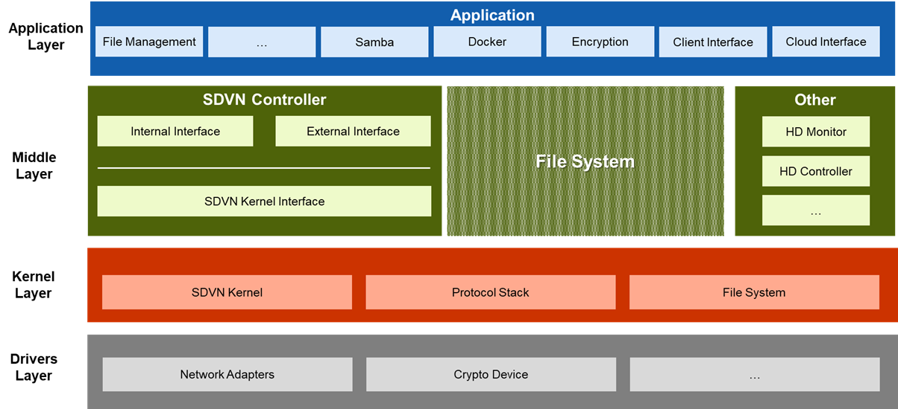
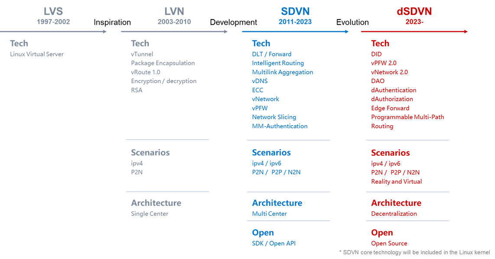

# What is SDN & SDVN?

## Software-Defined Networking
Software-Defined Networking (SDN) is a way of making networks more flexible and
efficient with software. Instead of relying on hardware devices like routers and switches to
manage how data flows on a network, SDN uses software controllers or APIs to talk to the hardware
and tell it what to do. 

SDN also splits the network into two parts: the control plane, which handles the routing and
forwarding decisions, and the data plane, which carries the actual data packets. By doing this,
SDN makes the network more programmable and adaptable.

## Software-Defined Virtual Network
A Software-Defined Virtual Network (SDVN) is when a SDN can creates different virtual networks
on top of the physical network, and adjusts them according to the needs of the apps. 

## SDVN & Dasset
Dasset constructs a SDVN by default, enabling secure and private communication between all nodes
on the network.  The following are key principles for the SDVN configuration with Dasset:

* ### Integration
Integrate all Dasset servers on the Internet, regardless of their physical location, network
environment, or devices.

* ### Reconfiguration
Reconfigure the globally connected virtual network on top of the Internet, providing a secure and
high-performance open network associated with the real world.

* ### Autonomy
Dasset users can independently possess a fully autonomous virtual private network (VPN) within the
SDVN virtual network space.

## Goals of the Dasset SDVN

* ### Global Virtual Network Connectivity
Through SDVN's DLT and virtual IP/domain, Dasset achieves global virtual addressing, positioning, and 
communication within the SDVN virtual network, independent of any technical or policy limitations.
This forms a secure virtual network independent of the Internet.

* ### Programmable Sovereign Subnets
Using network slicing technology, any organization or individual can create fully sovereign virtual subnets,
defining various attributes of the subnet (such as service content, objects, charging methods, etc.), and
easily scale the network as needed.

* ### Roaming in the Virtual Network Space
Users have unique identities and can freely access any open/authorized services or networks in the virtual network space. They can also authorize their identities and data for limited use by third parties, enabling the vision of
**data as an asset**.

## Architecture

## Development Phases

