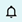
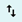
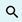
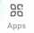
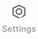

# Home Screen
After logging into your DASSET user account and connecting to a Data Hub, you are presented with the **Home Screen**.  The **Home Screen** is your one-stop shop for accessing all of the functionality of DASSET on the Data Hub you are connected to.  For example, connecting to a Data Hub that you have been invited to join may have a slightly different **Home Screen** than when you connect to your own Data Hub.

The following are sections of the **Home Screen** for your DASSET Data Hub.

## 1 - Actions Bar
The **Actions Bar** gives you quick access to Notifications, File Transfer status and Search.

1. **<u>Notifications</u>** - The  icon will show any notifications you may have for the Data Hub, including requests to confirm adding new users to the Data Hub, or system areas that need your attention, such as running out of hard disk space.
2. **<u>File Transfer Status</u>** - The  icon will show the status of any in-progress file transfers happening on your system, including notifications if file transfers have failed.  Selecting this icon will show you details of the file transfers.
3. **<u>Search</u>** - The The  icon is your gateway to finding files and data on your DASSET Data Hub.  Selecting this icon will open a **Search** screen which will allow you to search across all [Spaces](../concepts/spaces.md) you have access to.

## 2 - Data Hub Information Area
The **Data Hub Information Area** will give you a snapshot of the DASSET Data Hub you are connected to, including the name of the device, an picture of the physical device, how much space has been used on the device as well as connectivity status.

## 3 - Spaces
The **Spaces** area provides quick access to your personal data (My Space), data shared with everyone else on the Data Hub (Public Space) and data shared with specific groups of users (Group Space).  Learn more about how [Spaces](../concepts/spaces.md) works.

## 4 - Recent & Favorites
The **Recent** area provides a short list of 5 files you have recently accessed on the Data Hub, using a [MRU algorithm](https://en.wikipedia.org/wiki/Cache_replacement_policies#Most_recently_used_(MRU)) which puts files you access often, at the top of the list.

The **Favorites** area shows all files you have specifically marked as a *favorite*, enabling you to "pin" certain files front and center if you want to refer to it on demand quickly.  To see a complete list of all of your favorite files, click **See all >** on the right of the screen.

## 5 - Applications
The **Applications** area provides a list of the most commonly-used apps inside of DASSET, for quick access.  To see a complete list of all apps in DASSET, you can scroll further and click **See all >** on the right of the screen, or click on the **Apps** button on the **Navigation Bar**.

## 6 - Navigation Bar
The **Navigation Bar** provides a quick way to navigate through the DASSET application quickly.

1. **<u>Home</u>** - The  icon takes you to the **Home Screen** as a quick way to get back to this screen when in other parts of the DASSET app.
2. **<u>Files</u>** - The  icon takes you to the **Files** section of DASSET where you can manage all of your files easily.
3. **<u>Add Files</u>** - The  icon gives you quick access to uploading photos or other files to your Data Hub with ease.
4. **<u>Apps</u>** - The  icon gives you quick access to all of the apps available to you on the Data Hub.
5. **<u>Settings</u>** - The  icon gives you quick access to all of the settings available to you on the Data Hub.