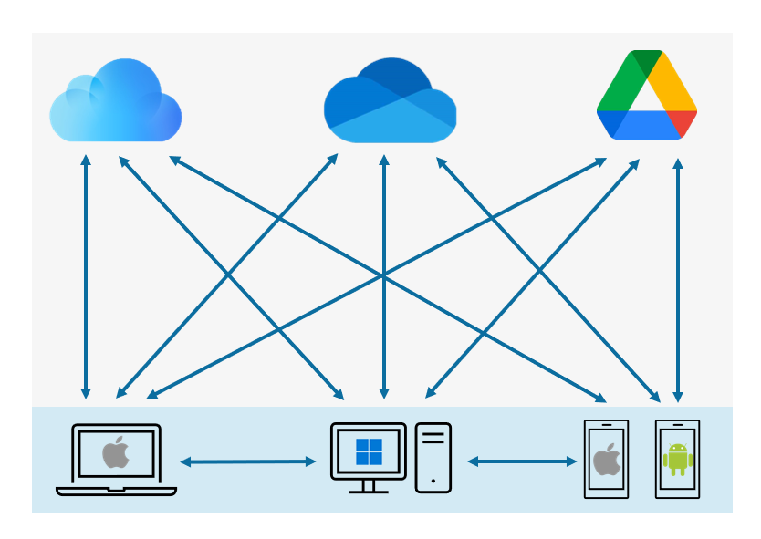
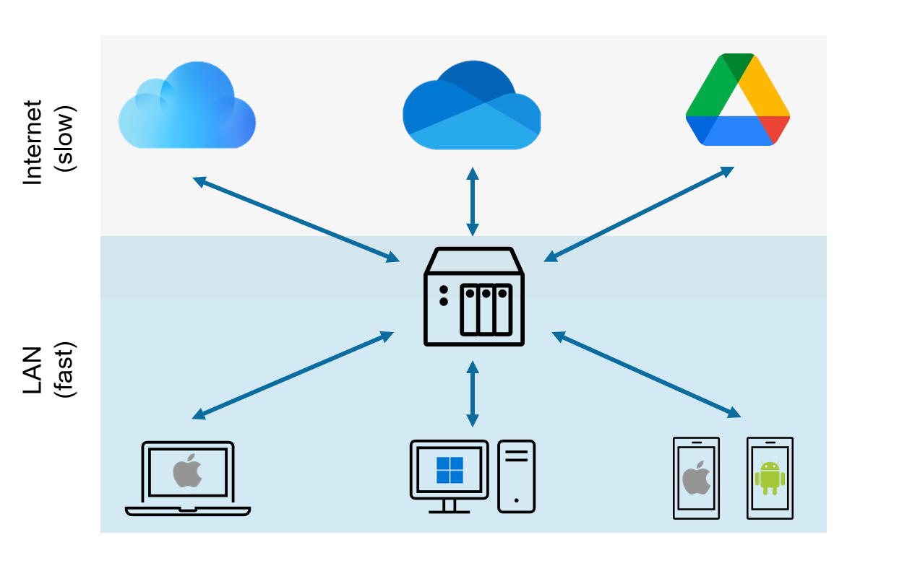

# Introduction

## Our digital footprint is a mess

In today's world, we likely have our data spread across multiple locations.  Multiple computers,
mobile devices, external hard drives... and then there's the cloud.  Or better yet, "clouds".
If you have an iPhone or a Mac, likely a lot of your data is in iCloud.  Windows PC?  Probably
in OneDrive.  Android phone, then it's in Google Drive.  That's might be OK if all of your devices
are from one vendor, but in households or small businesses where there's a mix of these devices,
sharing data among one another is simply hard.

Not only is this digital mess complicated to deal with - having your personal data stored in
a public cloud means you're giving the cloud vendor custody of your data.  Remember, if you're
being offered "free" storage, then you aren't the customer.  You're the product.  These companies
are using your data for targeted advertising, AI training, and who knows what else.

## DASSET brings your data together

A DASSET Data Hub is a computer connected to your home or business network that has the ability
to synchronize data from your various clouds into a single location.  Since the Data Hub is on 
your local network, accessing your data is fast.

## More than a data storage device
But a DASSET Data Hub is much more than just a way to synchronize your data from clouds to your
home.  Using the DASSET client application on your PC, Mac or mobile phone, you can:

* 🖼️  Back up pictures, videos, music, documents and contacts from your mobile phone
* 🤖  Use the AI features of DASSET for photos to tag faces, view by location, scenes and more
* 🎁  Share files with anyone with ease - no more sharing using text messages that degrade photo 
  quality
* 🔐  Store secret data, such as passwords, account numbers or private keys in an encrypted Data Vault
* 👨‍👩‍👧‍👦  Create groups to share data with a set of friends or colleagues to collaborate
* 🎉  And much more!

And the best part - you can access your DASSET Data Hub just as easily from anywhere in the world
as if you were sitting right next to it!

## How do I get a DASSET Data Hub?
The team at PlanetX Labs are currently working with major computer manufacturers to build DASSET
Data Hubs.  We anticipate DASSET Data Hubs being for sale from major computer manufacturers
by the end of 2024.

Want to be notified when DASSET Data Hubs are available for purchase?  Fill out the form below and
you'll be contacted with details on how to get your own DASSET Data Hub.

<iframe src="https://docs.google.com/forms/d/e/1FAIpQLSdtX7WZZVRzevYeOTuLcb464uSryYoYqXcFWFas5PJrctFvWA/viewform?embedded=true" width="640" height="493" frameborder="0" marginheight="0" marginwidth="0">Loading…</iframe>