# Android & iOS

# Introduction

This document is intended to help users quickly understand the full
functionality of DASSET.

As the actual features available may vary depending on the specific
hardware device in use, please refer to the functions displayed when
accessing the device through DASSET.

Not all hardware devices supporting DASSET necessarily provide all the
features mentioned in this document.

With ongoing version updates, the features and images described herein
may differ from the actual product. Please always refer to the functions
displayed in the DASSET App for the most accurate information.

# DASSET Overview

## What is DASSET

The DASSET App is a cross-platform application designed to provide
intelligent storage, collaborative communication, and AI Agent services
for small and medium-sized enterprises, families, individuals, and
teams.

Through seamless integration with a wide range of DASSET-supported
products and devices, the DASSET App enables true data freedom, allowing
users to break free from third-party restrictions and maintain full
control over their data and AI resources.

## DASSET Features

- **Cross-platform support**: Available for Windows, macOS, iOS, and
  Android, ensuring a consistent user experience across different
  devices.

- **Access DASSET devices anytime, anywhere**: Users can remotely access
  and manage their DASSET hardware devices from any location via the
  DASSET App.

- **Unified cross-platform experience**: Provides a consistent interface
  and operational logic across operating systems and devices, reducing
  the learning curve.

- **Data synchronization and backup**: Supports data synchronization and
  backup between DASSET hardware devices and end-user devices, ensuring
  data security and availability.

## Application Scenarios

- **Personal data management**: Synchronize and back up personal data
  across multiple devices to ensure data integrity and security.

- **Family data sharing**: Share photos, videos, and other files among
  family members to enhance interaction and communication.

- **Team collaboration**: Serve as an internal file sharing and
  collaboration platform for small teams or startups to improve
  efficiency.

# Installation and Download

## DASSET Download Links

Download from the official DASSET website: [Click to
Download](https://dassetai.ai/download/dasset.html)

## System Requirements

- **Android**: Android 7 or later

- **iOS**: iOS 13 or later

## Multi-Language Support

DASSET currently supports **Simplified Chinese, Traditional Chinese, and
English**.

## Installation and Launch

1.  **Android**

    - **APK Package**: Download from the official website, then tap the
      APK file to install.

> *Note: If a security warning appears, allow installation from unknown
> sources.*

- **Google Play Store**: Available for direct installation.

2.  **iOS**

    - Download from the **App Store**.

# Registration and Login

When using DASSET for the first time, you need to create an account.
DASSET supports both **mobile phone numbers** and **email addresses** as
account credentials.

*Note: The current DASSET version does not allow mobile phone number
registration.*

If you forget your password, you can easily reset it on the DASSET login
page using the phone number or email address registered with your
account.

## Registration

DASSET supports registration with either a mobile phone number or an
email address. On the login screen, click **Register** to create an
account.

*Notes:*

1.  Due to the security policies of some email providers, DASSET
    registration emails may be misclassified as spam. If you do not
    receive the verification code, please check your spam folder.

2.  DASSET does not strictly enforce password strength requirements,
    leaving security to your discretion. However, for account safety, it
    is strongly recommended that you set a strong password to reduce
    privacy risks.

Steps:

1.  Click **Register**.

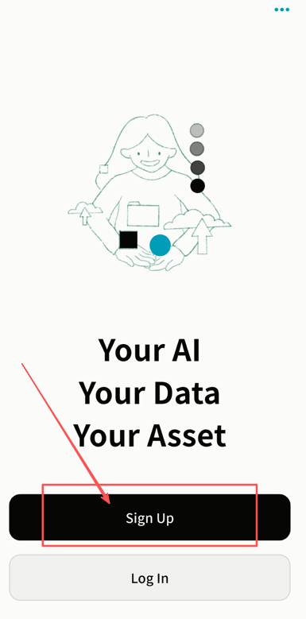

2.  Enter your email address.

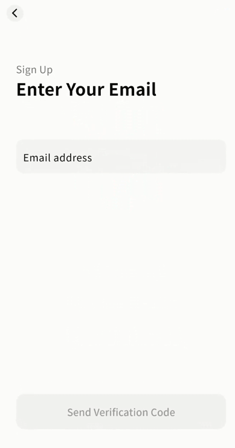

3.  Input the verification code and click **Verify**.

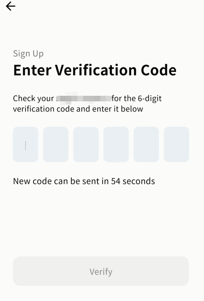

4.  After verification, set your login password. The password must be
    **6--32 characters**, using letters, numbers, or symbols.

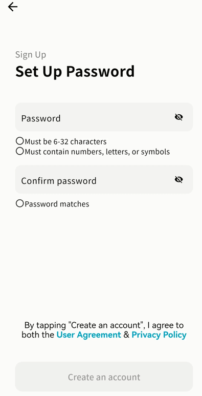

5.  Once completed, you can log in to the DASSET client using your new
    account.

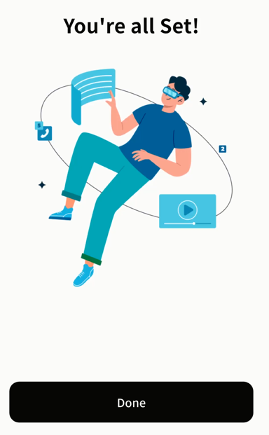

## Login

DASSET supports login with either email or mobile phone number. Enter
your registered account credentials and password, then click **Login**.

- If this is your first login, the login screen will appear.

- If you have logged in before, DASSET will automatically log you in.

- If you have used multiple accounts, you can switch between them from
  the login screen.

- You may also select a saved account from the dropdown menu for faster
  login.

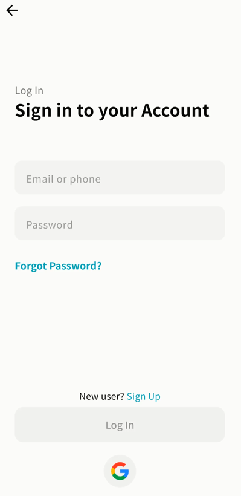

## Password Reset

If you forget your password, click **Forgot Password** on the login
screen and follow the prompts to reset it using your registered email or
phone number.

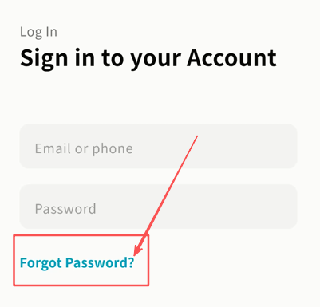

## Google Account Quick Login

1.  Click the **Google Login** button.

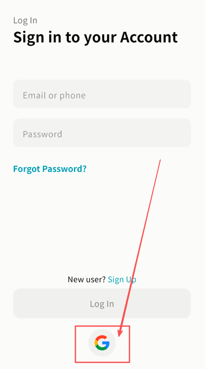

2.  On the Google authorization page, enter your Google account and
    password.

3.  After authorization, DASSET will complete the login automatically.

## Apple ID Quick Login

1.  Click the **Apple Login** button.

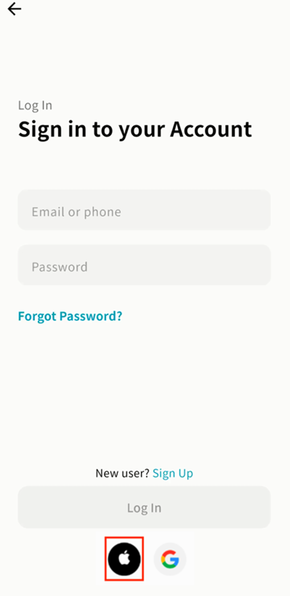

2.  In the login pop-up, select your current Apple account or log in
    with your Apple ID password.

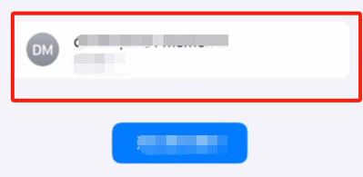

3.  Wait for DASSET to complete the login.

## OS Auto-Save Password

DASSET integrates with your device's OS keychain. On your first login,
your DASSET account and password can be saved in the keychain.

When logging in again, your device can autofill the credentials,
eliminating the need to re-enter them manually.

*Note: If you choose to save your credentials in the OS keychain, the
security of your account and password will be managed by the operating
system.*

# DASSET Home

## Device List Page

After logging in, you will enter the DASSET home page:

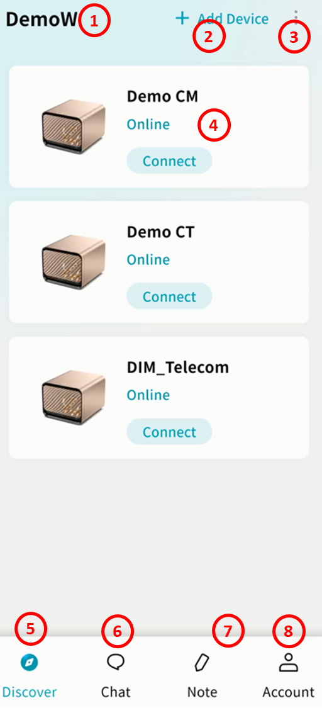

1.  **Account**: Displays the currently logged-in account.

2.  **Add Device**: Bind your DASSET edge device or join a device shared
    by a friend.

3.  **Show All / Online Devices**:

    - Select **Show All Devices** to display all DASSET edge devices
      bound to your account, whether online or offline.

    - Select **Show Online Devices** to display only devices that are
      currently online and accessible.

4.  **Device List**: Displays all devices bound to your account,
    including your own devices and those shared by friends. You can
    clearly see which devices are online or offline.

    - **Device Status**: Online or offline

    - **Connect**: Click to access the device

5.  **Discover**: Switch to the device list page.

6.  **Chat**: Enter the chat interface.

7.  **Notes**: Access DASSET Notes to create, edit, and delete notes,
    and keep them synchronized between your computer and DASSET edge
    device.

8.  **My Profile**: Access account management and client settings.

## DASSET Edge Device Home

Click **Connect** on a device to enter its home page.

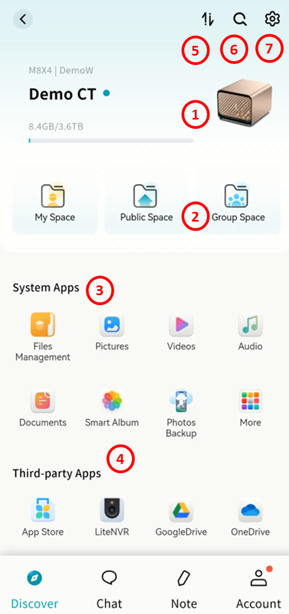

1.  **Device Status**: Displays the following information:

    - Device name

    - Device model

    - Device owner account

    - Storage usage

2.  **Three Spaces:** Quick access to My Space, Public Space, and Group
    Space.

3.  **System Applications:** Displays built-in DASSET application icons.
    Click an icon to open the corresponding application page.

4.  **Third-party Applications:** Displays third-party applications
    available for installation on DASSET. You can install and use them
    as needed.

5.  **Task Center:** View and manage the progress of upload and download
    tasks.

6.  **Search:** Search files stored on the DASSET edge device by
    keyword.

7.  **SET UP:** Manage DASSET edge device settings, including hardware
    information, performance, disk management, and member management.

# DASSET Device Binding and Unbinding

## Device Binding

When you receive a new DASSET edge device, the first step is to bind it
to your account using the DASSET mobile app.

The first account to bind the device will become its **owner**. Follow
the steps below to complete binding:

1.  Go to **Discover  Add Device**.

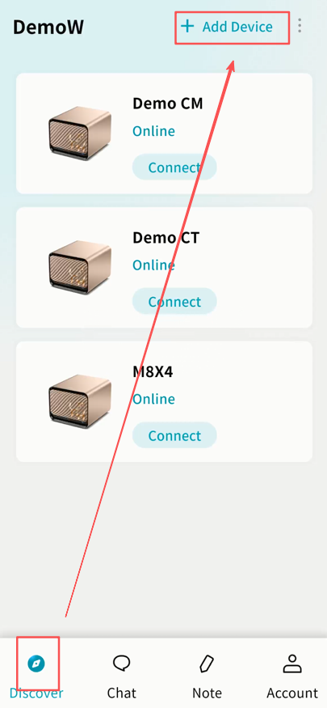

2.  Select **Yes, this is my device**.

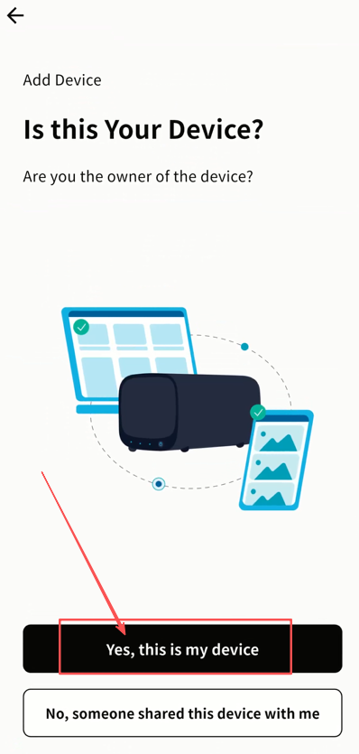

3.  Follow the binding guide to connect the device to power and network.

4.  In step 3 of the guide, choose one of two binding methods:

    - **Scan QR Code (Recommended)**: The default method is to scan the
      binding QR code located on the device.

    - **Search my network**: Alternatively, search for DASSET devices on
      the same LAN as your mobile device.

> *Note: Ensure both your mobile device and the DASSET device are on the
> same LAN; otherwise, the device cannot be discovered.*

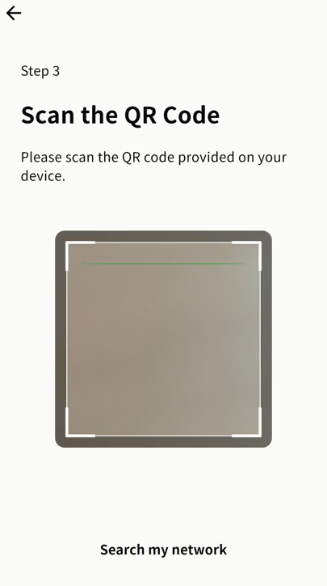

5.  After scanning, you will see the **Device Found** prompt. Click
    **Bind**.

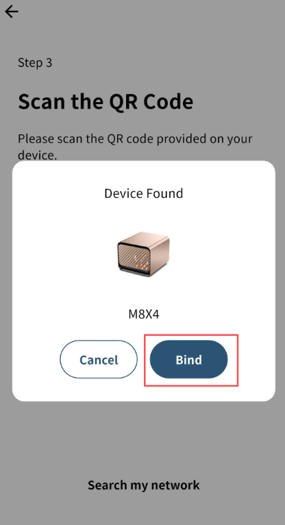

6.  Once binding is complete, click **✓**.

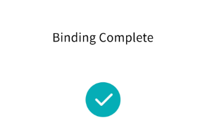

7.  Set a name for the device for easier identification, or skip to use
    the default system name.

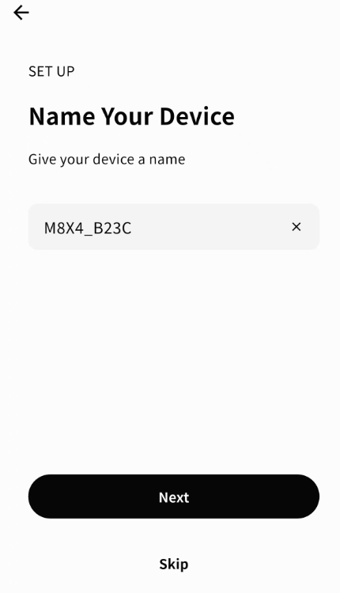

8.  Click **Done**. The device will now appear on the device home page.

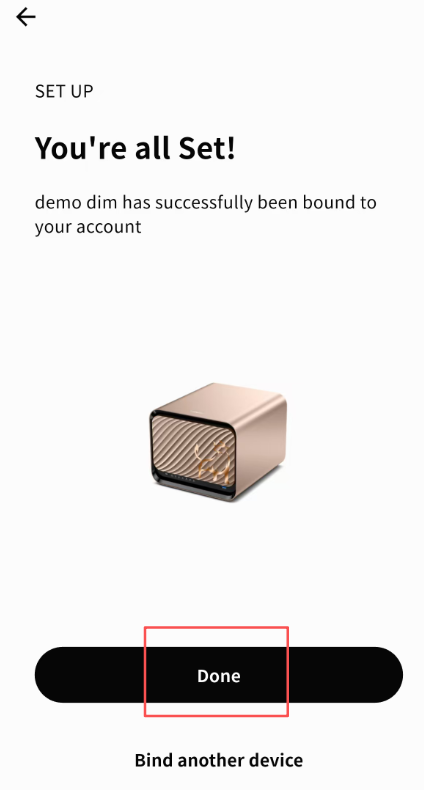

## Adding a Shared Device

You can also bind to a DASSET edge device shared by another user via the
**Add Device** button on the home page. Use either an **invitation QR
code** or an **invitation code**.

Steps:

1.  On the device page, click **Add Device  No, someone shared this
    device with me**.

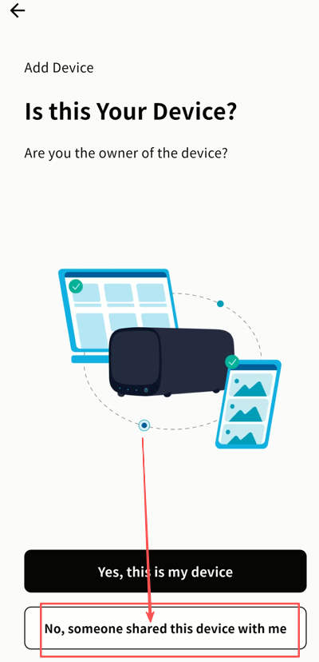

2.  Choose one of the following methods to add the shared device:

    1.  Scan the **invitation QR code** with your mobile device camera.

    2.  Select an **invitation QR code image** stored in your photo
        album.

    3.  Enter the **invitation code** manually.

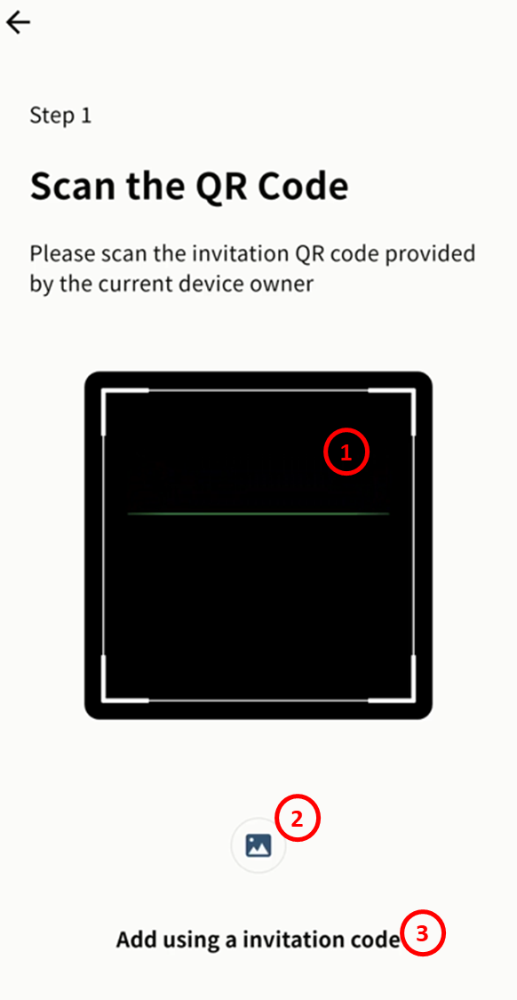

3.  After scanning or entering the code, a **Device Found** prompt will
    appear. Click **Bind**.

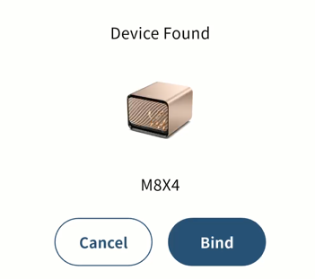

- If the device requires owner confirmation, you will see an application
  success message. Binding will complete only after the owner approves.

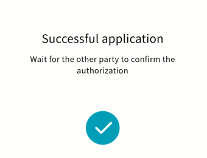

4.  Once binding is complete, set a name for the device.

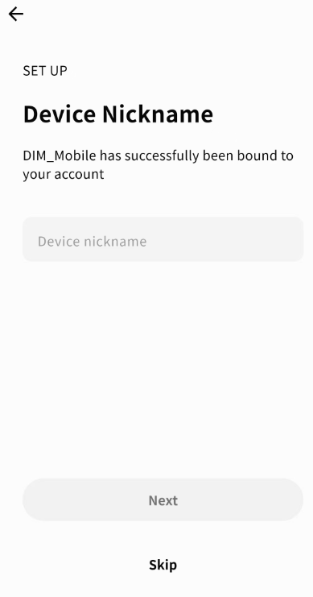

5.  The device will appear on your device page. Click **Connect** to
    access it.

## Device Unbinding

### Owner Unbinding

The owner can unbind a DASSET edge device from their account. Once
unbound, all users associated with the device will also be unbound.

1.  Go to the device **SET UP** page and click **Unbind this device**.

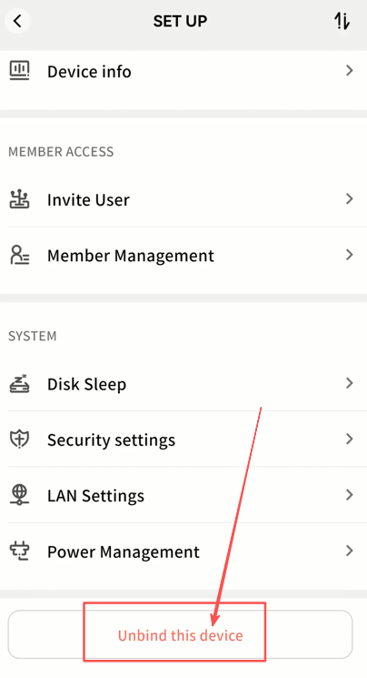

2.  As the owner, you will receive a warning. If you do not want to
    remove all members, you may first transfer ownership to another user
    before unbinding. If you wish to proceed, click **Remove All
    Members**.

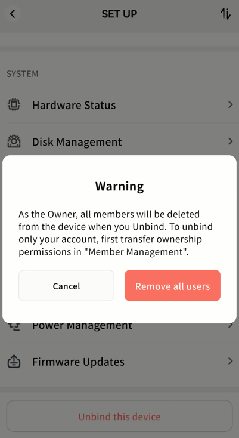

3.  In the confirmation window, type **Confirm**. If you no longer need
    the data stored on this device, we strongly recommend selecting
    **Erase personal hard disk data at the same time**.

    - When this option is enabled, all data in **My Space** associated
      with your account will be automatically deleted from the DASSET
      edge device after unbinding, ensuring your privacy and data
      security.

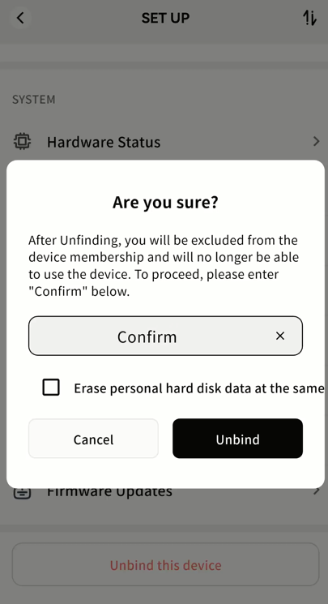

### Member Unbinding

As a device member, you can unbind yourself from the device at any time.
After unbinding, the device will no longer appear in your device list.

1.  Go to the device **SET UP** page and click **Unbind this device**.

2.  In the confirmation window, type **Confirm**. If you no longer need
    the data stored on this device, we strongly recommend selecting
    **Erase personal hard disk data at the same time**.

    - When this option is enabled, all data in **My Space** associated
      with your account will be automatically deleted from the DASSET
      edge device after unbinding, ensuring your privacy and data
      security.

## Device Offline

When a device is offline, you can still perform the following
operations:

1.  **Device Information**

    - View basic information, including device name, remarks, owner,
      join time, and device SN.

    - Unbind from the device.

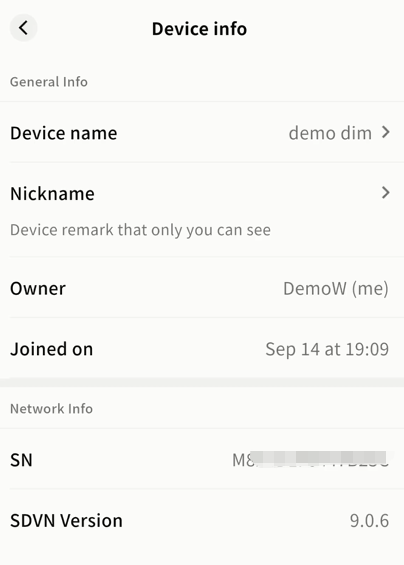

2.  **Member Management**

    - View all accounts bound to the device.

    - Promote a standard member to administrator.

    - Demote an administrator to standard member.

    - Remove members.

*For detailed instructions, see the **Member Management** section.*

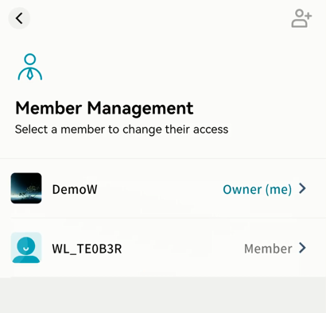

# Device Initialization

If you are binding a DASSET edge device for the first time, you need to
use the DASSET mobile client to scan the QR code on the device to
complete binding. After binding, when you enter the device for the first
time, you will be prompted to format the hard drive:

1.  Insert the hard drive into your DASSET edge device.

2.  From the **Device List**, click your device to enter.

3.  A format prompt will appear. Click **Confirm**.

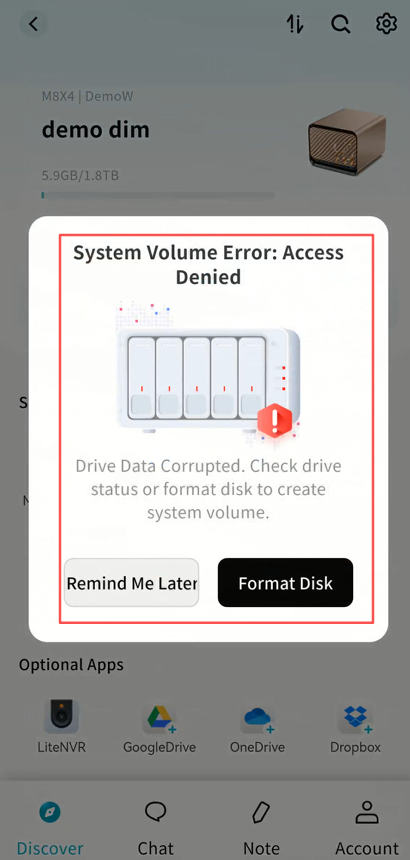

4.  The DASSET client will navigate to **SET UP  Disk Management**.
    Click the **\...** menu next to the system volume and select
    **Format and Rebuild System Volume**.

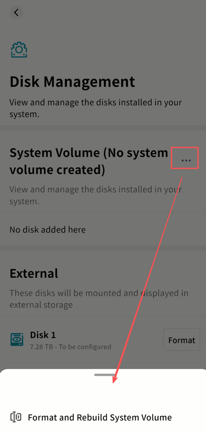

5.  Choose the hard drives to format and the desired disk format, then
    click **Next**. Supported formats include:

    - **Normal Mode**: Basic mode; total usable space equals the sum of
      all disks, with no redundancy.

    - **RAID 0**: Maximum read/write performance; usable space equals
      the sum of all disks, with no redundancy.

    - **RAID 1**: Two-disk mirroring; usable space equals the smaller of
      the two disks, with redundancy protection.

    - **RAID 5**: Requires at least three disks; usable capacity equals
      the sum of two disks used for data, with redundancy protection.

> *Note: The estimated capacity is displayed according to the selected
> format.*

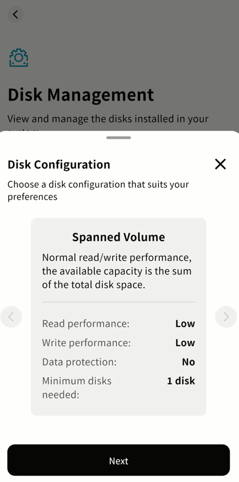

6.  After selecting the disk format, check the hard drives to be
    formatted. The system will calculate the available capacity after
    formatting.

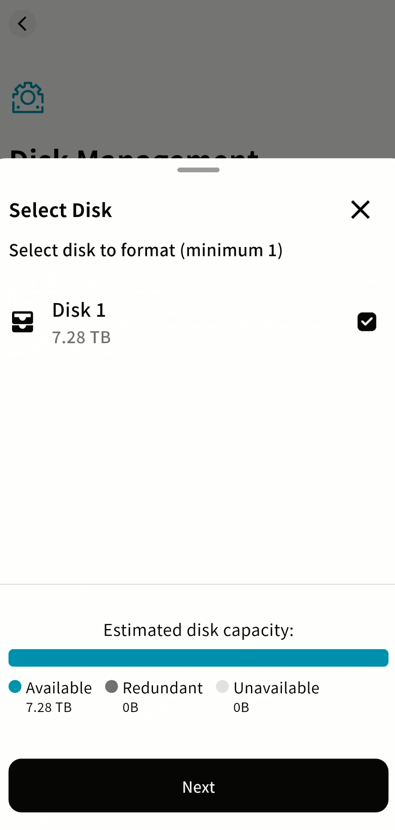

7.  In the confirmation window, click **Confirm**. The system will start
    the formatting process. Please wait until it completes.

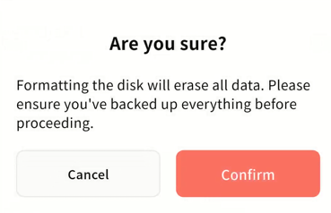

8.  During formatting, you may return to the device page. The formatting
    progress will be displayed.

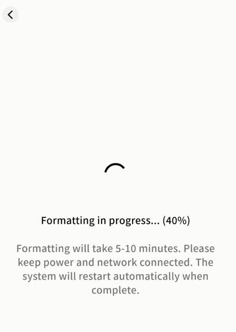

9.  Once formatting is complete, a notification will appear. Click
    **Confirm** and you can begin using your DASSET edge device.

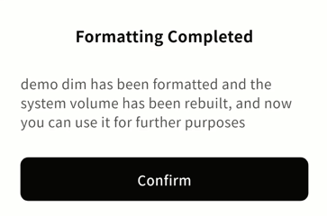

# Device SET UP

## Device SET UP Overview

All management of the DASSET edge device is centralized in the **Device
SET UP** page. The main functions include:

- **Device Info**: Displays device name, network, SN, owner, and related
  details.

- **Invite User**: Generate an **invitation QR code** to add other users
  to the device.

- **Member Management**: Manage all members on the device and invite
  additional users.

- **Hardware Status**: View CPU, memory, storage, and network
  performance of the device.

- **Disk Management**: Manage inserted hard drives, including formatting
  and other operations.

- **Disk Self-test**: Run diagnostics to detect disk issues.

- **Disk Sleep**: Configure hard disk sleep rules.

- **Security Settings**: Configure options such as showing hidden files,
  personal passwords, and public space passwords.

- **LAN Settings**: Manage network configuration of the device.

- **Power Management**: Perform remote power on/off and configure
  scheduled power rules.

- **Firmware Upgrade**: Check for the latest firmware available for your
  device and perform the upgrade.

- **Unbind this device**: Unbind the DASSET edge device from the current
  account.

## Device Information

The **Device Information** page displays the basic details of your
DASSET edge device:

1.  **Device Name:** You can edit the device name. If no Device Remark
    is set, this name will be visible to all users.

2.  **Nickname:** A private label visible only to you. This remark helps
    differentiate between multiple devices when you have several bound
    to your account.

3.  **Owner:** Shows the nickname of the account that owns the device.

4.  **Joined On:** Displays the date and time when the device was bound
    to your account.

5.  **Virtual IP:** The dynamic IP address assigned to the device within
    the DASSET virtual network.

    - **Security Note**: Only users bound to the device can access it
      through this virtual IP. Other accounts cannot connect using this
      address.

6.  **LAN IP:** The IP address assigned to the device within your local
    network.

7.  **Domain Name:** The static virtual domain URL assigned to the
    device in the DASSET network.

    - You can use either the domain name or the virtual IP to connect to
      the device.

    - **Security Note**: Only users bound to the device can access it
      through this domain. Other accounts cannot connect using it.

8.  **SN:** The unique serial number of the device.

9.  **SDVN Version:** Displays the current version number of the SDVN
    service running on the device.

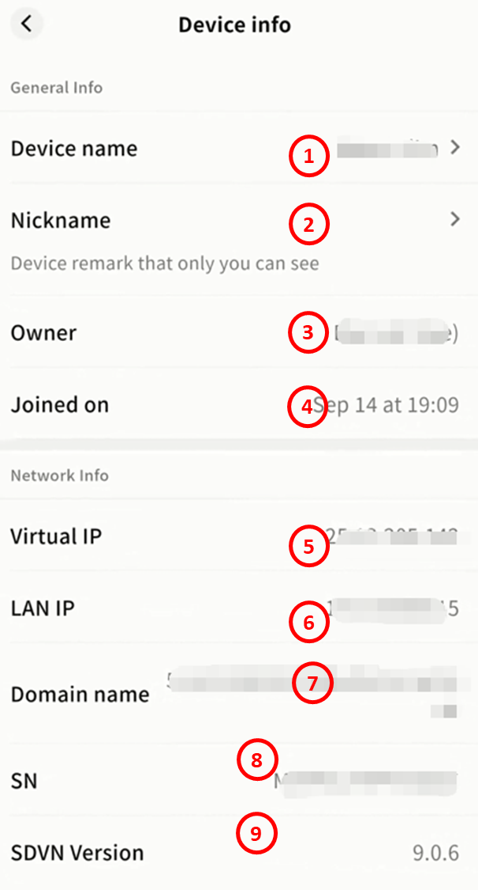

## Invite User

On the **Invite User** page, you can click **Enable Sharing** to
generate an **invitation QR code** and an **invitation code**, allowing
other users to join your DASSET edge device.

- The **invitation code** is valid for 24 hours. After expiration, a new
  code must be generated.

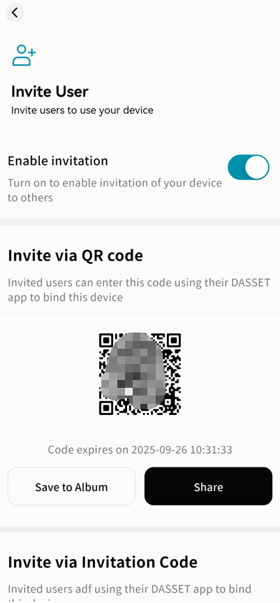

- **Verification Required**: When enabled, any join requests must first
  be approved by the device owner or administrator in the **Messages**
  section before access is granted.

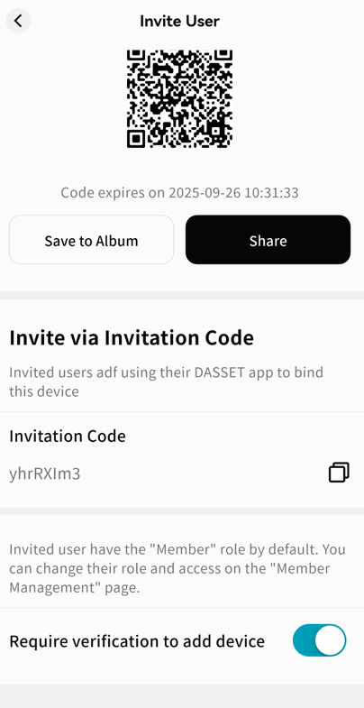

## Member Management

On the **Member Management** page, you can manage all members of the
device, assign roles and permissions, and invite others to join.

1.  **View Member List**: See all accounts currently bound to the
    device.

2.  **Assign Roles**: Set different roles for members, including
    **Administrator** and **Member**.

3.  **Permissions**: Configure specific permissions for each member,
    such as read/write access to Public Space.

4.  **Invite Users**: Generate an invitation code to allow new members
    to join the device.

*Note: Only the Owner and Administrators can view or set member
permissions. Members can see only their own permissions and cannot
modify them.*

### User Roles

DASSET defines three roles with different levels of control:

- **Owner**: The first account to bind the device. Has full
  administrative privileges.

- **Administrator**: Assigned by the Owner. Has most management
  permissions, including setting member permissions.

- **Member**: Invited users who join the device. Has only basic
  permissions.

#### Role Permission Matrix

The differences in permissions between user roles are shown in the table
below:

  ----------------------------------------------------------------------------
  Permission Item                    Owner        Administrator   Member
  ---------------------------------- ------------ --------------- ------------
  Manage account storage limit       √            √               

  Read/Write My Space                √            √               √

  View Public Space                  √            √               √

  Edit Public Space                  √            √               

  Use Group Space                    √            √               √

  Create Groups                      √            √               

  View External Storage              √            √               

  Edit External Storage              √            √               

  Transfer Ownership                 √                            

  Assign Administrator               √                            

  Remove Users                       √            √               
  ----------------------------------------------------------------------------

#### Adjusting Member Permissions

- The **Owner** can set permissions for all users.

- **Administrators** can set permissions for Members.

- To configure permissions, select a member and adjust their detailed
  permission options in the right-hand panel.

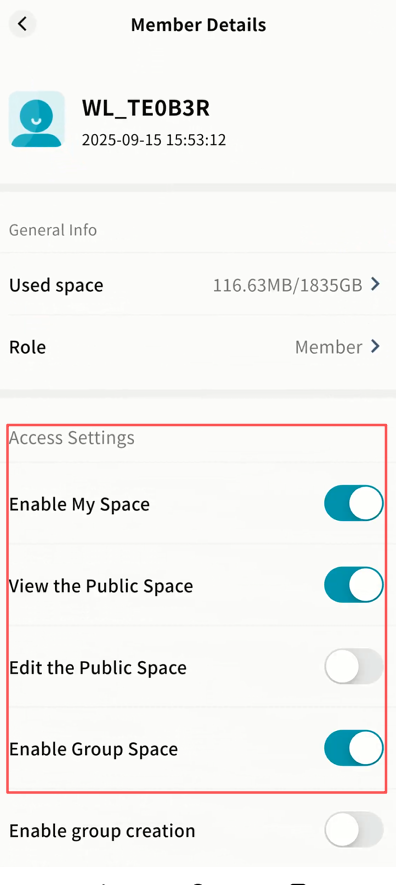

### Storage Quota

You can set the maximum storage a member can use.

- Owners can set quotas for all users.

- Administrators can set quotas for Members.

Steps:

1.  In Member Management, open a member's detail page and click
    **Storage Usage**.

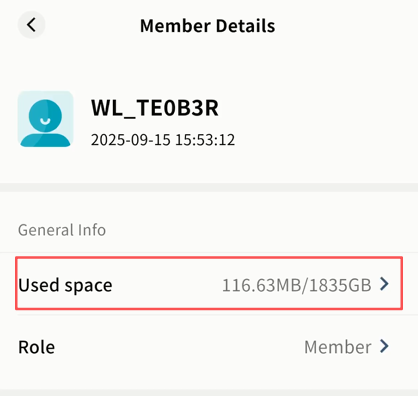

2.  On the **Storage Authorization** page, choose one of the following:

    - **Unlimited**: No limit on storage.

    - **Percentage**: Allow the user to use a set percentage of total
      device capacity.

    - **Custom Size**: Define a maximum limit in GB.

Once set, the user cannot exceed the allocated storage.

### Transfer Ownership

The Owner can transfer device ownership to another member.

1.  In Member Management, open a member's detail page and click
    **Role**.

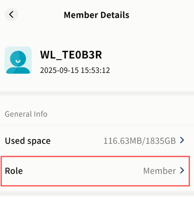

2.  On the **Role Settings** page, select **Owner** and click
    **Update**.

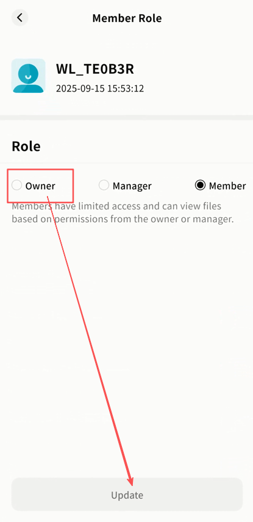

3.  In the confirmation dialog, click **Transfer**.

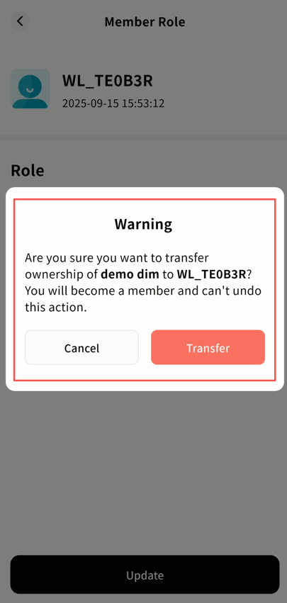

> *Note: After transferring ownership, your account will become a
> regular Member.*

4.  The device will go offline and then back online to process internal
    permissions. Afterward, the new account will be listed as Owner.

### Admin Promotion and Demotion

#### **Promote Member to Admin**

1.  In Member Management, open the member's detail page and click
    **Role**.

2.  Select **Manager** and click **Update**.

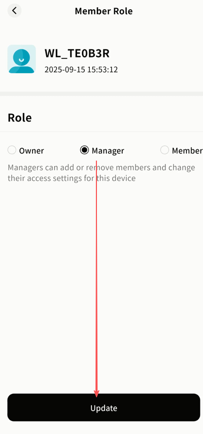

3.  The device will restart its permissions cycle (offline → online).
    The member will now appear as an Administrator.

#### **Demote Admin to Member**

1.  In Member Management, open the admin's detail page and click
    **Role**.

2.  Select **Member** and click **Update**.

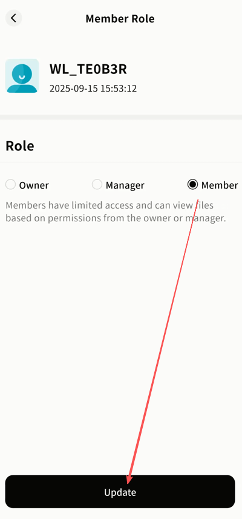

3.  The device will restart its permissions cycle (offline → online).
    The user will now appear as a Member.

### Remove Users

Owners and Administrators can remove users from the device.

- Owners can remove **Admins and Members**.

- Administrators can remove **Members** only.

Steps:

1.  In Member Management, open the member's detail page and scroll to
    the bottom.

2.  Click **Remove this user**, then confirm.

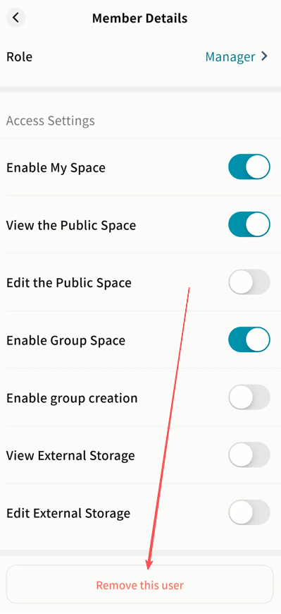

- The user will be unbound from the device.

- Their personal space data on the device will be cleaned up to free
  storage.

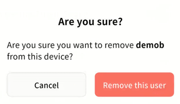

### Invite Users

Owners and Administrators can invite new members to join the device.

Steps:

1.  In Member Management, click **Invite User** in the top-right corner.

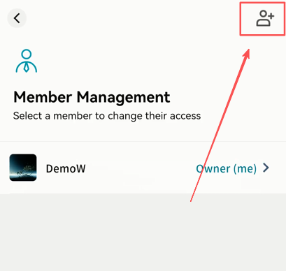

2.  A QR code and invitation code will be generated:

    - **Enable Sharing**: Must be enabled before generating the QR code.

    - **QR Code**: Can be scanned within its validity period to join the
      device. You can also save it to your gallery or share it through
      other apps.

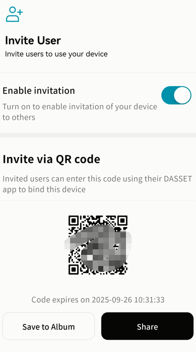

- **Invitation Code**: Equivalent to the QR code. Click **Copy** to
  share it directly.

- **Verification Required**: If enabled, new join requests must be
  approved by the Owner or Administrator in the Notifications panel.

3.  If verification is required, the Owner/Administrator will see a
    request notification and must click **Accept** for the new member to
    join.

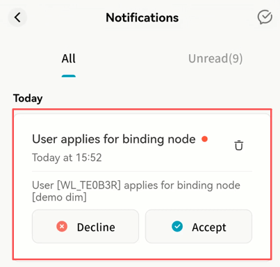

## Hardware Status

The **Hardware Status** section allows you to monitor the performance
and usage of your DASSET edge device.

1.  **Basic Information:** Displays the device name and SN. Click More
    to view general device details and disk information.

2.  **Storage Usage:** Shows how much storage space is currently in use.
    Click More to view per-member usage details.

3.  **Operating Status:** Displays real-time performance indicators,
    including:

    - CPU usage and temperature

    - Memory usage

    - Hard disk temperature

    - Upload and download speed

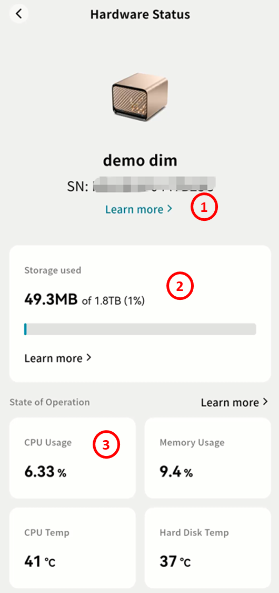

### Hardware Information

Click **More** in the hardware status panel to access detailed hardware
information, including:

- Product model

- **SN**: Unique device identifier

- **MAC**: Device MAC address

- **Firmware Version**: Current firmware installed on the device

- **CPU Model**

- **Memory Size**

- **Disk Information**: Shows details for each slot, including capacity,
  model, and serial number

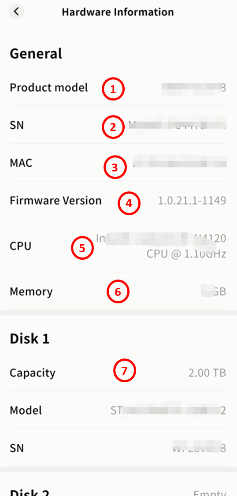

### Storage Information

Click **More** in the storage usage panel to view detailed storage
information:

1.  **Used Storage**

    - Total disk capacity

    - Total used space (all users combined)

    - Space used in **My Space** (all users combined)

    - Space used in **Public Space** (all users combined)

    - Space used in **Group Space** (all users combined)

    - Space used in **Other Areas** (such as My Vault, Recycle Bin, and
      thumbnails)

    - Total available space

2.  **Member Usage**

    - Displays per-user storage consumption statistics

3.  **Former Members**

    - If a removed member chose to retain data, their usage will appear
      with an **exclamation mark**.

    - Click the exclamation mark to delete the retained data and free up
      storage.

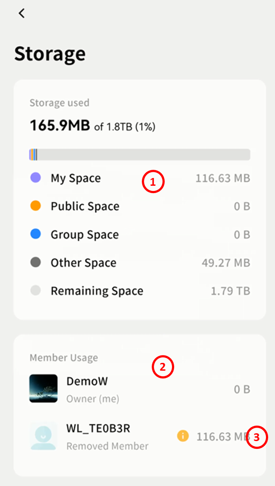

### Operating Status

Click **More** in the operating status panel to view detailed
performance metrics:

- **CPU Usage**

- **Memory Usage**

- **Download/Upload Speed**

- **Fan Speed** (shows one entry per fan installed in the device)

- **Disk Temperature**

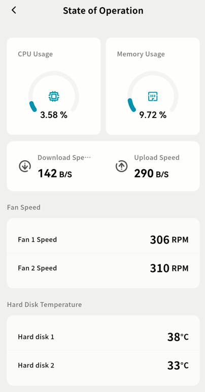

## Disk Management

In Disk Management, you can view all hard drives currently inserted in
the DASSET edge device and configure them accordingly.

1.  **System Volume:** Configure the system volume, format disks, and
    view the format type and capacity of each disk included in the
    system volume.

2.  **External Disks:** Newly connected hard drives not yet part of the
    system volume will appear here. After formatting, they can be used
    as external storage.

3.  **Format and Rebuild System Volume:** Reformat all or selected hard
    drives into a new disk configuration.

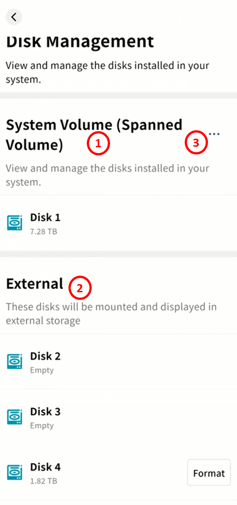

### Format and Rebuild System Volume

If you install or replace hard drives and do not want to use them as
external storage, select **Format and Rebuild System Volume**.

Steps:

1.  Go to **SET UP  Disk Management** and click **Format and Rebuild
    System Volume**.

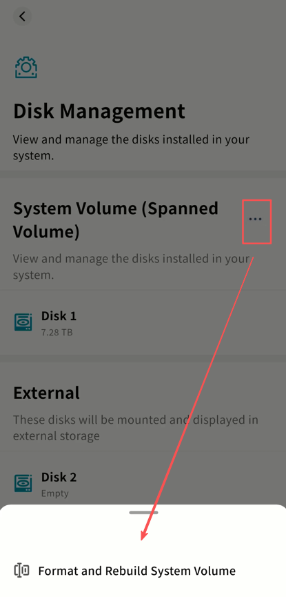

2.  In the pop-up window, choose a new disk format. DASSET supports
    multiple disk formats:

    - **Normal Mode**: Basic mode. Total usable space equals the sum of
      all disks, no redundancy.

    - **RAID 0**: Optimized read/write performance. Usable space equals
      the sum of all disks, no redundancy.

    - **RAID 1**: Requires two disks. Usable space equals the smaller of
      the two disks, with redundancy.

    - **RAID 5**: Requires at least three disks. Usable space equals the
      combined capacity of two data disks, with redundancy.

    - **RAID 10**: Requires at least four disks. Usable space equals the
      smaller group's total capacity, with redundancy.

> *The interface will display the estimated available capacity for the
> selected configuration.*

3.  After selecting the format, choose the hard drives to include in the
    system volume.

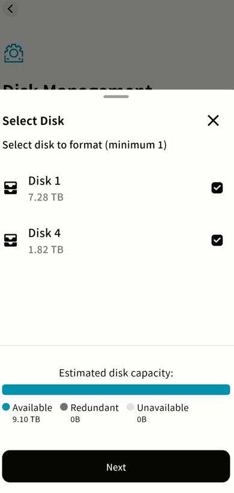

4.  Click **Confirm** to begin formatting. Please wait until the process
    completes.

    - In RAID modes, after formatting you may see the disk status as
      **Synchronizing**. This is an internal process and will not
      prevent you from uploading, downloading, or managing files.

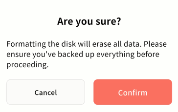

5.  During formatting, you can return to the device page to view the
    progress.

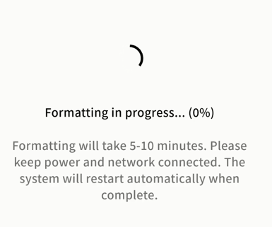

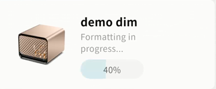

6.  Once formatting is complete, a notification will appear. Click
    **Confirm** to start using your DASSET device.

### Add External Disk

If you insert a new hard drive and do not want to rebuild the system
volume (which would erase existing data), you can configure it as an
external disk.

Steps:

1.  Go to **SET UP  Disk Management**. Newly inserted drives will
    appear as **Pending Configuration**.

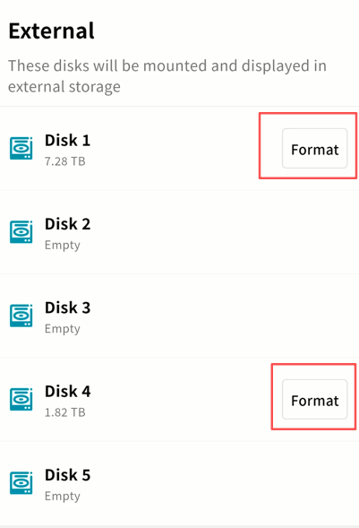

2.  On the pending disk, click **Format**. In the pop-up window, click
    **Confirm**.

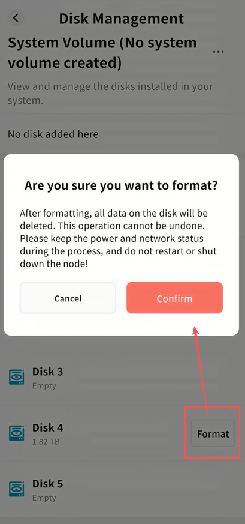

3.  The system will begin formatting. You can click the **Back button**
    to close the progress window.

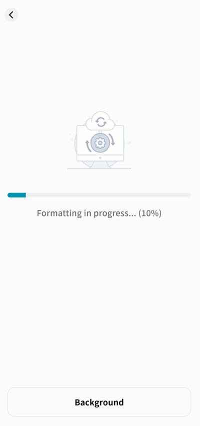

4.  Once formatting is complete, you will see a success notification and
    the **Pending Configuration** status will be removed.

5.  Go to **System Apps  External Storage** to view the newly added
    external disk.

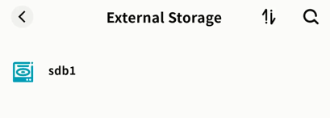

6.  Double-click the disk name to access it and perform file operations.

> *Note: Do not delete the "lost+found" folder to avoid unexpected
> issues.*

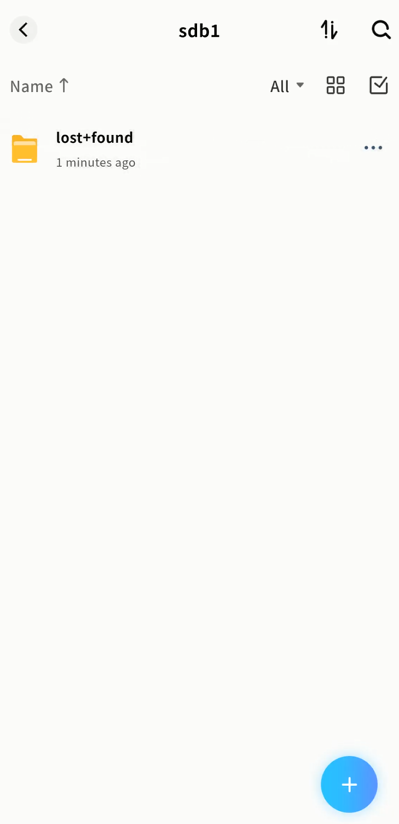

## Disk Self-test

The **Disk Self-test** feature allows you to run diagnostics on your
hard drives to identify potential issues early and prevent data loss. We
recommend performing disk self-checks regularly to ensure data security.

Steps:

1.  Go to **Settings  Disk Self-test**.

2.  Click **Self-test Again**.

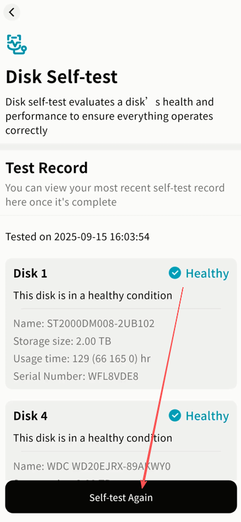

3.  The system will begin scanning the hard drives. Please wait for the
    process to complete. (The duration depends on the size and type of
    the drives.)

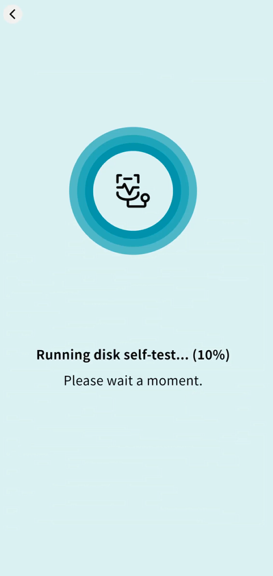

4.  After completion, the system will display the health status of the
    drives along with the timestamp of the last self-check.

## Hard Disk Sleep

The **Hard Disk Sleep** feature powers down hard drives when there is no
read/write activity. This helps extend drive lifespan and reduces power
consumption during standby.

### Manual Sleep

1.  Go to **SET UP  Hard Disk Sleep  Sleep now**.

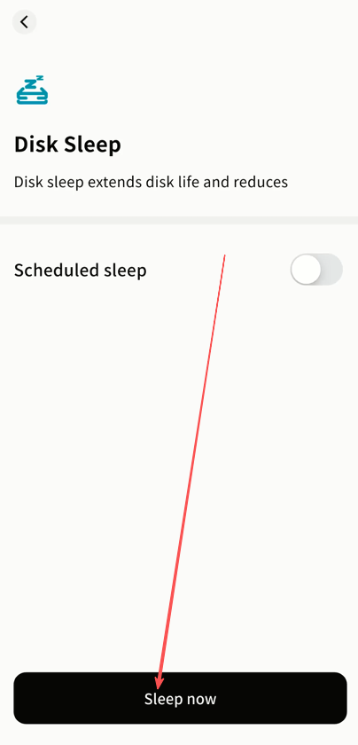

2.  In the warning window, click **Confirm**. All applications and
    transfer tasks will be stopped before the disk powers down.

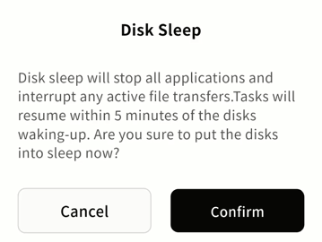

3.  A notification will confirm when the hard drive has entered sleep
    mode.

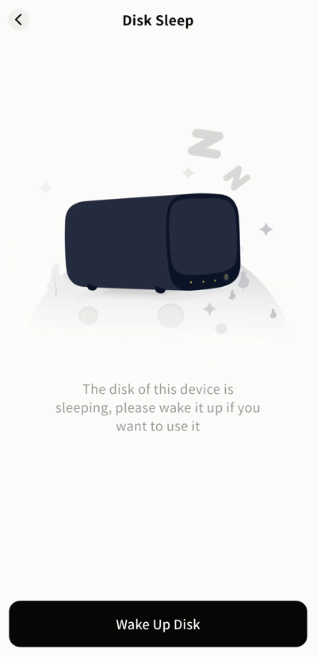

### Scheduled Sleep

To enable scheduled sleep, go to **SET UP  Scheduled Sleep** and
switch on **Scheduled Sleep**.

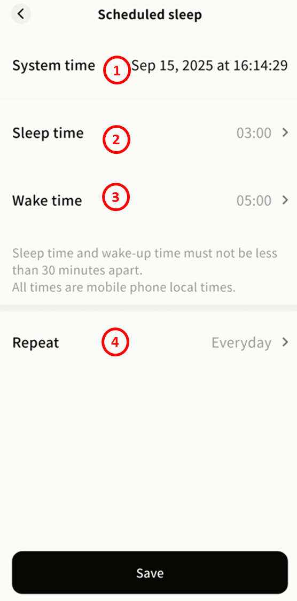

1.  Once enabled, configure the following:

    - **System Time**: Based on the time zone of your client.

    - **Sleep Time**: The time when the hard disk should enter sleep
      mode.

    - **Wake Time**: The time when the hard disk should resume
      operation.

    - **Repeat**: Choose when the schedule should apply --- every day,
      weekdays, weekends, or custom days of the week.

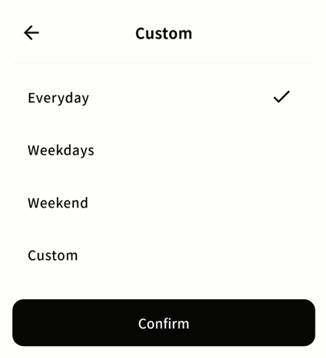

2.  To disable scheduled sleep, simply turn off the option.

### Wake Disk

After the hard disk enters sleep mode, the DASSET client will notify you
when you attempt to access the device. Click **Wake Up Disk** to restart
the drive and resume normal operations.

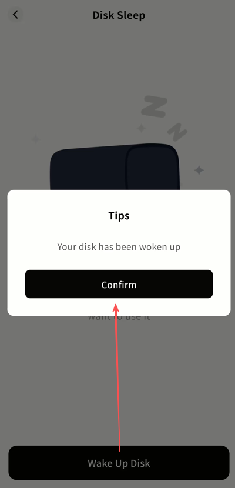

## Security Settings

Go to **SET UP  Security Settings** to configure security-related
options.

1.  **Show Hidden Files and Folders:** When enabled, hidden
    files/folders become visible in file management.

2.  **Personal Password:** When enabled, a password is required to
    access the device.

3.  **Public Space Password:** When enabled, a password is required to
    access data stored in Public Space.

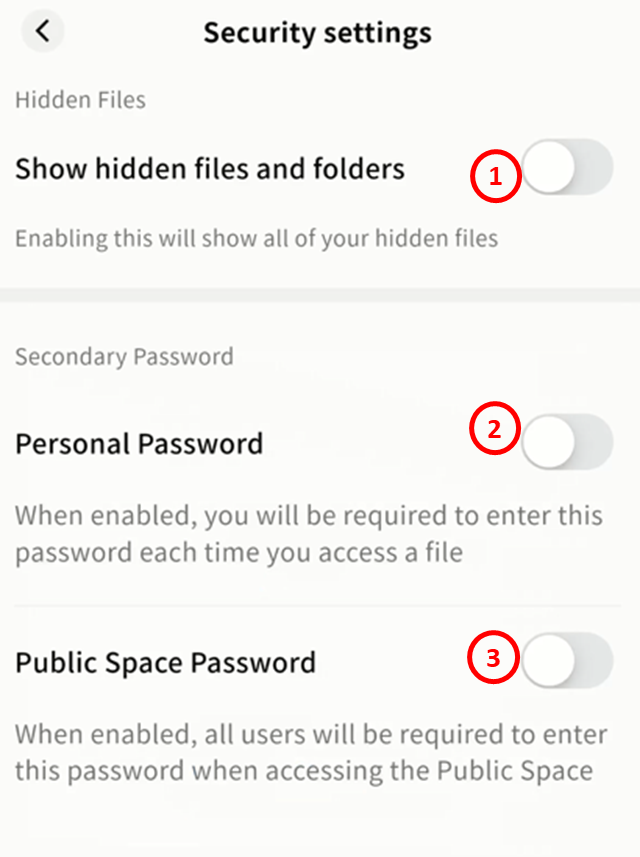

### Show Hidden Files and Folders

If certain files are hidden, enable this option to make them visible in
the file manager.

### Personal Password

#### Set Personal Password

1.  On the Device Information page, go to **Security Settings** and
    enable **Personal Password**.

2.  Enter your password in the prompt to complete setup.

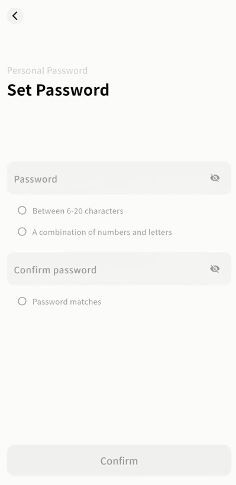

#### Access Device with Personal Password

Once set, you will be prompted to enter the password when accessing the
device home page. Only after entering the correct password can you
proceed.

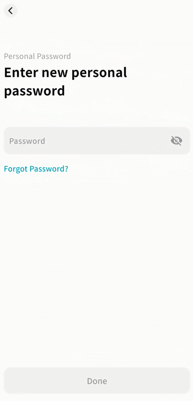

#### Change Personal Password

1.  Go to **SET UP  Security Settings  Personal Password  Change
    Password**.

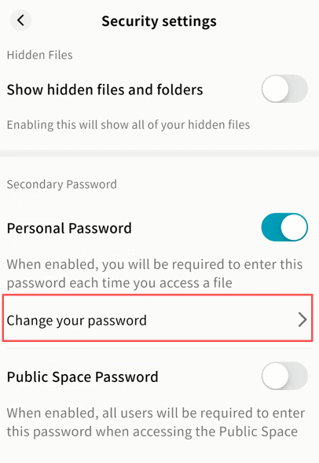

2.  Enter your current password to verify your identity.

3.  Enter the new password and save changes.

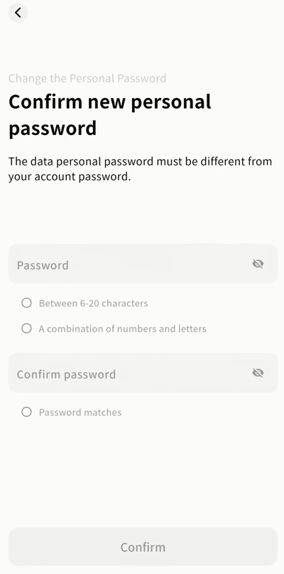

#### Forgot Personal Password

1.  In the Personal Password prompt or change window, click **Forgot
    Password**.

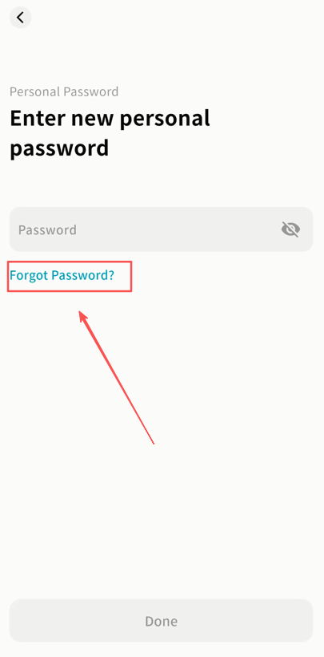

2.  Enter the email or phone number linked to your DASSET account.

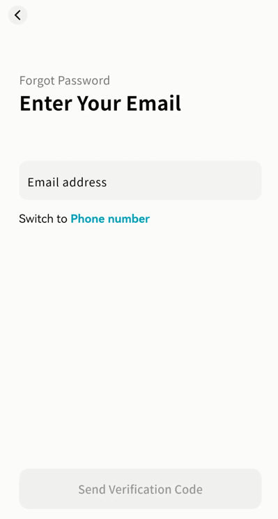

3.  Enter the verification code sent to you.

4.  After verification, set a new personal password.

### Public Space Password

*Only Owners and Administrators can configure this option.*

#### Set Public Space Password

1.  Go to **SET UP  Security Settings** and enable **Public Space
    Password**.

2.  Enter the desired password to complete setup.

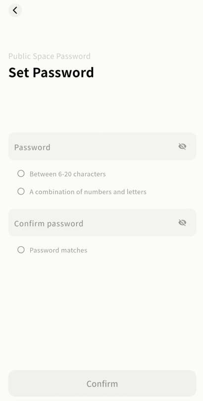

#### Access Public Space

When accessing Public Space, a password prompt will appear. Only the
correct password will grant access.

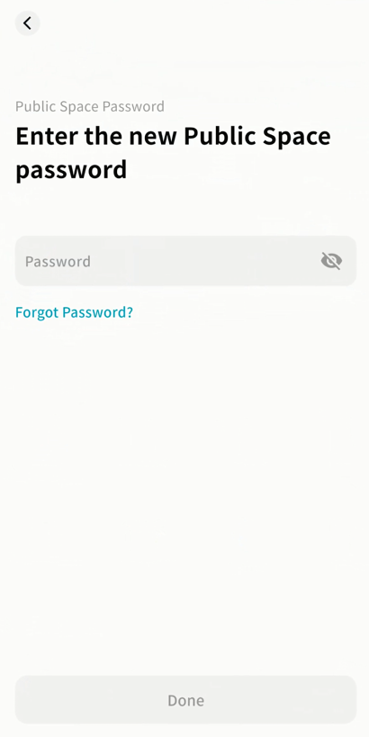

#### Change Public Space Password

1.  Go to **SET UP  Security Settings  Public Space Password 
    Change Password**.

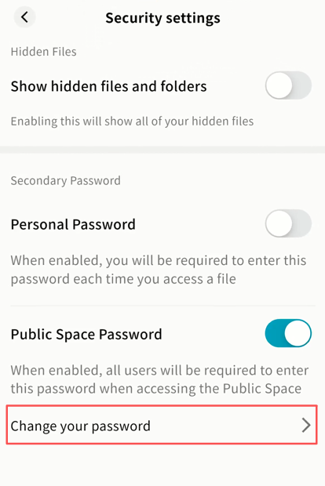

2.  Enter the current password to verify your identity.

3.  Enter a new password to update.

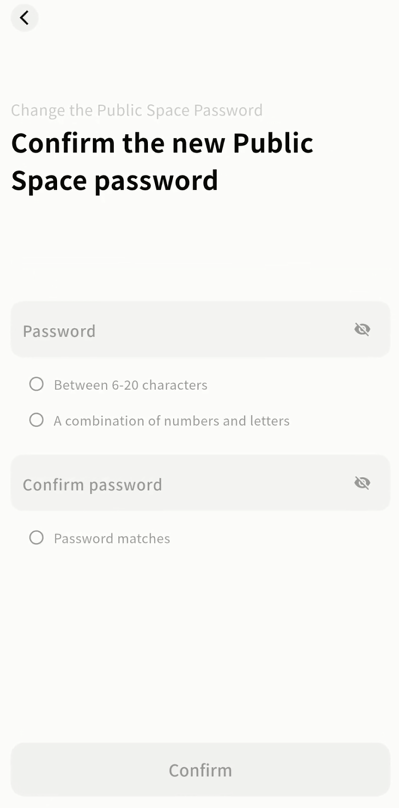

#### Forgot Public Space Password

*Only Owners and Administrators can use this option.*

1.  In the Public Space Password prompt or change window, click **Forgot
    Password**.

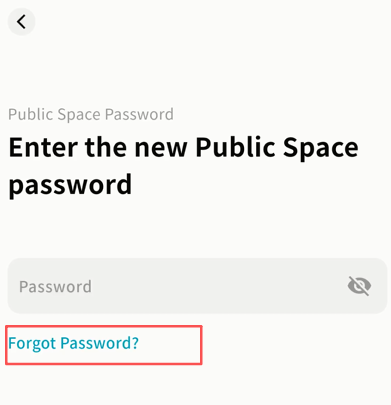

2.  Enter the email or phone number linked to your DASSET account.

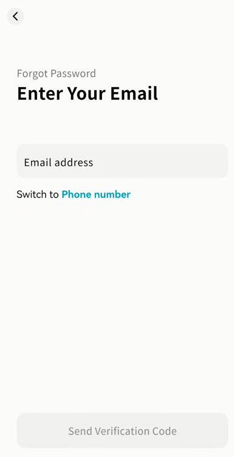

3.  Enter the verification code sent to you.

4.  After verification, set a new password.

##  Firmware Upgrade

*Only Owners and Administrators can perform this operation.*

When a firmware update is available, you will see a pop-up notification
upon entering the device.

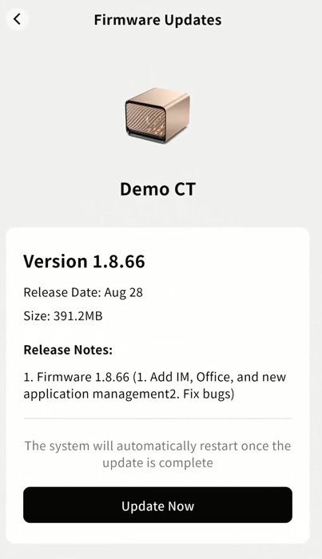

- Click **Update Now** to begin the upgrade.

- If you prefer not to update immediately, click **Back** and upgrade
  later.

- **Important**: Do not shut down or restart the device during the
  update, as this may cause the upgrade to fail and result in device
  malfunction.

You can also check update notifications under **SET UP  Hardware
Status**.

- Click **New Updates Available** to view details of the update.

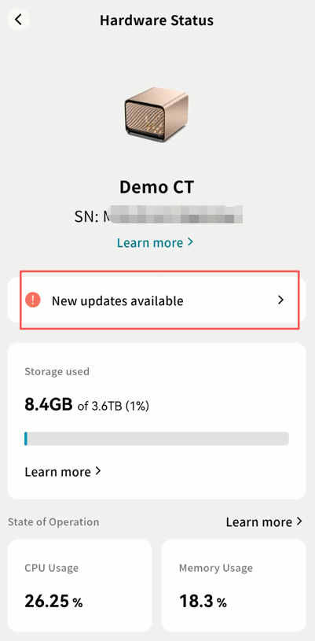

##  LAN Settings

On the **LAN Settings** page, you can configure:

- **LAN Access Account**: Change the password used to access Samba and
  Time Machine.

- **LAN IP Management**: Configure the network information of the DASSET
  edge device.

- **Link Aggregation**: If your device has multiple network ports, you
  can combine them into one **logical interface** to improve
  performance.

###  LAN Access Account

1.  Click **Change Password**.

2.  In the pop-up window, enter a new password and confirm.

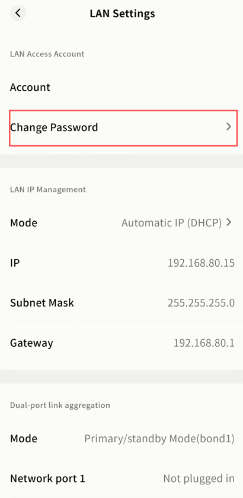

###  LAN IP Management

Two IP management modes are available:

- **DHCP (Automatic IP Assignment)**: The switch/router assigns an IP
  address to the DASSET device automatically. No manual configuration is
  required. This is ideal for plug-and-play use and users without
  networking knowledge.

- **Manual IP Assignment**: The user assigns a fixed IP address to the
  DASSET device. This is recommended when services (such as Samba)
  require a stable IP address.

*Important: Ensure that the manually configured IP matches the subnet of
the current network and is not already in use. If the device cannot
connect after manual configuration, press and hold the **reset** button
on the device to restore IP settings.*

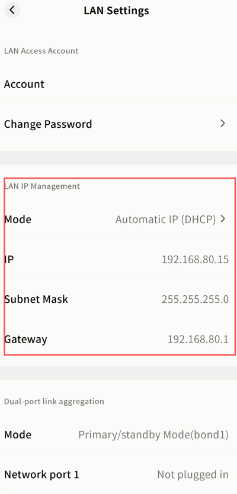

#### DHCP (Automatic)

By default, DASSET devices use DHCP. On the LAN IP Management page, you
can view:

- Current IP address

- Subnet mask

- Gateway IP address

*Note: IP details assigned by DHCP cannot be modified manually.*

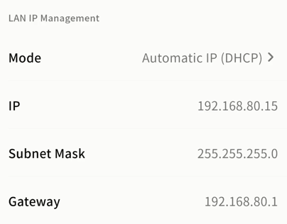

#### Manual IP Assignment

If you use protocols such as Samba, it is recommended to configure a
static IP to avoid DHCP changes disrupting access.

Steps:

1.  Go to **SET UP  LAN Settings  LAN IP Management**, then click
    **Mode**.

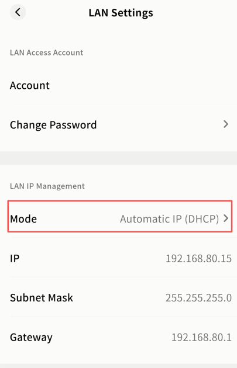

2.  Enable **Manual Network Configuration** and enter:

    - IP address

    - Subnet mask

    - Gateway

    - Primary and secondary DNS servers

Once saved, you can access Samba and other services using the fixed IP
address.

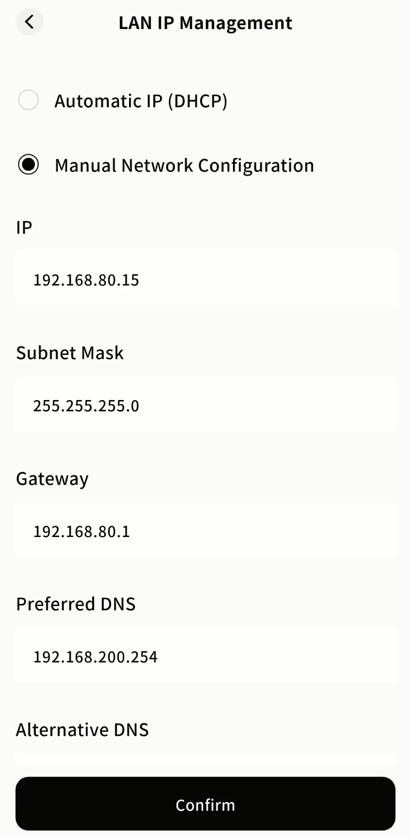

###  Link Aggregation

If your device has multiple network ports, you can enable link
aggregation and select a working mode:

- **Balance Polling Mode**: Both ports transmit packets in turn,
  providing load balancing and fault tolerance. Requires switch support
  for port aggregation.

- **Primary/standby Mode**: One port is active, the other serves as
  backup. If the active port fails, the backup takes over automatically.

- **Dynamic Link Aggregation Mode**: Requires a switch with LACP
  support. Provides real-time monitoring, load balancing, and failover.

- **Adaptive Load Balancing**: Distributes traffic across ports
  automatically. Does not require switch support.

*Note: To ensure proper use, connect both ports to the same switch.*

Steps:

1.  Go to **SET UP  LAN Settings  Link Aggregation  Mode**.

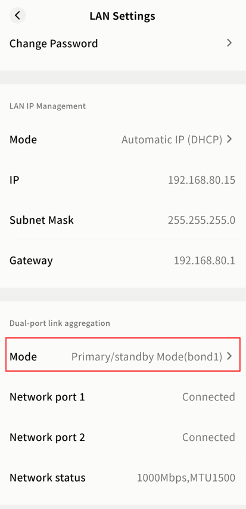

2.  Select the desired mode and click **Update**.

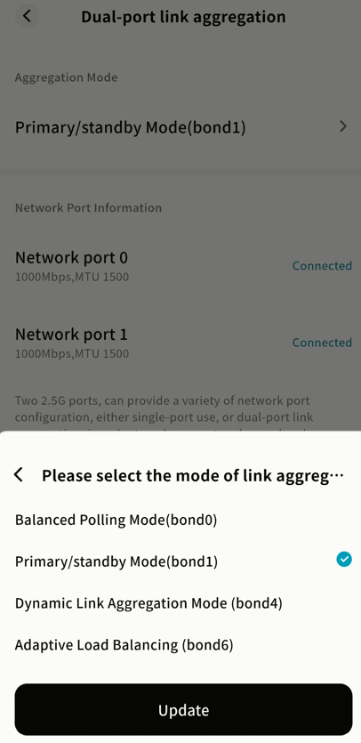

##  Power Management

On the **Power Management** page, you can perform remote shutdown,
restart, and scheduled power tasks.

###  Safe Shutdown

*Available to Owners and Administrators only.*

Click **Shutdown** to remotely power off the DASSET device.

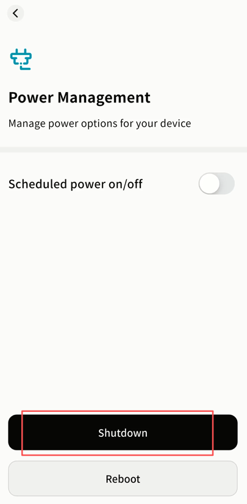

*Important: If your device does not support remote power-on, it can only
be restarted by:*

1.  Power cycling (unplugging and re-plugging the power cable, if the
    device supports auto power-on).

2.  Pressing the physical power button on the device.

###  Restart

*Available to Owners and Administrators only.*

Click **Reboot** to remotely reboot the DASSET device.

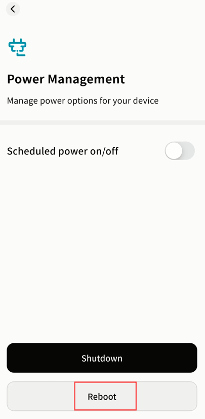

###  Scheduled Power Management

*Available to Owners and Administrators only (regular users can only
view rules).*

Steps:

1.  Go to **SET UP  Power Management  Scheduled Power on/off** and
    enable the option.

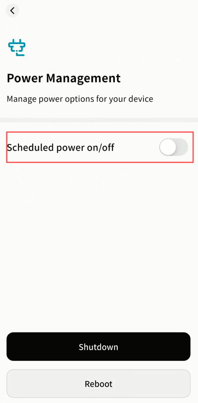

2.  Configure rules:

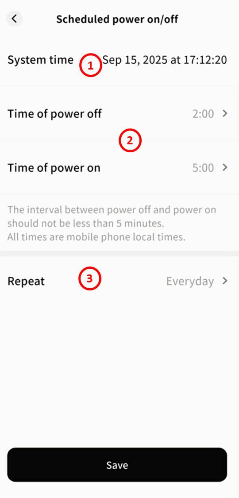

- **System Time**: Based on the device's time zone.

- **Time of power off/on**: Define exact times or adjust by hour using
  arrows.

- **Repeat**: Apply the rule daily, on weekdays, weekends, or custom
  days of the week.

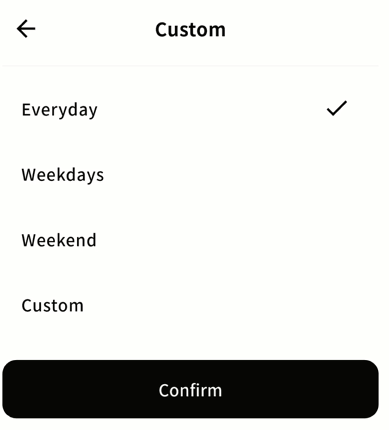

3.  To disable scheduling, simply switch off the option.

##  Device Unbinding

###  Owner Unbinding

The Owner can unbind the device. This action unbinds **all members**
associated with the device.

1.  Go to **SET UP  Unbind this device**.

2.  A warning will appear. If you prefer not to remove all members,
    transfer ownership first. Otherwise, click **Remove All Members**.

3.  In the confirmation window, type **Confirm**. If you no longer need
    the data stored on this device, we strongly recommend selecting
    **Erase personal hard disk data at the same time**.

    - When this option is enabled, all data in **My Space** associated
      with your account will be automatically deleted from the DASSET
      edge device after unbinding, ensuring your privacy and data
      security.

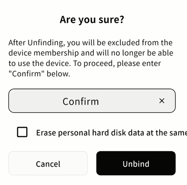

###  Member Unbinding

Members can unbind themselves from a device at any time. After
unbinding, the device will no longer appear in their device list.

1.  Go to **SET UP  Unbind Device**.

2.  In the confirmation window, type **Confirm**. If you no longer need
    the data stored on this device, we strongly recommend selecting
    **Erase personal hard disk data at the same time**.

    - When this option is enabled, all data in **My Space** associated
      with your account will be automatically deleted from the DASSET
      edge device after unbinding, ensuring your privacy and data
      security.

# File Management

## Three Storage Spaces

DASSET divides storage into three types of spaces:

- **My Space**

> Accessible only by you. Other members cannot see the files stored
> here.

- **Public Space**

> Accessible to all users bound to the device. Read/write permissions
> can be configured per user.

- **Group Space**

> Accessible only to members of the same group.

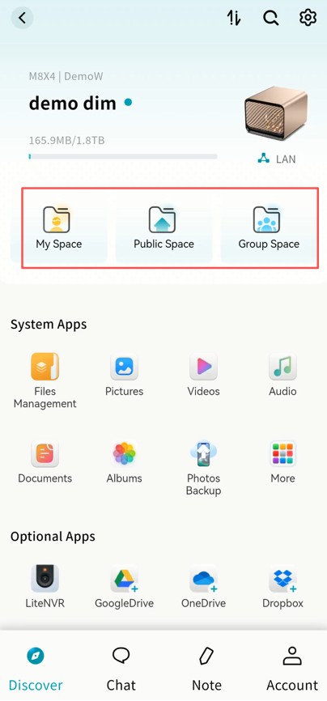

## File Browser Interface

Inside any space, you can browse and manage files with multiple options:

1.  **Sorting:** Sort files by name, size, or modification date.

2.  **View Options:** Display files in list view or grid view.

3.  **Selection:** Select single or multiple files.

4.  **File Type Filter:** Quickly filter files by type (images, videos,
    audio, documents, compressed files).

5.  **File List:** Shows file names and modification dates.

6.  **File Menu (...):** Open the file operations menu.

7.  **Task Center:** Track upload, download, and other task progress.

8.  **Search:** Search for files within the current space using
    keywords.

9.  **+ Button:** Upload photos, videos, files, or create new folders.

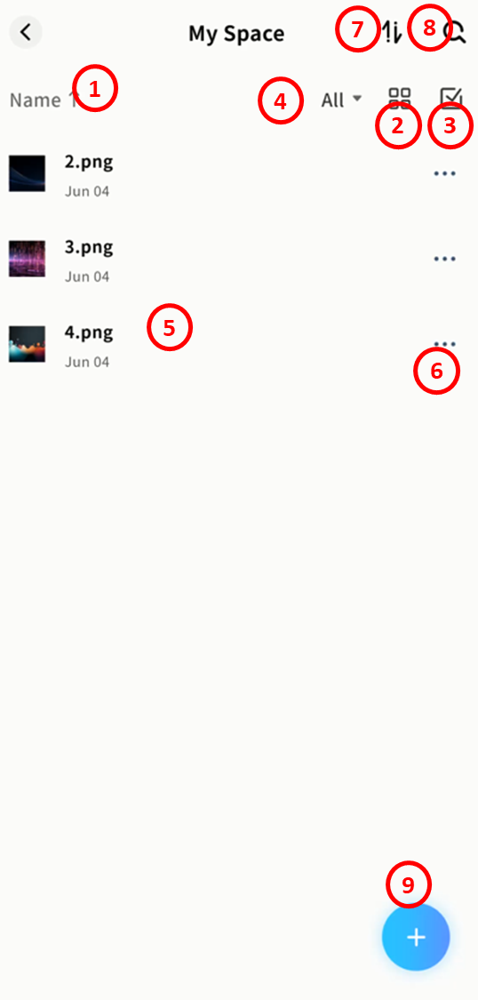

## File Operations Menu

DASSET supports a wide range of file operations:

1.  **File Menu (...):** Open file operations menu.

2.  **Move:** Move files from the current directory to another.

3.  **Copy:** Copy files to another directory.

4.  **Download:** Download files to your local device.

5.  **Delete:** Remove files.

6.  **Rename:** Assign a new name to the file.

7.  **Favorite:** Add files to My Favorites.

8.  **Share/Send:** Share files in different ways:

    - **Member Share**: Share with other members of the same device.

    - **QR Code Share**: Generate a QR code for sharing with other
      DASSET users.

    - **My Other Devices**: Copy files to another DASSET device you own.
      (*Note: The target device must also belong to your account.*)

9.  **Hide:** Hide files. Hidden files will not appear unless Show
    Hidden Files is enabled.

10. **Compress:** Compress one or multiple files into a ZIP archive.

11. **Decompress:** Extract compressed files. Supported formats: RAR,
    ZIP, TAR, TAR.GZ.

12. **View Details:** Display file details, including name, location,
    creation date, and modification date.

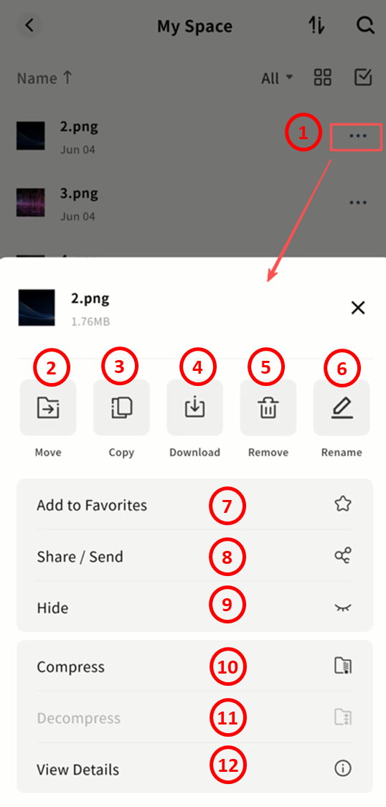

## File Selection

### Single File Operations

Click **...** next to a file to open the menu and choose operations for
that file.

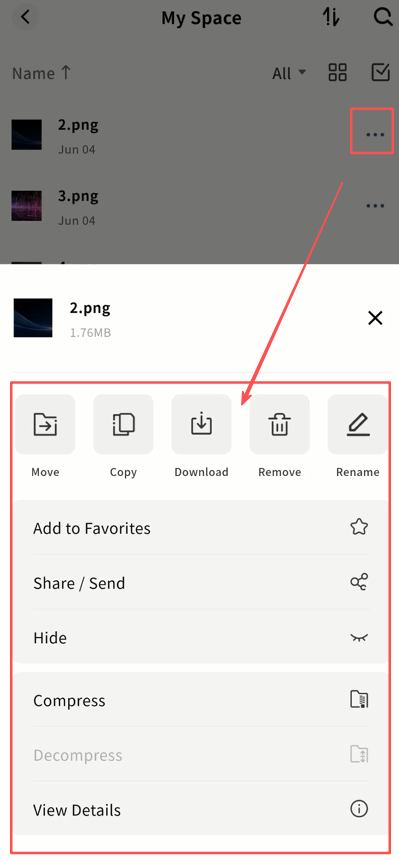

### Batch File Operations

1.  Use the checkboxes to select one or more files.

2.  From the bottom menu, choose an operation:

    - **Move**: Move selected files to another directory.

    - **Download**: Download selected files to your device.

    - **Share/Send**: Share selected files via member share, QR code, or
      send to another DASSET device you own.

    - **More**: Access additional operations.

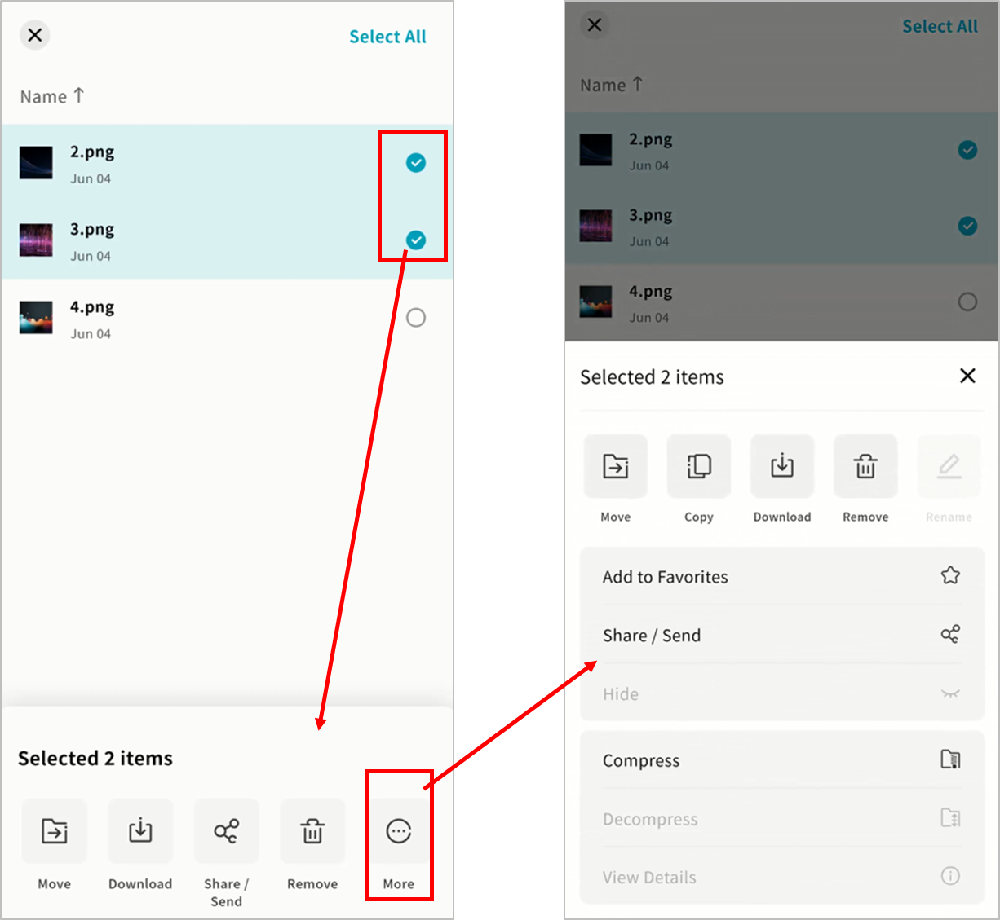

## File Upload and New Folder

You can upload files from your mobile device to the DASSET edge device
in any space by tapping the **+** button.

*Note: Ensure you grant file access permissions to the DASSET app before
uploading.*

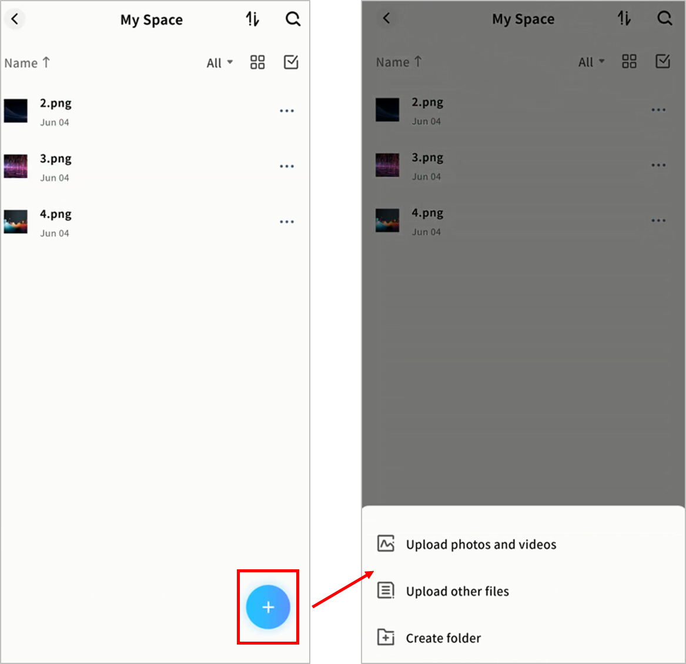

### Upload Photos and Videos

1.  Tap **+  Upload Photos/Videos**.

2.  In the pop-up window, select the photos or videos to upload to the
    device.

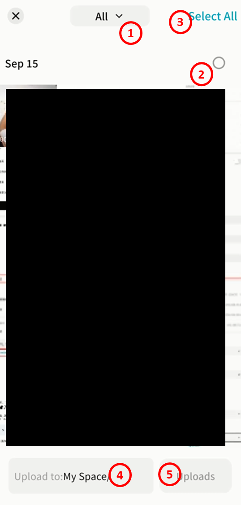

1.  **Album Selection:** Switch between different albums from the
    dropdown.

2.  **Select by Date:** Checkmark a date to select all photos/videos
    from that time.

3.  **Select All:** Select all items in the album.

4.  **Upload To:** Choose the destination folder.

5.  **Uploads:** Start uploading the selected items.

<!-- -->

3.  Monitor progress in **Task Center  Upload**.

### Upload Files

1.  Tap **+  Upload Files**.

2.  The DASSET app will open your device's **File Manager**. Select the
    files to upload. The upload will begin automatically once confirmed.

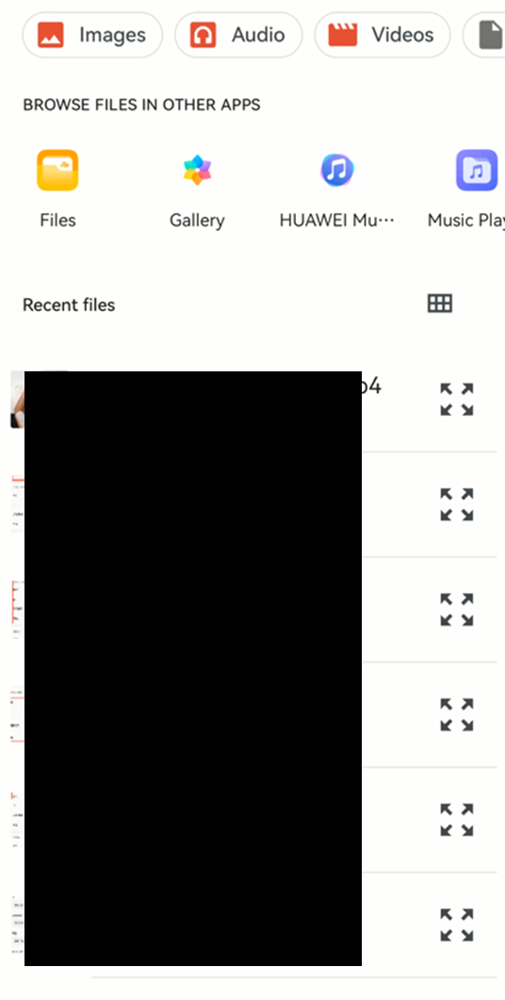

> *Note: The File Manager interface may vary depending on the mobile
> device.*

### Create a New Folder

1.  Tap **+  New Folder**.

2.  In the pop-up window, enter the folder name and click **Confirm**.

> *Note: The following characters are not supported in folder names: \\
> /  \< \* \` \| ? \" '*

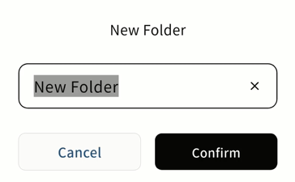

### Upload Progress

You can view current and completed uploads in **Task Center  Upload**.

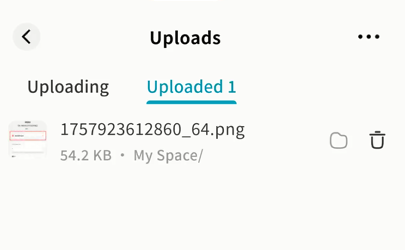

## File Download

Files stored on the DASSET edge device can be downloaded to your mobile
device at any time. Both single and multiple file downloads are
supported.

### Single File Download

1.  Tap the **...** menu next to a file and select **Download**.

2.  The download will start automatically.

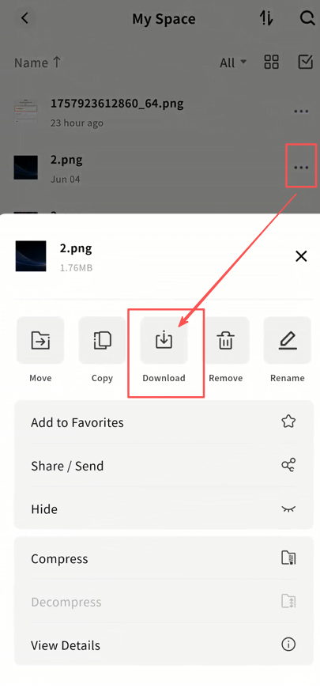

### Multi-File Download

1.  Use the checkboxes to select one or more files.

2.  Tap **Download** in the bottom menu to begin.

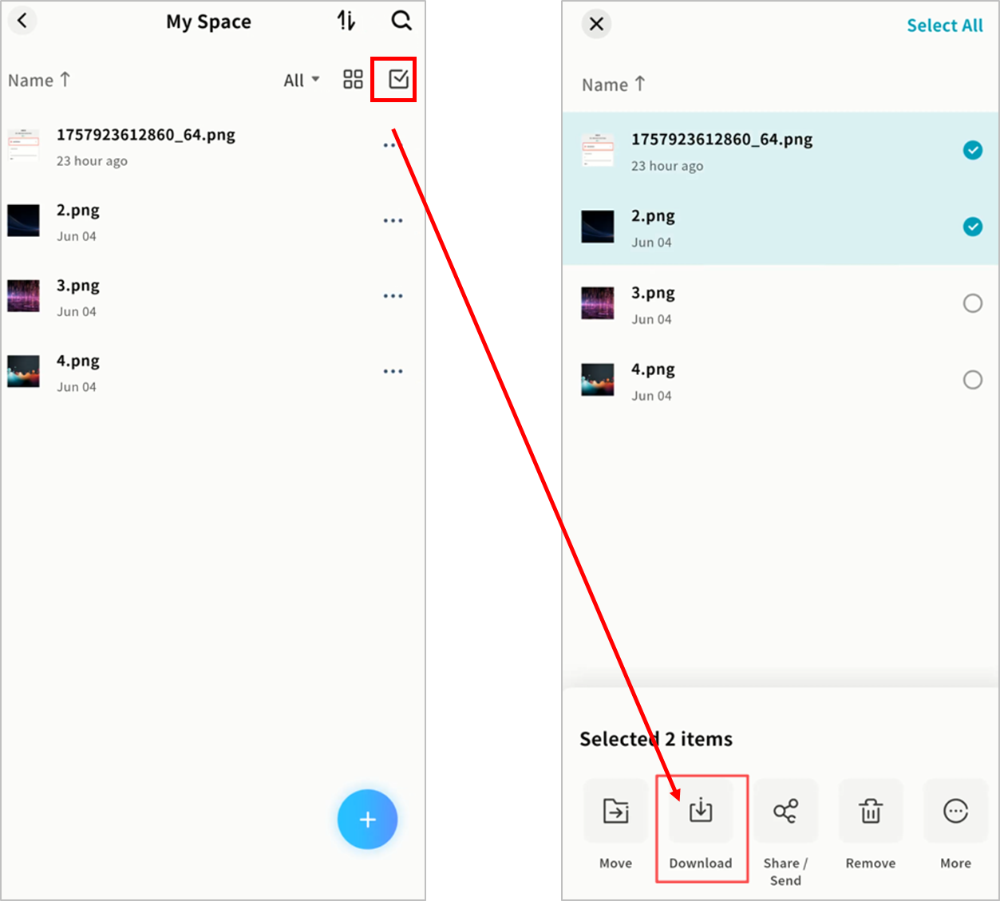

### Download Progress

Track downloads in **Task Center  Download**.

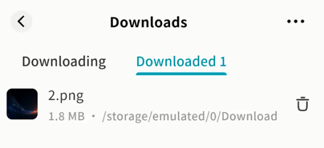

## File Move

The File Move function transfers files from one directory to another.
After moving, files will exist only in the new directory and no longer
in the original location. Single and batch operations are supported.

1.  Tap the **...** menu next to a file and select **Move**.

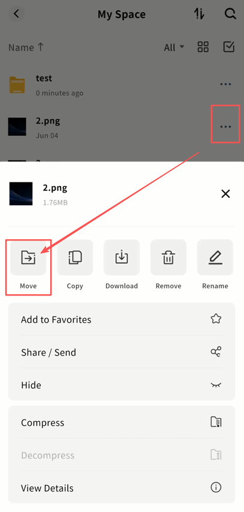

2.  On the **Select Destination** page, choose the target space. All
    available spaces will be listed.

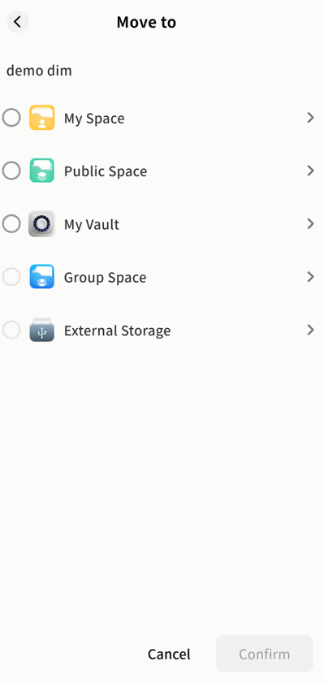

3.  In the chosen space, select the destination folder. You can also tap
    **+** in the top-right corner to create a new folder as the target.

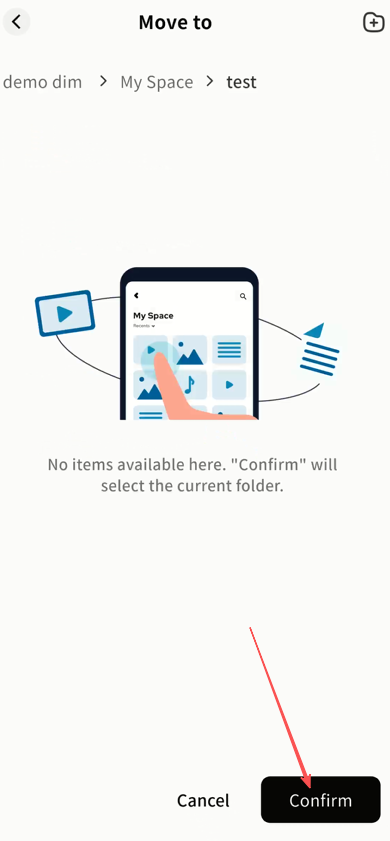

4.  Monitor move progress in **Task Center  Other Operations**.

## File Copy

The File Copy function duplicates files into a target directory while
keeping the original files in their original location. Both single and
batch copy operations are supported.

1.  Tap the **...** menu next to a file and select **Copy**.

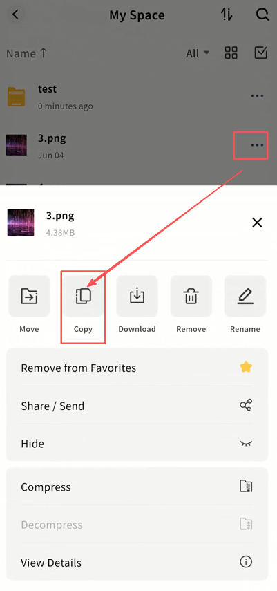

2.  On the **Select Destination** page, choose the target space. DASSET
    will list all available spaces.

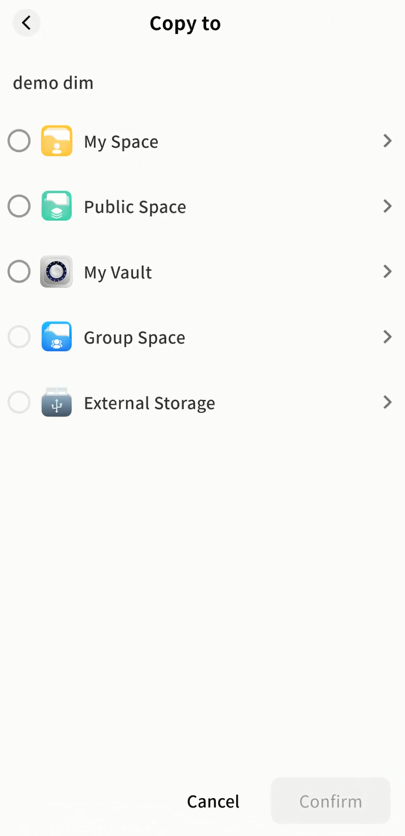

3.  Select the destination folder within the chosen space. You can also
    tap **+** in the top-right corner to create a new folder as the
    target directory.

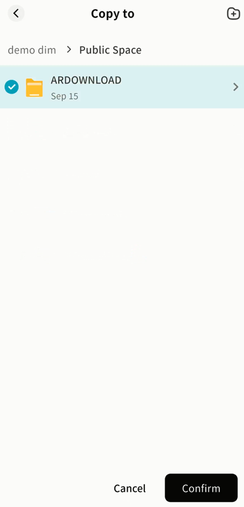

4.  Monitor copy tasks in **Task Center  Other Operations**.

## Online Media Playback

DASSET supports online playback of images, videos, and audio files.
Simply tap the file to open it.

1.  **Supported Video Formats**

> avi, flv, mpg, mov, mkv, mp4, m2ts, asf, wmv, vob, divx, 3gp, mpeg,
> mts, ts, f4v, hevc

2.  **Supported Image Formats**

> bmp, gif, heic, jpg, png, jpeg, tif, tiff, dng

3.  **Supported Audio Formats**

> mp3, wma, flac, wav, aac, ape, m4a, ogg

### Video Playback

Tap a video file to open the video player and watch online.

1.  Total video duration and current playback time

2.  Progress bar with drag-to-seek support

3.  Fullscreen/windowed playback toggle

4.  Play/Pause

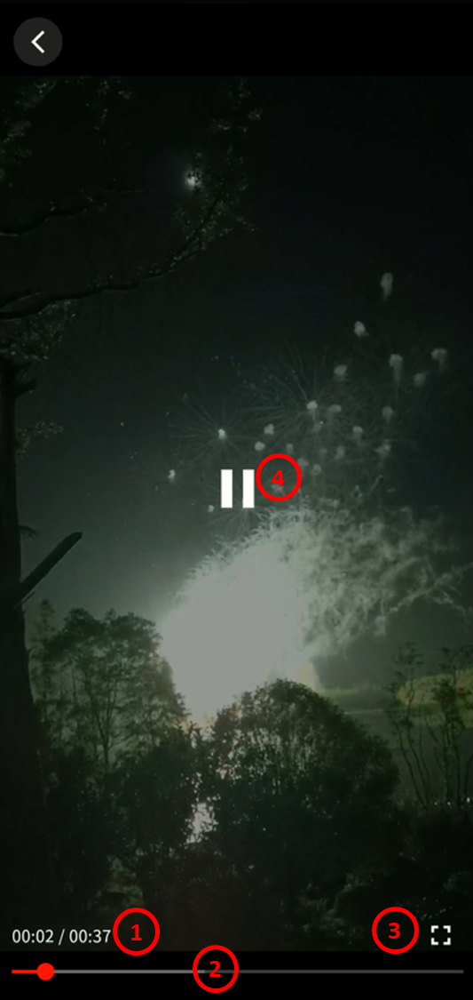

### Image Viewing

Tap an image file to open the image viewer and view the original file.

- Swipe left or right to switch images

### Audio Playback

Tap an audio file to open the audio player and listen online.

1.  Progress bar with drag-to-seek support

2.  Sequential or random playback

3.  Previous/Next track

4.  Play/Pause

5.  Playlist (all audio files in the same directory are automatically
    added)

6.  Display of current audio filename

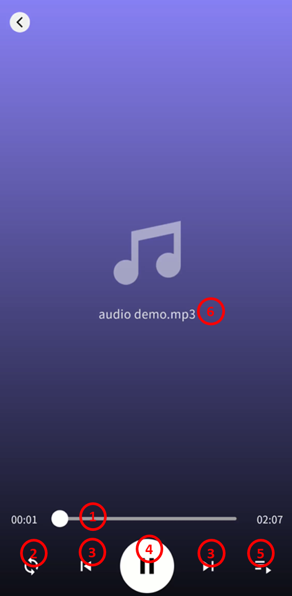

##  File Sharing / Sending

DASSET supports sharing files stored on your device in multiple ways,
either with other users or between your own devices.

- **Member Share**: Share files directly with members on the same DASSET
  device. Useful for private file sharing outside Public or Group
  Spaces.

- **QR Code Share**: Generate a sharing code (QR code) to securely share
  files with other DASSET users not on the same device. The recipient
  must own at least one DASSET device.

- **My Other Devices**: Copy files between DASSET devices under your
  ownership.

###  Share/Send Entry

1.  Tap the **...** menu next to a file and select **Share/Send**.

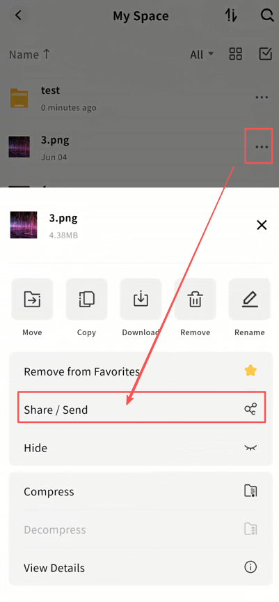

2.  Choose the desired sharing method.

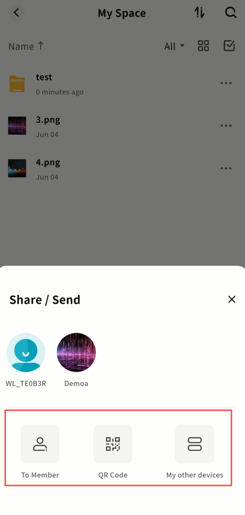

###  Member Share

#### **Send Files via Member Share**

1.  Tap the **...** menu next to a file  **Share/Send**.

2.  Select the target members in the pop-up window.

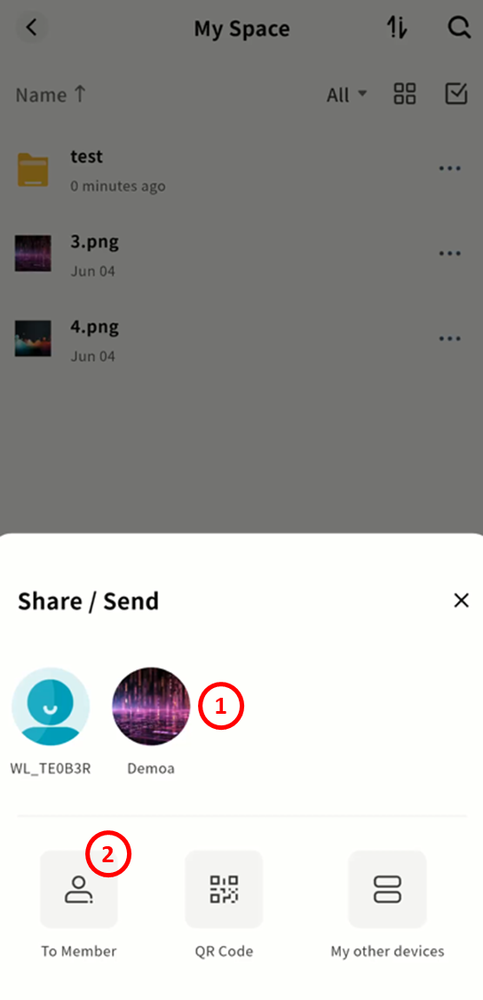

1.  Tap a member avatar to send directly.

2.  Or go to the **Member Share** page, select multiple members, and
    share in batch.

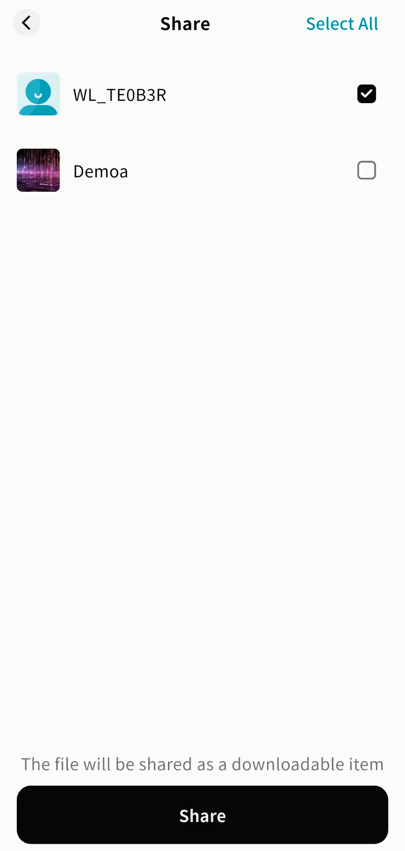

#### **Receive Files via Member Share**

Check **Task Center  Get Share** to see incoming files.

1.  Displays a list of received share tasks. Tap a task to view details.

2.  Delete tasks by tapping ×.

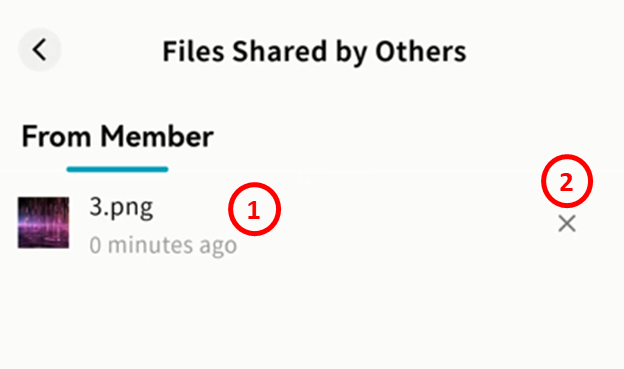

For each received file, you can:

- **Save**: Store the file in a directory on your DASSET device.

- **Download**: Save the file directly to your mobile device.

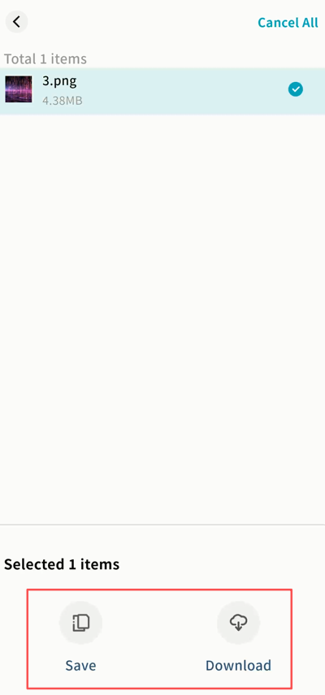

### QR Code Share

#### **Create a QR Code Share**

1.  Tap the **...** menu next to a file  **Share/Send**.

2.  Select **QR Code**.

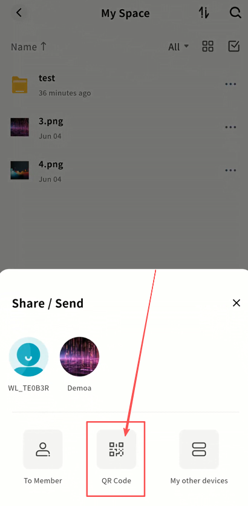

3.  Configure share rules:

<!-- -->

1.  **Share Expiration:** The validity period of the QR code.

2.  **Downloadable:** Maximum number of times the file can be
    downloaded.

3.  **Access Settings:**

    - **Public**: Anyone with the QR code can access the file.

    - **Password-Protected**: A password is required to access the file.

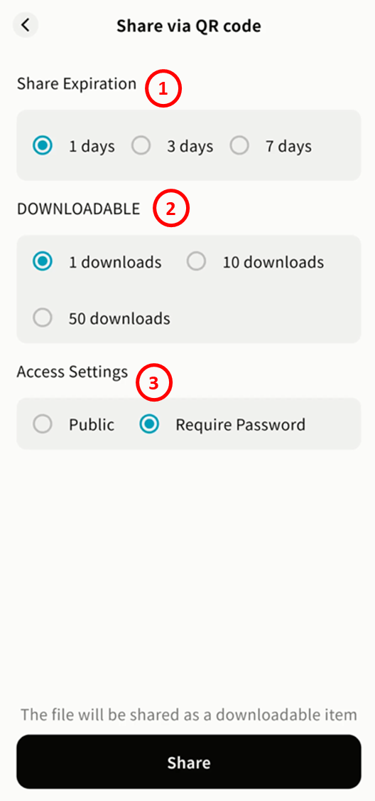

4.  After setup, click **Share** to generate a QR code. Options include:

<!-- -->

1.  File list in the share task

2.  Delete share task

3.  Task name

4.  Expiration date

5.  QR code image

6.  Remaining downloads

7.  Share code (string form)

8.  Access password (if password-protected)

9.  Save QR code to gallery

10. Share QR code via other apps

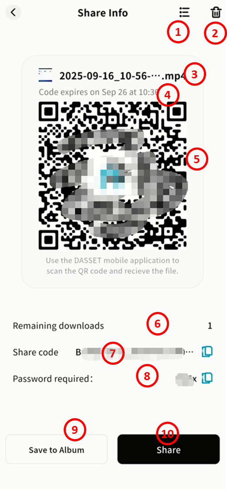

#### **Retrieve Files via QR Code Share**

- **Method 1: Scan QR Code**

  1.  Open **DASSET  Account  Scan**.

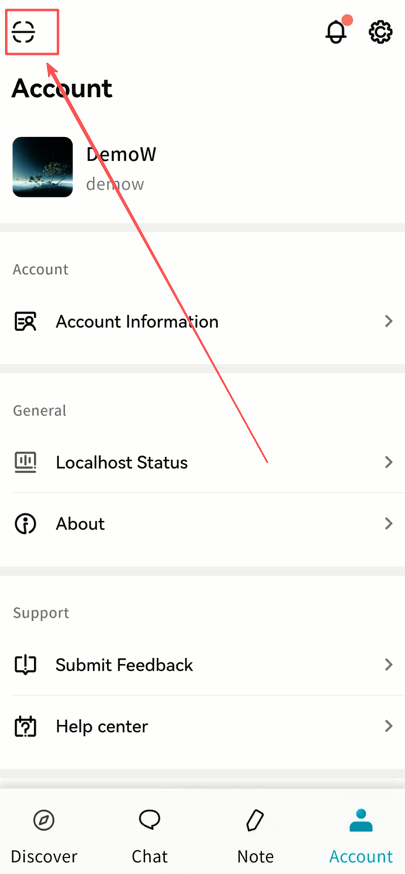

2.  Choose to scan using the camera or select a saved QR image from the
    gallery.

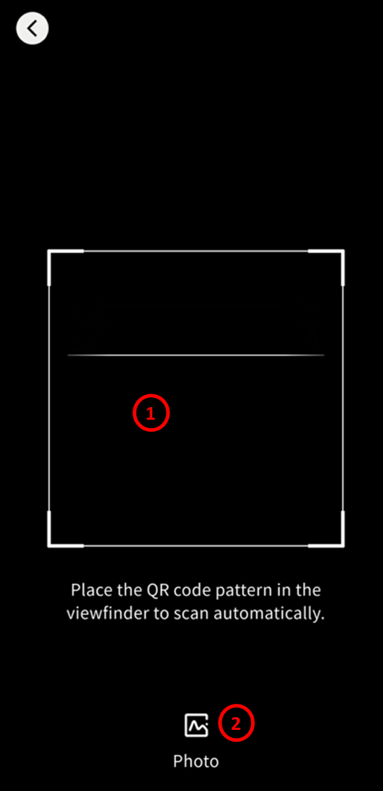

3.  Enter the access password if required.

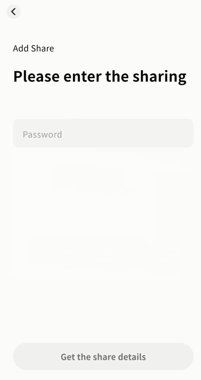

4.  View the file details, select files, and click **Save**.

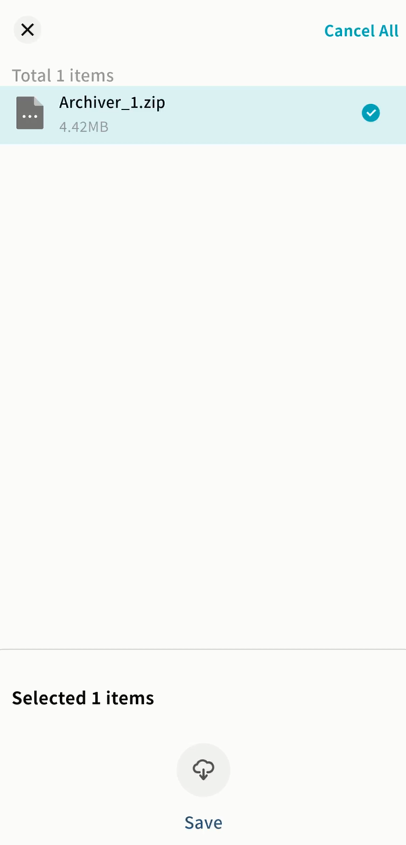

5.  Select the target DASSET device (only those you own will appear).

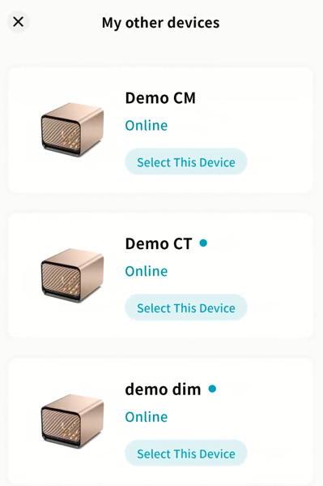

6.  Choose the destination space and directory, then Confirm.

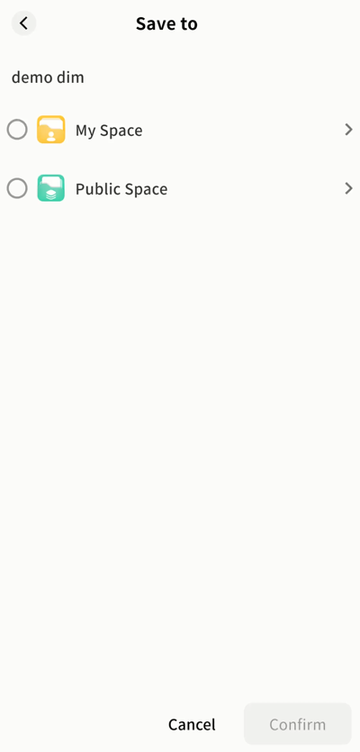

7.  Monitor download progress in the Task Center.

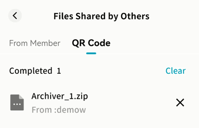

- **Method 2: Enter Share Code**

  1.  Go to **Task Center  Get Share  QR Code  +**.

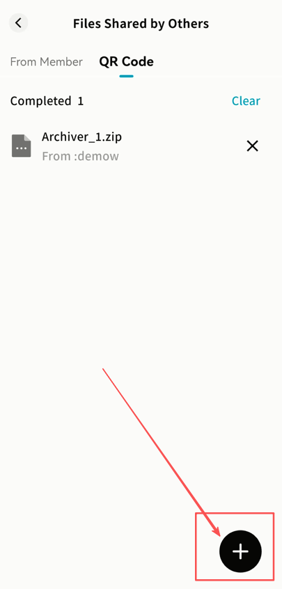

2.  Choose to scan QR code, select from gallery, or enter the share code
    string.

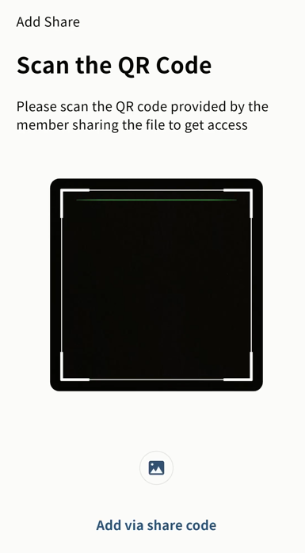

3.  Enter the share code manually if selected.

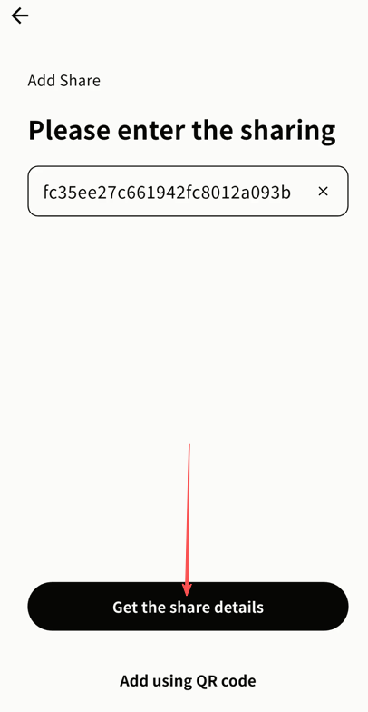

4.  Provide the access password if required.

5.  View file details and select files to save.

6.  Select the target DASSET device (only those you own will appear).

7.  Choose the destination space and directory, then Confirm.

8.  Monitor progress in the Task Center until complete.

###  Send to My Other Devices

Used to copy files between two DASSET devices under your account.

1.  Tap the **...** menu next to a file  **Share/Send**.

2.  Select **My Other Devices**.

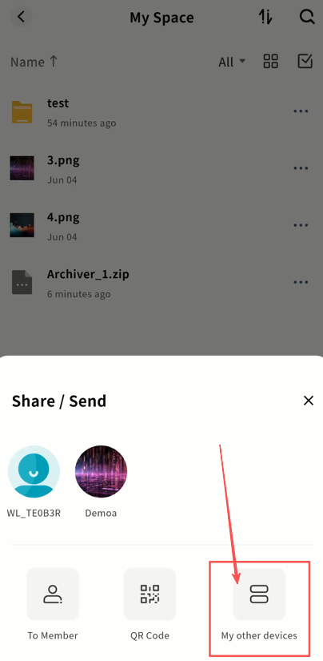

3.  In the list, select the destination device (only devices you own
    will be displayed).

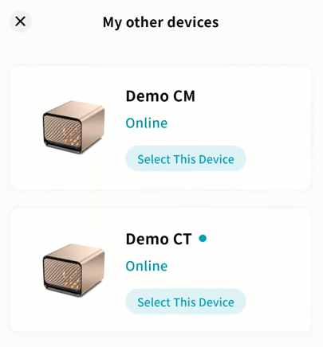

4.  Choose the save path and click **Confirm.** The file will transfer
    automatically.

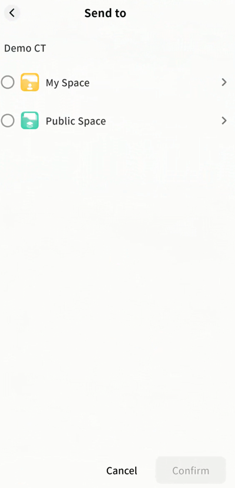

5.  On the destination device, go to **Task Center  Get Share  QR
    Code** to view progress.

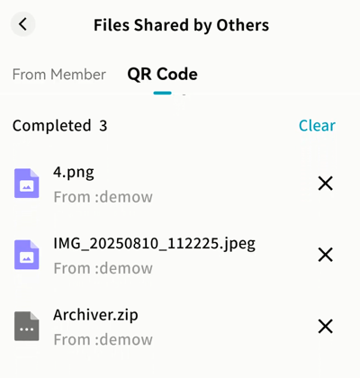

##  Rename

You can rename files stored on the DASSET edge device.

1.  Tap the **...** menu next to a file  **Rename**.

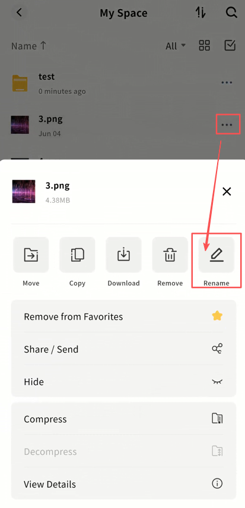

2.  Enter a new file name and click **Confirm**.

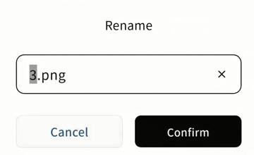

*Note: The following characters are not supported in file names: \\ / 
\< \* \` \| ? \" '*

##  Favorites

You can add files to **My Favorites** for quick access later. Both
single and multiple files can be added.

1.  Tap the **...** menu next to a file  **Add to Favorite**.

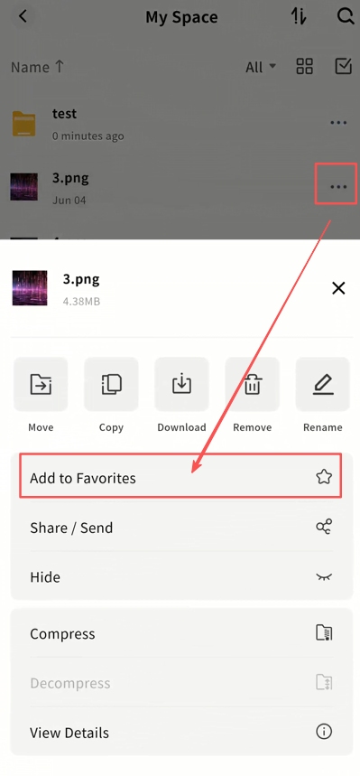

2.  To remove, select **Remove from Favorite**.

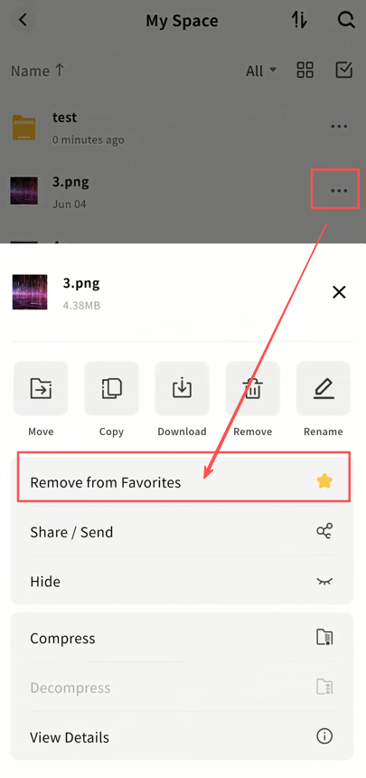

##  Remove

You can delete unwanted files, either individually or in batches.

1.  Tap the **...** menu next to a file and select **Remove**.

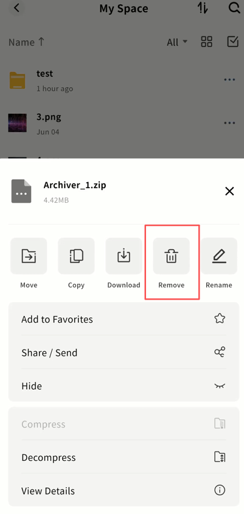

2.  Choose one of two deletion methods:

    - **Delete permanently**: If selected, the file will be deleted
      immediately and cannot be recovered.

    - **Move to Recycle Bin**: If not selected, the file will first be
      moved to the **Recycle Bin** for 30 days before being permanently
      deleted. Files in the Recycle Bin can be restored to their
      original directory if deleted by mistake.

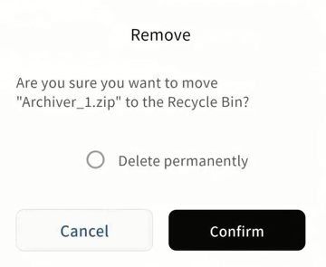

##  Hide

###  Hide and Unhide Files

For sensitive files, you can hide them from view. Both single and batch
operations are supported.

1.  Tap the **...** menu next to a file and select **Hide**.

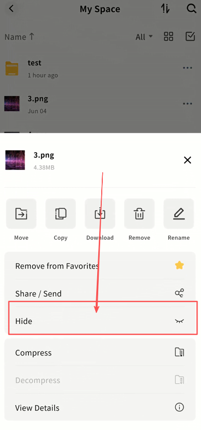

2.  Hidden files will not appear in the file list by default.

3.  You can later **Cancel hide file** so they are always visible again.

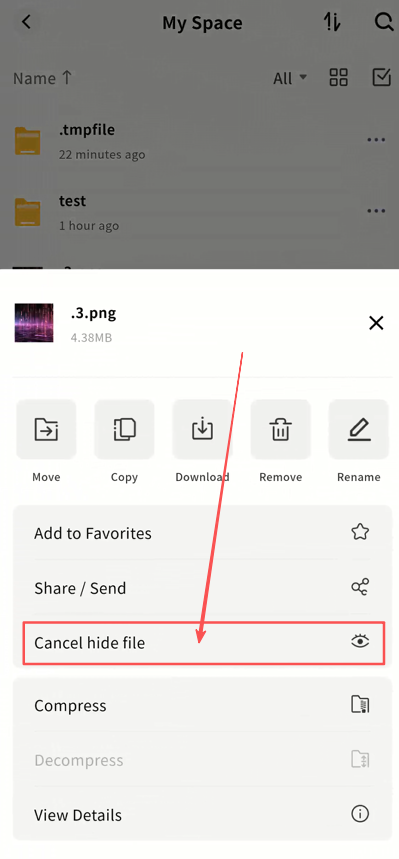

###  Show Hidden Files

To view hidden files:

1.  Go to **SET UP  Security Settings**.

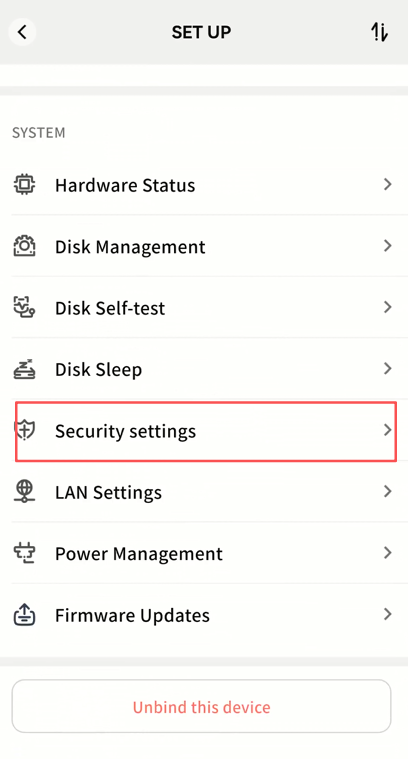

2.  Enable **Show Hidden Files and Folders**.

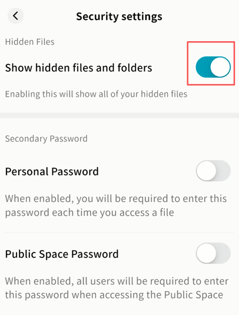

3.  Hidden files will then appear in the file list.

##  File Compression and Decompression

DASSET supports online compression and decompression, without
downloading files locally.

- **Supported Decompression Formats**: rar, zip, tar, tar.gz

- **Default Compression Format**: zip (cross-platform friendly)

###  Compression

1.  Select one or more files and choose **Compress** from the menu.

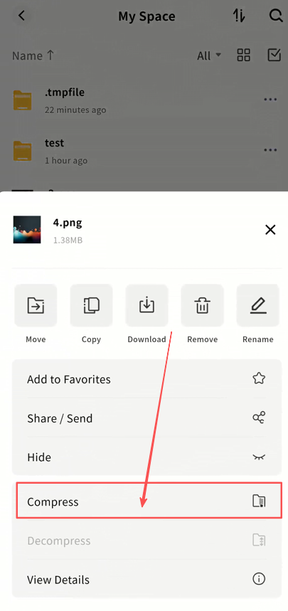

2.  On the **Select Destination** page, choose a target space.

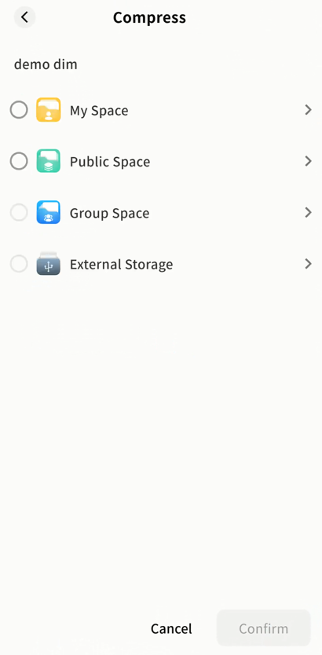

3.  Select the target folder, or tap **+** to create a new folder.

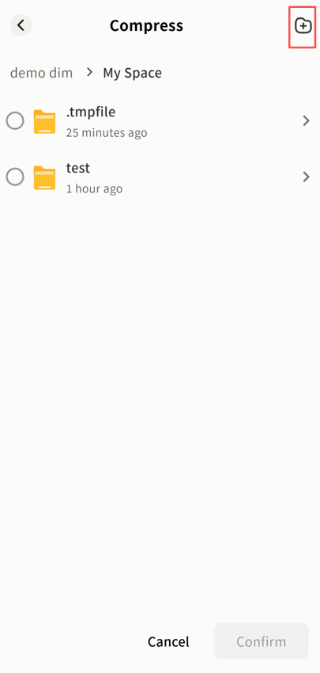

4.  After compression:

    - Multiple files will be packed into **Archiver.zip**.

    - A single file will be compressed as **OriginalFileName.zip**.

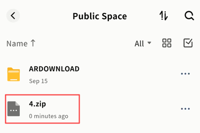

5.  Track compression tasks in **Task Center  Other Operations**.

###  Decompression

1.  Tap the **...** menu next to a compressed file and select
    **Decompress**.

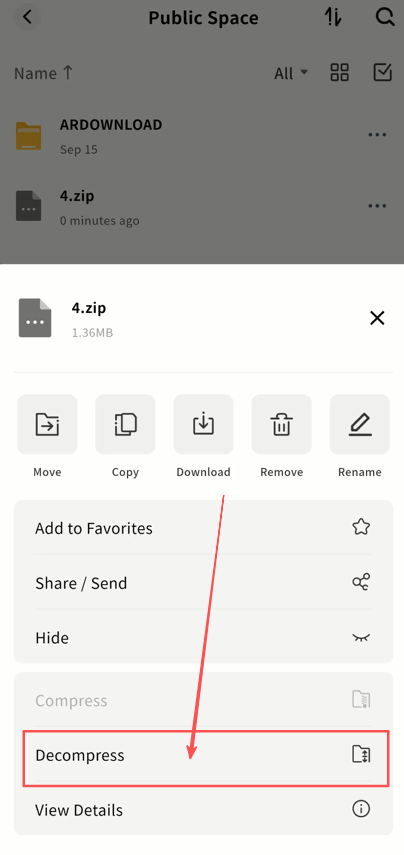

2.  On the **Select Destination** page, choose a target space.

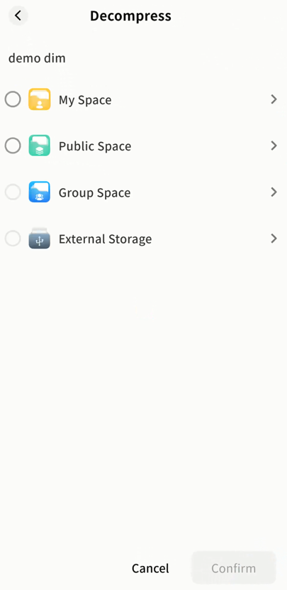

3.  Select the folder where extracted files will be saved, or tap **+**
    to create a new folder.

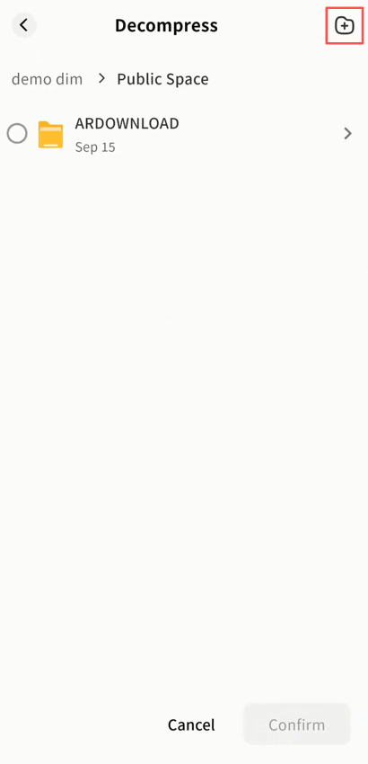

4.  Extracted files will appear in the chosen directory.

###  Compression/Decompression Progress

Monitor task progress in **Task Center  Other Operations**.

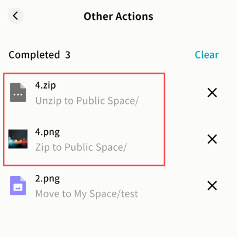

##  View Details

You can view detailed information about any file or folder, including
size, location, creation date, and modification date. Details vary
depending on file type.

1.  Tap the **...** menu next to a file and select **View Details**.

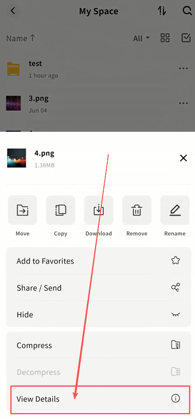

2.  A pop-up window will display the file's information.

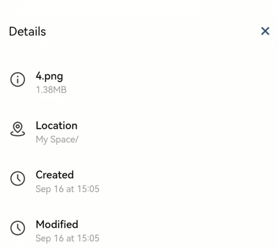

# DASSET Applications

## File Management

The **File Management** application provides centralized management of
all files stored in **My Space** and **Public Space**.

1.  **Quick Space Switch:** Instantly switch between My Space, Public
    Space, and Group Space.

2.  **File Display List:** View files stored in the selected space.

3.  **Sorting:** Sort files by name, modification time, or size.

4.  **File Categorization and Multi-Select:** Filter files by type and
    perform batch operations.

5.  **Task Center Access:** View upload and download progress.

6.  **Search Bar:** Search files by keyword.

7.  **File Operations Menu:** Perform actions such as move, copy,
    download, or delete.

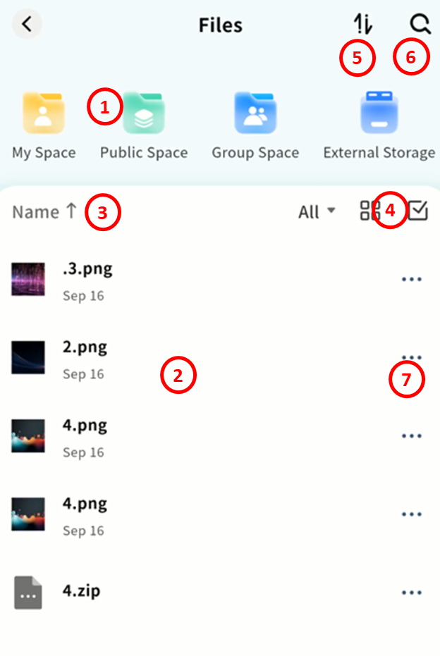

## File Libraries

The system provides four categorized libraries: **Pictures, Videos,
Audio, and Documents**. These libraries allow quick access to files of
the same type across My Space and Public Space.

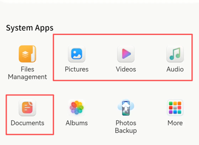

### Pictures

The **Picture Library** displays all image files from My Space and
Public Space.

1.  **Grouping:** Organize by day or month, with options to sort by
    time.

2.  **Batch Selection:** Select multiple images for actions such as move
    or download.

3.  **Preview Thumbnails:** Browse images visually.

4.  **Task Center Access:** Track tasks.

5.  **Search Bar:** Search images by keyword.

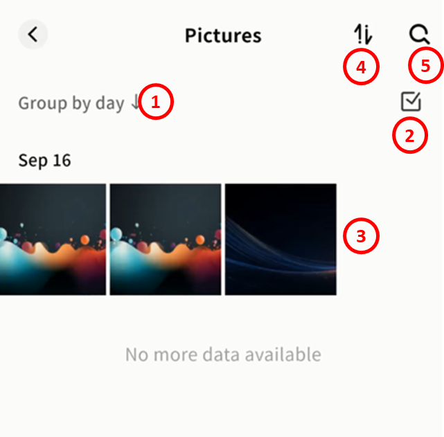

### Videos

The **Video Library** displays all video files from My Space and Public
Space.

1.  **Sort by Modification Time:** Order videos chronologically.

2.  **Batch Selection:** Select multiple videos for file operations.

3.  **Preview Thumbnails:** Browse video previews.

4.  **Task Center Access:** Track tasks.

5.  **Search Bar:** Search videos by keyword.

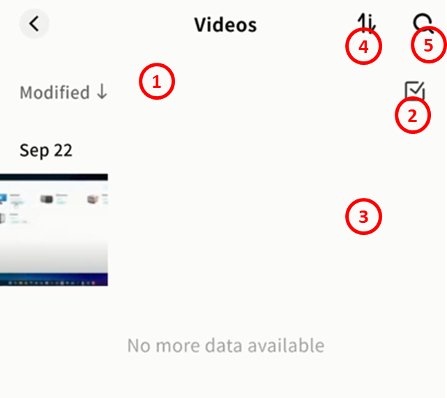

### Audio

The **Audio Library** displays all audio files from My Space and Public
Space.

1.  **Sorting:** Sort by name, modification time, or size.

2.  **View Options:** Switch between list view and grid view.

3.  **Batch Selection:** Select multiple audio files for actions such as
    move or download.

4.  **File Menu (...):** Open the file operations menu.

5.  **Audio File List:** Browse available audio files.

6.  **Task Center Access:** Track upload/download tasks.

7.  **Search Bar:** Search audio files by keyword.

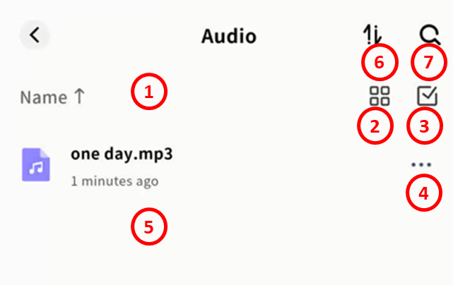

### Documents

The **Document Library** displays all document files from My Space and
Public Space.

1.  **Sorting:** Sort by name, modification time, or size.

2.  **Categories:** Filter by type, including DOC, XLS, PPT, PDF, and
    TXT.

3.  **View Options:** Switch between list view and grid view.

4.  **Batch Selection:** Select multiple documents for actions such as
    move or download.

5.  **Document List:** Browse all documents.

6.  **File Menu (...):** Open the file operations menu.

7.  **Task Center Access:** Track tasks.

8.  **Search Bar:** Search documents by keyword.

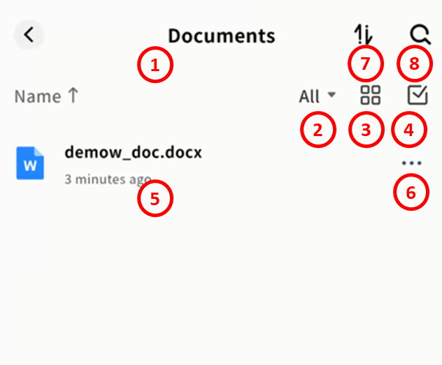

## Group Space

In **Group Space**, users with access permissions can create group
folders and invite specific members to join. Only members of the group
can access its contents, subject to defined read/write permissions.

Group Space is useful when photos, videos, or files need to be shared
only with certain users on the same device. By creating multiple groups,
different content can be shared with different people, providing
resource sharing and collaboration for families or small teams. Group
Space supports cross-device, multi-platform access but does **not**
support Samba access.

*Note: Files deleted in Group Space are permanently removed and do not
go to the Recycle Bin.*

###  Create a Group

1.  Go to **Group Space  + Create Group**, enter a group name, and
    click **Next**.

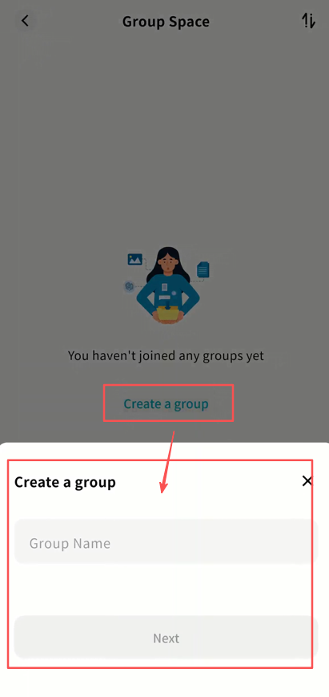

2.  Select members to add from the list of all bound device members. You
    can add one, multiple, or skip this step and add members later.

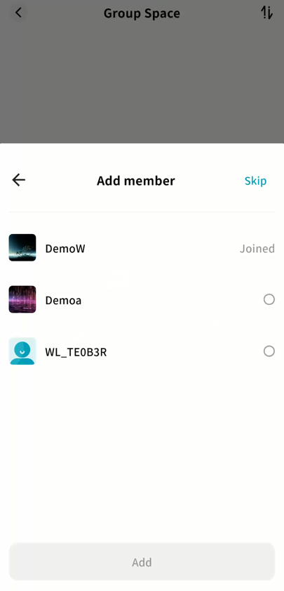

3.  Once created, the new group will appear on the Group Space page.

### Using Group Space

The Group Space functions just like other file management areas. You can
upload, download, create folders, move/copy files, rename, and more.

Features include:

1.  Sort files by name, modification date, or size.

2.  File Type Filter: Quickly filter files by type (images, videos,
    audio, documents, compressed files).

3.  Switch between list view and grid view.

4.  Toggle single or multiple file selection.

5.  File operations menu.

6.  File list view.

7.  File actions supported: move, copy, download, delete, rename, hide,
    and view details.

8.  Task Center for monitoring file transfers.

9.  Keyword search within the group.

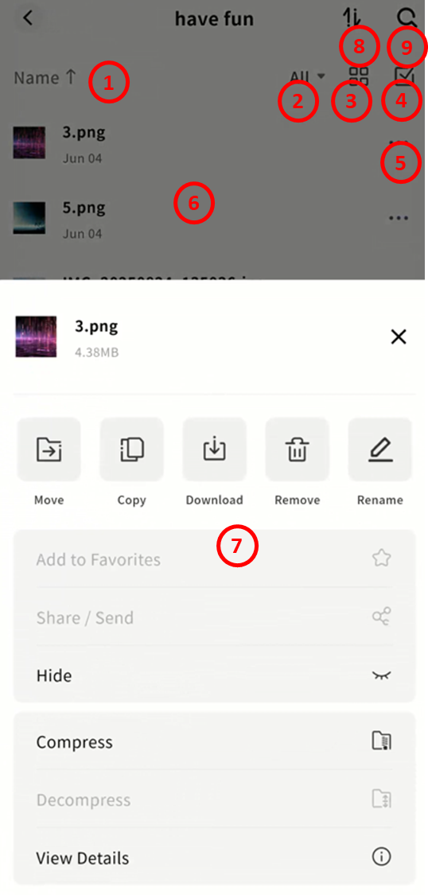

###  Group Management

Click **...** next to a group to open the group management menu:

1.  **Member Management** (group owner only): Add or remove members.

2.  **Group Password** (group owner only): Require a password to access
    the group.

3.  **Rename** (group owner only): Change the group name.

4.  **Delete this Group** (group owner only): Delete the group and all
    its contents.

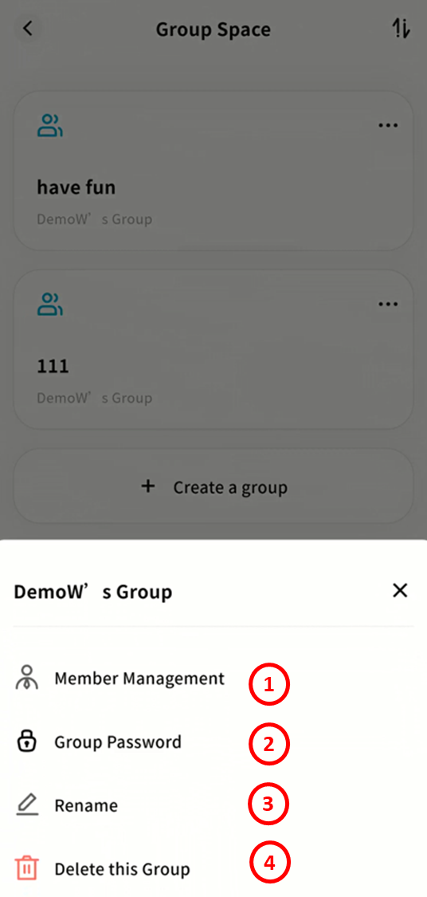

5.  **Leave this Group** (members only): Non-owners can leave the group
    at any time.

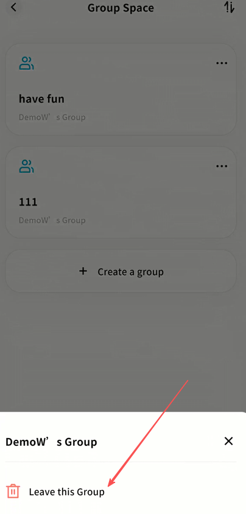

#### Member Management

In the Member Management interface, you can add/remove members and
assign permissions:

- **Add Members**: Invite other device-bound members.

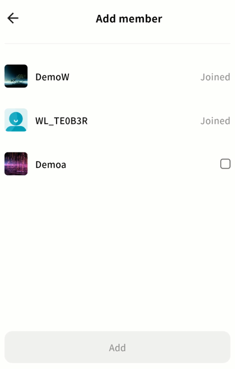

- **Member List**: Displays current members and their permissions.

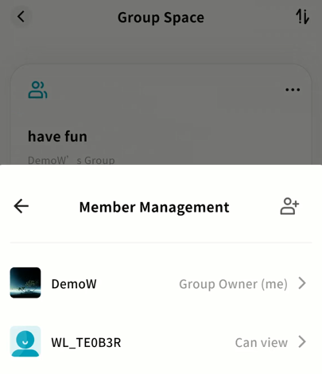

- **Permissions**:

  - **Owner**: Transfer ownership to this member.

  - **Editable**: Member can perform write operations (upload, move,
    download, etc.).

  - **View Only**: Member can view and copy/download files, but not
    edit.

  - **Remove**: Remove the member from the group.

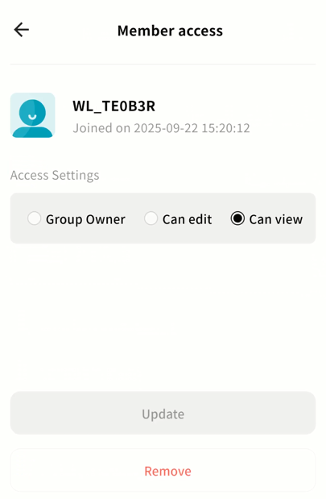

#### Group Password

##### **Set Group Password**

1.  Go to **Group Password  Enable**.

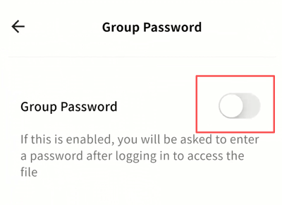

2.  Enter a password and confirm.

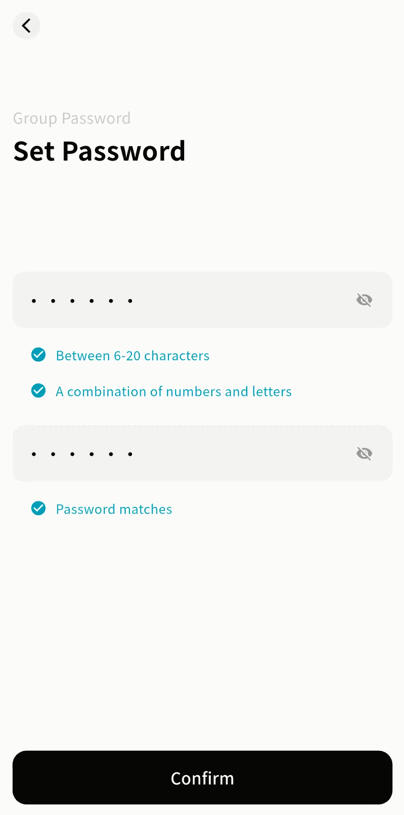

##### **Change Group Password**

1.  Go to **Group Password  Change Password**.

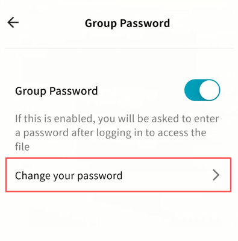

2.  Enter the current password to verify.

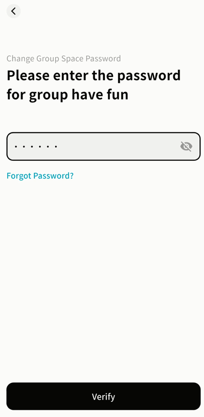

3.  Set a new password (must differ from the old one).

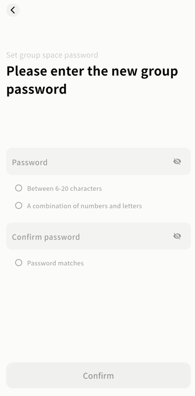

##### **Enter a Password-Protected Group**

1.  Select the group.

2.  Enter the correct password to access.

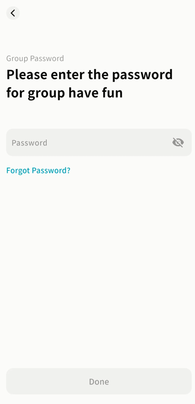

##### **Recover Group Password** (owner only)

1.  Go to **Group Password  Change Password** or the password prompt
    window.

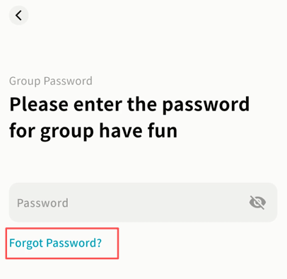

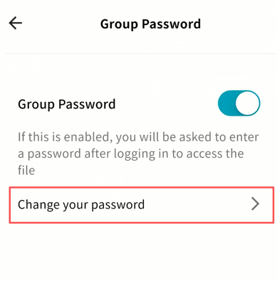

2.  Click **Forgot Password**.

3.  Enter the email or phone number linked to your DASSET account and
    request a verification code.

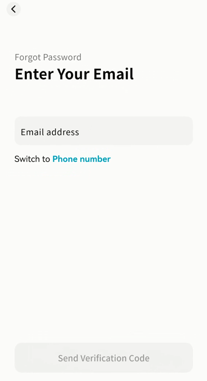

4.  Enter the received code and confirm.

5.  After verification, set a new password.

##### **Disable Group Password**

1.  Go to **Group Password  Disable**.

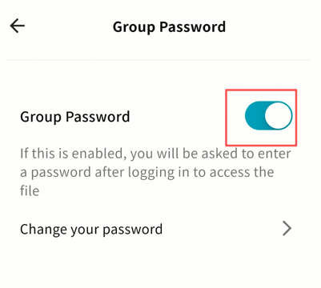

2.  Enter the current password to confirm.

#### Rename Group

Select **Rename**, enter the new group name, and confirm.

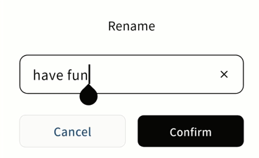

####  Delete Group

Select **Delete this Group**. The group and all files inside will be
permanently removed.

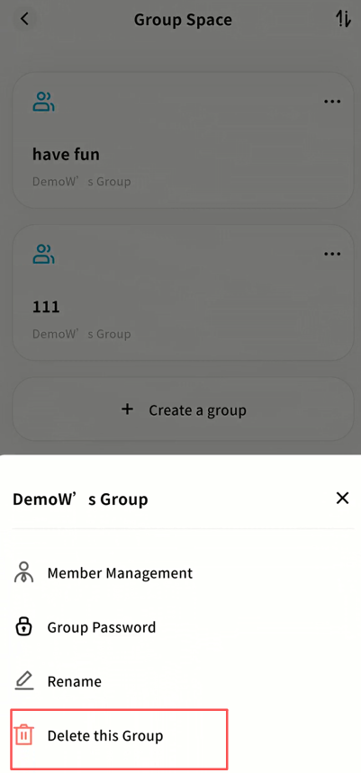

##  Photo Backup

The **Photo Backup** feature allows you to regularly back up photos and
videos from your mobile device's album to the DASSET edge device. This
helps free up storage on your device and also makes it easy to share
albums with friends via the DASSET device.

Once a backup rule is configured, the DASSET client automatically checks
for new photos in the selected albums whenever it starts and backs them
up to the device.

*Note: Due to power-saving restrictions in mobile operating systems,
photo backup tasks may be stopped if the DASSET client is running in the
background. We recommend keeping the DASSET client active in the
foreground when backing up large numbers of photos.*

Steps:

1.  Go to **Applications  Photo Backup** and click **Next**.

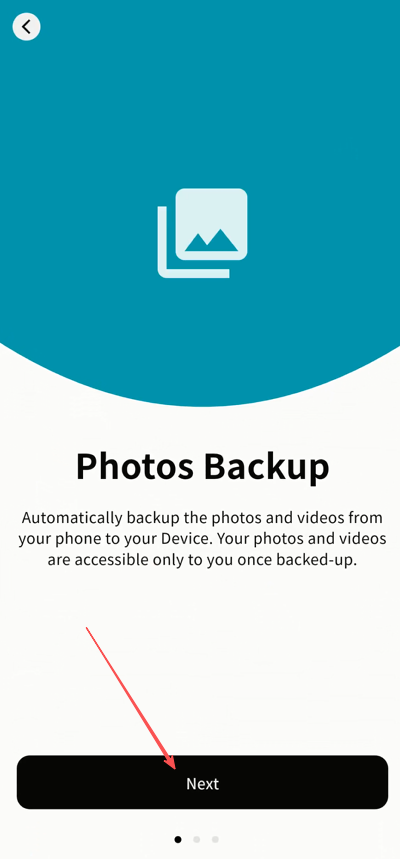

2.  Click **Grant Access to Photo Library**. The first time you use this
    feature, DASSET must request OS-level permissions to access your
    photos.

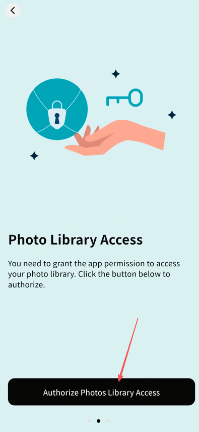

3.  Click **Select Album**.

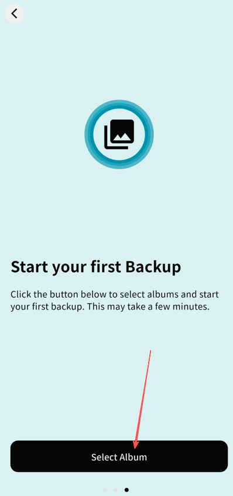

4.  Choose the albums you want to back up. You can modify album
    selections later if needed. After selecting, click **Backup**.

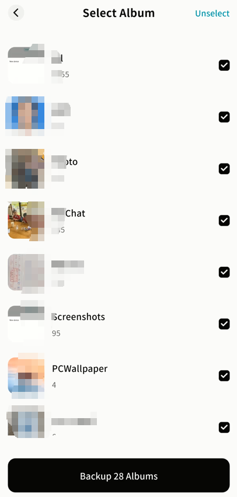

5.  The backup process begins automatically.

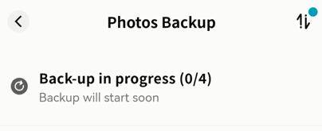

###  Photo Backup Settings

After completing the initial backup setup, you can:

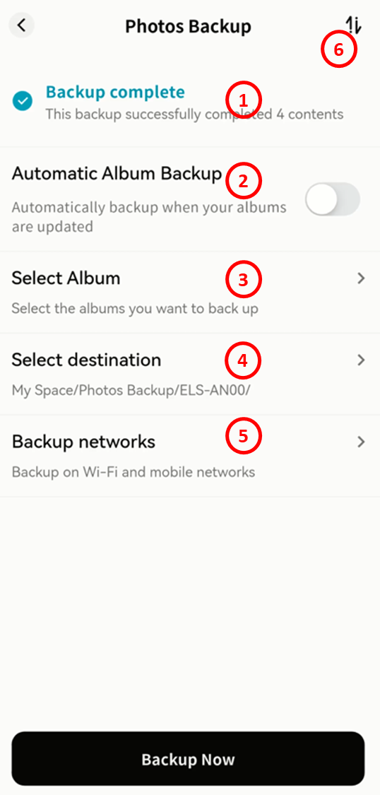

1.  View progress of current backup tasks.

2.  Enable **Automatic Album Backup**: The client will automatically
    check for new photos each time it starts and back them up.

3.  Change the selected albums for backup.

4.  Choose the **backup destination**: My Space, Public Space, Group
    Space, or My Vault.\
    *For privacy reasons, we strongly recommend backing up photos to My
    Space or the My Vault.*

5.  Configure backup conditions:

    - **Wi-Fi Only**: Backups run only when connected to Wi-Fi.

    - **Wi-Fi and Mobile Data**: Backups run regardless of network type.

6.  Monitor progress in **Task Center  Backup Tasks**.

###  Viewing Photo Backup Progress

You can check backup progress anytime:

1.  Go to **Applications  Photo Backup** to see live progress.

2.  Or go to **Task Center  Mobile Backup**:

    - Pause or resume backup tasks.

    - Cancel backup tasks.

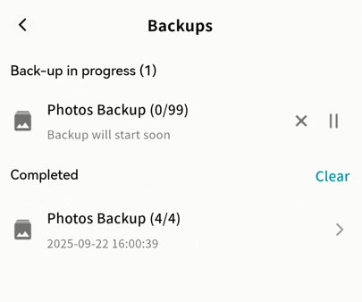

##  Contacts Backup

The **Contacts Backup** feature saves your mobile device's contact
information to the DASSET edge device. When you change phones, you can
restore your contacts from the device to the new phone.

Steps:

1.  Go to **Applications  Contacts Backup** and click **Next**.

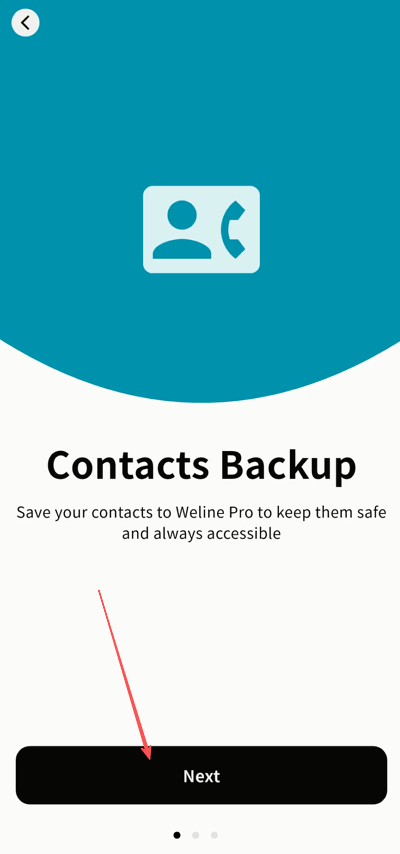

2.  Grant **Contacts Access** permission. Without it, DASSET cannot read
    your contacts.

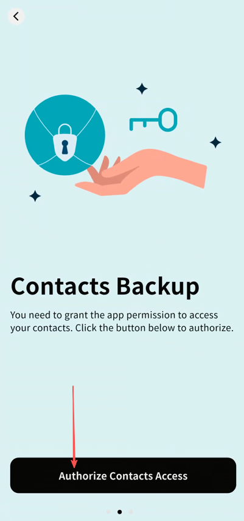

3.  Once authorized, click **Start Contacts Backup**.

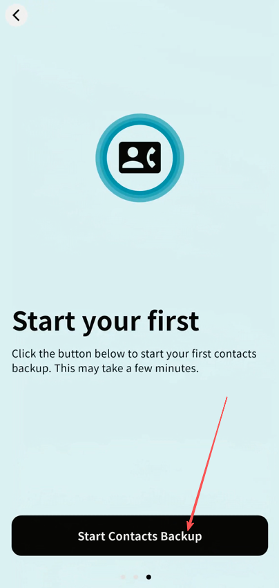

4.  Wait for the process to complete.

5.  After completion, you can view your backup history:

    1.  Backup date and time, source device, and number of contacts.

    2.  Option to delete the backup.

    3.  Option to restore the backup to the current phone.

    4.  Start a new backup.

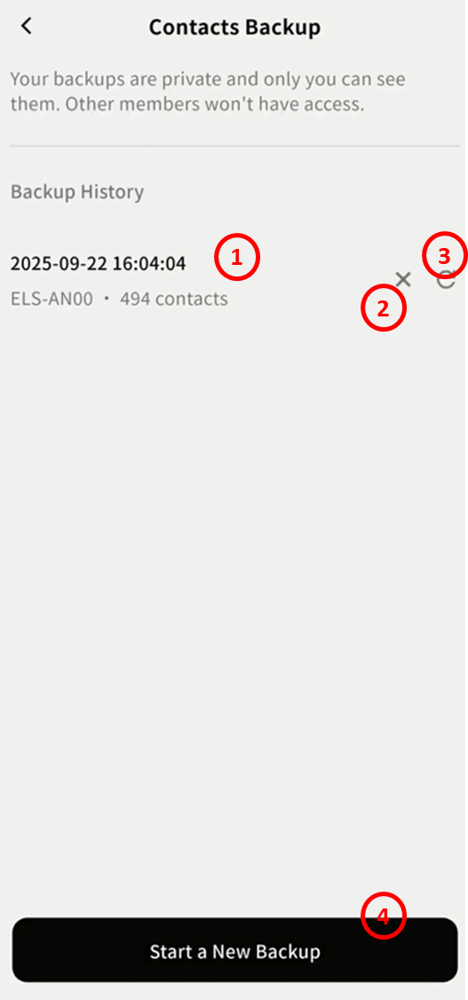

##  Task Center

The **Task Center** consolidates all upload, download, backup, and other
operations. From the device home page, click the **Task Center** icon in
the top-right corner to access it.

The badge indicator shows the number of tasks currently in progress.

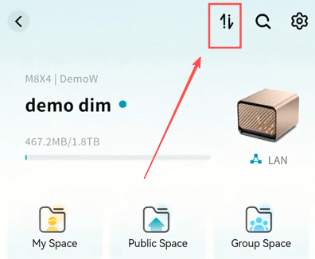

Within the Task Center, tasks are categorized as follows:

1.  **Upload:** Displays active and completed upload tasks.

2.  **Downloads:** Displays active and completed download tasks.

3.  **Get Share:** Displays files shared with you and files you shared
    with others.

4.  **Backups:** Displays photo and contacts backup tasks.

5.  **Other Actions:** Displays move, copy, compression, decompression,
    and similar tasks.

*Note: Tasks related to the My Vault are shown separately to ensure
privacy.*

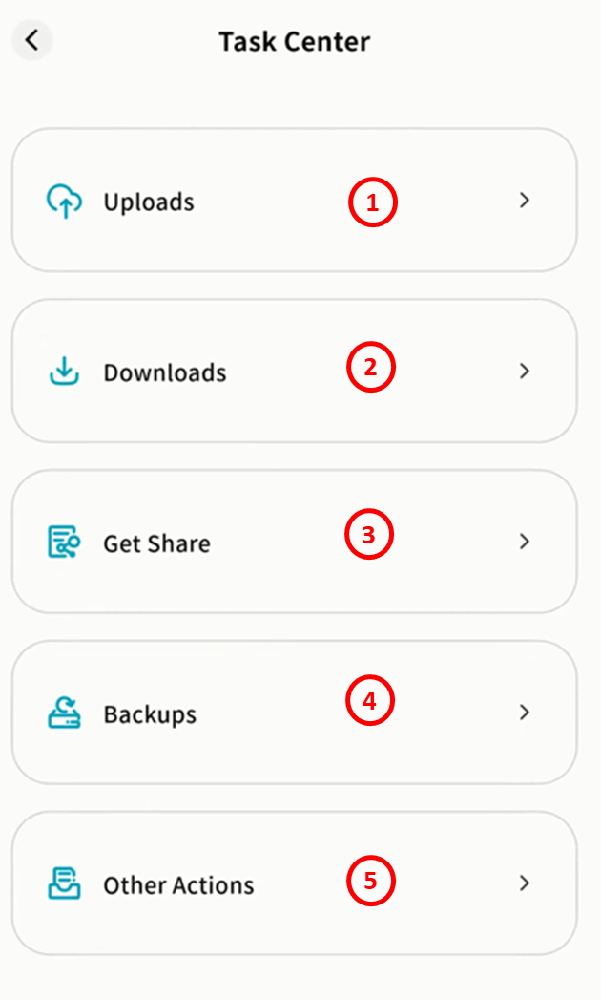

###  Upload

#### Uploading

In the **Uploading** tab, you will see:

1.  Number of active upload tasks

2.  Upload speed, completed size, and total file size

3.  A global task menu to **Start All, Pause All,** or **Cancel All
    uploads**

4.  Controls to start, pause, or cancel individual tasks

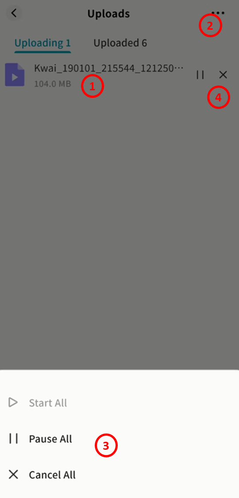

#### Uploaded

In the **Uploaded** tab, you will see:

> Number of finished uploads

1.  Option to Delete All Records

2.  Option to open the upload destination directory automatically

3.  Option to delete individual task records

4.  A list of all completed upload tasks

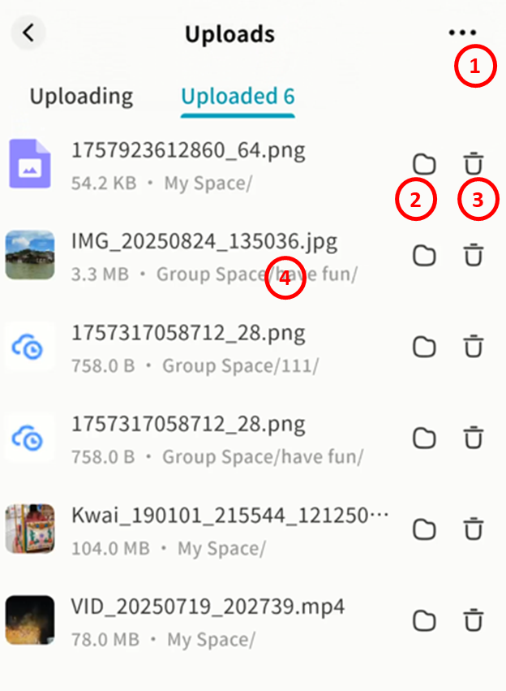

###  Downloads

#### Downloading

In the **Downloading** tab, you will see:

1.  Number of active download tasks

2.  Download speed, completed size, and total file size

3.  Options to **Start All, Pause All,** or **Cancel All downloads**

4.  Controls for individual downloads

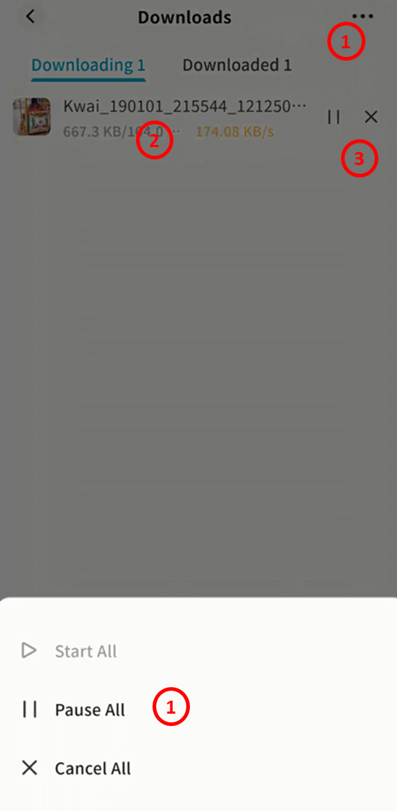

#### Downloaded

In the **Downloaded** tab, you will see:

> Number of finished downloads

1.  Option to Delete All Records

2.  Option to delete individual download records

3.  A list of all completed downloads

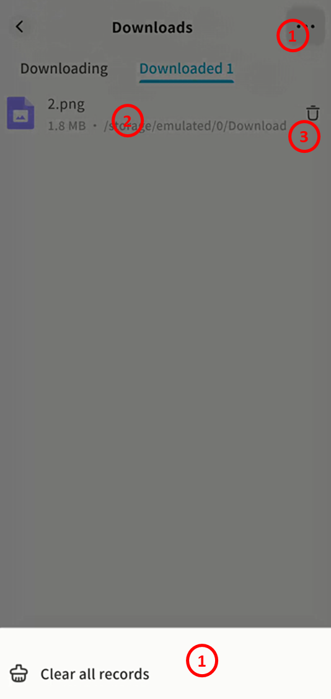

###  Get Share

Two types of shares are supported:

- **From Member**: File shares between users on the same DASSET device
  (available to all users).

- **QR Code**: File shares using QR codes or share codes across devices
  (available only to device owners).

#### From Members

1.  Go to **Task Center  Get Share  From Member**.

2.  View all files shared with you.

    - Click **×** to delete a share task.

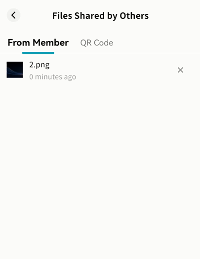

3.  Click a task to enter the **Share Details** page.

    - Preview files directly.

    - Select single or multiple files for **Save** or **Download**.

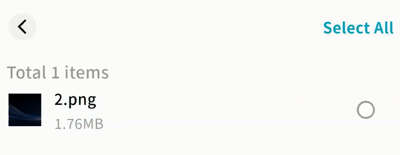

4.  Options:

<!-- -->

1.  **Save:** Store the file into a directory of your choice (My Space,
    Public Space, Group Space, My Vault, or External Storage --- subject
    to your account permissions).

2.  **Download:** Save the file to your mobile device.

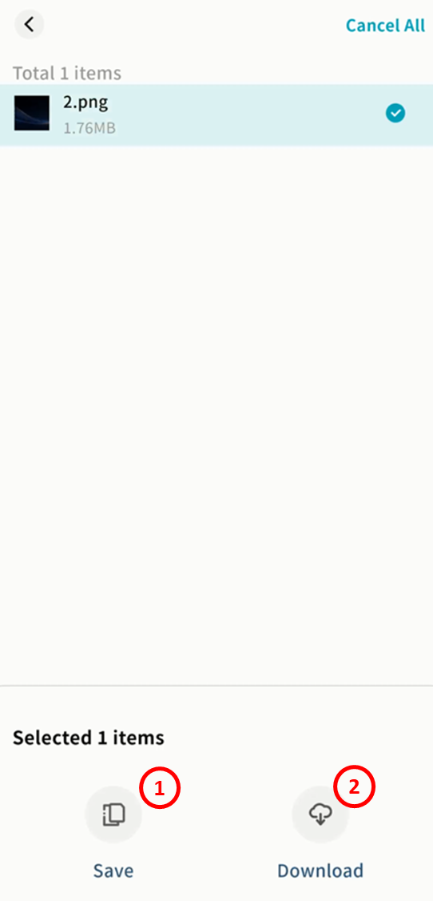

#### QR Code

The QR Code page provides:

- **Add Share**: Enter a share code to receive files.

- **Download Status**: Track active, completed, and failed share
  downloads.

> *For details on QR sharing, see the File Sharing section.*

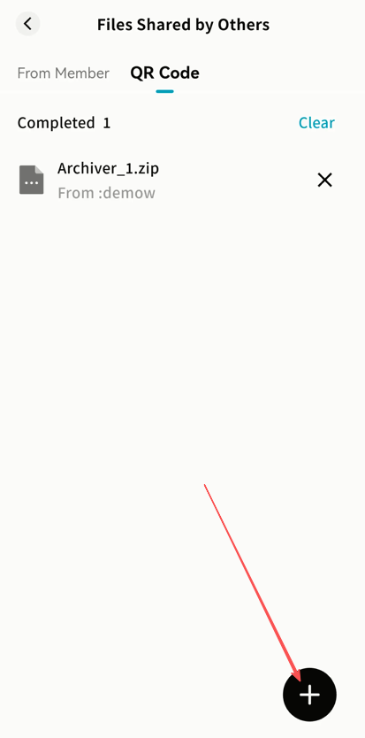

###  Backups

Displays records of photo and contacts backup tasks, including completed
and in-progress backups.

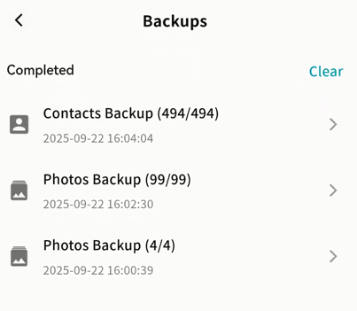

###  Other Actions

All **move, copy, compress, decompress, and similar tasks** are shown
under Other Operations.

Features:

- **Clear All**: Delete all task records.

- **Task List**: View current operations and their progress.

- **Delete Single Task**: Remove an individual record.

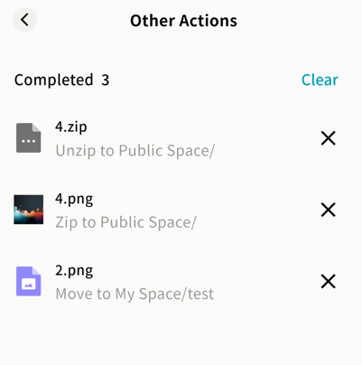

##  My Favorites

You can add frequently accessed files to **My Favorites** for quick
access later.

- Access via the **Favorites** icon in the DASSET application or the
  **Favorites** button in the file manager.

- Files in Favorites can be managed like regular files: Remove from
  Favorites, download, and more.

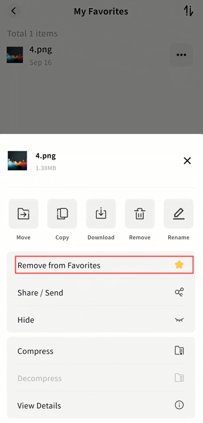

##  External Storage

When you connect a USB drive or formatted external hard disk to the
DASSET device, it appears under **External Storage**.

- Manage files in external storage just like files in My Space, Public
  Space, or Group Space.

- Access via the **External Storage** icon or the file manager top menu.

- Supported disk formats: **exFAT, FAT32, VFAT, EXT4, NTFS**.

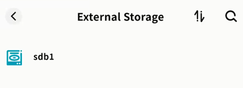

## Recycle Bin

All deleted files are moved to the Recycle Bin. You can restore or
permanently delete them.

- Supports single and multiple file operations.

- Files remain in the Recycle Bin for **30 days** before being
  permanently deleted.

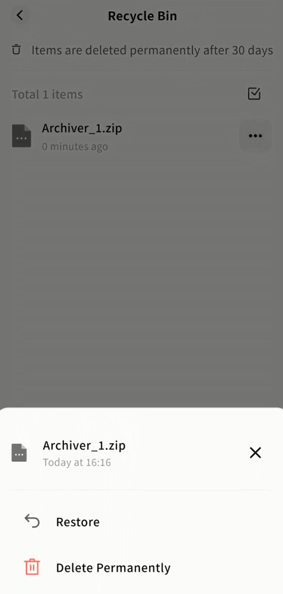

## Offline Download

The **Offline Download** feature enables 24/7 automated downloads
directly on the DASSET device.

*Only available to Owners and Administrators.*

Features:

1.  **Set Save Path**: Choose My Space or Public Space as the download
    destination.

2.  **Add New Task**: Enter a download link or torrent file.

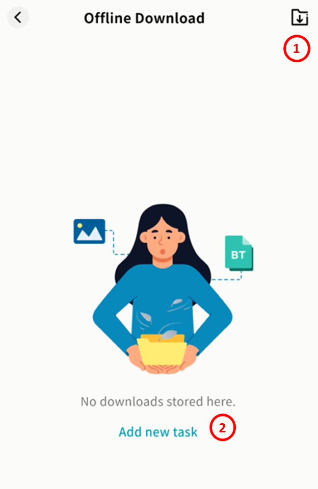

- Supports HTTP, HTTPS, FTP, magnet links, and torrent files.

- Torrent files can be uploaded locally or selected from files already
  on the device.

- By default, downloads are saved to **My Space/Download**, but you can
  customize the directory.

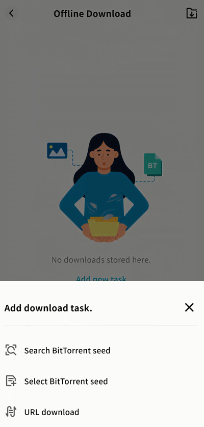

3.  **Monitor Progress**: View download progress in the Offline Download
    interface.

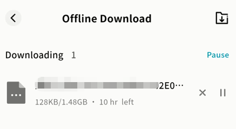

*Note: Download speed depends on network conditions, resource
availability, and thread control.*

## My Shares

The **My Shares** section consolidates all sharing tasks you have
created, including **Member Shares** and **QR Code Shares**:

- **Member Shares**: Files you shared with other members on the same
  DASSET device.

- **QR Code Shares**: Includes QR code shares you created and files sent
  to another DASSET device.

### Member Share Management

- Displays a list of all active member shares.

- Click **×** to cancel a share task.

### QR Code Share

This section displays QR code shares you created or sent to another
DASSET device.

- Click **×** to cancel a share task.

- Click on a task to view its QR code and details again, even if the
  original QR code image was lost.

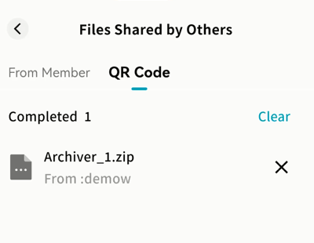

Information available for each share task:

1.  File list in the share task

2.  Delete share task

3.  Task name

4.  Expiration date

5.  QR code image

6.  Remaining downloads

7.  Share code (string form)

8.  Access password (if password-protected)

9.  Save QR code to gallery

10. Share QR code via other apps

## File Dedupe

The **File Dedupe** feature helps you locate and remove duplicate files
on the DASSET device, saving disk space.

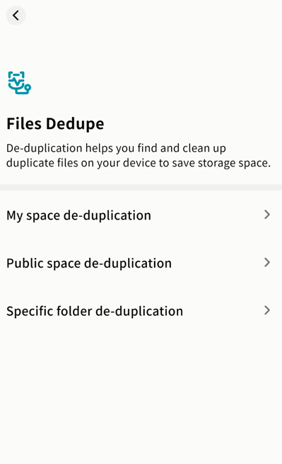

You can perform deduplication in:

- **My Space**

- **Public Space** (Owner and Administrators only)

- **Specified Folders**: Select one or more directories you have
  permission to scan.

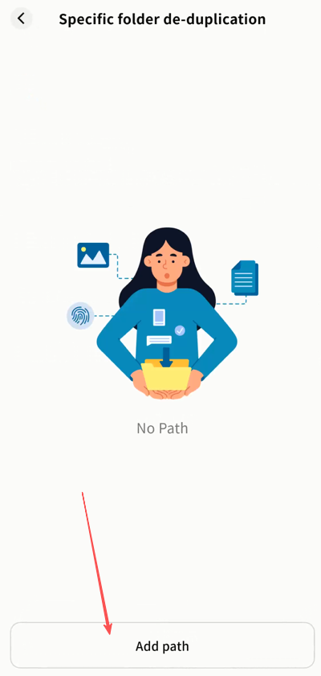

Once paths are selected, click **Start Scan** to initiate duplicate file
detection.

### Deduplication Process

After scanning, duplicate files are listed. Review them and click
**Delete** to remove duplicates.

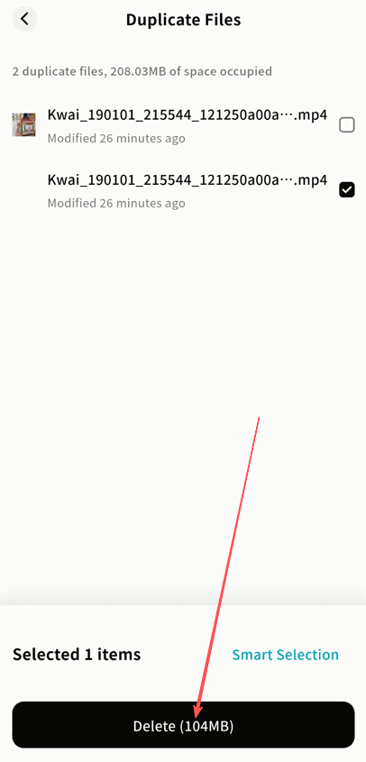

### Deduplication Rules

Click **Smart Selection** to define how duplicate files should be
handled:

- By filename length

- By file path length

- By file modification time

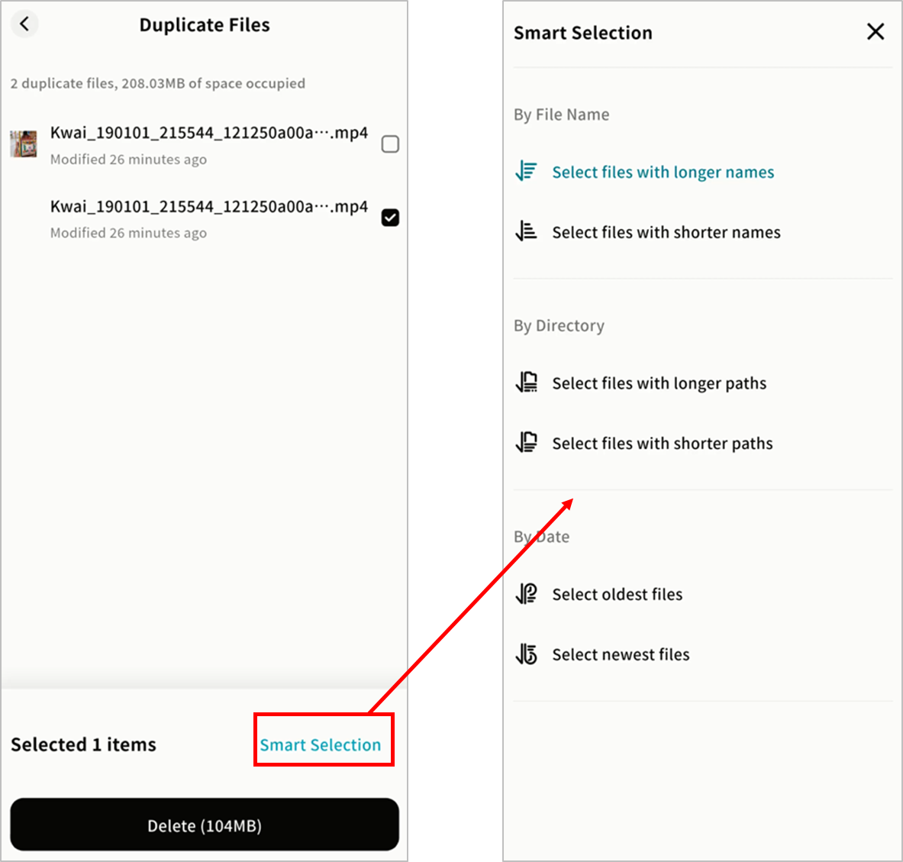

## Files Sync

*This feature is available only to device owners.*

The **Files Sync** function supports:

- File sync between a DASSET device and a computer (desktop client
  required).

- File sync between two DASSET devices, enabling off-site backups and
  improved redundancy.

Supported modes:

- **Two-Way Sync**: Keeps files consistent between both sides. Any
  change triggers synchronization.

- **One-Way Sync (A → B)**: Only new/modified files from Device A sync
  to Device B. Changes on B are not synced back.

- **One-Way Sync (B → A)**: Only new/modified files from Device B sync
  to Device A. Changes on A are not synced back.

### Configure Device-to-Device Sync

1.  Go to **Files Sync  Add Sync** or tap **+**.

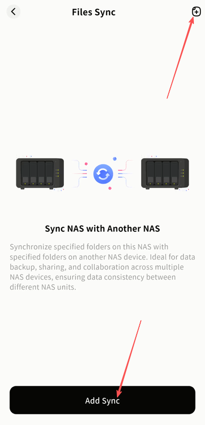

2.  In the Add Sync Task window, select another DASSET device you own,
    then click **Confirm**.

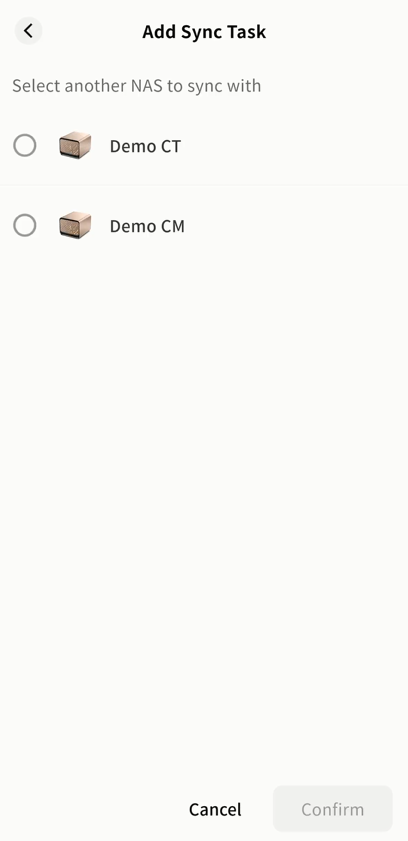

3.  Choose the folder to sync from the current device. You may use an
    existing folder or create a new one.

> *Tip: Choose the space (My Space, Public Space, Group Space) according
> to privacy requirements.*

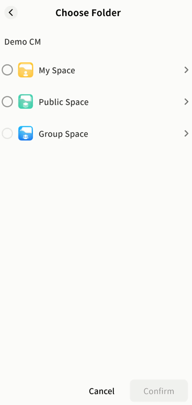

4.  Choose the folder to sync on the target device (existing or new).

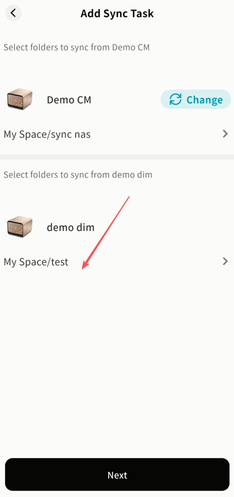

5.  Review the **source folder** and **target folder** in the Add Sync
    Task window, then click **Next**. You can also change the folder if
    needed.

6.  Select a synchronization mode:

    - **Two-Way Sync**

    - **Current Device → Target Device**

    - **Target Device → Current Device**

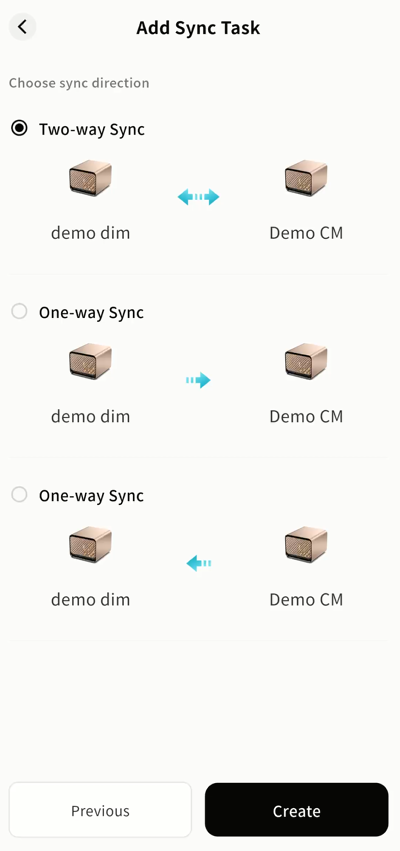

7.  The sync task will start automatically. Any file changes in the
    designated folders will trigger synchronization.

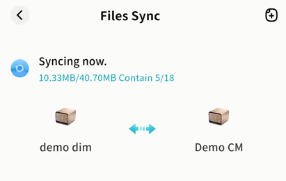

### View Sync Tasks

In the Sync Tasks panel, you can:

- View task status (**In Progress**, **Completed**, or **Error**)

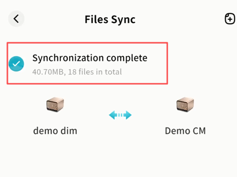

1.  Check total file size and file count being synchronized

2.  Pause or resume tasks

3.  View device names and directory paths of both sides

4.  Modify sync mode

5.  Delete sync tasks

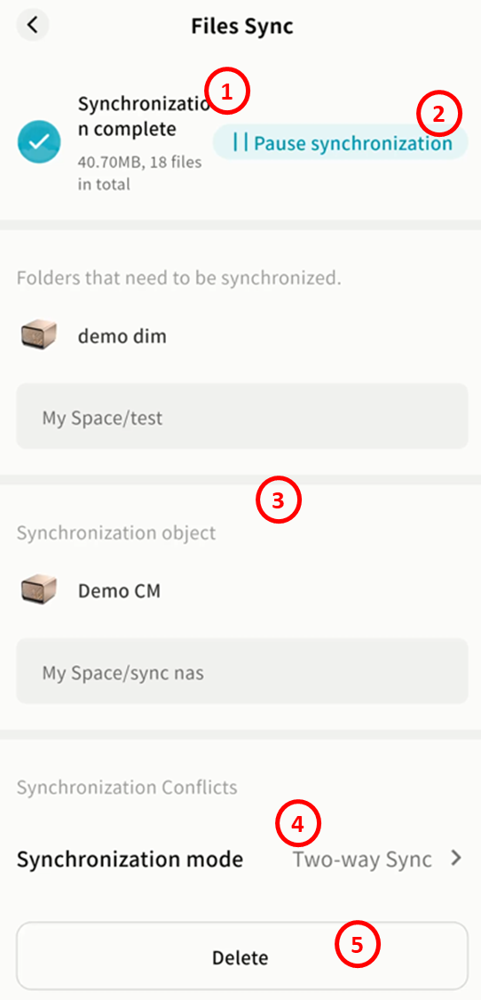

## Lite NVR

The DASSET edge device supports cameras compatible with the **Onvif
protocol**, enabling centralized management of cameras, storage of
surveillance video, live and recorded video playback, and PTZ
(pan-tilt-zoom) control. You can securely view surveillance video
anytime, anywhere, avoiding the privacy risks of cloud storage.

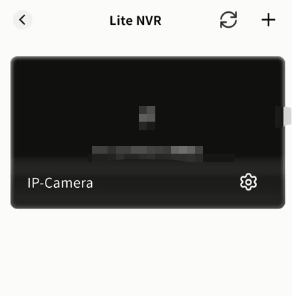

### Add a Camera

1.  Click **+** to search for cameras on the same LAN as the DASSET
    device.

> *Note: Ensure the camera is powered on, connected to the same LAN, and
> supports the Onvif protocol.*

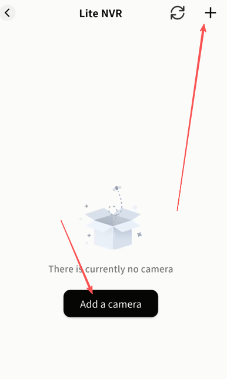

2.  Wait for search results; the process is usually fast.

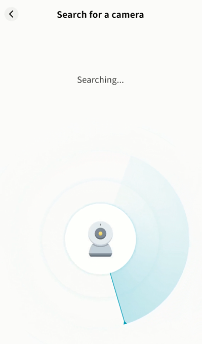

3.  Once found, the camera will appear in the results page.

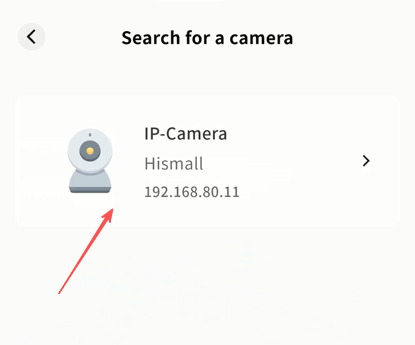

4.  Select the camera to open its configuration page. If authentication
    is required, enter the camera's username and password (refer to the
    user manual or contact the manufacturer).

5.  Configure settings:

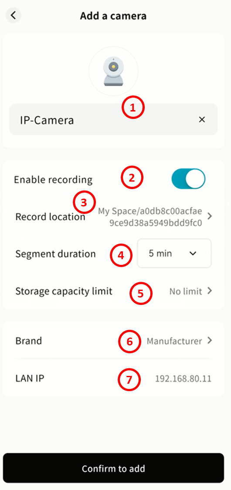

1.  **Camera Name**: Displayed in the Video Monitoring app.

2.  **Enable Recording**: Enable to save surveillance video to the
    DASSET device.

3.  **Record Location**: Define where video files are stored.

> *Recommendation: For privacy, save to **My Space** or **Group Space**,
> unless you need to share recordings with all device members.*

4.  **Segment Duration**: Define the length of each video file. Files
    are automatically segmented.

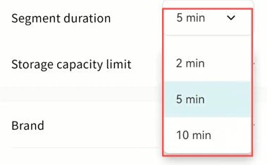

5.  **Storage Capacity Limit**: Set a maximum quota. Older recordings
    will be overwritten when the limit is reached.

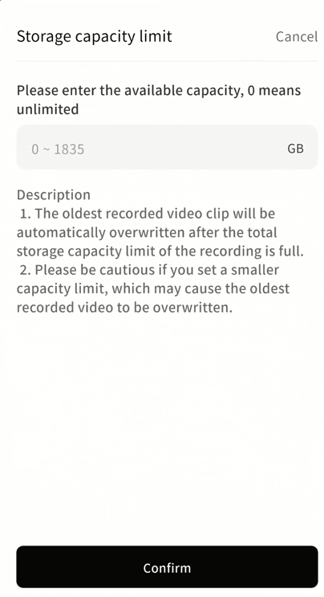

6.  **Brand**: Automatically detected from the camera protocol; can be
    corrected manually.

7.  **LAN IP**: Displays the current IP address of the camera.

<!-- -->

6.  After configuration, click **Confirm Add**. The camera will appear
    in the Video Monitoring page.

### View Live Video

In **Video Monitoring**, you can see all connected cameras with preview
images, camera name, and time.

1.  **Refresh:** Update the current view.

2.  **Add Camera:** Add new cameras.

3.  **Preview Window:** Shows static preview and timestamp.

4.  **Camera Name:** Display label.

5.  **Camera Configuration:** Manage or delete the camera.

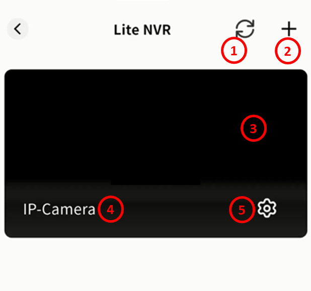

### Camera Monitoring Operations

Click a camera preview to enter the monitoring interface.

You can:

1.  View live feed with timestamp.

2.  Switch to fullscreen.

3.  Use PTZ controls.

4.  Access recorded playback.

5.  Configure the camera.

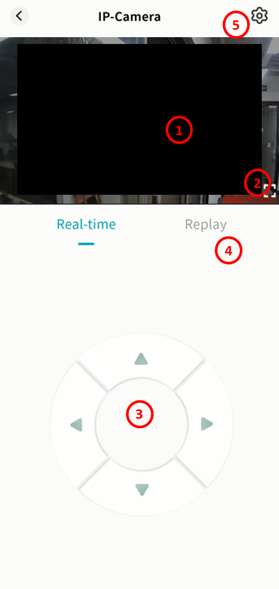

#### PTZ Control

Use the directional keys to adjust camera angles.

*If PTZ is not supported, a notification will be displayed.*

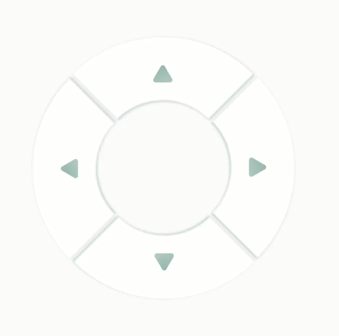

#### Playback

1.  In the monitoring interface, click **Playback** to access recorded
    footage stored on the DASSET device. Videos are sorted by time based
    on recording duration.

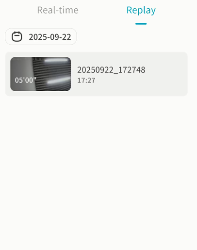

2.  Use the calendar to select a specific date.

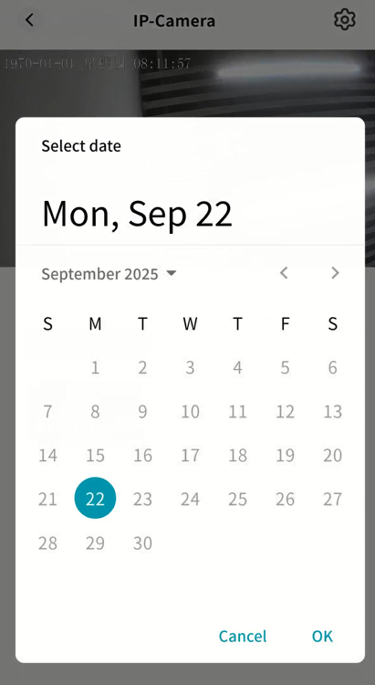

3.  Click a video segment to play. Features include:

    1.  Switch between previous/next recordings

    2.  Pause/Play

    3.  Display total video duration and playback timestamp

    4.  Fullscreen playback

    5.  Show filename of the current recording

    6.  Enter camera settings

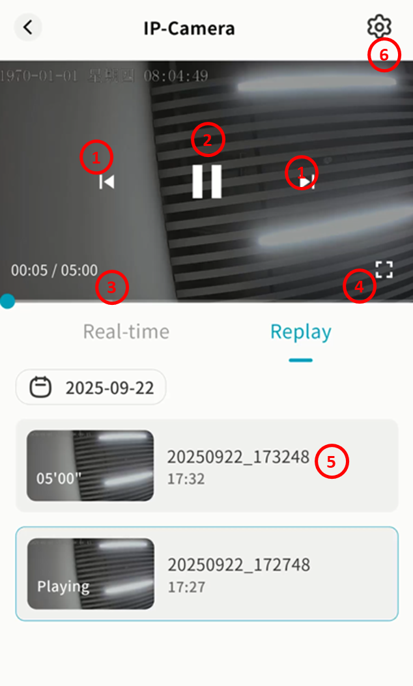

### Delete a Camera

You can remove a camera at any time.

1.  In the Video Monitoring home page or monitoring interface, click the
    **gear icon**.

2.  Select **Delete the Camera** to remove it.

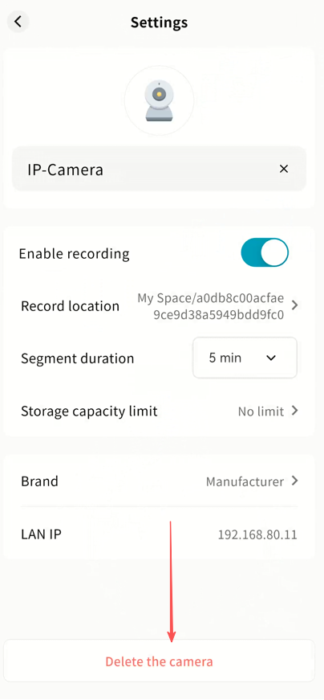

## Recent Files

The **Recent Files** page displays recently accessed files on the DASSET
device. From here, you can perform file operations such as move, copy,
download, and delete.

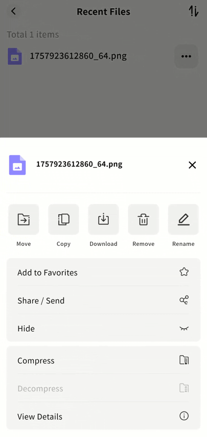

## Access Log

The **Access Log** page shows all member access records for the device,
including:

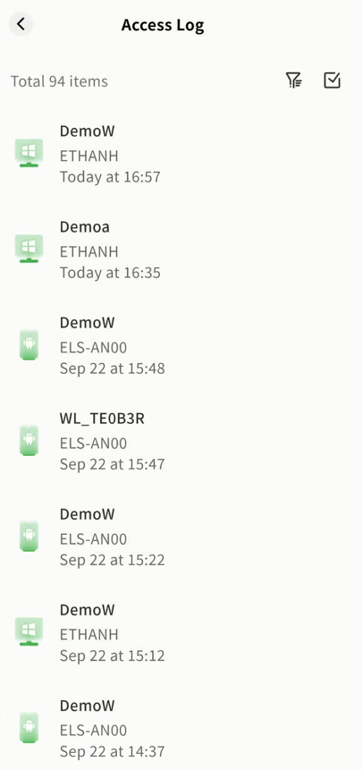

- Account name

- Client type

- Terminal name

- Access time

You can filter logs by account using the filter button in the top-right
corner. Multiple records can be selected and deleted.

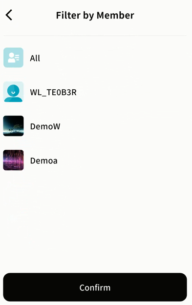

## Samba

The DASSET edge device supports the **Samba protocol**, allowing you to
connect from computers, smart TVs, and other devices to access files
stored on the device.

1.  **Enable/Disable Samba:** Turn Samba service on or off.

2.  **Network Discovery:** Allow your DASSET edge device's Samba service
    to be discovered via LAN scanning.

3.  **Account:** Your Samba login account.

4.  **Alias:** Set an alias for Samba, which can later be used as the
    login username.

5.  **Set Password:** Define the login password for Samba access.

6.  **Samba Access Path:** Specify which directories on the DASSET
    device can be accessed via Samba.

7.  **About Samba:** Provides a tutorial on how to connect to the DASSET
    device's Samba service from Windows or macOS.

*Note: If your DASSET device does not frequently change networks, it is
recommended to configure a **static IP address**. This ensures that the
Samba service is always accessible at the same IP within the LAN.*

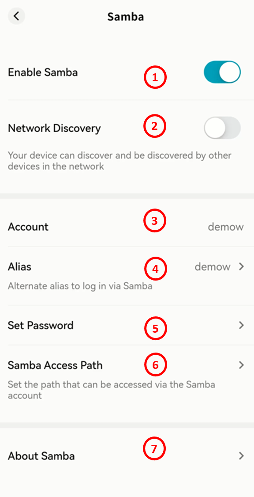

### Windows Connection to Samba

#### Access via Network Discovery

When \" Visible in LAN Scan\" is enabled on Smart DAS, the device will
appear automatically under the Network section in File Explorer.

Simply double-click the DAS icon and enter your username and password to
log in.

#### Map as a Network Drive

1.  Open **File Explorer**, type \\\\DASSET device IP address in the
    address bar, and press **Enter**.

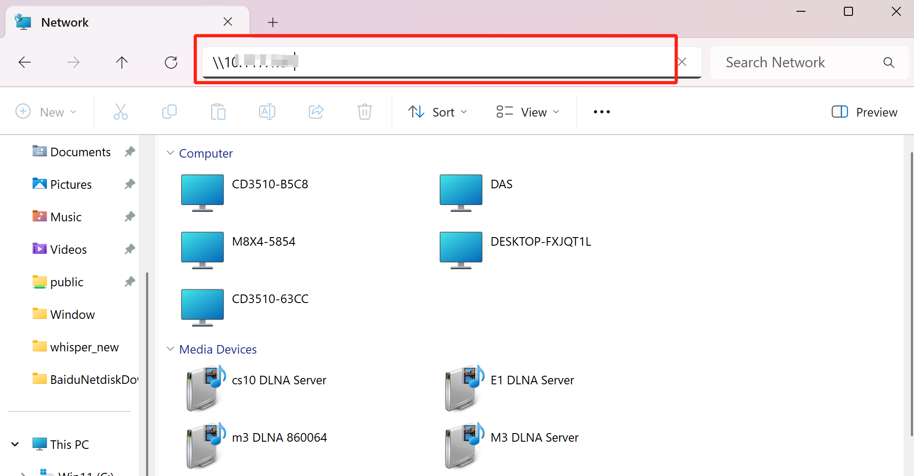

2.  When prompted, enter your **username** and **password**, then click
    **OK**.

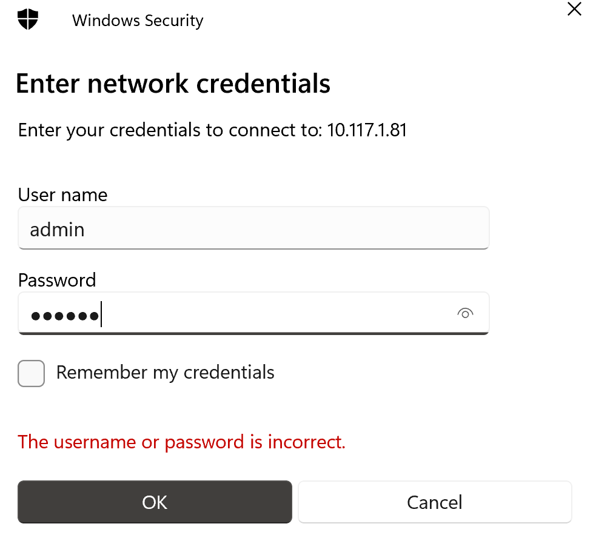

3.  **Once authenticated, File Explorer** will display all folders
    accessible under your **DASSET account.**

- **home:** Your personal space on Smart DAS.

- **public:** The public space accessible to all users on Smart DAS.

- **Other directories:** Shared group spaces that your account has
  joined on Smart DAS.

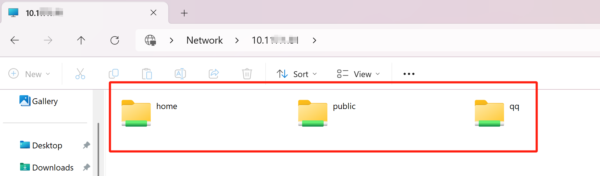

4.  Right-click the folder you access frequently, and select **Map
    network drive\...**.

5.  Choose an available **drive letter**, check **Reconnect at
    sign-in**, and click **Finish**.

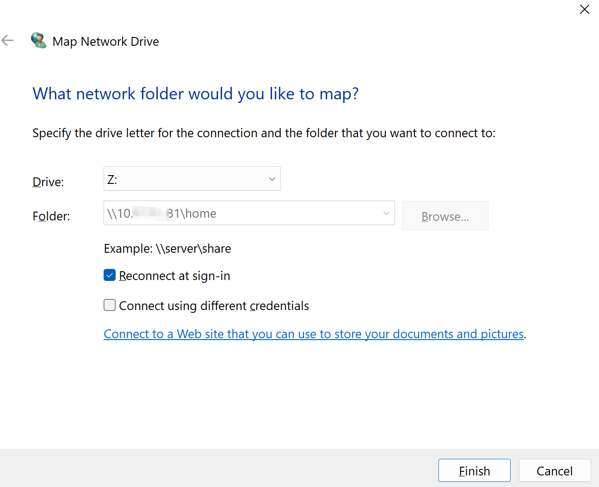

6.  The mapped network drive will now appear under **This PC**, allowing
    quick access to shared files on your DASSET Edge Device.

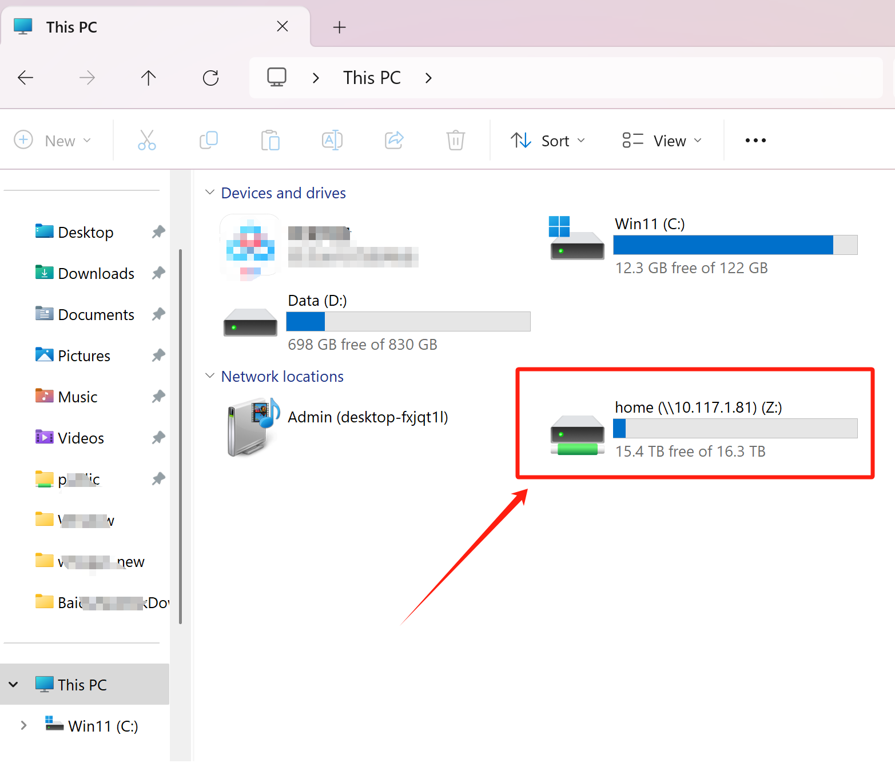

### macOS Connection to Samba

1.  Open **Finder**  **Go**  **Connect to Server.**

2.  In the server address field, enter:

> smb://Smart_DAS_IP_address
>
> (The Samba application interface will display your current IP
> address.)

3.  Click **Connect**  Select **Registered User**

4.  Enter your Samba username and password and click Connect.

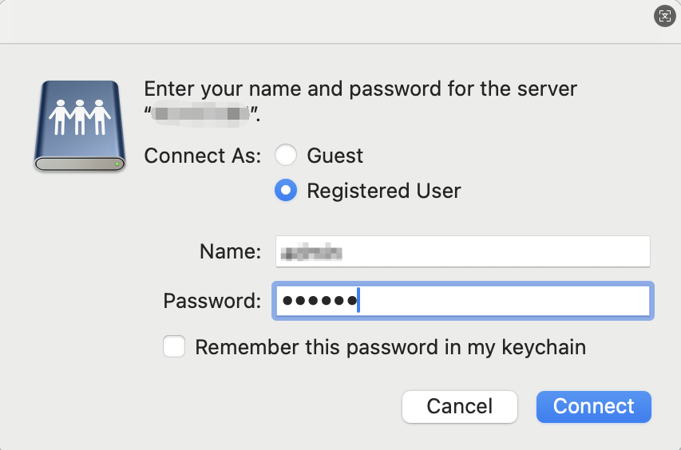

5.  Select shared directories to access:

- **home (Personal space)**

- **public (Public space)**

- **Group spaces (if available)**

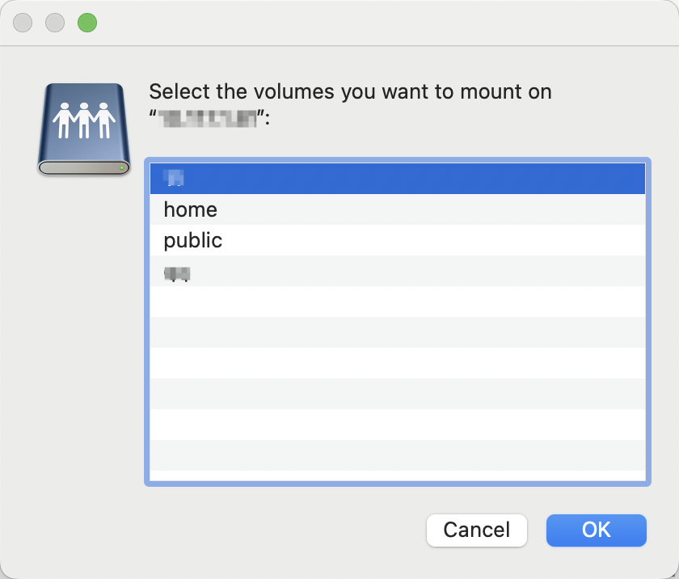

6.  **Quick access setup:** Drag frequently used folders to the
    \"Locations\" section in Finder\'s sidebar

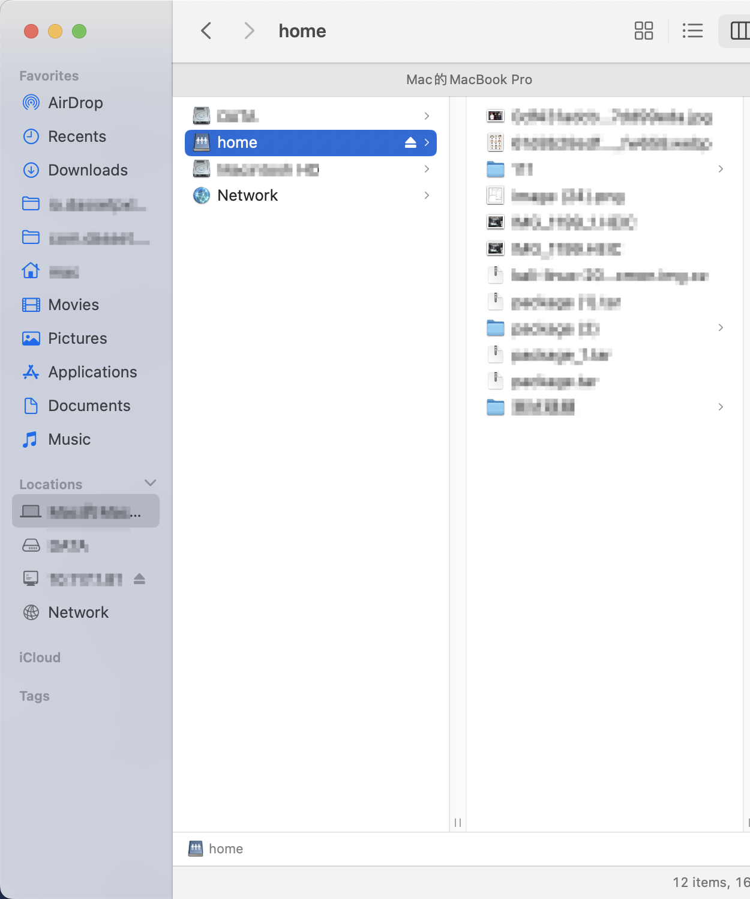

## DLNA

You can enable the **DLNA protocol** on the DASSET edge device so that
your computer, phone, smart TV, and other compatible devices can
automatically discover the device and directly access its media files.

*Note: DLNA is a standardized protocol that allows compatible devices
(such as smart TVs, phones, computers, and speakers) to automatically
discover each other on a home network and directly stream or play stored
music, videos, and photos without copying files or using physical media
like USB drives.*

**First-time setup:** You must add a **DLNA scan path**. Only media
files within the added folders will be accessible over the LAN.

Steps:

1.  Go to the **DLNA** page and click **DLNA Scan Location**.

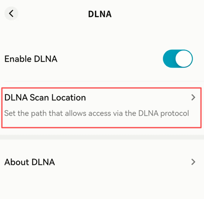

2.  In the pop-up window, select the folders you want to share via DLNA.

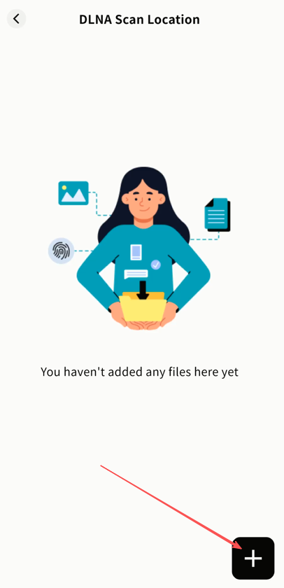

3.  Once added, your computer or any other DLNA-supported device on the
    LAN will discover the DASSET device and access its media files.

4.  You can edit or remove folders from the DLNA interface at any time.
    Once removed, the folder will no longer be accessible to other LAN
    devices.

## Time Machine

The DASSET edge device supports Apple's **Time Machine** feature. Once
enabled, you can back up your Mac directly to the DASSET device.

1.  **Enable/Disable Time Machine:** Allow your Mac to connect to the
    device for backup and restore.

2.  **Account:** The account used to log in from macOS.

3.  **Alias:** Set an alternate login alias for Time Machine.

4.  **Enable this Account:** Enable this account for Time Machine
    access.

5.  **Set Password:** When enabling Time Machine for the first time, set
    a password for authentication.

6.  **About Time Machine:** Provides instructions on how to connect from
    macOS to the DASSET device using Time Machine.

*Note: Apple's Time Machine does not support the **@** character in
account names.*

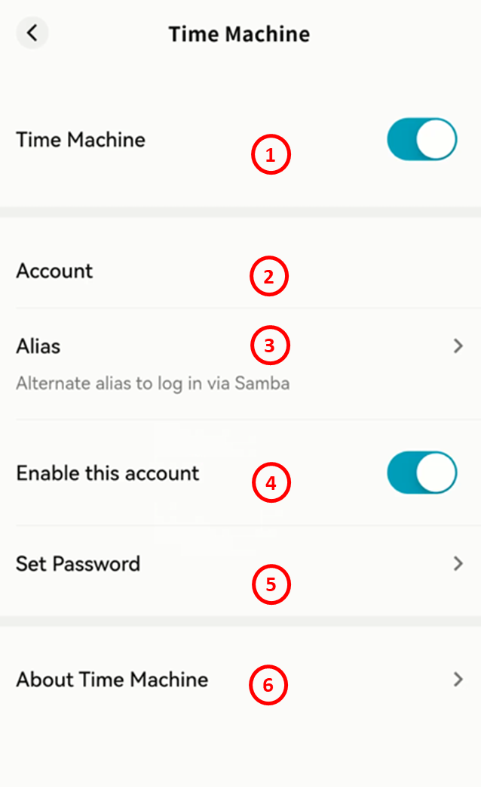

### Connecting a Mac to Time Machine

1.  On your Mac, go to **System Settings  General  Time Machine**.

2.  Select **Add Backup Disk...**, then choose your device from the list
    and click **Set Disk...**.

3.  Enter the corresponding network account and password in the pop-up
    window, then click Connect.

4.  After setup is complete, your Mac will automatically back up files
    to the DASSET device using Time Machine.

## Cloud Drive

DASSET supports integration with third-party cloud drives. You can
upload files from the DASSET edge device to a cloud drive, download
files from a cloud drive to the device, or synchronize data between
them.

Currently supported third-party cloud drives include: **Google Drive,
OneDrive, and Dropbox.**

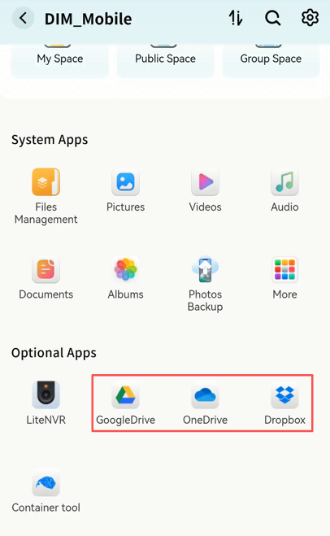

### Cloud Drive Login

#### **Log in to Google Drive**

1.  For first-time use, click **Install**  wait  **Open**.

2.  Read and agree to the usage terms, then click **Confirm**.

3.  On the Google Drive authorization page, enter your account
    credentials.

4.  Once logged in, your Google Drive files will be accessible.

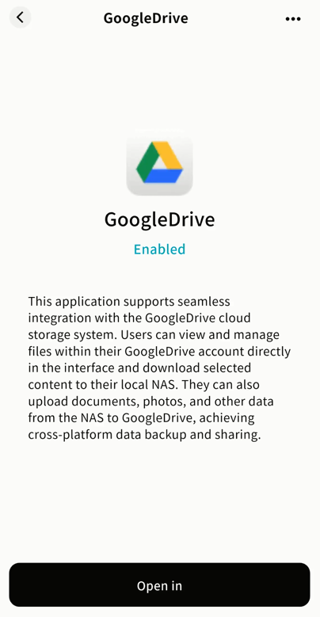

#### **Log in to OneDrive**

1.  For first-time use, click **Install**  wait  **Open**.

2.  Read and agree to the usage terms, then click **Confirm**.

3.  On the OneDrive authorization page, enter your account credentials.

4.  Once logged in, your OneDrive files will be accessible.

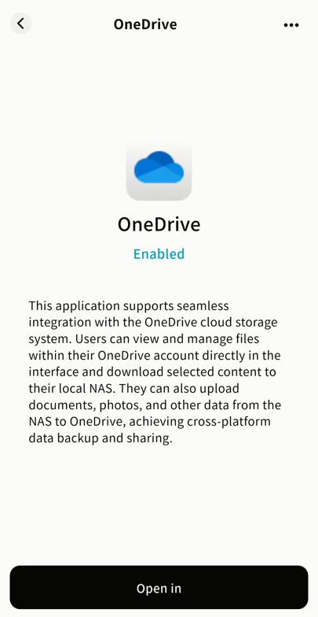

#### **Log in to Dropbox**

1.  For first-time use, click **Install**  wait  **Open**.

2.  Read and agree to the usage terms, then click **Confirm**.

3.  On the Dropbox authorization page, log in with your account
    credentials or sign in via Google/Apple.

4.  Once logged in, your Dropbox files will be accessible.

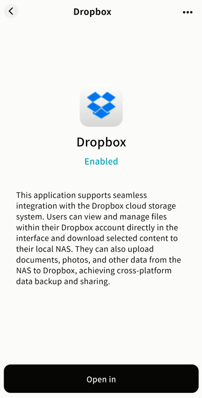

### Cloud Drive Operations

#### **Cloud Drive Interface**

After login, the interface includes:

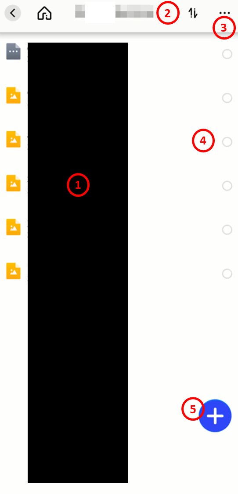

1.  **File List:** Displays files stored in the cloud drive.

2.  **Task List:** Shows progress and history of upload/download tasks.

3.  **Logout:** Exits the account; re-login required to re-enter.

4.  **File Operations:** Available via menu, including download, rename,
    copy, move, and delete.

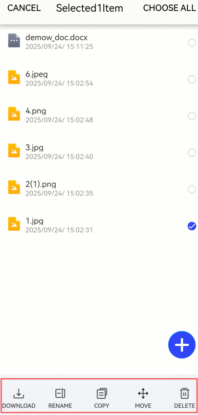

5.  **Add Files:** Upload files from DASSET to the cloud or create new
    folders.

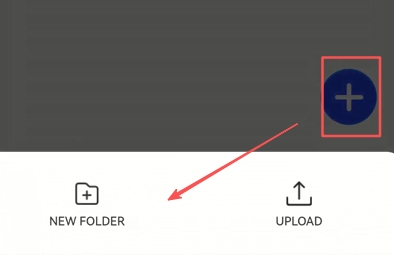

#### **Upload Files from DASSET to Cloud Drive**

1.  Go to **Cloud Drive  +** and choose upload or create folder.

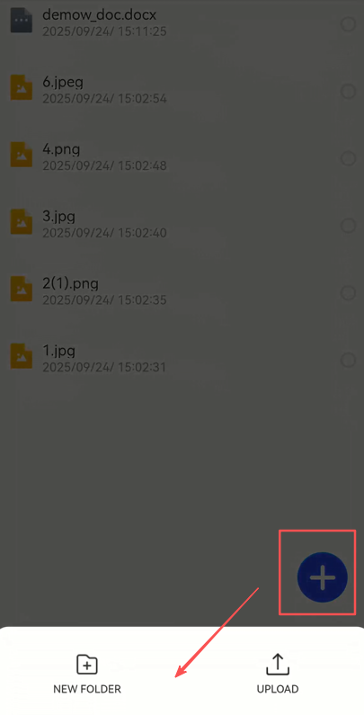

2.  Select files/folders from **My Space** to upload (multi-select
    supported).

> *Note: For security reasons, only files from My Space can be
> uploaded.*

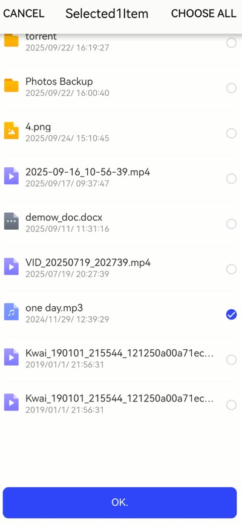

3.  Confirm to start upload.

#### **Download Files from Cloud Drive to DASSET**

1.  Select the file(s)  click **Download**.

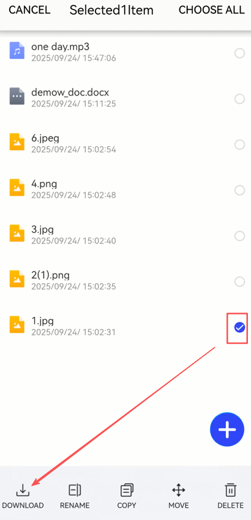

2.  Choose the destination folder in **My Space** (only My Space is
    allowed).

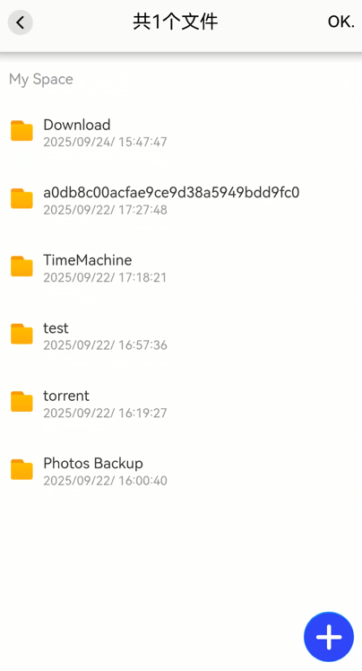

3.  Confirm to start download.

#### **File Operations in Cloud Drive**

After selecting files/folders, the operations menu allows you to:

1.  **Download**: Save cloud drive files to DASSET (multi-select
    supported).

2.  **Move**: Relocate files to another folder within the cloud drive.

3.  **Copy**: Duplicate files to another folder within the cloud drive.

4.  **Delete**: Remove one or more files.

5.  **Rename**: Change file or folder names.

6.  **+ Button**: Upload files from DASSET or create new folders in the
    cloud drive.

#### **Transfer List**

Monitor upload and download tasks under the Transfer List.

- **Uploads to Cloud Drive**:

  - Pause, start, or cancel multiple tasks.

  - Clear all completed tasks.

  - View failed uploads.

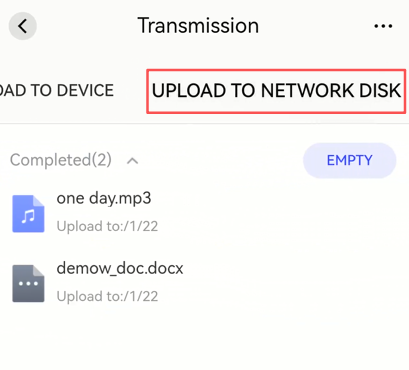

- **Downloads to Device**:

  - Pause, start, or cancel multiple tasks.

  - View or clear single or all completed tasks.

  - View failed downloads.

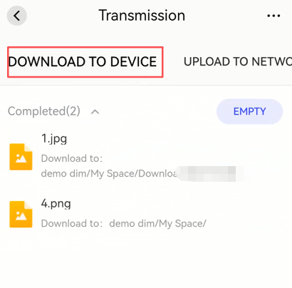

## My Vault

The **My Vault** is a secure area within the DASSET edge device. Files
stored here are protected with strong encryption. Without entering the
correct password, the My Vault cannot be accessed from the DASSET
client.

### Creating a My Vault

When using the My Vault for the first time, you must set a password and
a security question.

1.  **Create a Password**: Set a password to unlock the My Vault. It
    must be 6--20 characters long, containing only numbers or letters.

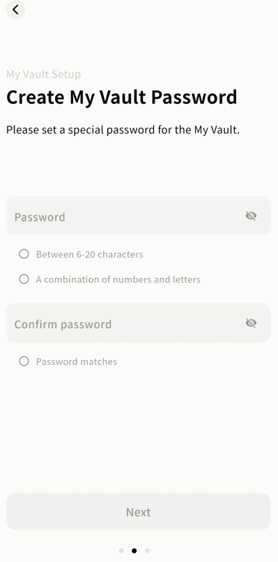

2.  **Set a Security Question**: Create a question to help recover your
    My Vault password.

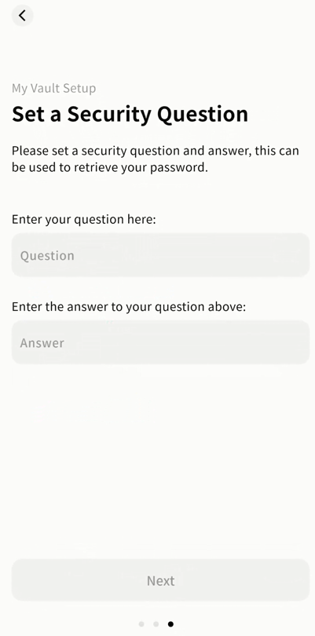

3.  After setup, log in to the My Vault and you will be prompted to
    enter your password.

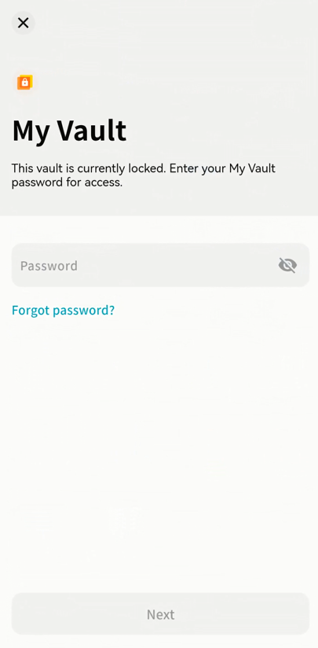

### My Vault Operations

Within the My Vault, you can manage files just like in other areas of
DASSET.

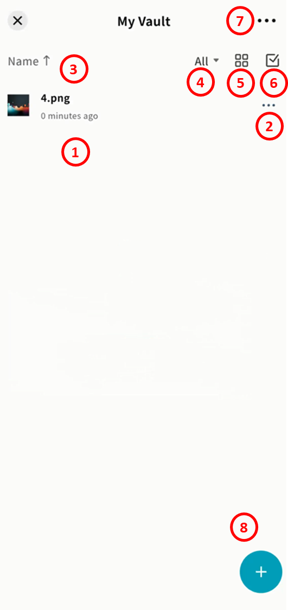

1.  **File List**: Displays all stored files.

2.  **File Operations:** Access the file menu to move, copy, download,
    delete, rename, hide, or view file details.

3.  **Sorting Options:** Sort by name, modification time, or file size.

4.  **File Type Filter:** Quickly filter files by type (images, videos,
    audio, documents, compressed files).

5.  **View Modes:** Switch between list view and grid view.

6.  **File Selection:** Toggle between single and multiple selection.

7.  **My Vault Settings:**

    - **Unlock Settings**: Configure lock rules (auto-lock after
      exiting, or stay unlocked until next login).

    - **Change Password**: Update the My Vault access password.

    - **Task List**: View upload and download task progress.

    - **Change Security Question**: Update the recovery question.

    - **Reset My Vault**: Requires verification of your DASSET account.
      All data will be erased after reset.

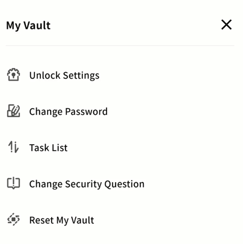

8.  **Add (+):** Upload or create new content.

    - **Upload photos and videos** from your mobile device's gallery

    - **Upload other files** from your device (requires OS permission)

    - **File from Device:** Move files from DASSET device storage into
      the My Vault

    - **Create folder**

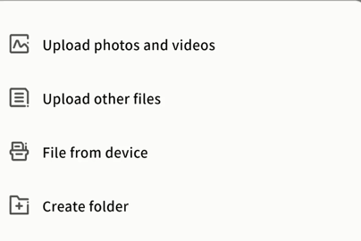

*Note: Files deleted in the My Vault are permanently erased and do not
go to the Recycle Bin.*

### My Vault Settings

From the My Vault settings page, you can configure:

- **Unlock Settings**: Modify locking rules (auto-lock after exiting or
  remain unlocked until re-login).

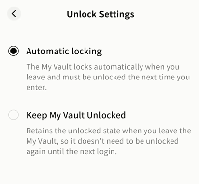

- **Change Password**: Update the My Vault password.

- **Task List**: Monitor upload/download tasks.

  - Upload tasks with progress and history

  - Download tasks with progress and history

  - Other tasks such as move/copy with progress and history

- **Change Security Question**: Update the security question.

- **Reset My Vault**: Requires verification of your DASSET account. All
  data will be permanently erased after reset.

### Password Recovery

If you forget the My Vault password, you can use the **Forgot Password**
option on the login page.

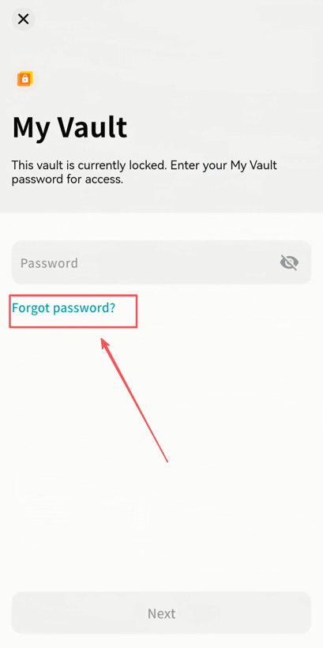

- Enter the correct answer to your security question to reset the
  password.

- Your stored data will not be affected.

*Note: The password is stored on the DASSET device. If you forget both
the password and the security question, the My Vault data cannot be
recovered. Keep your credentials safe.*

## Container Tool

Using Docker containers, you can run third-party applications on the
DASSET edge device to expand its functionality.

- On first use, go to the Container Tool interface and click
  **Install**.

- On mobile, you can only start or stop the container service.

- For advanced configuration, use the DASSET desktop client.

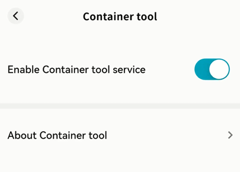

## Online Document Editing

DASSET supports third-party online document editing tools to view and
edit files stored on the device.

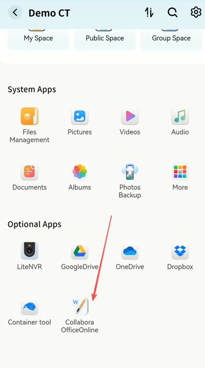

*Supported formats include Microsoft Office (DOC, DOCX, XLS, XLSX, PPT,
PPTX, Visio, MS Publisher), OpenDocument (ODT, ODS, ODP), and PDF.*

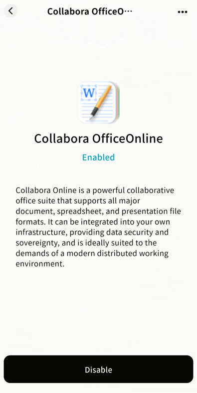

### Installing the Online Editing Tool

1.  Go to **Third-party Apps  Collabora Office Online**.

2.  Click **Install**.

3.  Wait for installation to complete. You can also manage the tool via
    the **...** menu (disable or uninstall).

4.  Once installed, you can select documents on the DASSET device for
    online viewing and editing.

> *Note: Viewing and editing take place on the DASSET device, not on
> your terminal.*

### Document Preview and Editing

1.  Select a document stored on the DASSET device and click **Online
    Editing**.

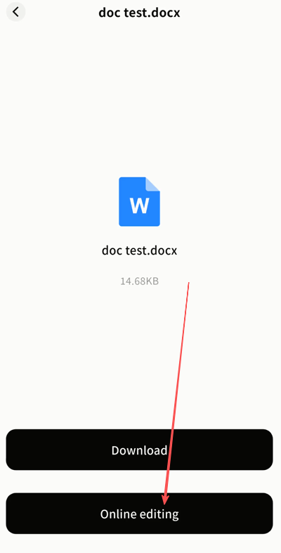

2.  The tool will open the document in preview mode.

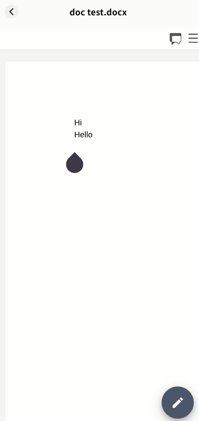

3.  Click the edit button to start editing.

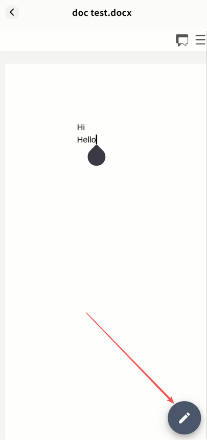

> *Note: All edits are stored on the DASSET device. For more details,
> check the tool's help documentation.*

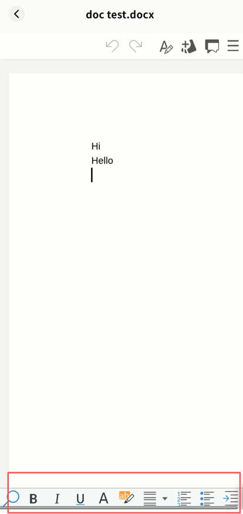

## App Store

The **App Store** lists all Third-party apps supported by your DASSET
device. You can install apps as needed.

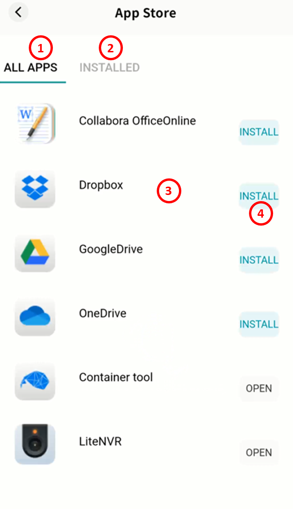

1.  **All Apps:** Displays all available apps.

2.  **Installed:** Displays apps already installed.

3.  **App List:** Shows icons and names of apps.

4.  **Install/Open:**

    - Click **Install** to add an app.

    - Click **Open** to launch an installed app.

Clicking an app icon shows its description, and allows you to open,
stop, or uninstall it.

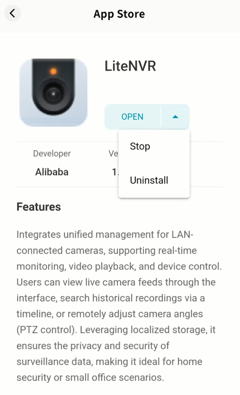

In **Installed**, you can manage all apps currently on the device.

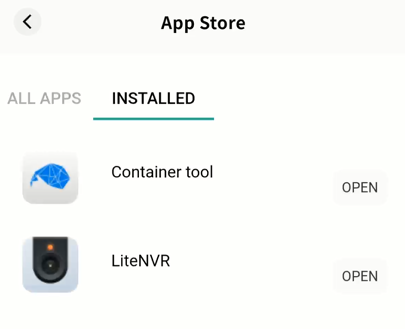

# Note

##  Note Overview

Tap the **Note** button to enter your personal notes page:

1.  **Note Settings:** By default, notes are stored on your mobile
    device. You can choose to sync them with your DASSET edge device.

2.  **Search:** Search notes using keywords.

3.  **Notebooks:** View notebook names and note counts. Tap to open.

4.  **Notebook Settings:** Delete or rename a notebook.

5.  **Trash:** Deleted notes and notebooks are temporarily stored here.

6.  **Add Notebook:** Create a new notebook.

*Note: Notes support direct pasting of Markdown content while preserving
formatting.*

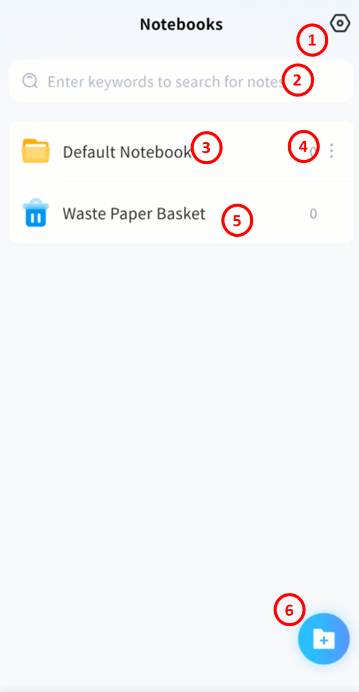

##  Note Settings

When sync is enabled, all notes remain consistent across your mobile
device and DASSET edge device.

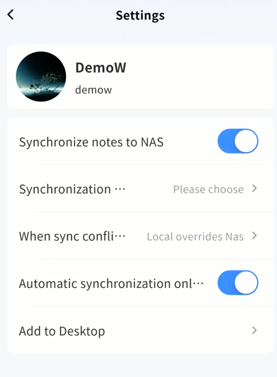

- **Synchronize notes to NAS:** When enabled, notes created on your
  mobile device sync with the chosen DASSET device.

> **Synchronization Object:** Select the device to sync notes with.

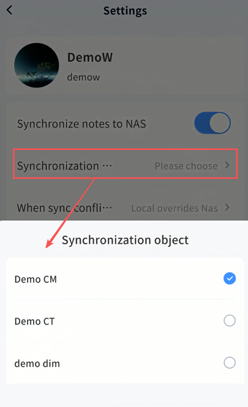

> **When sync conficts occur:** Define how conflicts are handled when
> notes differ between devices.

- **Local Overrides NAS**: Upload notes from your mobile device to
  overwrite notes on the DASSET device.

- **NAS device Overrides Local**: Download notes from the DASSET device
  to overwrite local notes.

> *Recommendation: If only you use the account and you don't edit notes
> across multiple devices simultaneously, choose **Local Overwrites
> NAS**.*

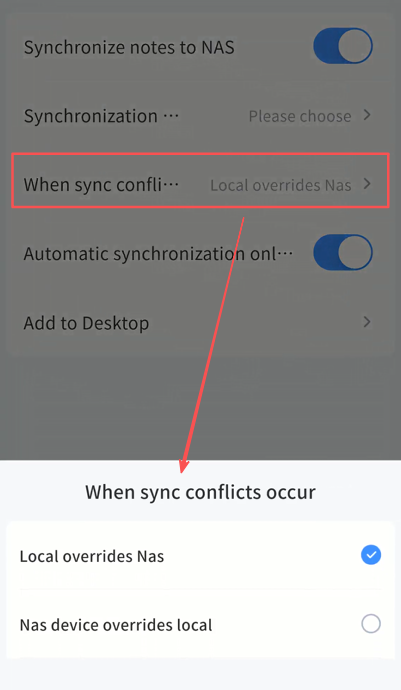

- **Sync Only on Wi-Fi**: Sync runs only when connected to Wi-Fi.

- **Add to Desktop**: Add a shortcut icon to your home screen for quick
  access.

##  Notebook Management

You can create multiple notebooks to organize your content.

1.  **Create a Notebook**

    - Go to the Notes app and tap **+**.

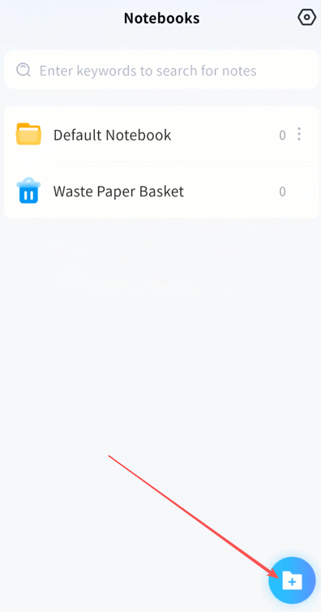

- Enter a name and tap **Confirm**.

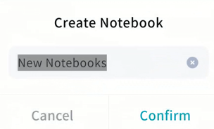

- The new notebook will appear in the list.

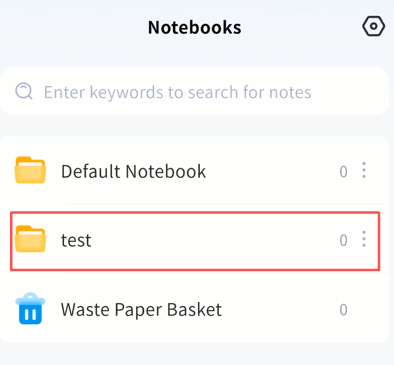

2.  **Rename**: Tap the notebook menu  **Rename**.

3.  **Delete**: Tap the notebook menu  **Delete**.

> *Note: Deleting a notebook also deletes all its notes. Restoring a
> note from Trash also restores its notebook.*

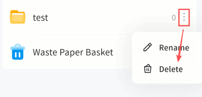

## Note Management

When you enter a notebook, all its notes are displayed.

###  Note Status

If sync is enabled, each note shows its sync status:

- Waiting to sync

- Sync complete

- Sync in progress

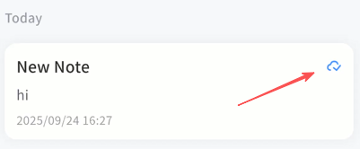

###  Create a Note

Tap **+** to create a new note.

###  Note Editing

In the editing screen, you can:

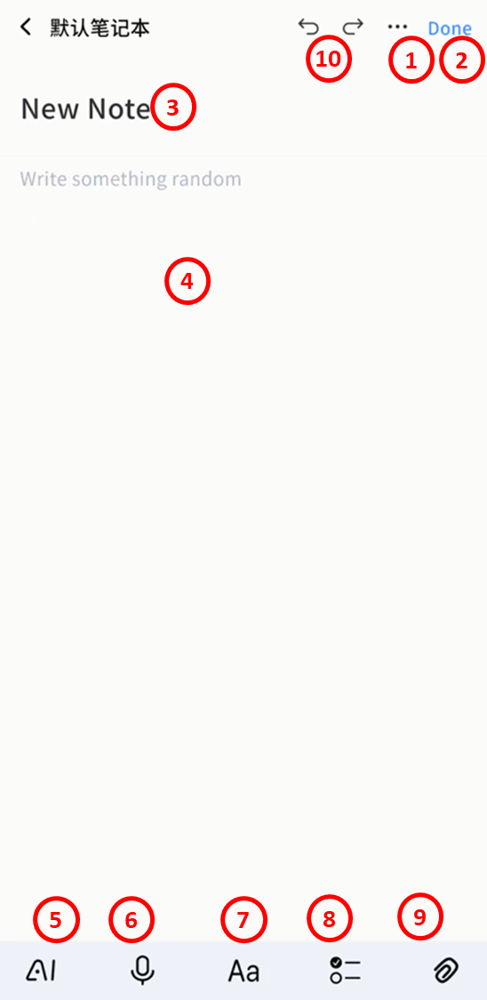

1.  **Note Options:** Move to another notebook, pin, or remove.

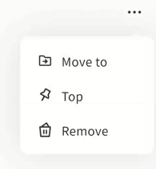

2.  **Done:** Tap Done or simply go back to save automatically.

3.  **Title:** Add a note title.

4.  **Body:** Write the main content.

5.  **AI Agent Tools:** Translate, summarize, create blog drafts,
    organize to-dos, and image interpretation.

6.  **Recording:** Record audio to embed in the note.

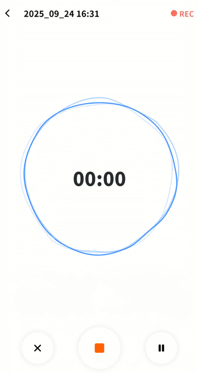

- Exit: Discard recording.

- Save: Store the recording in the note.

- Pause/Resume: Control recording.

> *Note: First-time use requires microphone permission.*

7.  **Formatting:** Rich text and basic formatting supported.

    - Headings (H1/H2/H3), body text

    - Bold, italic, underline, strikethrough

    - Lists and alignment options

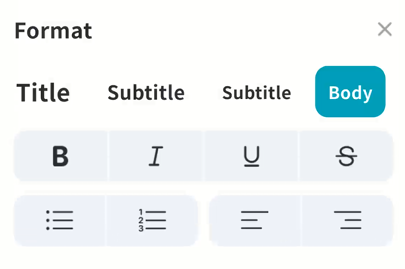

8.  **To-Do Items:** Insert tasks with completion checkboxes.

9.  **Insert Media:**

    - Insert photo from device

    - Take photo or video directly

    - Insert video/audio from device

> *Supported formats:*

- *Audio: mp3, wma, flac, wav, aac, ape, m4a, ogg*

- *Images: gif, jpg, png, jpeg*

- *Video: avi, flv, mov, mkv, mp4, wmv*

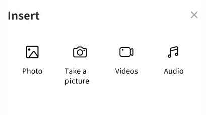

10. **Undo/Redo:** Cancel the current edit, or restore what was just
    undone (only available if no further actions have been taken after
    the undo).

###  Quick Edit

Long-press selected text to: Cut, Copy, Paste, or Select All.

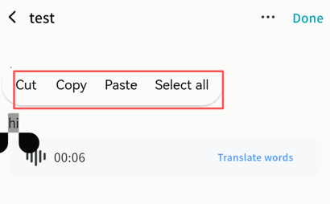

###  Notebook Settings

Inside a notebook, tap **...** to:

- Change view (grid or list).

- Sort notes by modification time, creation time, or title.

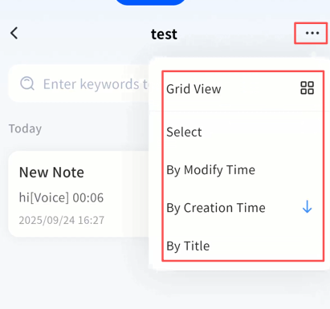

##  Note Management in List View

Long-press a note to perform batch actions:

- Move to another notebook

- Pin in current notebook

- Copy to another notebook

- Delete

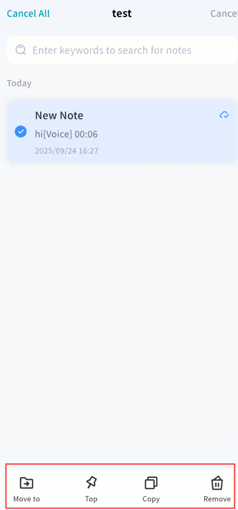

##  AI Agent for Notes

The Notes app includes multiple AI Agent features that you can use
anytime to improve efficiency.

###  Image Analysis

In a note, you can use **Image Analysis** to let AI generate a
description of an image.

1.  Long-press the image and select **Image Analysis**.

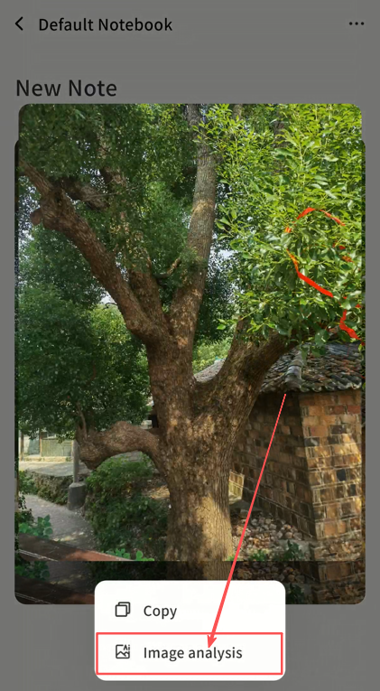

2.  The DASSET AI Agent will analyze the image. Please wait for
    processing.

3.  When complete, the AI Agent generates descriptive text. You can:

    - **Save as Note**: Store the description in a new note.

    - **Insert Text**: Add the description into the current note.

    - **Try Again**: Generate a new description if unsatisfied.

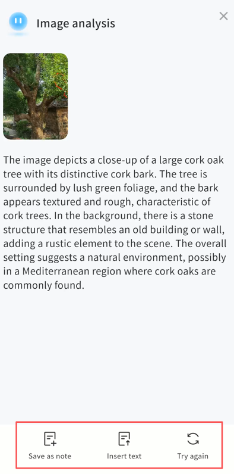

###  Text Translation

Use **Text Translation** to translate selected text into other
languages. Supported target languages: **Chinese, English, Japanese**.

1.  Select text, then tap **AI  Translation  Target Language**.

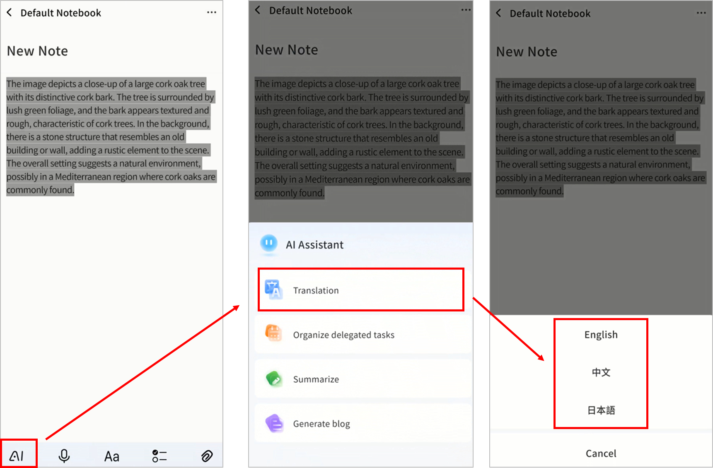

2.  The DASSET AI Agent will translate the text.

3.  After completion, you can:

    - **Save as Note**

    - **Insert Text** into the current note

    - **Try Again** to generate a new translation

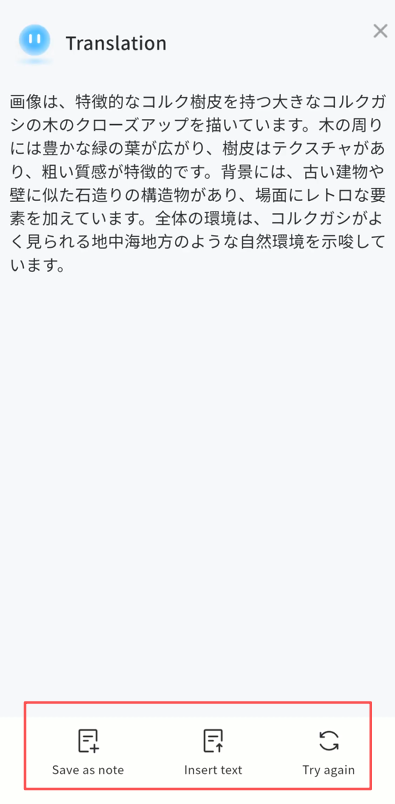

###  To-Do Organization

You can convert selected text into structured to-do items.

1.  Select text, then tap **AI  Organize delegated tasks**.

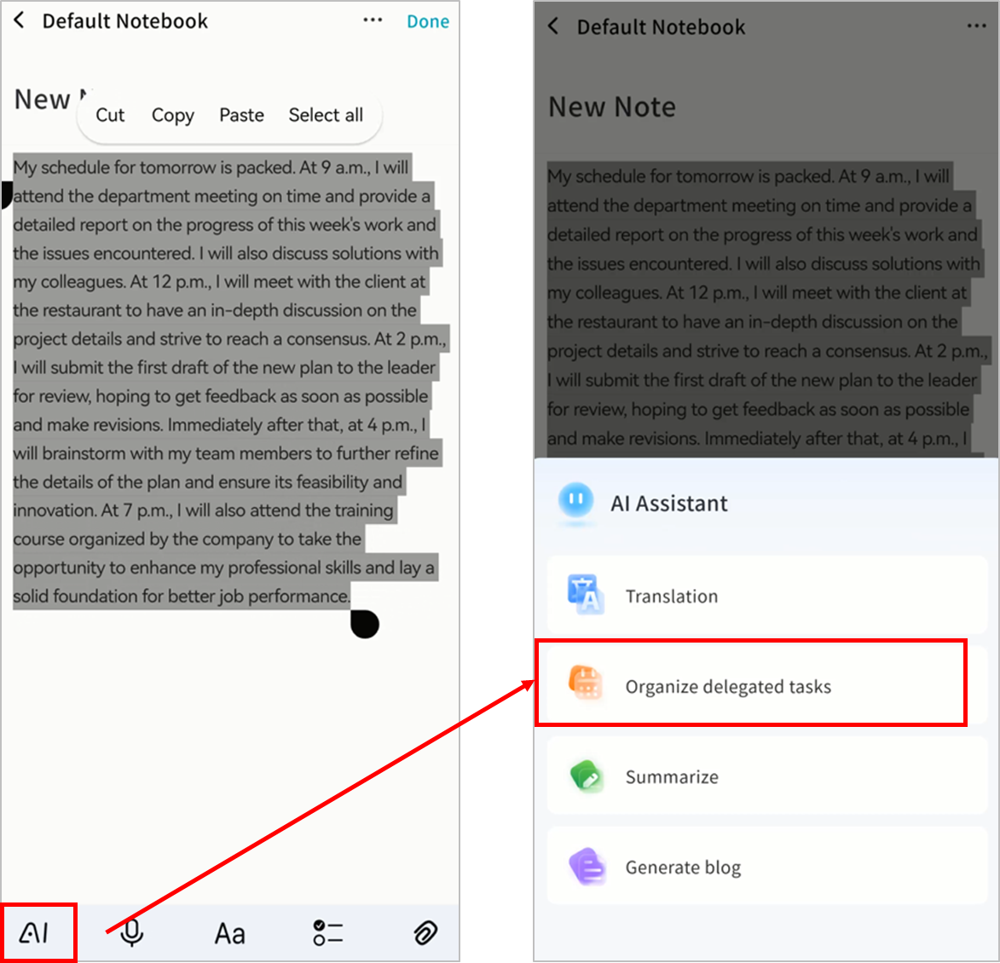

2.  The DASSET AI Agent will process the text and create a to-do list.

3.  After completion, you can:

    - **Save as Note**

    - **Insert Text** into the current note

    - **Try Again** for new results

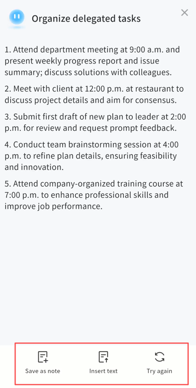

###  Summarization

Use **Summarization** to condense selected text into a concise summary.

1.  Select text, then tap **AI  Summarize**.

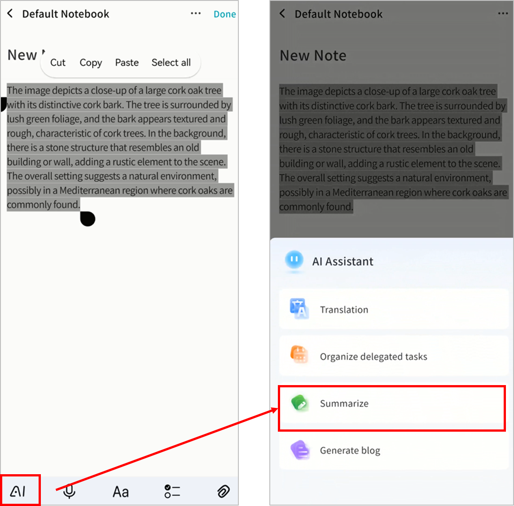

2.  The DASSET AI Agent will analyze and generate a summary.

3.  After completion, you can:

    - **Save as Note**

    - **Insert Text** into the current note

    - **Try Again** for a new summary

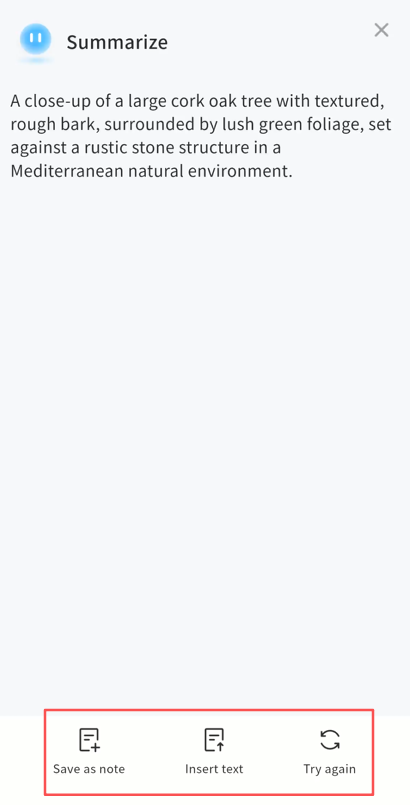

###  Blog Generation

Use **Blog Generation** to create social-media-ready drafts from
selected text.

1.  Select text, then tap **AI  Generate Blog**.

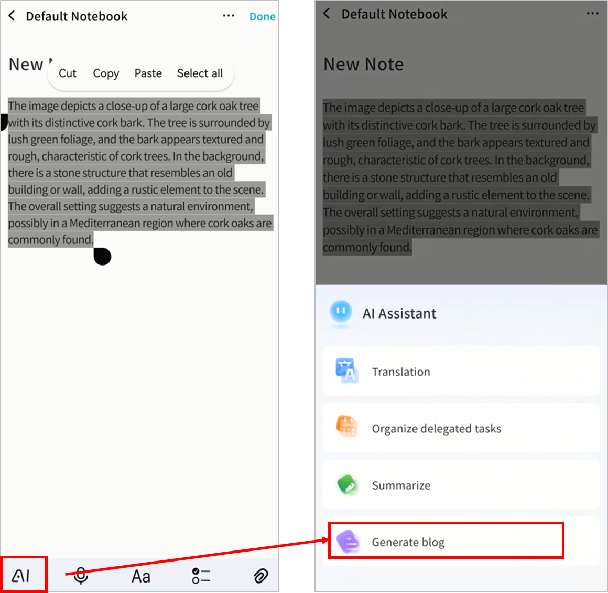

2.  The DASSET AI Agent will process the text.

3.  After completion, you can:

    - **Save as Note**

    - **Insert Text** into the current note

    - **Try Again** to regenerate the draft

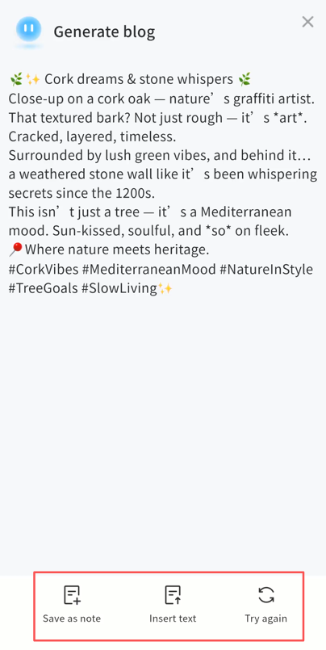

###  Speech Recognition

Use **Speech Recognition** to convert audio into text.

*Note: The AI Agent can identify different speakers by tone of voice.
Accuracy may vary depending on audio quality.*

1.  Tap **Translate words** on an audio file.

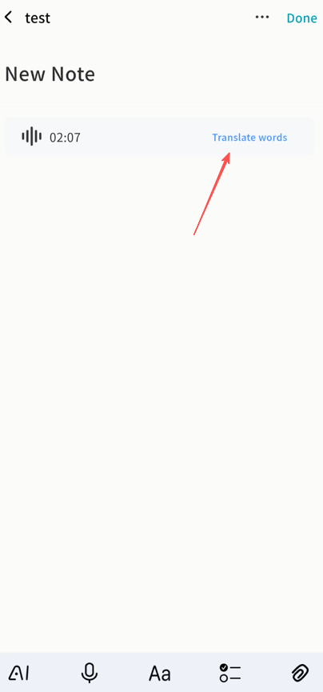

2.  The DASSET AI Agent will process the audio for speakers and content.

3.  After completion, you can:

    - **Save as Note**

    - **Insert Text** into the current note

    - **Try Again** for a new transcription

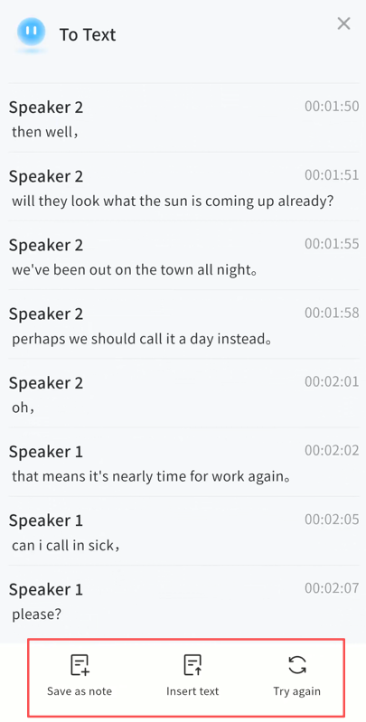

###  Example Use Case: Meeting Minutes

By combining different AI Agent features in Notes, you can handle
various scenarios efficiently. One example is creating **meeting
minutes**:

1.  Insert the meeting audio file into a note.

2.  Select **Translate Words** to transcribe the audio.

3.  Insert the transcription into the note.

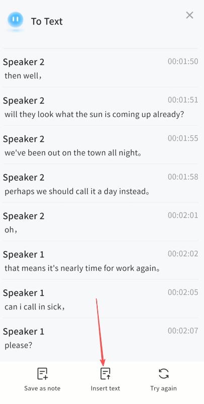

4.  Select the transcribed text and click **Summarize**.

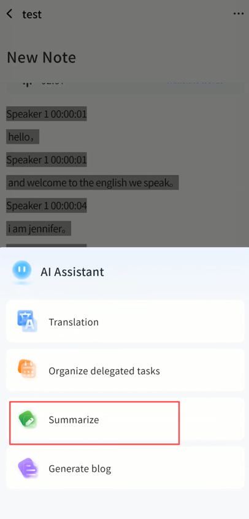

5.  The AI Agent will generate a meeting summary. You can save this
    summary as a note or request the Agent to regenerate it.

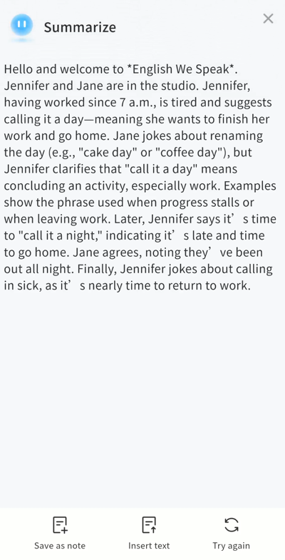

##  Search

Enter keywords in the search bar to find notes.

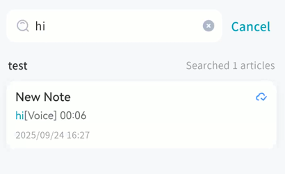

##  Waste Paper Basket

Deleted notes are stored in Waste Paper Basket .

Options:

1.  **Batch Edit**: Select multiple notes for permanent deletion or
    restore.

2.  **Search**: Search notes within Trash by keyword.

3.  **Note List**: View deleted notes with details.

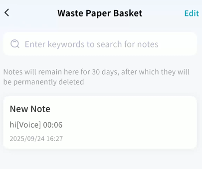

###  Batch Edit

- Select All or batch select.

- Permanently delete or restore selected notes.

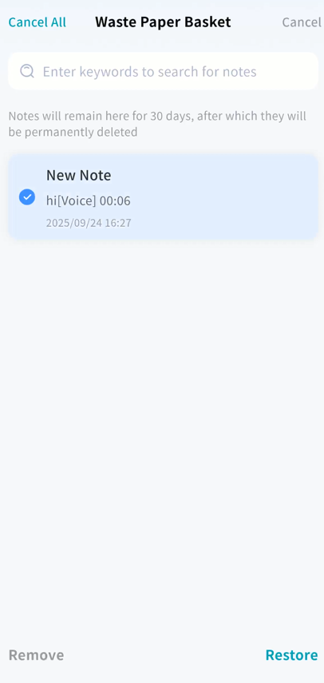

###  Single Note Restore/Delete

Open a note in Trash  **...** menu:

- **Restore**: Return note to its original notebook.

- **Delete**: Permanently delete the note.

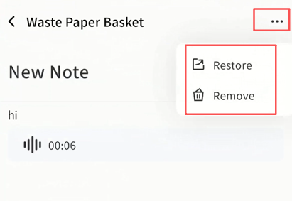

# Instant Messaging (IM)

DASSET IM is a private chat tool running on the DASSET edge device. It
ensures fully private instant messaging, with all chat data stored
locally on the device and transmitted securely with encryption.

Supported features include:

1.  **Quote**: Reply by quoting a message.

2.  **Copy**: Copy the content of a message.

3.  **Delete**: The sender can delete a message. Deleted messages are
    also removed from the recipient's history.

4.  **Media Preview**: Preview images, play videos, and listen to audio
    shared in chat.

5.  **Document Preview and Editing**: View and edit documents directly
    in chat.

6.  **Save Files**: Save received files to your local device.

7.  **Message Status**: View whether a message has been **Read** or
    **Delivered**.

8.  **AI Agent Features**: Translate, summarize, generate reply
    suggestions, and transcribe voice messages.

9.  **Send Files**: Share files stored on the DASSET device directly in
    chat.

##  Selecting a Chat Server

When using IM for the first time, you must select a DASSET device as
your **chat server**.

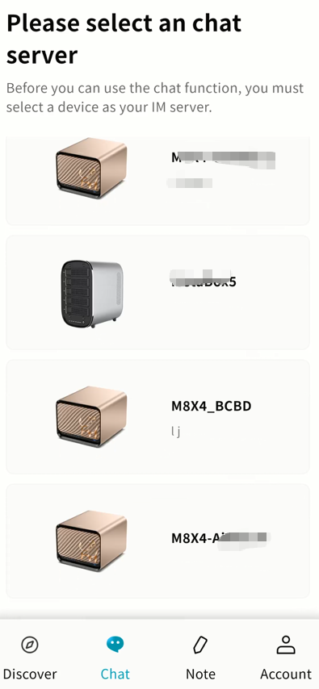

- Each chat server runs on one DASSET device. All bound users on that
  device can chat with each other.

- DASSET does not automatically create accounts for all bound users to
  protect privacy. To chat, users must connect to the same server.

- Each server is independent, like having your own private WeChat server
  at home/office. Cross-server chat is not supported.

- If a device does not support IM, you will see **This device does not
  support chat services** in red. This may be due to outdated firmware
  or insufficient hardware performance.

- An account can connect to multiple servers, but only one server at a
  time. You can switch servers anytime to view other messages.

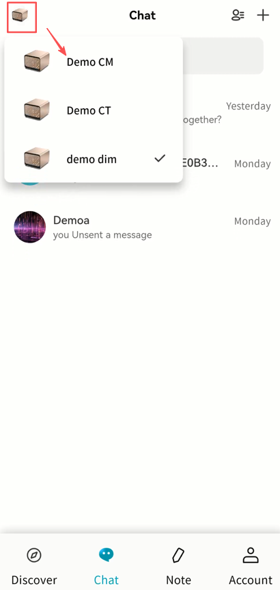

## Chat Interface Overview

After selecting a server, you enter the chat interface:

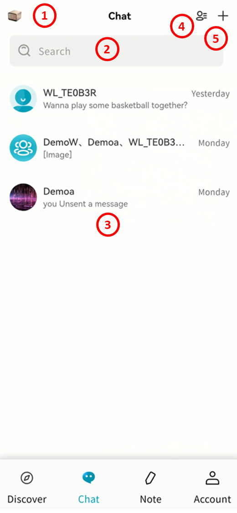

1.  **Switch Server:** Switch between multiple servers to communicate
    with different user groups.

2.  **Search:** Search contacts you've chatted with.

3.  **Conversation List:** View all conversations. Long-press a chat to
    **Top**, **Do Not Disturb**, or **Delete.**

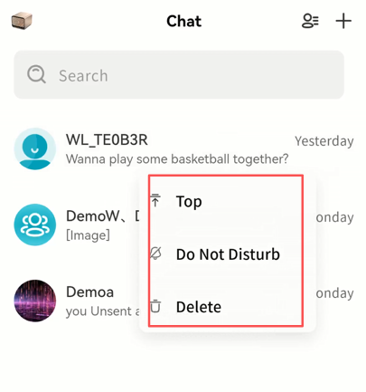

4.  **Contacts:** View all users on the current chat server.

5.  **+ Button:** Start a new chat with connected users, or invite
    others to the server (owner only).

## Contact List

View all user accounts connected to the chat server.

1.  **Search:** Find specific contacts.

2.  **Contact List:** View all connected users.

3.  **New Conversation:** Start a chat.

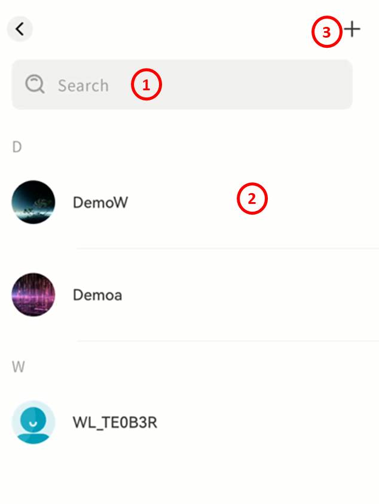

Click a contact to view details:

1.  Profile picture and nickname

2.  Add remarks for easier identification

3.  Send message

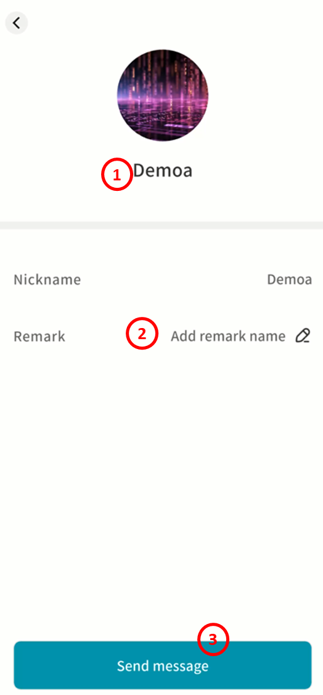

##  Switching Chat Servers

- Only one server can be active at a time.

- The current server is marked with a check (**√**).

- The list shows only bound DASSET devices that support IM.

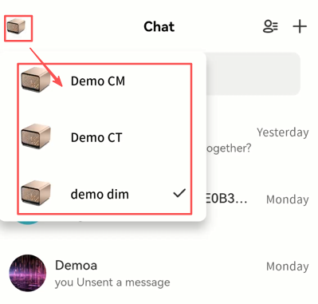

##  New Message Notifications

New messages are indicated by:

1.  A **red dot** on the client's chat icon.

2.  A **red dot** on the contact's avatar in chat.

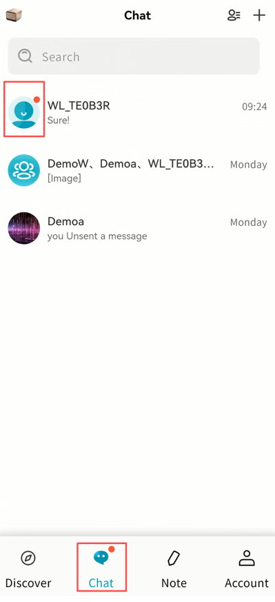

##  Chat Window

The chat window is designed for both one-on-one and group chats, with a
familiar interface:

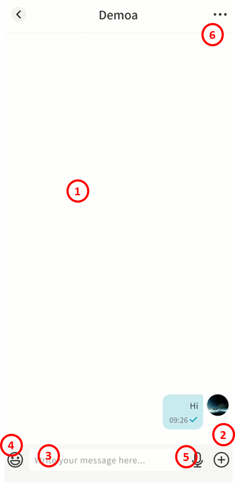

1.  **Chat Window**: View conversation history.

2.  **+ Button**: Send images, files, or more.

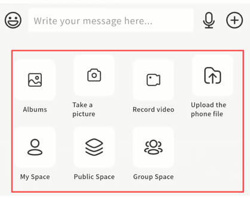

3.  **Input Box**: Enter text. Supports long text and Markdown
    formatting. If a message exceeds **5000 characters**, it is
    automatically converted into a file for sending.

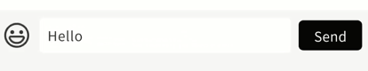

4.  **Emojis**: Add emoji reactions.

5.  **Voice Messages**: Record and send voice messages.

6.  **Chat Info**: View details about the chat partner:

    - Profile picture and nickname

    - Add remarks

    - Pin or mute chat

    - Files Management

    - Enable Auto Translate

    - Delete conversation (*deletes all local records; the recipient
      still retains theirs*)

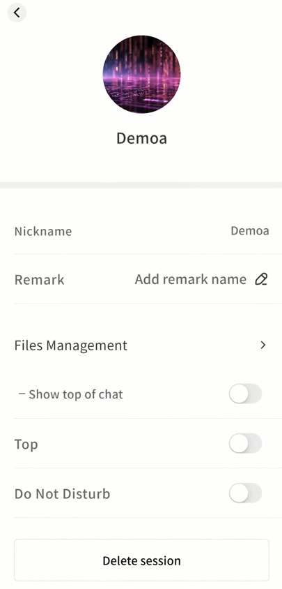

###  Sending Images and Files

- **Album**: Send images from your gallery.

- **Camera**: Take a photo and send it.

- **Video:** Record a video and send it.

- **Local Files**: Upload files from your phone.

- **NAS Files**: Send files stored on the DASSET device.

###  Sending Voice Messages

Press and hold the microphone button to record and send voice messages.

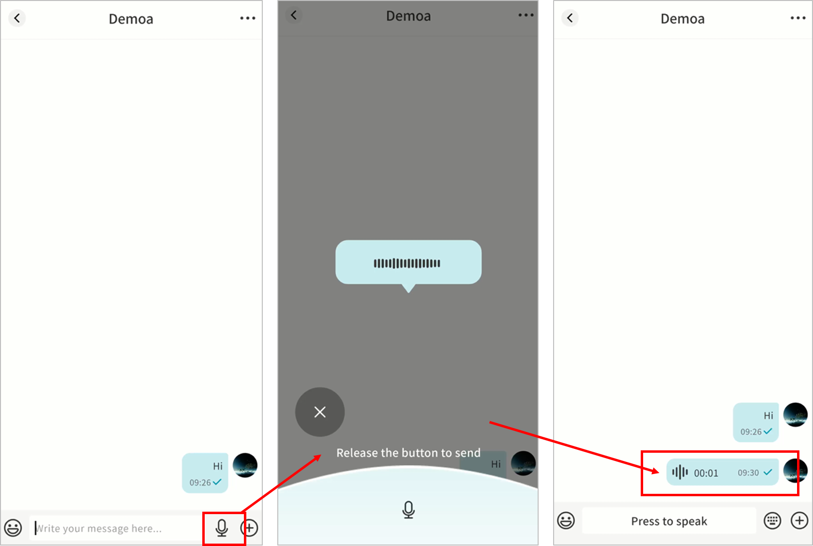

##  Message Interactions

Long-press a message to access the interaction menu. Options vary by
message type (text, file, voice):

- **Quote**: Reply to a specific message.

- **Copy**: Copy the content.

- **Forward**: Forward to another chat.

- **Multi-Select**: Select multiple messages to forward or delete.

- **Save to NAS**: Save attachments directly to your DASSET device.

- **Download**: Save attachments to your mobile device.

- **Emoji Reply**: React to a message with emojis.

- **Recall**: Withdraw a message you sent.

- **Delete**: Remove the message (local deletion only).

- **AI Agent Tools**:

  - **Translate**: Translate into Chinese, English, or Japanese.

  - **Reply Suggestions**: AI generates multiple suitable replies.

  - **Speech Recognition**: Convert a voice message into text.

  - **Summarize**: AI generates a summary of the message.

- **URL Links**: Tap to open in your browser.

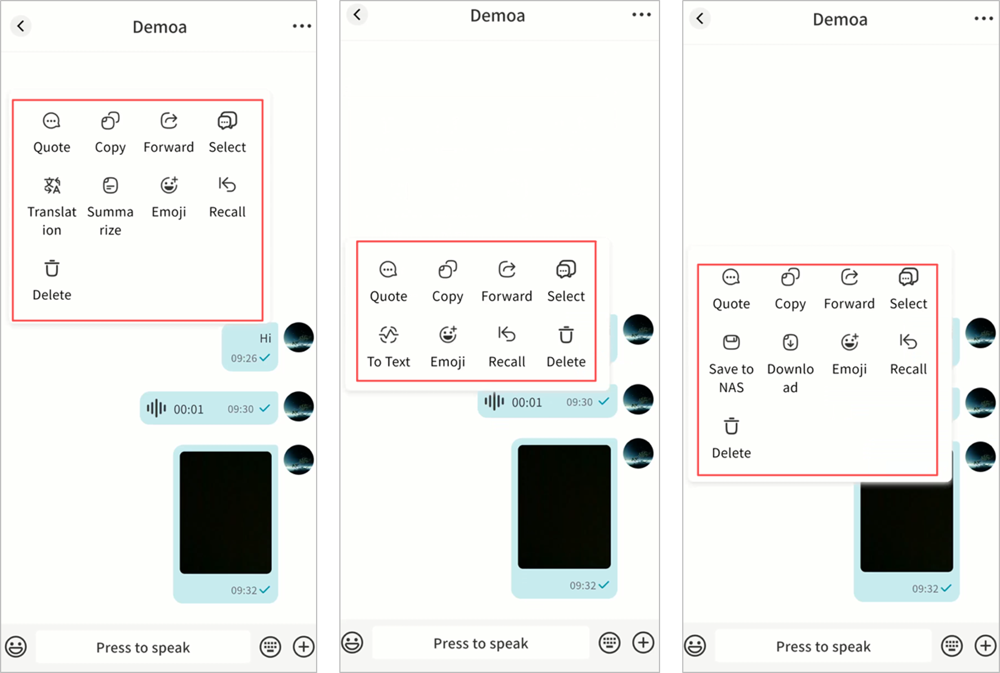

##  One-on-One Chat

### **Create Chat**

1.  Click **+  New Conversation**, or use the **New Conversation**
    button.

> *You can also start a chat from the Contacts page.*

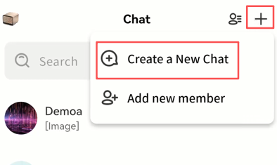

2.  Select one or more contacts. Multiple selections will create a group
    chat.

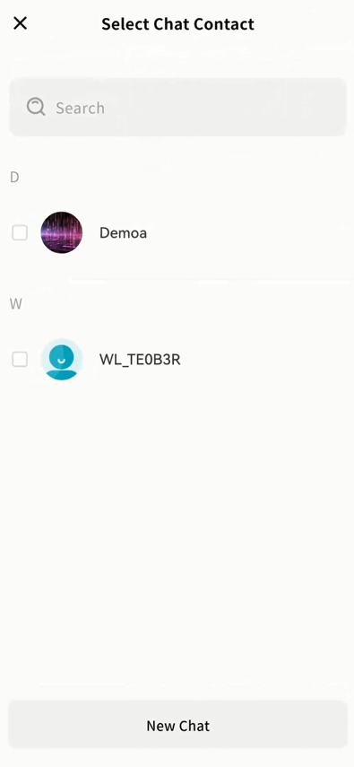

3.  Click **Confirm** to start.

### **Delete Chat**

1.  In the chat window, click **...  Delete session**.

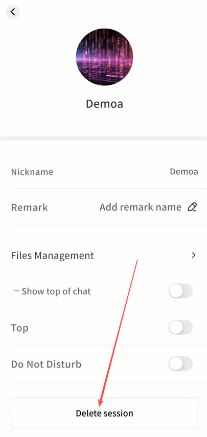

2.  Confirm deletion. *All records will be removed locally, but the
    recipient still retains them.*

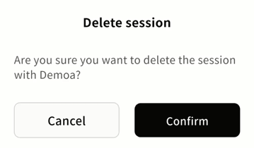

### **Top or Do Not Disturb**

In chat settings, you can:

- **Top**: Keep the chat at the top of the list.

- **Do Not Disturb**: Disable new message alerts.

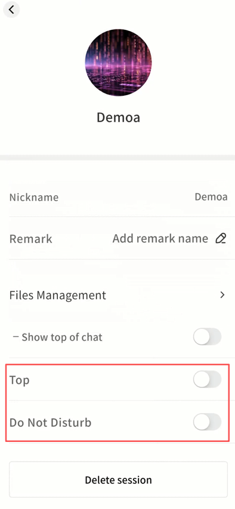

##  Group Chat

Group chats make it easy for teams to communicate.

###  **Create Group Chat**

1.  Click **+  New Conversation**.

2.  Select multiple contacts.

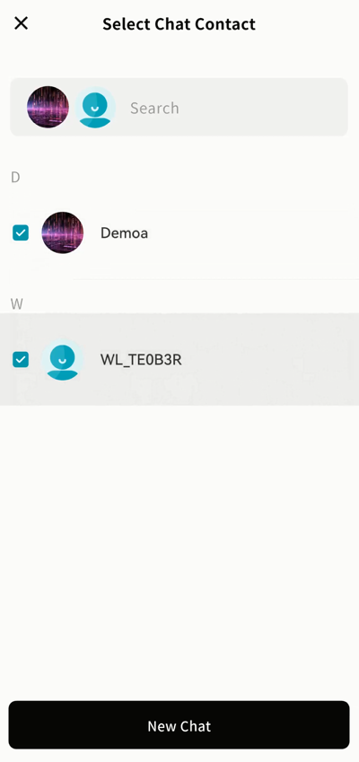

3.  Confirm to create the group.

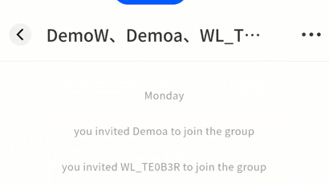

### **Manage Members**

- View, add, or remove members.

- Only the group creator can remove members.

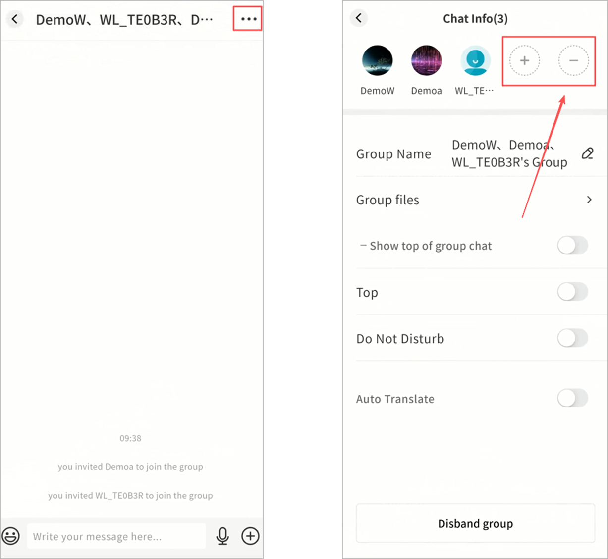

### **Rename Group**

- Group creators can rename the group.

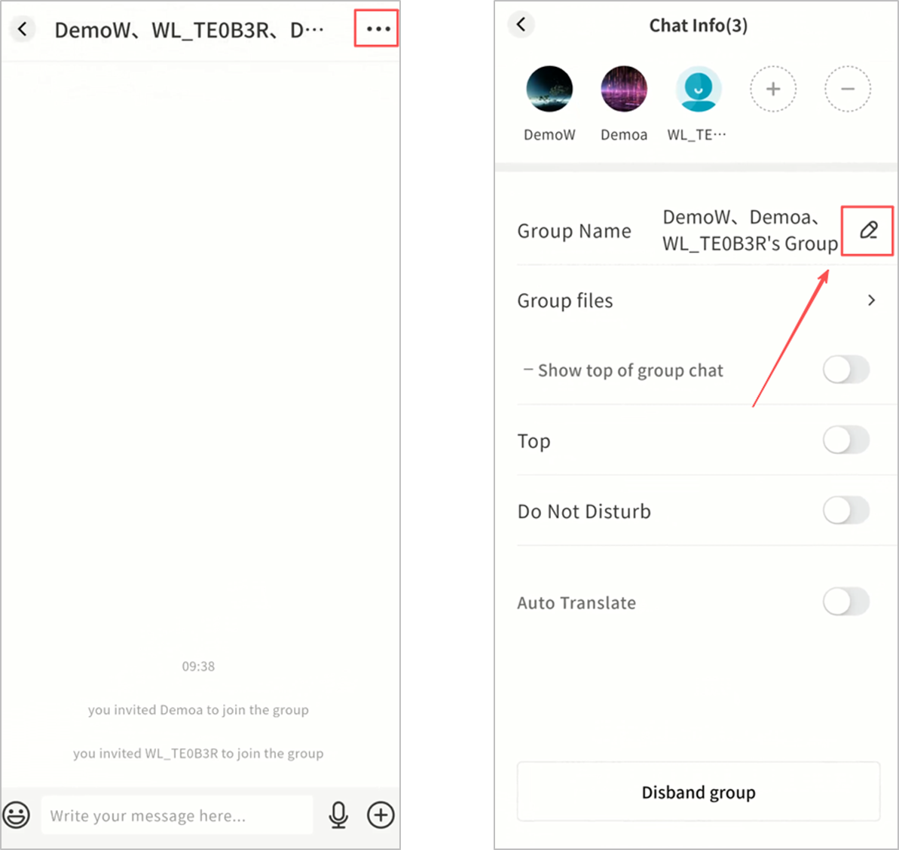

### **Disband Group**

- Group creators can delete the group.

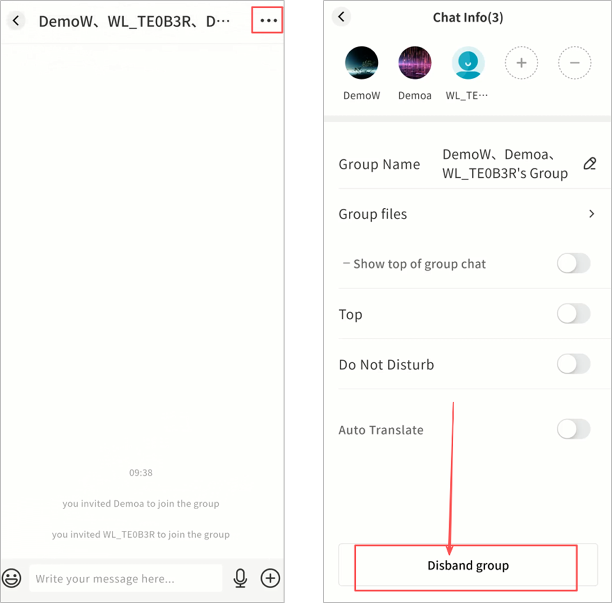

### **Top and Do Not Disturb**

- Top the chat or mute notifications.

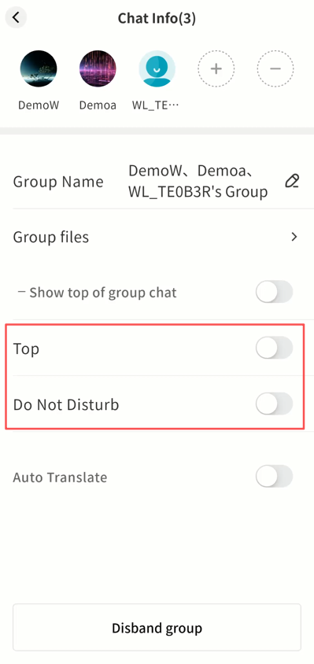

### **Leave Group**

- Any member can exit the group at any time.

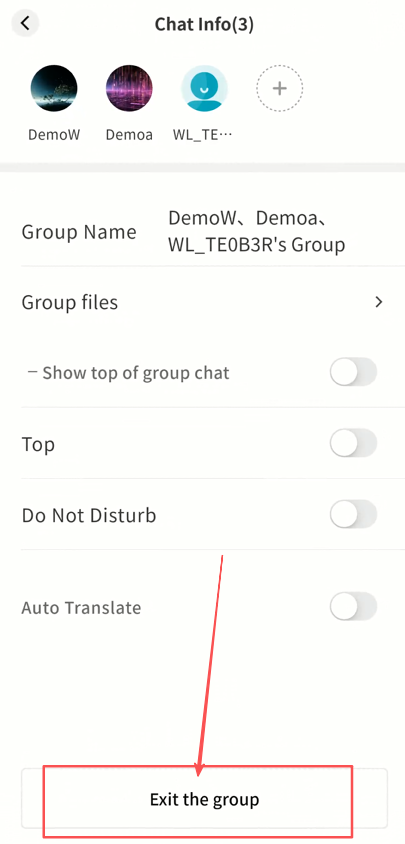

### **Group File Management**

Access all files shared in the group via **...  Group Files**.

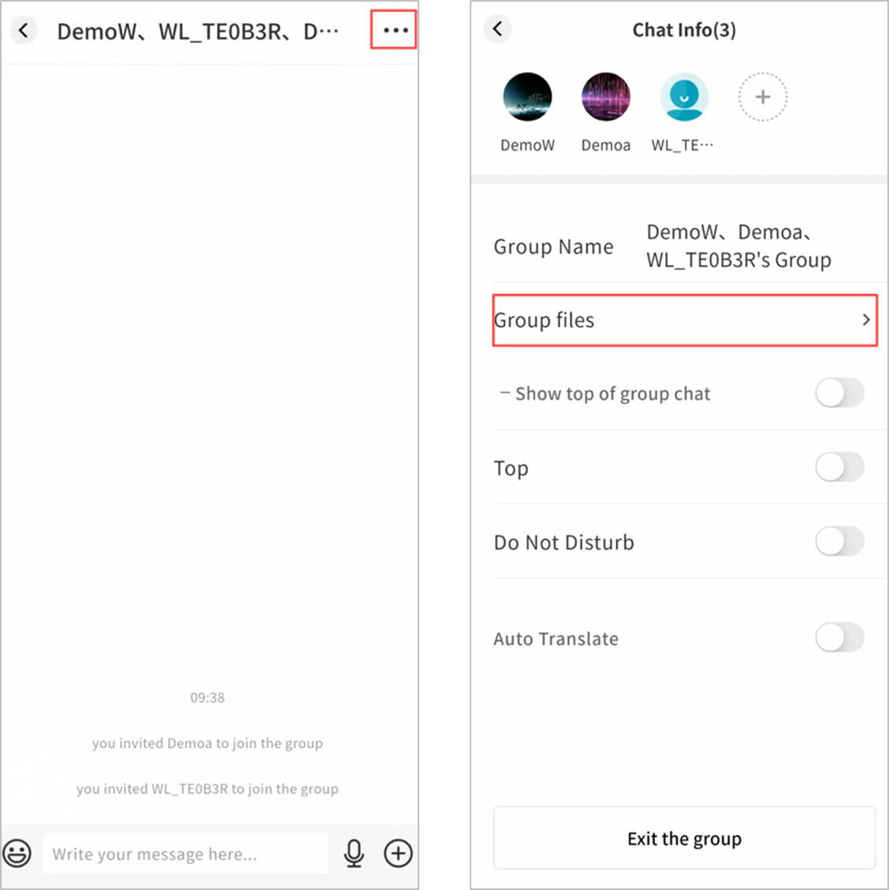

- Sort by modification time, size, or uploader

- List or grid view

- Multi-select

- File operations: Download, forward, delete (creator/uploader only),
  save to NAS, rename (creator only)

- Upload local files, photos, videos, or NAS files (uploads also
  generate a message in the group)

In \"Group File\" Management, You Can:

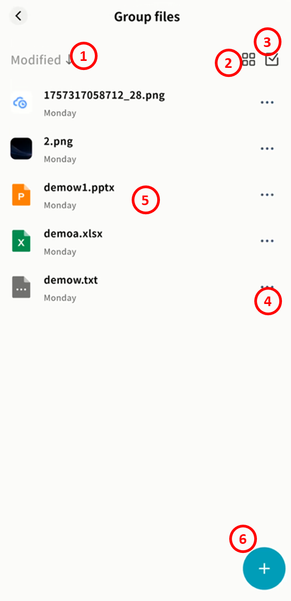

1.  **Sort:** Sort files by modification time, file size, and uploader.

2.  **File Display Mode:** Support displaying files in list view or grid
    view.

3.  **Selection:** Select files individually or in bulk.

4.  **Perform file operations**, including:

    - Download (All Group Members): Download files to your local device.

    - Forward (All Group Members): Forward the file to other chat
      conversations.

    - Delete (Only Group Creator and File Uploader): Only the current
      group creator or the file uploader can delete files from \"Group
      Files\".

    - Save to (All Group Members): Other users can only click \"Save\"
      to store the file in the personal NAS space of the current IM.

    - Rename (Group Creator): Allow modification of file names.

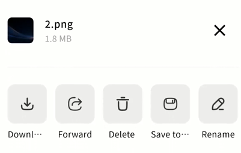

5.  **View the list of all group files,** including file names and file
    upload dates.

6.  **+** (Note: After uploading your file, a file message will be
    automatically sent to the current group chat)**:**

    - Albums: Select photos from the album to upload to group files.

    - Take a picture: Call the mobile device\'s camera to take photos
      and upload them to group files.

    - Record Video: Call the mobile device\'s camera to record videos
      and upload them to group files.

    - Upload Local File: Select files from the local device to upload to
      \"Group Files\". Note: After uploading your file, a file message
      will be automatically sent to the current group chat.

    - Send NAS File: Select files from the NAS to upload to \"Group
      Files\".

> 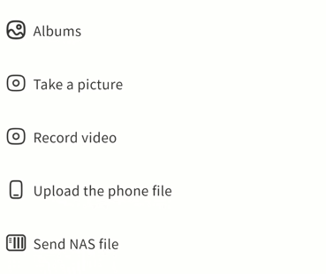

##  IM AI Agent

IM includes multiple AI Agent capabilities that you can use anytime to
improve efficiency.

### **Translation**

You can long-press a message and select **Translate** to convert it into
another language.

- Supported languages: **Chinese, English, Japanese**.

Steps:

1.  Long-press the chat message  **Translation  Target Language**.

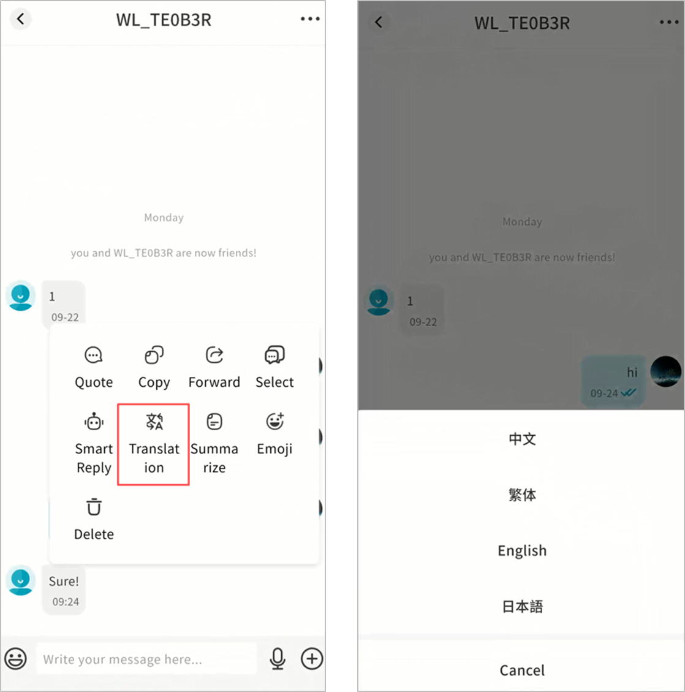

2.  Wait for the AI Agent to process.

3.  The translated text will be displayed.

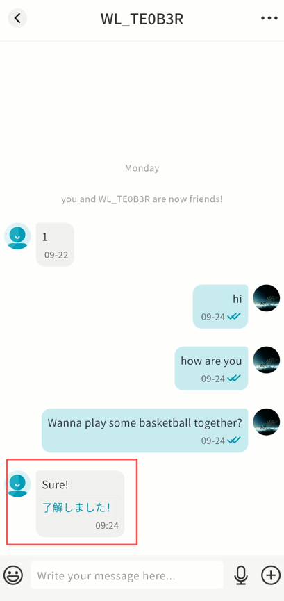

### **Smart Reply** 

You can ask the AI Agent to generate multiple suitable reply suggestions
for a selected message.

Steps:

1.  Long-press the chat message  **Smart Reply**.

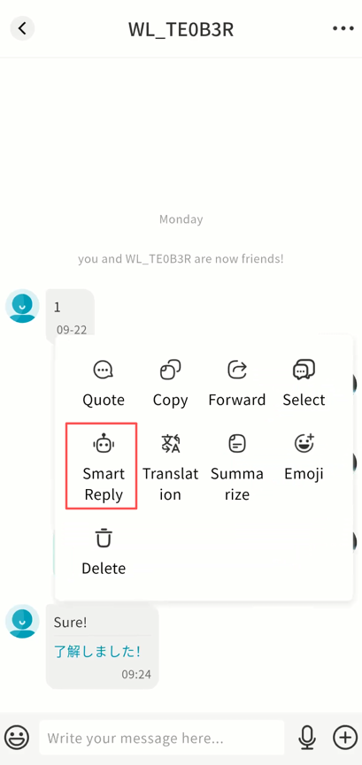

2.  Wait while the AI Agent generates responses.

3.  Multiple replies will be shown. Tap one to send directly.

    - If unsatisfied, tap **Change** to refresh the suggestions.

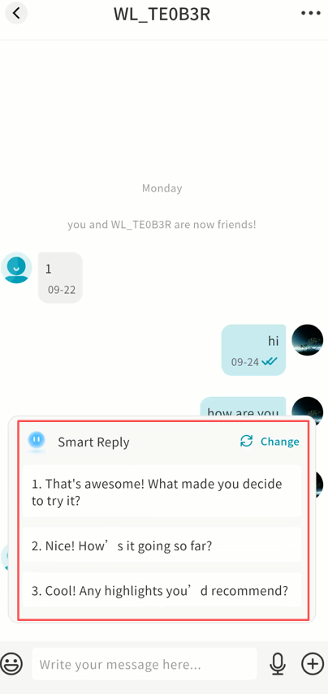

### **Summarization**

You can summarize the content of a message with the help of the AI
Agent.

Steps:

1.  Long-press the chat message  **Summarize**.

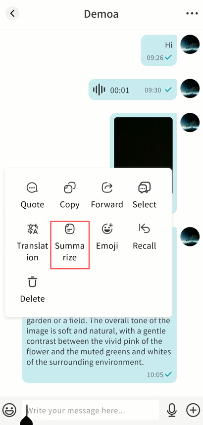

2.  Wait for the AI Agent to process.

3.  A summary will be displayed.

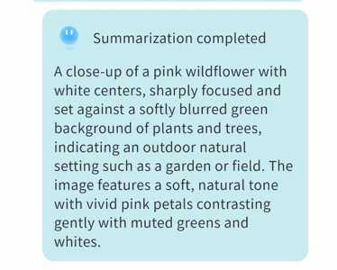

### **Speech Recognition**

You can transcribe a voice message into text.

Steps:

1.  Long-press the voice message  **To Text**.

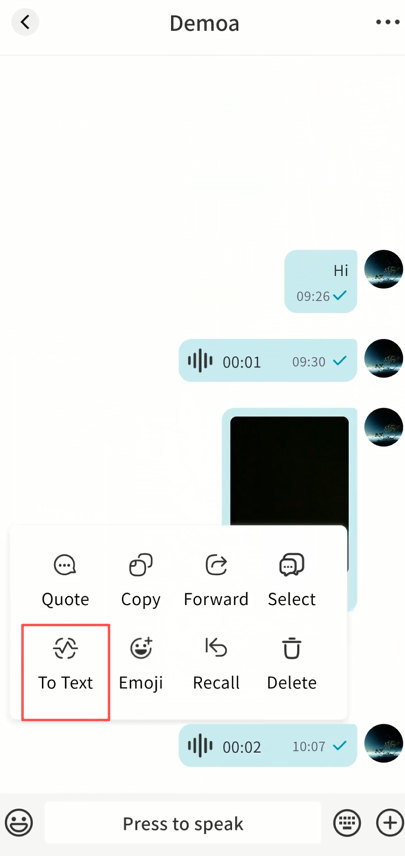

2.  Wait for the AI Agent to process.

3.  The transcription will be displayed.

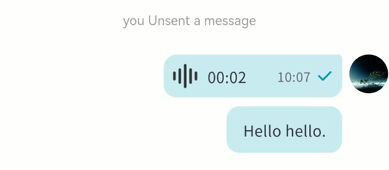

### **Auto Translation**

You can enable **Auto Translation** to have all chat messages
automatically translated into your chosen language.

Steps:

1.  In the chat window, click the **...** menu (top-right)  **Auto
    Translate**.

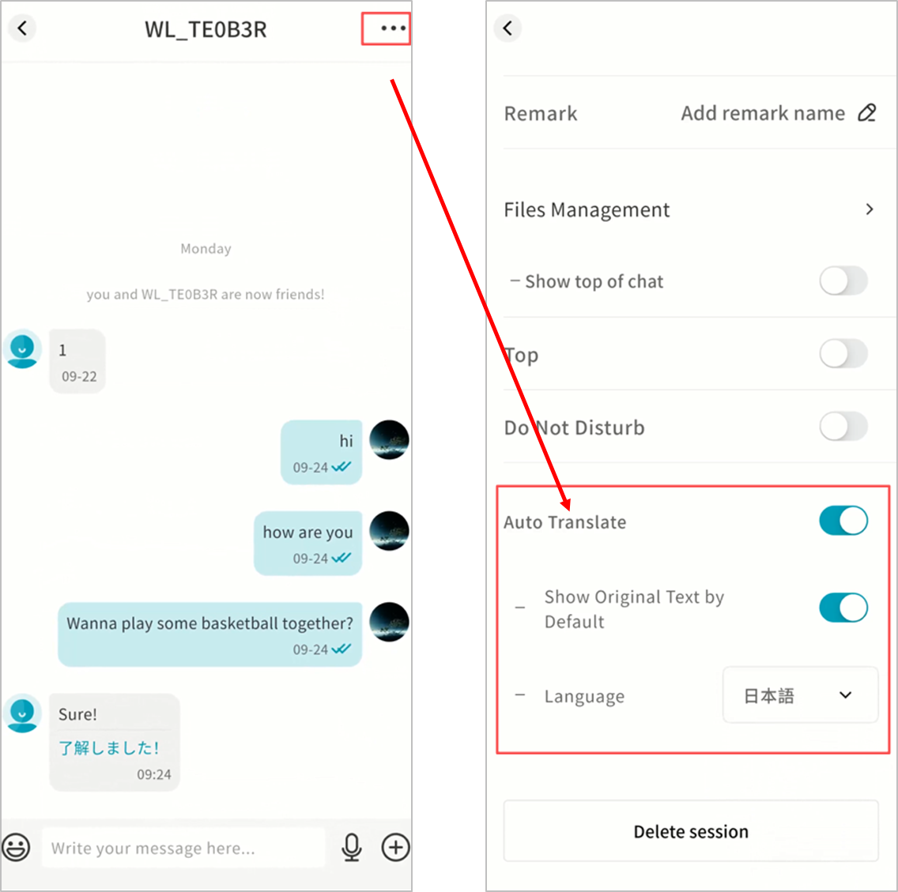

2.  Enable the option, then configure:

    - **Show Original Text**: Display both the source and translated
      text.

    - **Target Language**: Select the output language.

3.  The AI Agent will translate all incoming and outgoing chat messages
    automatically.

4.  After activation, all chat history will show both original and
    translated text.

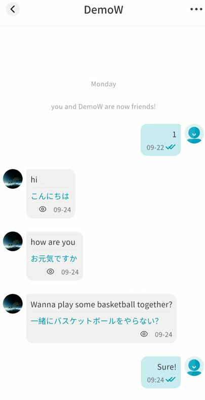

### **Image Recognition**

You can turn on the "Image Recognition" feature within any chat. Once
enabled, the AI Agent will automatically analyze the selected image and
generate a detailed description.

1.  Long-press the image you want to analyze, then tap **Recognize
    Image**.

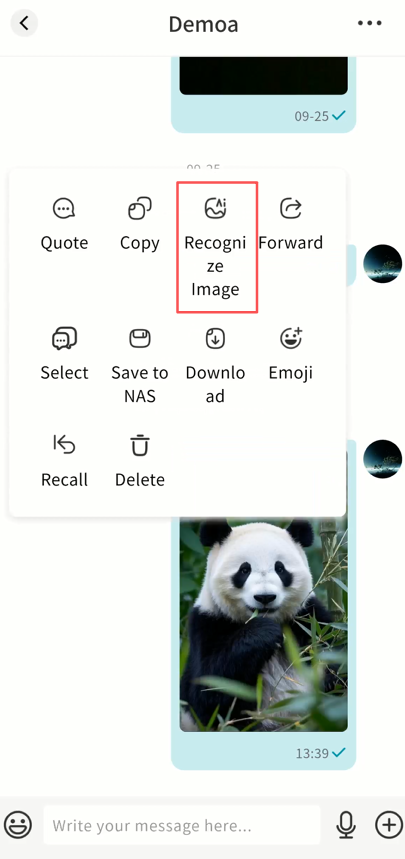

2.  Wait for the AI Agent to process.

3.  When finished, you'll see the AI-generated description of the image.

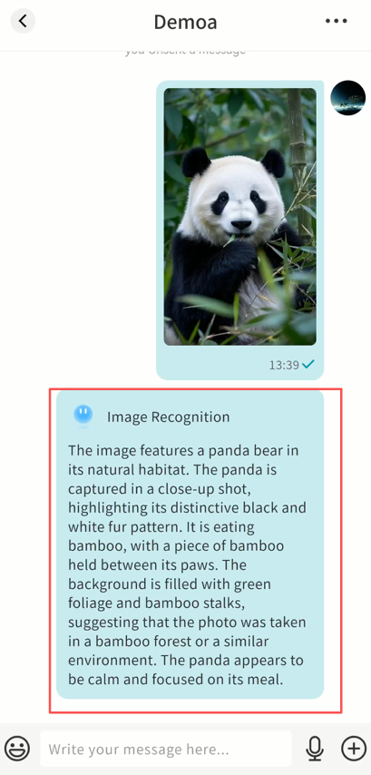

##  Supported Media File Formats in IM

The IM feature supports previewing media attachments. The supported
formats are as follows:

  -----------------------------------------------------------------------
  **Media type**          **Supported formats**
  ----------------------- -----------------------------------------------
  **Images**              JPEG/JPG、PNG、GIF、BMP、SVG、HEIC、RAW

  **Videos**              MP4、WebM、AVI、MOV、MKV

  **Audio**               MP3、AAC、OGG、WAV
  -----------------------------------------------------------------------

# Light NAS

Light NAS is a unique feature of DASSET that allows your Windows or
macOS computer to instantly act as a lightweight NAS. It enables
seamless file interaction between the DASSET client and your computer.
The key functions of Light NAS include:

- Instantly turn your computer into a personal cloud drive

- Designate directories on your computer for remote access

- Access your computer files securely, quickly, and from anywhere

##  Accessing Light NAS from Other Terminals

1.  On the **Discovery** page, tap **Connect** on the Light NAS icon.

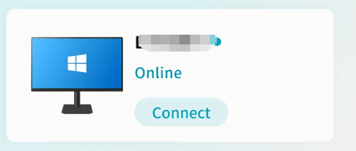

2.  Enter the Light NAS interface:

<!-- -->

1.  View configured directory list

2.  Access **Task Center** for upload/download progress

3.  Enter settings

##  **Viewing Device Information**

Tap the gear icon  **Set up** to see device name, owner account,
virtual domain name, virtual IP, and LAN IP.

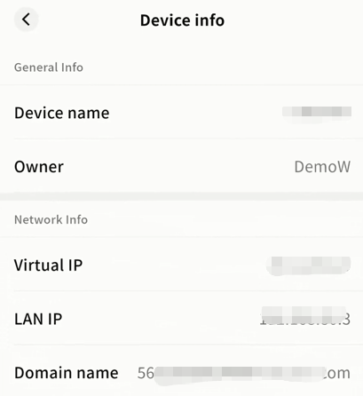

##  **Remote File Access**

On the Light NAS file manager, you can:

1.  Sort files by name, date, or size

2.  Access Task Center to monitor transfers

3.  Search files by keyword

4.  Enter settings

5.  Categorize files (images, videos, audio, documents, compressed
    packages)

6.  Switch between list and grid views

7.  Enable multi-select mode

8.  Browse the file list

9.  Open file menu for download, delete, rename, or details

10. Use the **+** button to upload files, upload photos/videos, or
    create new folders

# Notifications

All system notifications, including device binding operations and future
system messages, are displayed in the **Notifications** menu.

- Most notifications do not require action. You can mark them as
  **Read** by clicking the button in the top-right corner.

- When you receive a notification for a device binding request, decide
  whether to **Allow** or **Reject** based on the situation.

**Important:** Once you allow an account to bind to your DASSET edge
device, that account will have access to all data stored in your
**Public Space**. Be absolutely certain before clicking **Accept**.

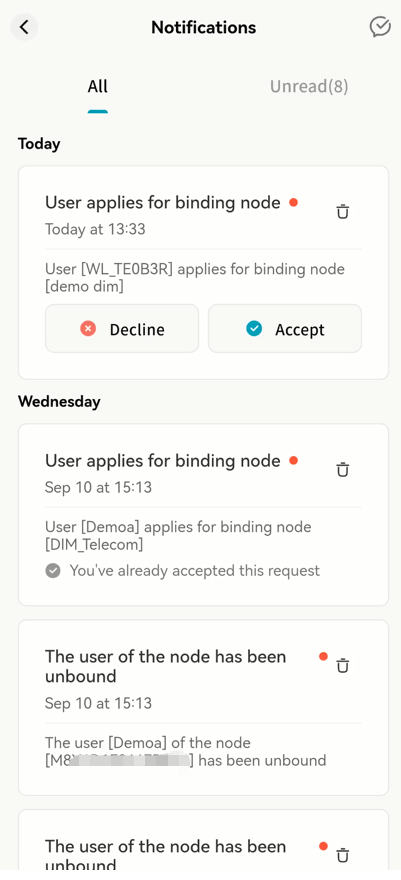

# Account

This section provides access to account information and client status
management for the DASSET mobile app.

1.  **Current Account and Nickname:** Displays the currently logged-in
    account and nickname.

2.  **Account Information:** View and edit account details.

3.  **Localhost Status:** Check client information on the current
    device.

4.  **About:** View the client version, check for updates, and access
    related information.

5.  **Submit Feedback:** Open the DASSET website to send feedback and
    suggestions.

6.  **Help Center:** Access the official DASSET documentation site.

7.  **Scan QR Code:** Scan QR codes generated by DASSET to receive
    shared files.

8.  **Notifications:** Open the notifications page to view system
    messages.

9.  **Settings:** Manage DASSET client configuration.

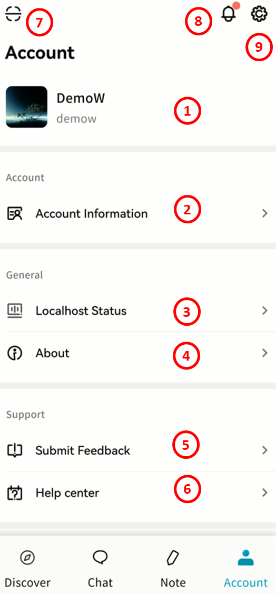

## Account

Displays your current account name, nickname, and avatar.

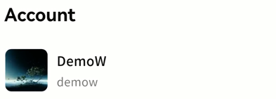

## Account Information

Click **Account Information** to manage your account details:

- **Change Avatar**: Select an image from your mobile device as your
  DASSET account avatar. The avatar will also be visible to your
  friends.

- **Nickname**: Set a display name that is easier for your friends to
  recognize.

- **Bind Email**: Link or update the email address associated with your
  account.

- **Bind Phone**: Link or update the phone number associated with your
  account.

- **Login Password**: Change your account password.

*Note: After adding or modifying your email, phone number, or password,
your account will be automatically logged out. Please log in again.*

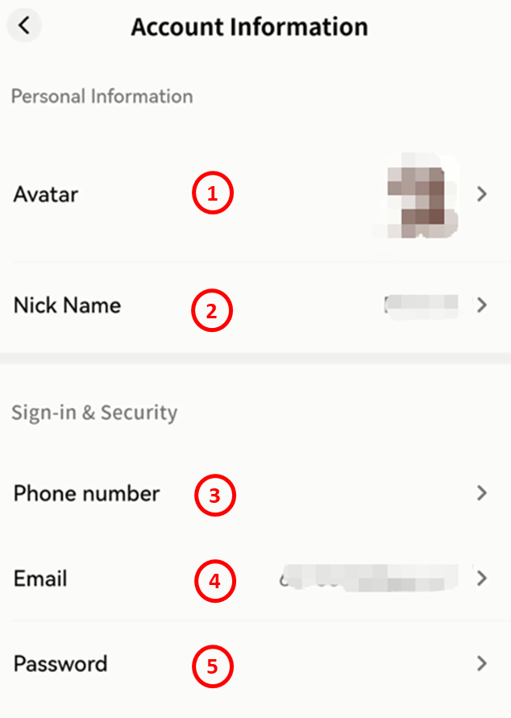

## Local Status

The Local Status page shows information about your current DASSET mobile
client:

1.  **Device Name:** Modify how your mobile device name is displayed in
    the client.

2.  **Current Network:** The name of the virtual network you are
    connected to.

3.  **Virtual Network IP:** The virtual IP address of your mobile
    device, used to communicate with DASSET edge devices over the SDVN
    virtual network.

4.  **LAN IP:** The LAN IP address currently configured on your mobile
    device.

5.  **Domain Name:** The unique virtual domain name of your mobile
    device within the virtual network.

6.  **Online Duration:** The current session duration.

7.  **Latency:** The latency of your virtual network connection.

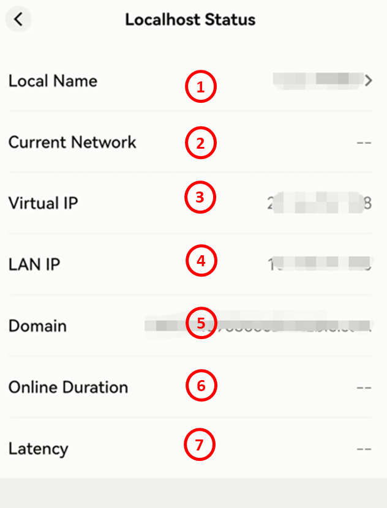

## About

View the DASSET client version number, check for updates, and access the
official website, privacy policy, and related information.

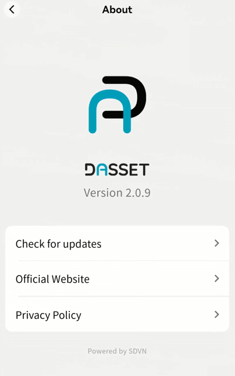

## Submit Feedback

Go to **Account  Submit Feedback**. The DASSET client will prompt you
to open a browser and access the contact page, where you can send
feedback to the DASSET team.

## Help Center

Go to **Account  Help Center**. The DASSET client will prompt you to
open a browser and access the DASSET Help Center, where you can view
official product documentation.

## Scan QR Code

Tap **Scan QR Code** to scan file-sharing codes sent by other users and
download the corresponding files to your DASSET edge device.

*For details, see the QR Code Sharing section.*

## Notifications

System notifications, including device binding and other future system
messages, are displayed in the Notifications menu.

Tap a notification to view details. *For more information, see the
Notifications section.*

## Settings

In the Settings page, you can configure:

1.  **Clear Cache:** Remove cached files stored on your mobile device to
    save storage space.

2.  **Language:** Change the display language of the client. By default,
    it follows the system language, but you can manually set it.

3.  **Advanced:** Define encryption protocols for communication between
    the client and DASSET devices.

4.  **Network Settings:** Configure how the client connects to DASSET
    devices.

5.  **Image Loading Settings:** Define how images are loaded in the
    client.

6.  **Switch Account:** Quickly switch between DASSET accounts
    previously logged in on the device.

7.  **Log out:** Log out of the current account.

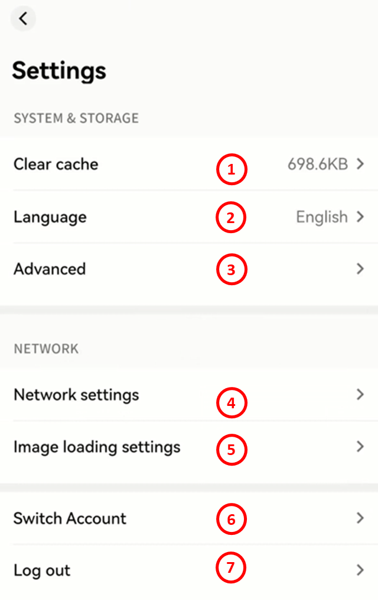

### Clear Cache

Go to **Settings  Clear Cache** to view the storage space used by
cached files. Tap to release the occupied space.

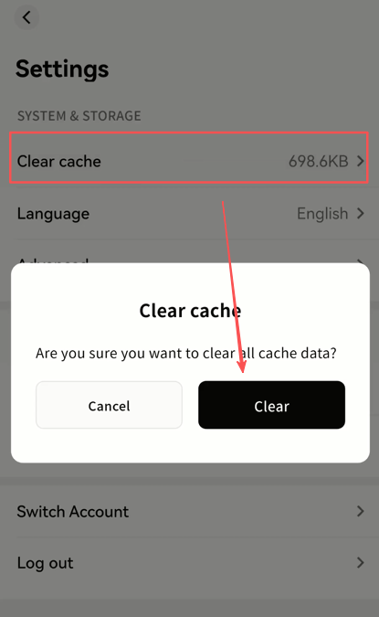

### Language

In the Language Settings page, select the preferred display language for
the client.

- If set to **Follow System**, the client interface will match your
  device's system language.

- Language options are continuously being expanded.

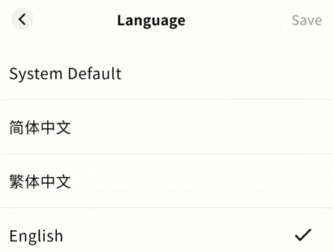

- You can also change the language from the login screen.

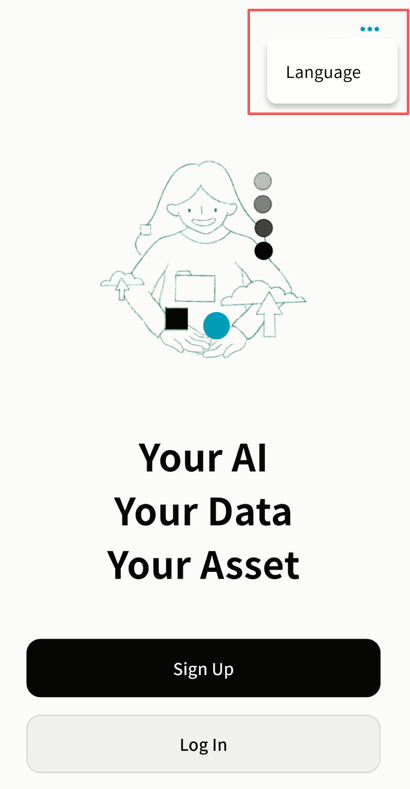

### Advanced Settings

In the Advanced Settings page, you can configure:

1.  **DLT**:

    - **On**: The client attempts direct channel communication with the
      device.

    - **Off**: Communication defaults to relay transmission.

2.  **Security Options**: Choose an encryption algorithm for data
    transmission.

    - **RC4**: Faster, but less secure.

    - **SHA256**: Slower, but more secure.

    - **No Encryption**: Not recommended.

3.  **Enable Logging**: Activate client logging. (Logs may be required
    by the DASSET support team for troubleshooting.)\
    *Note: The file path of log storage will be displayed for manual
    access when needed.*

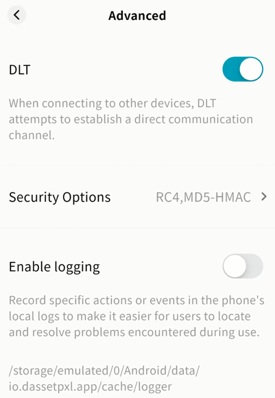

### Network Settings

Configure communication between the client and DASSET devices:

1.  **Blocking LAN Access**:

    - **On**: Communication is forced through the SDVN virtual network
      (more secure, slower).

    - **Off**: If the client detects that the device is on the same LAN,
      data is transmitted in plaintext over LAN (faster, less secure).

2.  **Allow uploads and downloads using mobile data**:

    - **On**: Data transfer occurs over both Wi-Fi and mobile data.

    - **Off**: Data transfer occurs only when the device is connected
      via Wi-Fi.\
      *Note: For large data transfers, it is recommended to turn this
      option off to avoid excessive mobile data usage.*

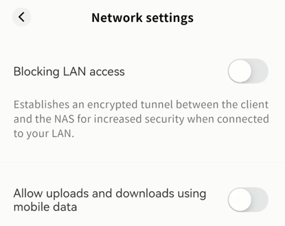

### Image Loading Settings

Options include:

- **Do not auto-load original images**: Only thumbnails are displayed by
  default.

- **Auto-load original images when on Wi-Fi**: Original images load
  automatically when connected to Wi-Fi.

- **Always auto-load original images**: Original images always load.

*Note: Choosing "Always auto-load original images" in non-Wi-Fi
environments may result in significant mobile data usage.*

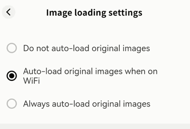

### Switch Account

Switch accounts without logging out. Select from previously logged-in
accounts on the current device.

### Log out

Two options are available:

- **Log out Only**: Exit the account without removing saved credentials.
  You can log in again quickly via account switching.

- **Log out and forget account**: Exit the account and remove stored
  credentials. You will need to re-enter account and password for future
  logins.

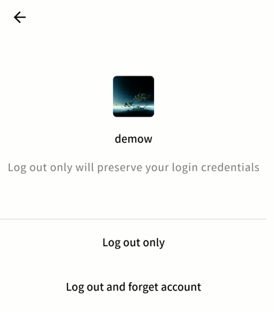

DASSET provides information that is believed to be accurate and
reliable; however, DASSET assumes no responsibility for the use of this
information, or for any infringement of third-party patents or other
rights that may result from such use. No license is granted by
implication or otherwise under any DASSET patents or patent rights.
DASSET reserves the right to modify this statement at any time without
prior notice.

Apple, Mac, macOS, iOS, OS X, and Time Machine are trademarks of Apple
Inc. App Store is a service mark of Apple Inc. Baidu Netdisk is a
trademark of Baidu. Aliyun is a trademark of Alibaba. Dropbox is a
trademark of Dropbox. OneDrive is a trademark of Microsoft. Wi-Fi is a
registered trademark of Wi-Fi Alliance®. Android and Google Play are
trademarks of Google Inc. All other trademarks are the property of their
respective owners.

© 2025 DASSET. All rights reserved.
