# Windows & macOS

# Introduction

This document is intended to help users quickly understand the full
functionality of DASSET.

As the actual features available may vary depending on the specific
hardware device in use, please refer to the functions displayed when
accessing the device through DASSET.

Not all hardware devices supporting DASSET necessarily provide all the
features mentioned in this document.

With ongoing version updates, the features and pc-images described herein
may differ from the actual product. Please always refer to the functions
displayed in the DASSET App for the most accurate information.

# DASSET Overview

## What is DASSET

The DASSET App is a cross-platform application designed to provide
intelligent storage, collaborative communication, and AI Agent services
for small and medium-sized enterprises, families, individuals, and
teams.

Through seamless integration with a wide range of DASSET-supported
products and devices, the DASSET App enables true data freedom, allowing
users to break free from third-party restrictions and maintain full
control over their data and AI resources.

## DASSET Features

- **Cross-platform support**: Available for Windows, macOS, iOS, and
  Android, ensuring a consistent user experience across different
  devices.

- **Access DASSET devices anytime, anywhere**: Users can remotely access
  and manage their DASSET hardware devices from any location via the
  DASSET App.

- **Unified cross-platform experience**: Provides a consistent interface
  and operational logic across operating systems and devices, reducing
  the learning curve.

- **Data synchronization and backup**: Supports data synchronization and
  backup between DASSET hardware devices and end-user devices, ensuring
  data security and availability.

## Application Scenarios

- **Personal data management**: Synchronize and back up personal data
  across multiple devices to ensure data integrity and security.

- **Family data sharing**: Share photos, videos, and other files among
  family members to enhance interaction and communication.

- **Team collaboration**: Serve as an internal file sharing and
  collaboration platform for small teams or startups to improve
  efficiency.

# Installation and Download

## DASSET Download Links

Download from the DASSET official website: \[[Click to
Download](https://dassetai.ai/download/dasset.html)\]

## System Requirements

- **DASSET Windows version**: Supports Windows 10 or later

- **DASSET macOS version**: Supports macOS 11 or later

## Multi-language Support

DASSET currently supports Simplified Chinese, Traditional Chinese, and
English.

## Installation and Execution

### Windows Version

After the download is complete, run the "DownloadedFile.exe" to install.

When running DASSET, since file synchronization and related services
need to be launched, please click **Allow** in the Windows prompt to
ensure proper functionality of all features.

### macOS Version

After the download is complete, double-click the "DownloadedFile.dmg"
file, then drag the DASSET application icon to the macOS
**Applications** folder shortcut. macOS will begin copying the
application.

**Note**: Before installing DASSET, please allow apps from any source on
your Mac.

Steps:

1.  Open **System Preferences**: Click the Apple icon in the top-left
    corner and select *System Preferences*, or press **Command + Space**
    to search and open.

2.  Go to **Security & Privacy**: Click the Security & Privacy icon,
    then click the lock icon in the bottom left corner and enter the
    administrator password to unlock.

3.  Select **Allow apps from Anywhere**: Under the *General* tab, locate
    *Allow apps downloaded from* and choose **Anywhere**, then confirm.

# Registration and Login

When using DASSET for the first time, you will need to create an
account.

DASSET supports both mobile phone numbers and email addresses as account
credentials.

*Note: The current DASSET version does not allow mobile phone number
registration.*

If you forget your password, you can easily reset it on the DASSET login
page by using the mobile phone number or email address registered with
your account.

## Registration

DASSET supports two registration methods: mobile phone number and email.

To register, click the **Register** button on the login page and follow
the instructions to complete the account setup.

**Note 1**: Due to security settings of certain email service providers,
DASSET registration emails may be incorrectly classified as spam. If you
do not receive the DASSET verification code email, please check your
spam folder.

## Password Reset

If you forget your DASSET login password, click **Forgot Password** on
the login page and follow the on-screen instructions to reset your
password.

**Note 2**: DASSET does not impose strict restrictions on password
strength, allowing you to decide the level of security.

However, for the protection of your account, it is strongly recommended
that you set a strong password to minimize privacy risks.

## Login

DASSET supports login via both email and mobile phone number.

Enter the email or phone number you registered with, along with your
password, then click **Login** to proceed.

You may also click the dropdown arrow next to the account input field to
select a previously used account (if saved) and log in directly.**Note 2**: DASSET does not impose strict restrictions on password
strength, allowing you to decide the level of security.

However, for the protection of your account, it is strongly recommended
that you set a strong password to minimize privacy risks.

## Quick Login with Google Account

You can log in to DASSET with one-click authorization using your Google
account, without the need to register.

1.  On the DASSET login page, click the **Google** icon.

2.  DASSET will open a browser and redirect to the Google verification
    page. Enter your Google account and click **Next**.

3.  Enter your Google account password and click **Next**.

4.  Wait for verification. When the page shown below appears, it
    indicates that Google verification has been successfully completed.

1.  After verification, wait for DASSET to automatically complete the
    login process.

# DASSET Home Page

## Device List Page

After completing the login process, you will enter the DASSET Home Page.

On this page, a list of all available DASSET devices associated with
your account will be displayed. From here, you can:

- View connected devices and their status.

- Select a device to access its functions and manage files.

- Quickly switch between multiple devices for centralized control.

The Device List Page serves as the primary entry point for managing your
DASSET hardware.

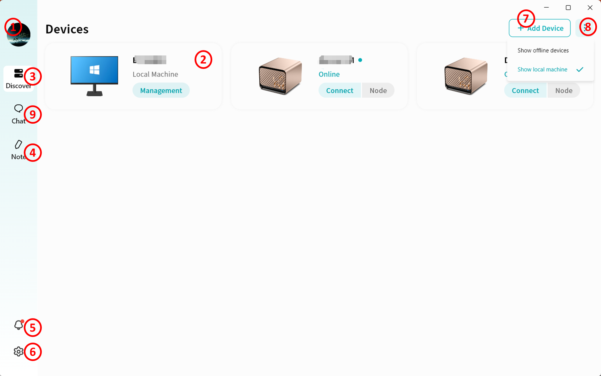

1.  **Account Avatar**: Allows you to switch to another account or log
    out of the current account.

2.  **Device List**: Displays all devices bound to your account,
    including both your own devices and those shared with you by others.
    The list clearly shows whether each device is online or offline.

- **Online/Offline status**

- **Connect**: Click to access the selected device.

- **Node**: Click to use this DASSET device as a *relay node* for
  accessing the Internet. *Note: The node option only appears if the
  corresponding feature is enabled on the device.*

> **Node Function**
>
> The node function is a unique feature of DASSET. It allows you to use
> a DASSET device as a relay node for Internet access.
>
> When enabled, all communication data between you and the Internet will
> be relayed through the selected DASSET device.
>
> This is particularly useful when you require a more secure Internet
> connection. For example, while away from home, if you need to access
> online banking, you can enable the node function to encrypt your
> banking sessions and avoid the security risks of public Wi-Fi.

3.  **Device List Shortcut Button**: Click this icon from anywhere in
    DASSET to return to the device list page.

4.  **Notes**: Use DASSET's Notes feature to create, edit, and delete
    notes, while keeping them synchronized between your computer and
    DASSET devices.

5.  **Notifications**: View device binding notifications here, including
    binding, unbinding, and binding requests.

6.  **Settings**: Configure DASSET desktop client settings.

7.  **Add Device**: Enter a share code to bind another user's DASSET
    device.

8.  **Show All/Online Devices**:

- Select **Show All Devices** to display all bound DASSET devices,
  whether online or offline.

- Select **Show Online Devices** to display only devices currently
  online and accessible.

9.  **Chat**: Enter the chat function to communicate in real time with
    other users on the same DASSET device. All chat records are stored
    locally on that DASSET device.

## DASSET Edge Device Home Page

After clicking the **Connect** button for a device, you will enter the
DASSET Edge Device Home Page.

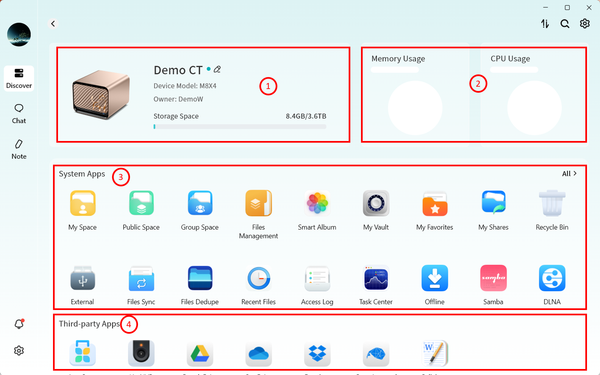

1.  **Device Status will display:**

- Device name (click to edit remarks)

- Device model

- Device owner account

- Storage usage

2.  **Hardware Performance Monitoring**

- CPU usage

- Memory usage

3.  **System Applications**

- Displays built-in DASSET system application icons. Click an icon to
  open the corresponding application page.

4.  **Thrid-party Applications**

- Displays third-party applications available for installation on
  DASSET. Click an icon to install and use as needed.

# DASSET Device Binding and Unbinding

## Add Device

You can click the **Add Device** button on the DASSET home page and
enter an invitation code to bind a DASSET device shared by others.

### Methods of Adding Devices

"Add Device" supports two methods:

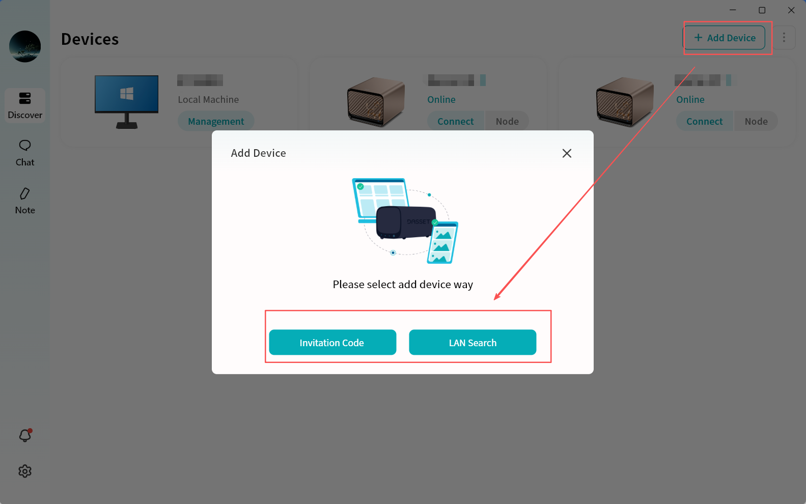

- **Invitation code**: Enter the invitation code shared by another user
  to complete binding with their DASSET device.

- **LAN search**: Search for all DASSET devices on the same local
  network as your terminal and bind them.

### Add Device via Invitation Code

1.  Enter the **Invitation Code** provided by another user (usually an
    8-character string).

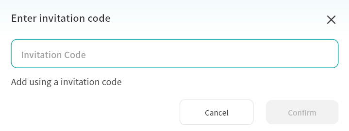

2.  Click **Apply for Binding**.

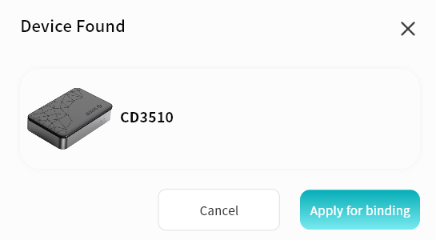

> *If the selected device requires owner approval, the binding will only
> be completed after confirmation by the owner.*

3.  Once binding is completed, the device will appear in your device
    list.

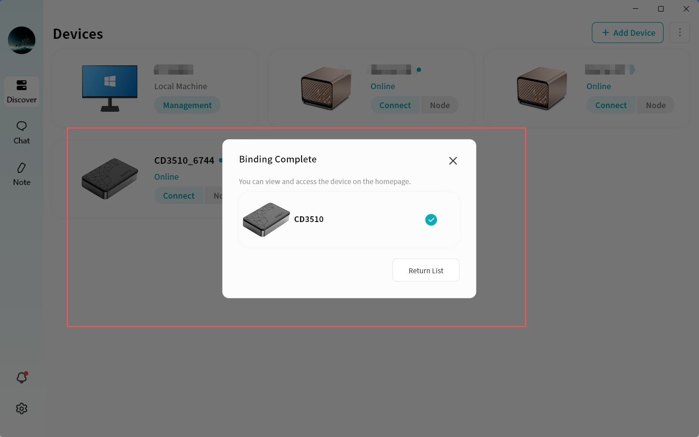

4.  Click the **Connect** button on the device icon to access the
    device.

### Add Device via LAN Search

1.  Click **Add Device  LAN Search**.

2.  From the search results, select the desired device and click **Bind
    This Device** to complete binding.

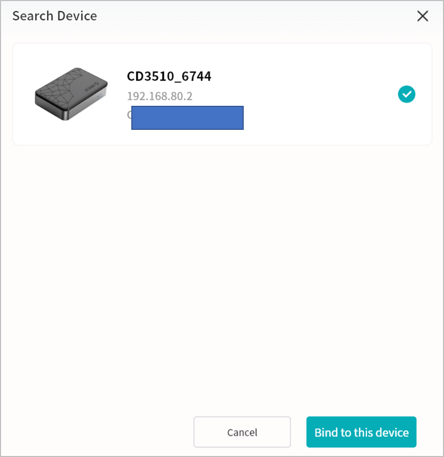

> *Note: If the selected device is already bound to another user, LAN
> search binding will not be available.*

3.  Assign a custom name to the device for easier identification.

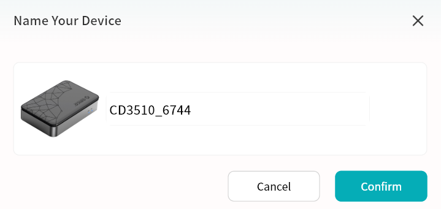

4.  After binding, click the device to enter its home page.

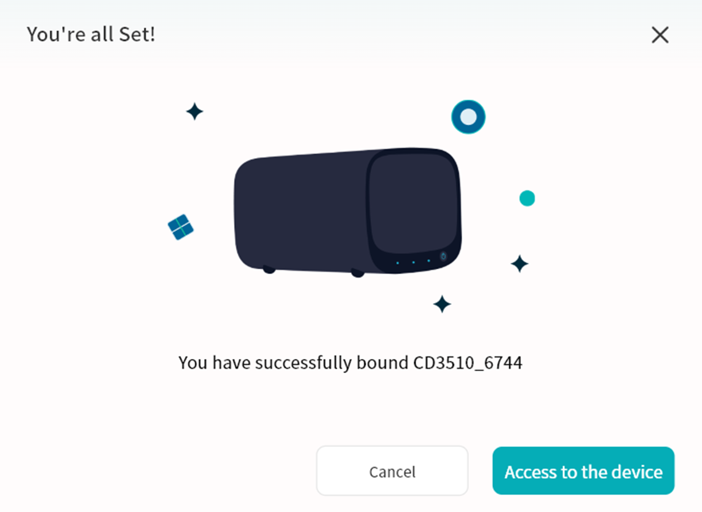

## Device Unbinding

### Owner Unbinding

The owner can unbind their DASSET edge device. After unbinding, all
users on this hardware device will be automatically unbound.

1.  Enter the device home page and click the upper-right corner
    .

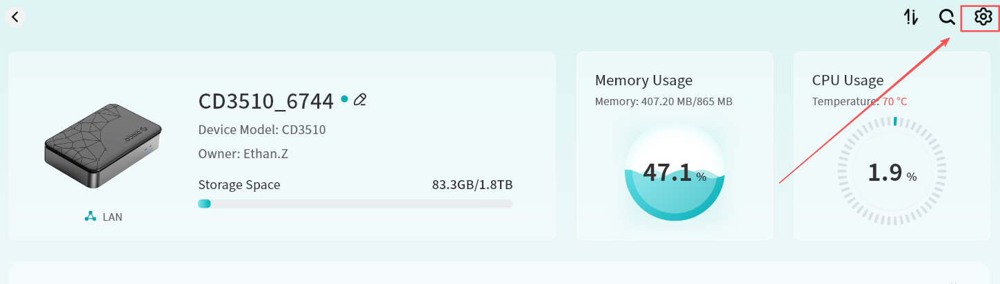

2.  On the Device Management page, click **Device Unbinding**.

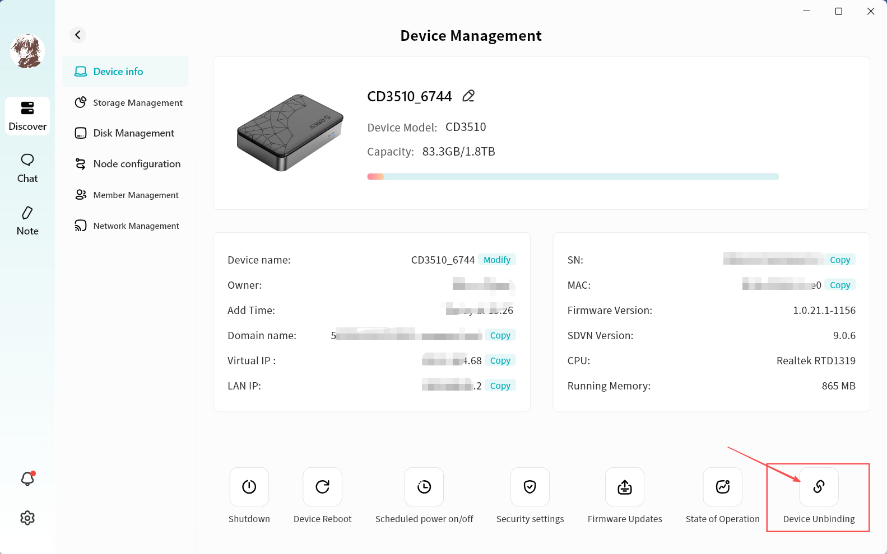

3.  As the owner, you will receive an unbinding warning.

    - If you do not wish to remove all members, you can transfer
      ownership to another member before unbinding.

    - If you decide to proceed, click **Remove All Members**.

    - Ownership can be transferred to another member via Member
      Management.

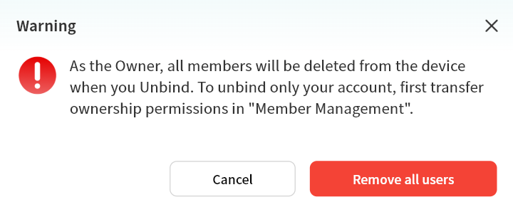

4.  In the pop-up window, enter your DASSET account and password.

    - If you no longer need the data stored on this device, it is
      strongly recommended to check **Erase Personal Hard Disk Data at
      the Same Time**.

    - Once selected, after your account is unbound from the DASSET edge
      device, all data in *My Space* will be automatically deleted to
      protect your privacy.

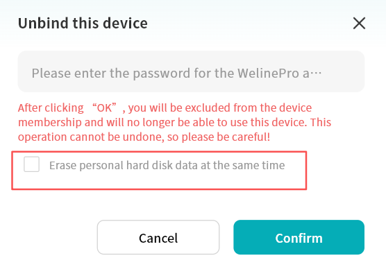

### Member Unbinding

You can unbind from a device at any time. After unbinding, the device
will no longer appear in your device list.

1.  Enter the device home page and click the upper-right
    corner.

2.  On the Device Management page, click **Device Unbinding**.

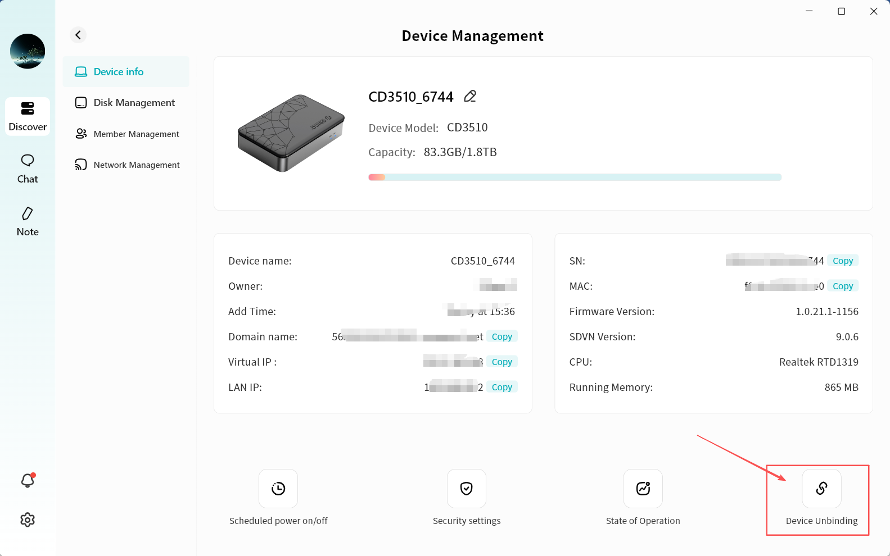

3.  In the pop-up window, enter your DASSET account and password.

    - If you no longer need the data stored on this device, it is
      strongly recommended to check **Erase Personal Hard Disk Data at
      the Same Time**.

    - Once selected, after your account is unbound from the DASSET edge
      device, all data in *My Space* will be automatically deleted to
      protect your privacy.

## Device Offline

When the device is offline, you can perform the following operations:

1.  **Device Information**

- View basic device information, including device name, remarks
  (editable), device owner, add time, and device SN.

- Unbind from the device.

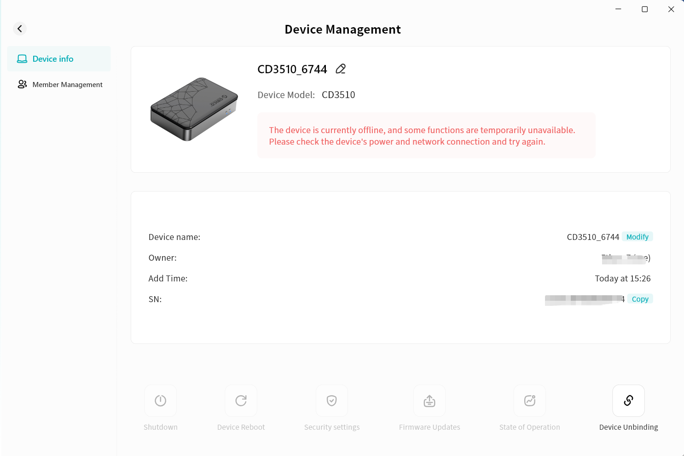

2.  **Member Management**

- View accounts currently bound to the device.

- Promote a regular member to administrator.

- Demote an administrator to regular member.

- Remove a member.

For detailed instructions, please refer to the *Member Management*
section.

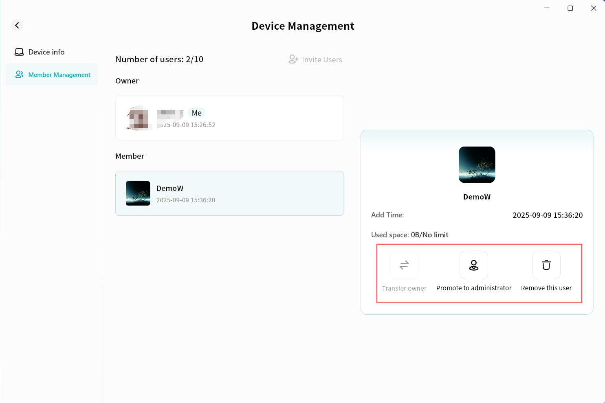

# Device Initialization

If you are binding a DASSET edge device for the first time, you must use
the DASSET mobile client to scan the QR code on the device to complete
the binding.

After binding, when you enter the device for the first time, you will be
prompted to perform a hard disk format:

1.  Insert the hard disk into your DASSET edge device.

2.  From the **Discover**, click your device to enter.

3.  You will see a format prompt. Click **Confirm**.

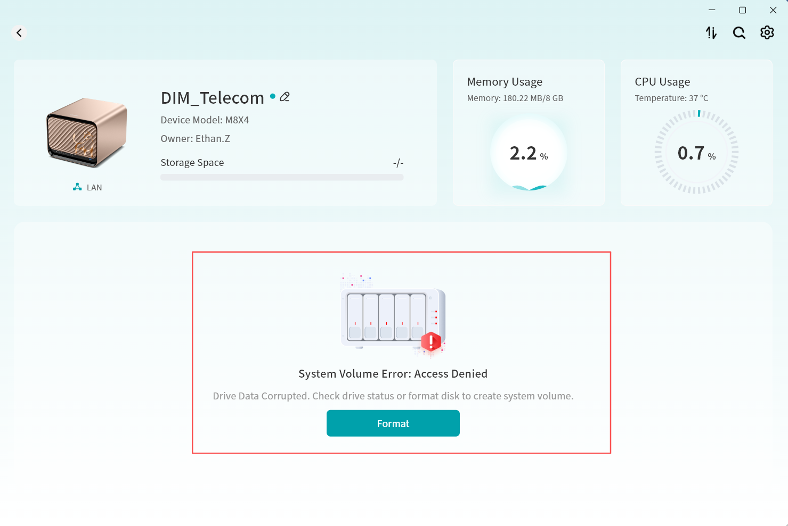

4.  The DASSET client will redirect to **Device Management  Disk
    Management**. Click **Format and Rebuild System Volume**.

    - Select the disks you wish to format and the desired disk format,
      then click **OK**.

    - Disk format options include:

      - **Normal Mode**: Basic mode; available capacity equals the sum
        of all disks, with no redundancy.

      - **RAID 0**: Optimized read/write performance; available capacity
        equals the sum of all disks, with no redundancy.

      - **RAID 1**: Two disks required; available capacity equals the
        smaller of the two disks, with redundancy.

      - **RAID 5**: Minimum of three disks; available capacity equals
        the combined capacity of two data disks, with redundancy.

    - The disk format page will display the estimated capacity based on
      the chosen mode.

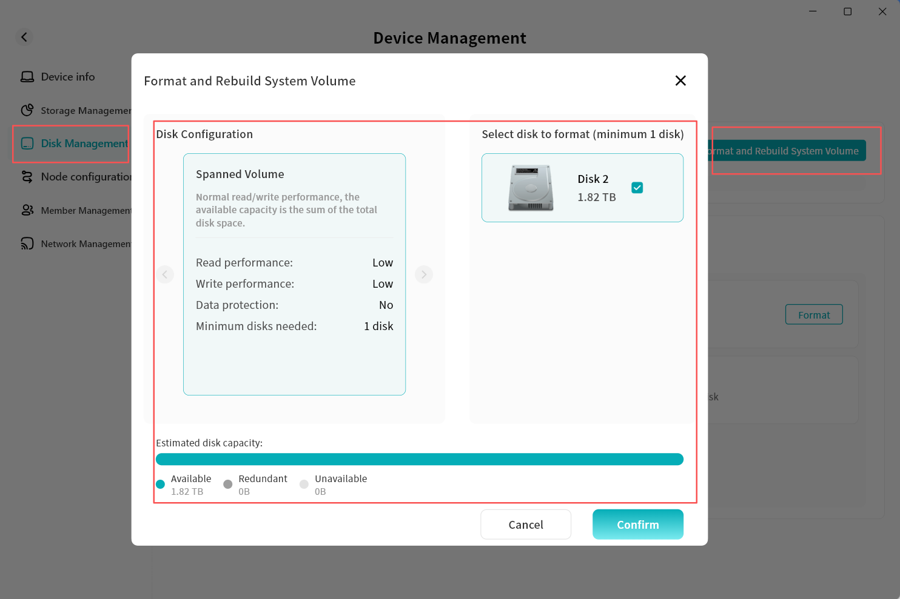

5.  The system will begin formatting. Please wait patiently.

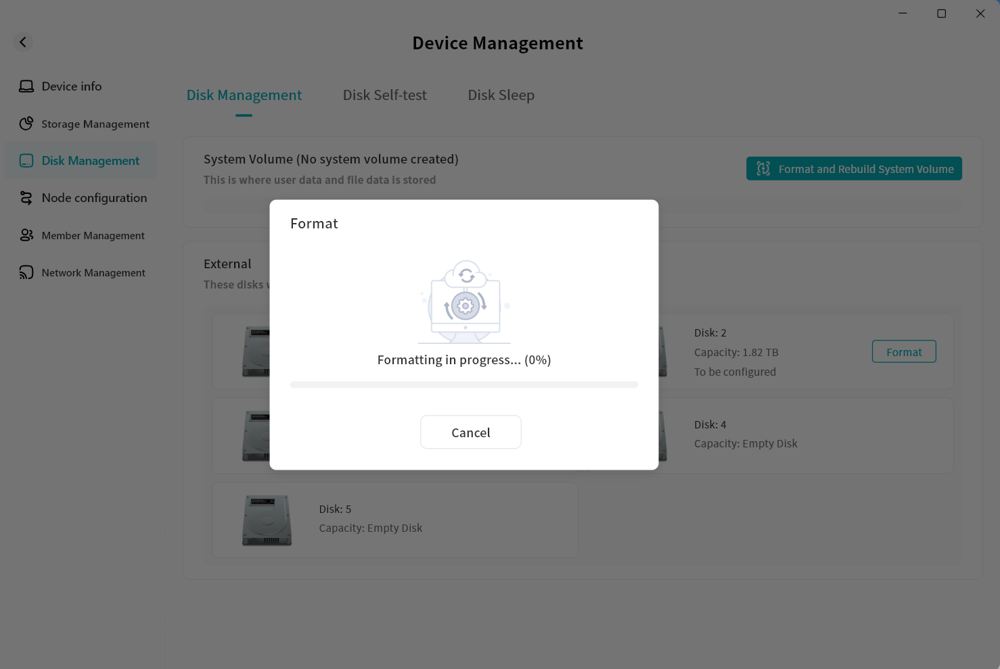

6.  Once formatting is complete, a confirmation message will appear.
    Click **OK** to start using your DASSET edge device.

# Device Management

## Device Management Overview

All management of DASSET edge devices is centralized on the **Device
Management** page, which mainly includes the following functions:

- **Device Info**: Displays device software and hardware information,
  with quick access to operations such as shutdown.

- **Storage Management**: Shows storage usage details.

- **Disk Management**: Manages inserted hard drives and supports
  operations such as formatting.

- **Node Configuration**: Configures node information, allowing you to
  use this device as a *relay node* to access the Internet or resources
  within the device's local network.

- **Member Management**: Manages all members on the device and invites
  others to join the device.

- **Network Management**: Configures device network settings.

## Device Info

The **Device Info** page primarily displays the device's basic details
and provides quick access to functions such as shutdown:

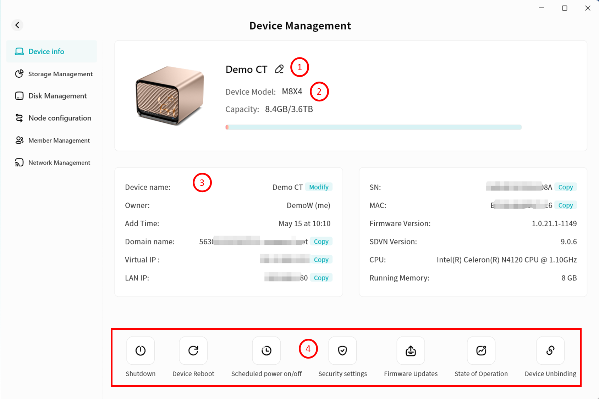

1.  **Edit Device Remarks:** After modification, the updated device name
    will appear on the device list and home page.

- Remarks help you distinguish between multiple devices more clearly.

- Remarks are visible only to you.

2.  **Device Model and Capacity Information**: Displays the device model
    and an overview of storage usage.

3.  **Device Basic Information:** Centralized display of all
    device-related details, including:

- **Device Name**: Editable only by the device owner.

- **Owner**: Displays the account nickname of the current device owner.

- **Added Time**: Shows the date the device was bound.

- **Domain Name**: Displays the device's virtual domain URL within the
  DASSET virtual network.

  - When logging in to DASSET, you can connect to the device using the
    domain name or virtual IP.

  - *The virtual domain is static and will not change once assigned.*

  - **Security**: Only users bound to the device can connect via the
    virtual domain. Other DASSET accounts cannot.

- **Virtual Network IP**: The IP address assigned to the device within
  the DASSET virtual network.

  - This IP is dynamic.

  - **Security**: Only users bound to the device can connect via the
    virtual IP. Other DASSET accounts cannot.

- **LAN IP**: The device's IP address within the local network.

- **Device Model**: Factory model defined by the manufacturer.

- **SN**: The device's unique serial number.

- **MAC**: The MAC address of the device's network interface card.

- **Firmware Version**: Current firmware version number.

- **SDVN Version:** Current SDVN version number.

- **CPU**: Device CPU model.

- **RAM**: Device memory size.

4.  **Quick Functions**: Includes shortcuts for shutdown, unbinding, and
    other operations.

### Shutdown

This function is available only to owner and administrator accounts.

Click the **Shutdown** button at the bottom of the Device Information
page to remotely power off the DASSET edge device.

**Note**: If your DASSET edge device does not support remote startup,
there are only two ways to restart it after shutdown:

- **Method 1**: Disconnect and reconnect the power supply (requires
  device support for power-on after power recovery).

- **Method 2**: Manually press the device's power button to restart.

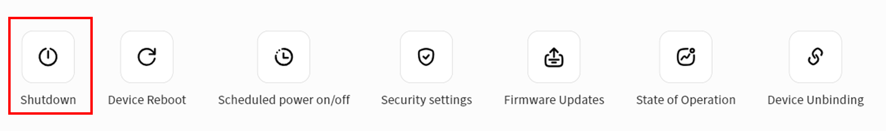

### Device Reboot

This function is available only to owner and administrator accounts.

Click the **Device Reboot** button at the bottom of the Device
Information page to remotely restart the DASSET edge device.

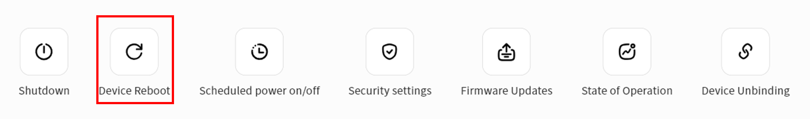

### Scheduled Power On/Off

This function is available only to owner and administrator accounts.
Regular users can only view the scheduled rules.

Click the **Scheduled Power On/Off** button at the bottom of the Device
Information page to set your DASSET edge device to enter sleep mode at
specified times.

Steps to configure:

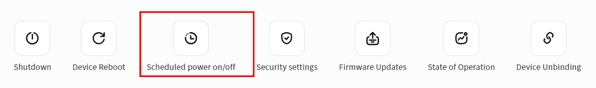

1.  Go to **Device Management  Device Information  Scheduled Power
    On/Off**, then click **Enable Scheduled Power On/Off**.

2.  Set the specific rules:

    - **System Time**

    - **Time of power off/on**: Set the scheduled shutdown and startup
      times. You can either input the exact time or adjust in hourly
      increments using the up/down arrows.

    - **Repeat**: Set the repeat schedule for the rule to take effect.
      Options include *Everyday,* *Weekdays*, *Weekends*, or *Custom*
      days of the week.

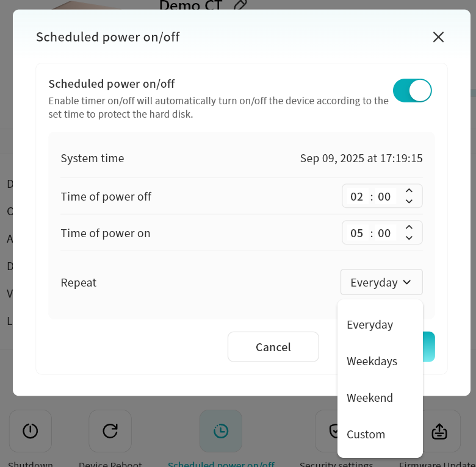

3.  If you no longer wish to use **Scheduled Power On/Off**, simply
    disable the option.

### Security Settings

Click the **Security Settings** button at the bottom of the Device
Information page to enter the Security Settings page.

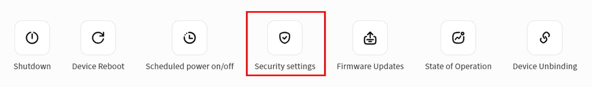

- **Show Hidden Files and Folders**: When enabled, all hidden files and
  folders will be visible in the File Management page.

- **Personal Password**: When enabled, a password must be entered to
  access the device.

- **Public Space Password**: When enabled, a password must be entered to
  access data in the public space.

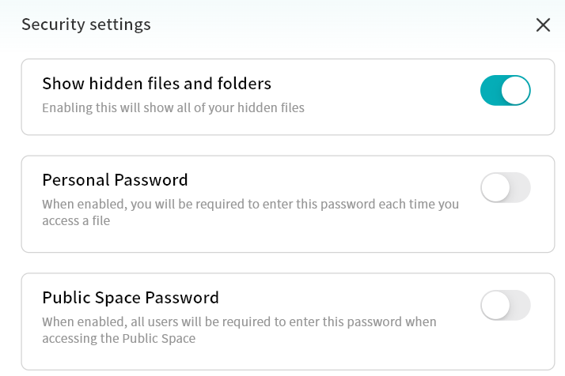

#### Show Hidden Files and Folders

If you have hidden certain files and wish to access them again, you can
enable **Show Hidden Files and Folders** to display hidden files/folders
in the File Management page.

#### Personal Password

##### Set Personal Password

1.  On the Device Information page, click **Security Settings** and
    enable **Personal Password**.

2.  In the pop-up input box, enter a password to complete the setup.

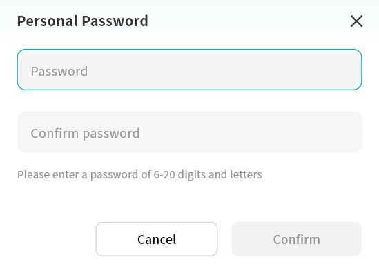

##### Enter Personal Password to Access Device

After setting a personal password, you will be prompted to enter it when
accessing the device home page.

Only after entering the correct password can you access the device.

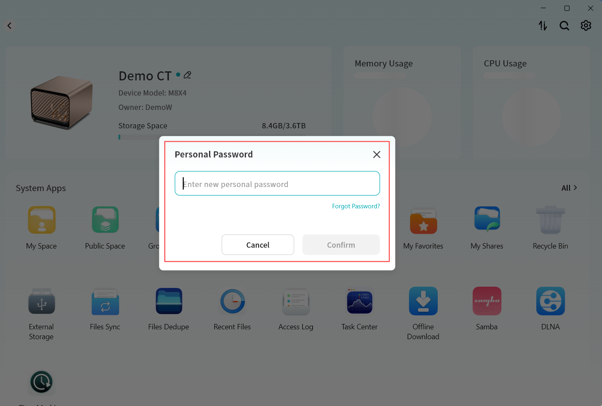

##### Change Personal Password

1.  To change the personal password, go to **Device Information 
    Security Settings  Personal Password** and click **Change
    Password**.

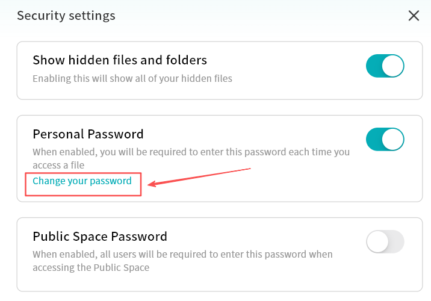

2.  In the pop-up window, enter the current personal password to verify
    your identity.

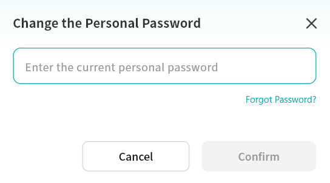

3.  Enter the new password to complete the change.

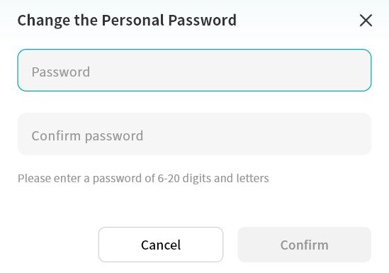

##### Forgot Personal Password -- Recovery

1.  In the personal password input or change password window, click
    **Forgot Password**.

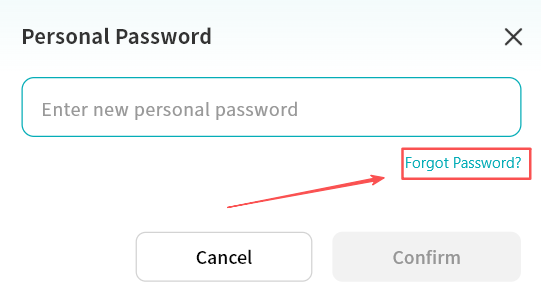

2.  Enter the email address or mobile phone number bound to your DASSET
    account.

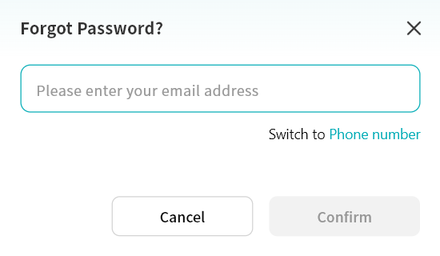

3.  Enter the correct verification code.

4.  After verification, set a new personal password in the new password
    window.

#### Public Space Password

**This function is available only to owner and administrator accounts.**

##### Set Public Space Password

1.  On the Device Information page, click **Security Settings** and
    enable **Public Space Password**.

2.  In the pop-up input box, enter a password to complete the setup.

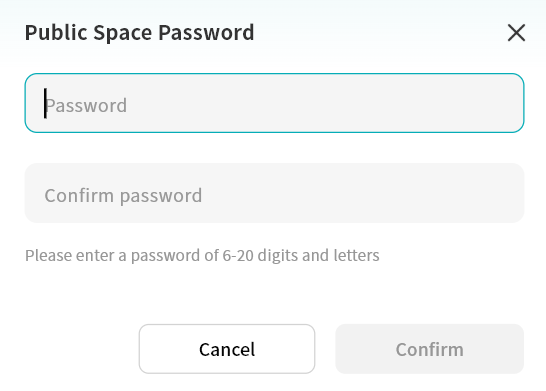

##### Enter Password to Access Public Space

When attempting to enter a password-protected public space, you will be
prompted to input the correct password before access is granted.

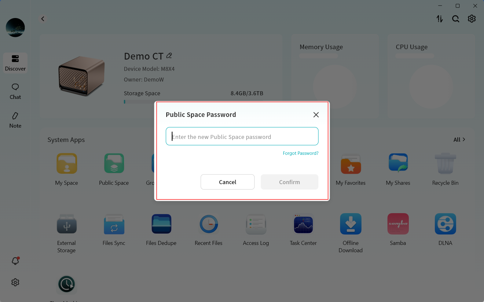

##### Change Public Space Password

1.  To change the public space password, go to **Device Information 
    Security Settings  Public Space Password** and click **Change
    Password**.

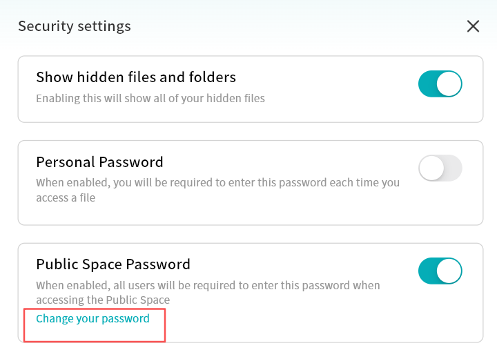

2.  In the pop-up window, enter the current public space password to
    verify your identity.

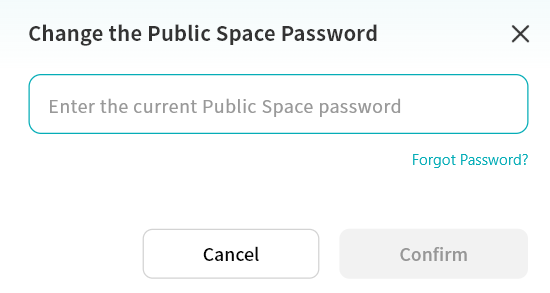

3.  Enter the new password to complete the change.

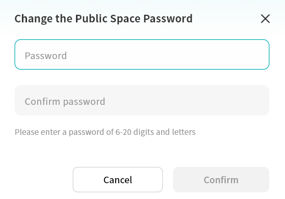

##### Forgot Public Space Password -- Recovery

This recovery function is available only to owner and administrator
accounts.

1.  In the public space password input or change password window, click
    **Forgot Password**.

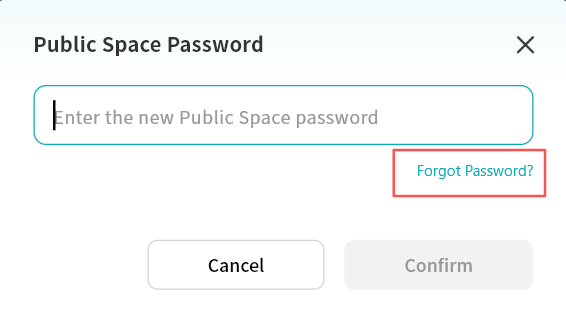

2.  Enter the email address or mobile phone number bound to your DASSET
    account.

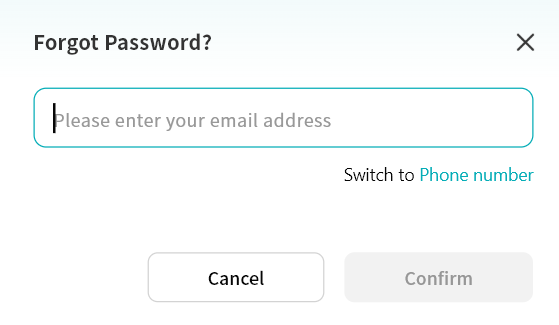

3.  Enter the correct verification code.

4.  After verification, set a new public space password in the new
    password window.

### Firmware Upgrade

This function is available only to owner and administrator accounts.

Firmware upgrades are provided in two ways:

- **Method 1**: Automatic check with client update notifications

- **Method 2**: Manual check for updates

#### Method 1: Automatic Firmware Update Notification

When a new firmware version is detected for the DASSET edge device, the
DASSET client will automatically display a **Firmware Update** prompt
upon entering the device home page.

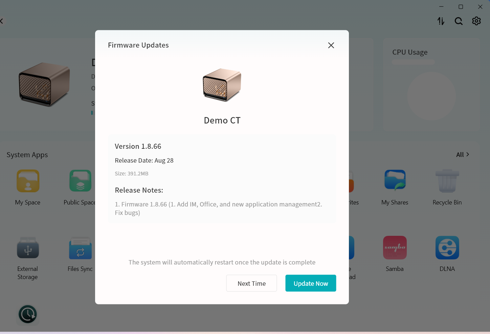

The system checks for updates every 8 hours. If a new version is found,
you will be notified at login.

- Click **Update Now** to begin the upgrade.

- If you prefer not to upgrade immediately, click **Next Time** to
  postpone the update.

#### Method 2: Manual Check for Updates

Click the **Firmware Upgrade** button at the bottom of the Device
Information page to manually check for available firmware updates.

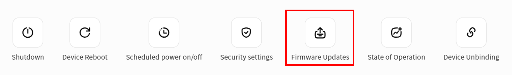

- If a firmware upgrade is detected, a small red dot will appear on the
  **Firmware Upgrade** option, indicating a pending update compatible
  with your device.

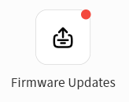

**Firmware upgrade steps:**

1.  Click **Device Information  Firmware Upgrade**.

2.  Check for updates:

    - If an update is available, the upgrade page will display the
      firmware version, release date, and detailed update information.

    - If no update is available, a message will confirm that the device
      is up to date.

3.  Click **Update Now**. The system will automatically download and
    install the firmware. Please wait patiently.

    - **Important**: Do not power off or restart the device during the
      upgrade process to avoid firmware failure or device malfunction.

4.  After the upgrade is complete, the device will restart
    automatically. You will receive a device offline notification, and
    once the restart finishes, the device will appear online again in
    your device list.

### State of Operation

This function is available only to owner and administrator accounts.

Click the **Running Status** button at the bottom of the Device
Information page to view the current operating status of the device.

On the Running Status page, you can monitor the following information:

1.  Memory usage

2.  CPU usage

3.  Device traffic, including upload and download speed

4.  Hard disk temperature, showing the operating temperature of inserted
    disks

5.  Fan speed, showing the rotation speed of the device's built-in
    cooling fan

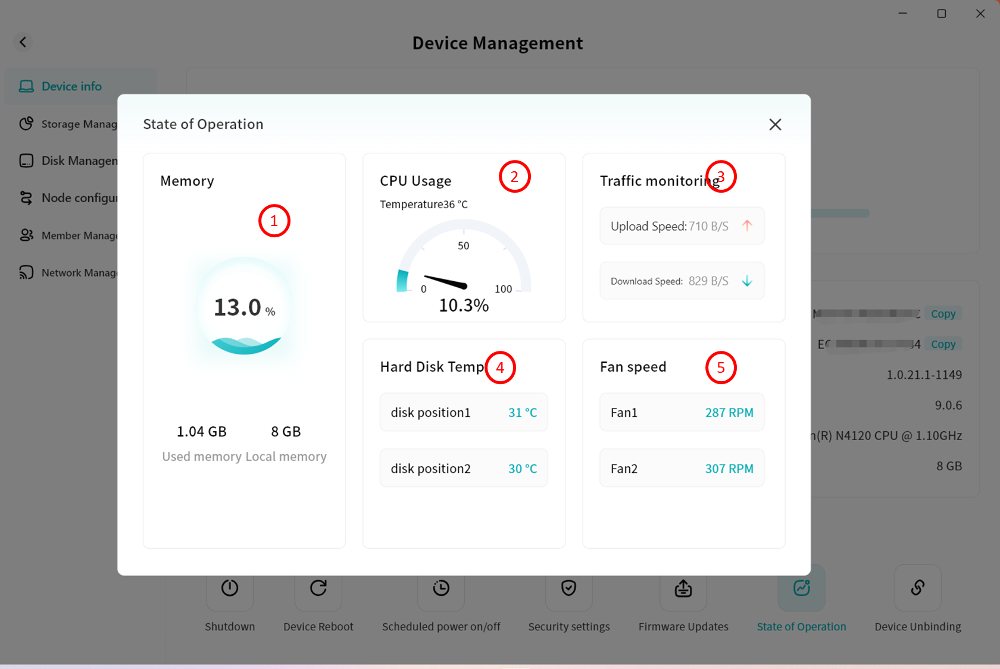

### Device Unbinding

Click the **Unbind Device** button at the bottom of the Device
Information page to remove the binding with this DASSET edge device.

For detailed steps, please refer to the *Device Unbinding* section.

## Storage Management

In **Storage Management**, you can view the overall storage usage of the
current DASSET edge device:

1.  **Total Storage Usage**

- Total hard disk capacity

- Current used disk space (all users combined)

- Total disk space used by *My Space* (all users combined)

- Total disk space used by *Public Space* (all users combined)

- Total disk space used by *Group Space* (all users combined)

- Total disk space used by *Other Space* (including My Vault, Recycle
  Bin, thumbnails, etc.)

- Total available space

2.  **Per-User Storage Usage**

> Displays the total storage space used by each user.

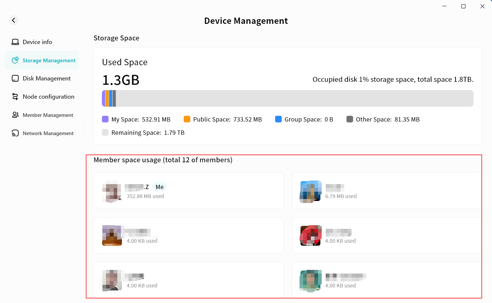

3.  **Abnormal Member Space** (clean up and release storage used by
    unbound members)

> In the member storage usage view, you may see a mark on certain member
> space cards.
>
> This indicates that the member has already unbound from the device,
> but did not select **Delete Data** during unbinding.

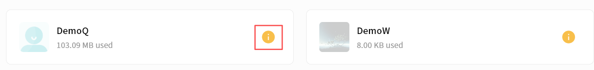

You can click the marked option to clean up and release the storage
space occupied by these unbound members.

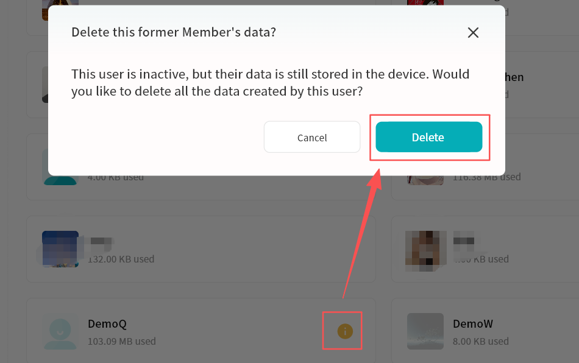

## Disk Management

In **Disk Management**, you can view information about all hard drives
currently inserted into the DASSET edge device and configure them
accordingly.

1.  **Disk Management**: Configure system volumes, format disks, and
    display disk capacity and status.

2.  **Disk Self-Check**: Inspect the health status of the disks.

3.  **Disk Hibernation**: Configure hard drive sleep mode.

4.  **Format and Rebuild System Volume**: Reformat all or selected hard
    drives with a new disk format.

5.  **System Volume Status Display**: Show the current status of the
    system volume, including the number of drives.

6.  **External Disks**: Newly connected drives that are not part of a
    rebuilt system volume are displayed here. After formatting, these
    drives can be used as external storage under *External Storage*.

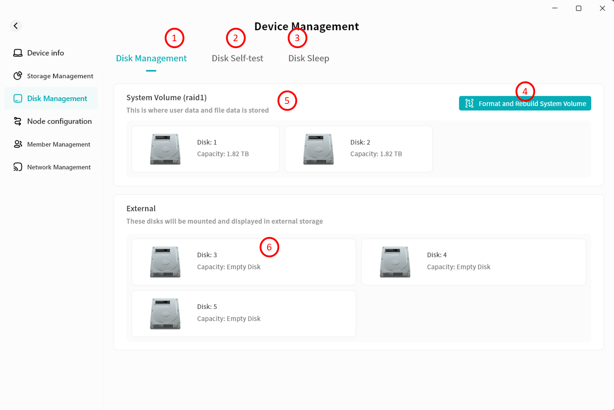

### Format and Rebuild System Volume

When replacing or adding new hard drives, if you do not wish to use them
as external storage, you can choose **Format and Rebuild System
Volume**.

1.  Go to **Device Management  Disk Management** and click **Format
    and Rebuild System Volume**.

2.  In the pop-up window, select a new disk format. DASSET edge devices
    support multiple disk formats:

- **Normal Mode**: Basic mode; available space equals the sum of all
  disks, no redundancy.

- **RAID 0**: Optimized read/write performance; available space equals
  the sum of all disks, no redundancy.

- **RAID 1**: Two disks required; available space equals the smaller of
  the two, with redundancy.

- **RAID 5**: Minimum of three disks; available space equals the
  combined capacity of two data disks, with redundancy.

- **RAID 10**: Minimum of four disks; available space equals the
  combined capacity of the smaller group of two, with redundancy.

- The disk format interface will display the estimated capacity based on
  the selected mode.

3.  Click **Confirm** to start formatting. Please wait patiently.

    - In RAID modes, after formatting, the disk status may show
      **Synchronizing**. This indicates internal disk configuration. You
      can still perform normal operations such as file upload and
      download. The *Synchronizing* status does not affect usage.

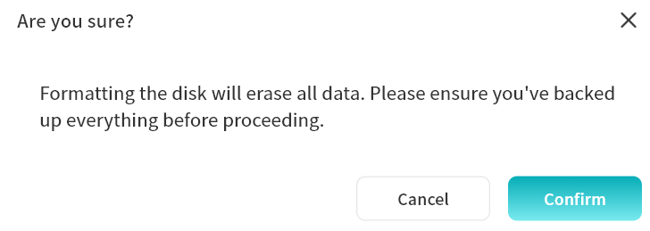

When the device is performing formatting operations, you will also see
the device status on the Device List page.

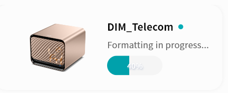

### Add External Disk

When inserting a new hard drive, if you do not wish to rebuild the
system volume (which would erase existing disk data), you can configure
the drive as an **external disk**.

1.  Go to **Device Management  Disk Management**, where the newly
    added disk will be shown as **Pending Configuration**.


2.  For the disk you want to add to external storage, click **Format**.

3.  In the pop-up prompt, click **Confirm**.


4.  The system will begin formatting. You may click **Background** to
    close the progress window.


5.  After formatting is complete, the system will notify you that the
    task is finished, and the **Pending Configuration** status will be
    removed.


6.  Go to **Applications  External Storage** to see the disk added as
    external storage.


7.  Double-click the disk name to enter the external disk and perform
    file operations.

    - *Note: To avoid abnormal behavior, do not delete the "lost+found"
      folder.*


### Disk Self-test

Performing a self-test on the hard drives helps you identify problematic
disks in time and take appropriate action to prevent data loss.

We recommend running a disk self-test periodically to ensure data
security.

Steps for disk self-test:

1.  Go to **Device Information  Disk Management  Disk Self-test**.

2.  Click **Self-test Again**.

3.  The system will begin scanning the hard drives. Please wait
    patiently for the process to complete (the time required may vary
    depending on disk size and type).

4.  Once complete, you will see the current health status of the hard
    drive along with the self-check completion time.


### Disk Sleep

The purpose of disk sleep is to power down hard drives when no
read/write operations are occurring. This extends disk lifespan and
reduces energy consumption while the device is idle.

#### Manual Hibernation

1.  Click **Sleep Now**.


2.  In the pop-up warning window, click **Confirm**. During disk
    hibernation, all applications and transfer tasks will be stopped.


3.  Once the disk enters hibernation, a notification will appear.


#### Scheduled Sleep

1.  Enable **Scheduled Sleep**.

2.  After enabling, configure the specific hibernation rules:

1.  **System Time:** The time zone of your client.

2.  **Wake Time / Sleep Time:** Set the start and end times for disk
    System Time: The time zone of your client.

3.  **Repeat:** Choose when the rule applies---*Everyday*, *Weekdays*,
    *Weekends*, or custom days of the week.


3.  If you no longer wish to use scheduled sleep, simply disable this
    option.

#### Wake Disk

After disks enter hibernation, the DASSET client will automatically
prompt you upon accessing the device. You can click **Wake Disk** to
re-enable the hard drives and resume normal operations on the DASSET
edge device.


## Node Configuration

Node configuration allows the DASSET edge device to expose its local
network resources (e.g., at home) for remote access.

This enables users to access home network resources such as cameras and
printers while away, and to quickly use the Internet resources of the
device's location.

Even when on a business trip, you can work as if you were at home.

Only owners and administrators can configure this feature.

**Example:**

If you configure your home printer's IP address in Node Configuration,
you can log in to the DASSET client from your office and use the DASSET
edge device as a *relay node* to connect to your home printer for
printing.

All communication during this process is encrypted.

Node Configuration provides three functions:

- **Allow access to the network through this node**: When enabled, users
  can use this DASSET edge device as a *relay node* to access the
  Internet.

- **Use a dedicated DNS**: Configure a dedicated DNS address so domain
  names can be resolved using your chosen DNS, avoiding domain
  pollution.

- **Allow access to the subnet of the device**: Configure access to the
  local network resources where the DASSET edge device is located,
  enabling remote access via the DASSET hardware relay.


### Allow access to the network through this node

When enabled, if you activate the **Node** function on the device home
page, all your Internet traffic will first be sent to the DASSET edge
device, and then forwarded to the target website.

**Note:** All communications are encrypted by the SDVN virtual network,
so you do not need to worry about your data being decrypted or read by
others.

Once enabled, all users bound to this device can use this function.
Please enable it with caution.

**Example:**

If you are at a café in City A and need to use online banking but are
concerned about Wi-Fi security, you can log in to the DASSET client and
select the **Node** function on your home device in City B. Your online
banking data will be encrypted and tunneled to the DASSET edge device in
City B before being forwarded to the bank's server. Even if the café's
Wi-Fi is being monitored, hackers cannot obtain your banking information
because the traffic is encrypted.

**Steps:**

1.  Go to **Device Management  Node Configuration** and enable **Allow
    Internet Access Through This Node**.


2.  After enabling, you will see a **Node** button appear on this
    device's card in the device home page.


3.  Click **Node**, then confirm in the pop-up window.


4.  The **Node** button will appear active, and all subsequent Internet
    access will be routed through this device.


### Use Dedicated DNS

When enabled, you can configure a specific DNS server for domain name
resolution.\
This is useful if Internet access through DASSET hardware seems slow,
allowing you to choose a faster DNS server.

**Note:** Ensure the DNS server you configure is valid. If it is
unavailable, domain names may fail to resolve, making URLs inaccessible.
If you are unsure, it is not recommended to enable this function.

### Allow Access to Device Subnet

This function allows remote access to local network resources via the
DASSET hardware relay.

**Note:** Once configured, all users bound to this device can access the
subnet IP addresses you specify. Configure carefully to avoid privacy
risks. The device must be on the same LAN as the target subnet.

**Example:**

If you configure your home printer's IP address in Node Configuration,
you can log in to the DASSET client from the office and use the device
as a relay node to print documents remotely. All communication is
encrypted.

**Steps:**

1.  Go to **Device Management  Node Configuration** and enable **Allow
    Access to Device Subnet**.

2.  Click **+**.


3.  In the pop-up window, enter the target IP address and subnet mask,
    then click **Confirm**.

- **Subnet Address (mask not 32):** Shares an entire network segment,
  suitable if multiple resources need to be accessed.

- **Host Address (mask 255.255.255.255 or /32):** Shares a single
  device, such as a camera with IP 192.168.1.254. Configure as
  192.168.1.254, 255.255.255.255 to access only that device remotely.

*Tip:* It is recommended to use subnet addresses to reduce the risk of
IP conflicts.

### Example Scenario: Remote Work

A user places a DASSET edge device in the office and enables sharing of
the office computer's network resources.

While at home or on a business trip, the user can securely and easily
control the office computer through the DASSET edge device, enabling
efficient remote work.

## Member Management

On the **Member Management** page, you can manage all members and their
permissions, as well as invite others to join the device.


1.  **Owner:** Displays the owner's nickname and the time of device
    binding.

2.  **Administrator:** Displays all administrators' nicknames and their
    binding times.

3.  **Member:** Displays all members' nicknames and their binding times.

4.  **Permission Details:** Shows your specific permissions on this
    device.

5.  **User Count:** Displays the number of users currently bound to the
    device and the maximum number of users allowed.

6.  **Invite Users:** Generates an invitation code to invite others to
    join the device.

*Note: Only owners and administrators can view and configure member
permissions. Members can only view their own permissions and cannot
modify them.*

### User Roles in Device Binding

In DASSET, accounts are classified into different roles based on their
permissions:

- **Owner**: The first account to bind the device. Has full control over
  the device.

- **Administrator**: A role assigned by the owner to a member account.
  Has most device management permissions and can configure member
  permissions.

- **Member**: Accounts invited to join the device default to member
  role, with only basic permissions.

#### Permission Description

The differences in permissions between user roles are shown in the table
below:

  ----------------------------------------------------------------------------
  Permission Item                    Owner        Administrator   Member
  ---------------------------------- ------------ --------------- ------------
  Manage account storage limit       √            √               

  Read/Write My Space                √            √               √

  View Public Space                  √            √               √

  Edit Public Space                  √            √               

  Use Group Space                    √            √               √

  Create Groups                      √            √               

  View External Storage              √            √               

  Edit External Storage              √            √               

  Transfer Ownership                 √                            

  Assign Administrator               √                            

  Remove Users                       √            √               
  ----------------------------------------------------------------------------

#### Adjust Member Permissions

You can configure detailed permissions for different members.

- Select a member account, then in the **Permission Details** section on
  the right, enable or disable specific permissions for that member.

- **Owners** can configure permissions for all users.

- **Administrators** can configure permissions for member accounts.


### Storage Quota Management

You can configure storage limits for different members:

- **Owners** can set storage limits for all users.

- **Administrators** can set storage limits for member accounts.

1.  Select a member account, then in the **Permission Details** section
    on the right, click **Manage Space Access**.


2.  In the pop-up window, configure the available storage limit for the
    account:

    - **No limit**: No restriction on the member's storage usage.

    - **Percentage**: Allocate a percentage of the device's total
      capacity.

    - **Customized Size**: Set a fixed maximum capacity (in GB).


Once configured, the member will not be able to exceed the assigned
quota.

### Transfer Owner

The owner can transfer device ownership to another member account.

1.  Select a member account, then in the **Permission Details** section
    on the right, scroll down and click **Transfer Owner**.


2.  In the pop-up window, click **Transfer**.


3.  After transfer, the device will briefly go offline and then
    reconnect to update internal permission logic.

    - Once back online, your account will become a member, and the
      selected account will become the device owner.

### Administrator Promotion and Demotion

- **Promote Member to Administrator**

  1.  Select a member account, then in the **Permission Details**
      section on the right, scroll down and click **Promote to
      Administrator**.


2.  The device will briefly go offline and then reconnect. After
    reconnection, the account will appear as an administrator.

- **Demote Administrator to Member**

  1.  Select an administrator account, then in the **Permission
      Details** section on the right, scroll down and click **Demote to
      Member**.


2.  The device will briefly go offline and then reconnect. After
    reconnection, the account will appear as a member.

### Remove User

You can remove a user to unbind them from the device. After removal, the
user will no longer see the device.

- Owners and administrators can perform removals.

- Owners can remove administrators and members.

- Administrators can remove members.

**Steps:**

1.  Select a user account, then in the **Permission Details** section on
    the right, scroll down and click **Remove This User**.


2.  In the pop-up window, click **Remove This User**. After system
    processing, the user will be removed from the device.

    - When a user is removed, their personal storage data will also be
      cleared to free up space.


### Invite Users

You can invite others to join the device via the Member Management page.

1.  Go to **Device Management  Member Management** and click **Invite
    Users**.


2.  The system will generate an invitation QR code window. You can send
    the QR code or invitation code to others.

    - On mobile: Scan the QR code with the DASSET mobile client.

    - On desktop: Enter the invitation code in the DASSET desktop
      client.

> *(See the Add Device section for details on joining a device.)*
>
> **Options:**

1.  **QR Code Display:** Shows the invitation QR code.

2.  **QR Code Expiry:** Valid until the specified time, after which it
    cannot be used.

3.  **Invitation Code:** Equivalent to the QR code for invitation
    purposes.

4.  **Enable Sharing:** Must be enabled to generate the invitation QR
    code.

5.  **Require Verification to add device:** If enabled,
    owner/administrator approval is required before new users can join.

6.  **Allow regular Members to invite:** If enabled, regular member
    accounts can also invite others.

7.  **Download QR Code:** Save the QR code image to your computer's
    download directory.


3.  If **Verification Required** is enabled, when someone applies to
    join, the owner/administrator will see a notification in the system.
    Only after clicking **Accept** will the user be bound to the device.


## Network Management

On the **Network Management** page, you can configure:

- **LAN Settings**: Change the password for Samba and Time Machine
  access.

- **LAN IP Management**: Configure the DASSET edge device's network
  information.

- **Link Aggregation**: If your device has multiple network ports, you
  can aggregate them into a single logical port to improve transfer
  performance.

### LAN Settings

1.  Click **Change Password**.

2.  In the pop-up window, enter the new password and click **Confirm**.


### LAN IP Management

LAN IP address management supports two modes:

- **Automatic IP (DHCP)**: The switch assigns the device an IP
  automatically, requiring no manual configuration. Suitable for
  out-of-the-box use without networking knowledge.

- **Manual Network Configuration**: Assign a fixed IP address to the
  device. Recommended for scenarios requiring a stable IP, such as Samba
  services.

**Note:** When manually configuring IP, ensure the address matches the
connected network segment and is not already in use. If the device
cannot come online after manual configuration, press and hold the
device's **reset** button to restore IP settings.


#### Automatic IP (DHCP)

By default, DASSET edge devices use **DHCP** for ease of setup.

On the **LAN IP Management** page, you can view:

- Current IP address of the device

- Subnet mask

- Gateway IP address

*Note: DHCP-assigned IPs cannot be modified manually.*


#### Manual Network Configuration

Recommended for Samba or similar services to avoid IP changes caused by
DHCP.

When enabled, you can configure:

- IP address

- Subnet mask

- Gateway

- Primary and secondary DNS

After setup, you can access services like Samba using the fixed IP
address.


### Dual-port Link Aggregation

If your device has multiple network ports, you can connect multiple
cables and configure link modes in **Network Management**:

- **Balance Polling Mode**: Network ports take turns transmitting
  packets, providing load balancing and fault tolerance. Requires switch
  support for port aggregation.

- **Primary/standby Mode**: One port is active while the other serves as
  backup. The backup port takes over if the primary fails.

- **Dynamic Link Aggregation (IEEE 802.3ad LACP)**: For switches
  supporting LACP. Provides real-time link monitoring, load balancing,
  and failover.

- **Adaptive Load Balancing**: Distributes traffic automatically across
  ports without requiring special switch support.

*Note: To avoid issues, connect both network ports to the same switch
when using link aggregation.*


# File Management

## Three Storage Spaces

DASSET defines three types of storage spaces:

- **My Space**

> Accessible only by yourself. Other members cannot view files saved
> here.

- **Public Space**

> Accessible by all users bound to the DASSET edge device. Read/write
> permissions vary by user and can be configured.

- **Group Space**

> Accessible only by users within the same group.

## File Operation Interface

The DASSET file browsing interface is similar to a standard file
explorer UI, so you can use it with minimal learning.


1.  **Quick Space Entry:** Switch quickly between *My Space*, *Public
    Space*, and *Group Space*.

2.  **Forward/Back:** Navigate to the previous or next directory.

3.  **Refresh:** Reload the current page to display the latest file
    changes (DASSET also auto-refreshes periodically).

4.  **Full Path Display:** Shows the complete path of the current page.
    You can click any folder in the path to jump directly to it.

5.  **Search Bar:** Enter a file name to search within the current
    directory and its subdirectories.

6.  **Function Bar:** Perform operations on files/folders, including
    upload, download, copy, move, share, and delete.

7.  **File Filter Button:** Display only certain file types, such as
    pc-images, videos, audio, documents, or compressed files.

8.  **Sort and View Options:**

- Sort files by name, size, or modification date.

- Display files in list view or grid view.

9.  **File List Display:** Shows file name, size, and modification date.

10. **Right-Click Menu:** Provides the same operations as the Function
    Bar.

## Quick Space Entry

You can click different entries to quickly access the root directory of
each space:

- **My Space**

- **Public Space**

- **Group Space**: Displays all groups you belong to.

- **External Storage**: Includes USB-connected storage devices and
  internal drives configured as external disks.

- **Favorites**: Displays all files marked as favorites.

- **All Files**: Displays all files in *My Space* (folders not shown).

## File Upload

File uploads can be performed in two ways:

- **Method 1**: Use the **Upload** button in the menu bar to upload
  files from your computer to the DASSET edge device.

- **Method 2**: Drag and drop files directly into the DASSET edge
  device. Drag-and-drop can be done either in a specific directory page
  or in the Task Center.

### Method 1: Upload Button

1.  Click **Upload** and choose whether to upload files or folders.


2.  In the pop-up window, select the files or folders you want to upload
    to the DASSET device (multi-selection supported).

3.  After confirmation, DASSET will begin the upload process.

### Method 2: Drag-and-Drop Upload

- Supports dragging and dropping single or multiple files.

- Supports dragging and dropping single or multiple folders.

- Supports mixed drag-and-drop of files and folders.

There are two drag-and-drop entry points:

- **Entry 1**: Drag files/folders directly into a specific DASSET edge
  device directory.


- **Entry 2**: On the Task Center page, drag files/folders into the
  DASSET client interface.

  - *In this case, you will be prompted to select the destination path
    on the DASSET edge device.*


### Upload Progress

You can view your upload progress and history under **Task Center 
Upload**.

## File Download

File downloads can be performed in two ways:

- **Method 1**: Use the **Download** button in the menu bar to download
  files from the DASSET edge device to your computer.

- **Method 2**: Drag and drop files from the DASSET edge device to your
  computer.

### Method 1: Button Download

1.  Select the file(s) and click **Download**.


2.  DASSET will automatically begin downloading.

3.  Completed downloads will be saved in:

> C:\\Users\\\[Username\]\\Downloads
>
> You can also open the file location directly by clicking the completed
> task in Task Center.

### Method 2: Drag-and-Drop Download

You can select and hold files on the file page, then drag them into a
folder on your computer.

The DASSET client will automatically create a download task and transfer
the files from the DASSET edge device to your computer.

- Supports dragging and dropping single or multiple files.

- Supports dragging and dropping single or multiple folders.

- Supports mixed drag-and-drop of files and folders.

### Download Progress

You can view your download progress and history under **Task Center 
Download**.

## Copy/Move To

You can copy or move files to other directories at any time from the
File Management page.

### File Copy

Copying a file creates a duplicate in the target directory, while the
original file remains in its original location.

1.  Select the file and click **Copy/Move To  Copy To**.


2.  In the pop-up window, select the target path. DASSET will list all
    available spaces.


3.  Click **Confirm** to execute the copy operation.

### File Move

Moving a file transfers it from one directory to another. After
migration, the file will only exist in the new directory.

1.  Select the file and click **Copy/Move To  Move To**.

2.  In the pop-up window, select the target path. DASSET will list all
    available spaces.


3.  Click **Confirm** to execute the move operation.

### Progress View

You can view copy and move tasks under **Task Center Other
Operations**.

## Create Folder

Click the **Create** **Folder** button to create a new folder in the
current directory.\
When creating a folder, you can assign it a name.


## Media File Online Playback

DASSET supports online playback of pc-images, videos, and audio files.
Simply double-click the file you want to view.

1.  **Supported Video Formats:**

* avi, flv, mpg, mov, mkv, mp4, m2ts, asf, wmv, vob, divx, 3gp, mpeg,
* mts, ts, f4v, hevc

1.  **Supported Image Formats:**

* bmp, gif, heic, jpg, png, jpeg, tif, tiff, dng

3.  **Supported Audio Formats:**

* mp3, wma, flac, wav, aac, ape, m4a, ogg

### Video Playback

Double-click a video file to open the video player for online playback.

1.  Play/Pause

2.  Adjust volume

3.  Video duration and current playback time

4.  Progress bar (supports drag)

5.  Switch between full screen and windowed playback

6.  Share/Send: Share video via member share, QR code, or send to
    another device

7.  Download: Save the file to your computer

8.  Move To: Move the file to another directory on the DASSET edge
    device

9.  Copy: Copy the file to another directory on the DASSET edge device

10. Delete: Remove the file


### Image Viewing

Double-click an image file to open the image viewer and display the
original image.

1.  Image display area

2.  Share/Send: Share image via member share, QR code, or send to
    another device

3.  Download: Save the file to your computer

4.  Move To: Move the file to another directory on the DASSET edge
    device

5.  Copy: Copy the file to another directory on the DASSET edge device

6.  Delete: Remove the file

7.  Image navigation: Switch between other pc-images in the same directory


### Audio Playback

Double-click an audio file to open the audio player for online playback.

1.  Play/Pause

2.  Sequential/Shuffle play

3.  Progress bar (supports drag)

4.  Next/Previous track

5.  Playlist (all audio files in the same directory are automatically
    added)

6.  Audio file name


## File Sharing / Sending

DASSET supports sharing files stored on a DASSET edge device in multiple
ways, or sending them to other DASSET edge devices.

- **Member Sharing**

> Enables file sharing between members of the same DASSET edge device.\
> Suitable for relatively private file sharing without using Group Space
> or Public Space.
>
> This feature is available to all users.

- **QR Code Sharing**

> Generates a share code for a file, which can be provided to other
> DASSET users to retrieve the file.
>
> Suitable when the sender and recipient are not on the same DASSET edge
> device and secure file sharing is required.
>
> *Note: The recipient must be the owner of a DASSET edge device to
> receive the file.*

- **My Other Devices**

> Copies files from one DASSET edge device to another, suitable for
> users who own multiple devices and need cross-device file transfer.
>
> *Note: The operator must be the owner of the receiving DASSET edge
> device.*

### Sharing / Sending Entry

Right-click the file you wish to share/send, then select **Share/Send**
from the context menu.


You can also select **Share/Send** from the **top menu bar** in the File
Management interface.


### Member Sharing

Member sharing enables file sharing between members on the same DASSET
edge device.

This is useful for private file sharing without using Group Space or
Public Space.

All users can use this feature.

#### Send Files via Member Sharing

1.  Select the file, then right-click and choose **Share/Send  to
    Member**


2.  In the pop-up window, select the member(s) to share with
    (multi-selection supported). Click **Send** to confirm.


#### Receive Files from Member Sharing

You can check for shared files in **Task Center  Received Shares** on
the DASSET edge device.


- Save the file to *My Space* or My Vault.

- Download the file to your local computer.

- Delete the file share entry.

- Delete all share entries.

### QR Code Sharing

Generates a share code for a file, allowing other DASSET users to
retrieve it.

Useful when the sender and recipient are on different devices and secure
file sharing is required.

*Note: The recipient must be the owner of a DASSET edge device to
receive the file.*

#### Create QR Code Share

1.  Select the file, then right-click and choose **Share/Send  QR
    Code**.


2.  Set sharing rules:

    - **Shared File Display**

    - **Expiration Date**: Defines validity. After expiry, the share
      becomes invalid.

    - **Downloadable**: Maximum number of times the file can be
      downloaded. After the limit, the share becomes invalid.

    - **Permission Settings**:

      - **Public**: Anyone with the QR code can access the file.
        Suitable for low-security scenarios.

      - **Require Password**: A password must be entered to access the
        file. Suitable for high-security scenarios.


3.  After setting the rules, click **Create Share**. A QR code share
    will be generated. You may:

    - Click **Copy Full Info** to share all details.

    - Send only the QR code image.

> Displayed information includes:

1.  QR code (scannable in the DASSET app to retrieve the file)

2.  Remaining download count

3.  Share content

4.  Expiration date

5.  Share code (can also be entered in the DASSET app to retrieve the
    file)

6.  Password required (only shown if a password was set)


#### Retrieve Files via QR Code Share

1.  Go to **Task Center  Received Shares  QR Code Share** on your
    DASSET edge device.

2.  Click **Add Share**.


3.  In the pop-up window, enter the share code string and click **Add**.


4.  If password-protected, enter the password.


5.  After entering the correct code (and password, if required), the
    file information will appear. Select the file and click **Save**.


6.  Choose a directory and click **Confirm**. The file will be saved to
    your DASSET edge device.


7.  You can monitor progress in the Task Center. Once completed, the
    file will be available in the selected directory.

### Send to My Other Devices

Copies files from one DASSET edge device to another.

Useful for users with multiple DASSET edge devices who need cross-device
file transfers.

*Note: The operator must be the owner of the receiving device.*

Steps:

1.  Select the file, then click **Share/Send  My Other Devices**.


2.  In the pop-up window, select the target DASSET device and click
    **Confirm**.

    - *Note: Only devices where you are the owner will be displayed.*


3.  Choose the save path for the file and click **Confirm**. The file
    will be transferred from the source to the target device.


4.  On the target device, go to **Task Center  Received Shares  QR
    Code Share** to view the transfer progress.


##  Rename

You can rename files stored on the DASSET edge device. Enter the new
file name, click **Confirm**, and the change will be applied.


##  Favorites

You can add files to **Favorites** either by right-clicking a file and
selecting *Add to Favorites* or by clicking the **Add to Favorites**
button in the top menu bar. Afterward, you can quickly access these
files from the Favorites section.


To remove a file from Favorites, perform the **Remove from Favorites**
operation.


##  Delete

For unnecessary files, you can perform a delete operation. The
**Delete** option is available in both the right-click menu and the top
menu bar. Deletion supports both single and multiple files.

1.  Click the **Delete** button.


2.  Choose one of two options:

    - **Permanent Delete**: When selected, the file is immediately
      deleted and cannot be recovered.

    - **Recycle Bin** (default): If permanent delete is not selected,
      the file will first be moved to the **Recycle Bin** for 30 days
      before being permanently deleted.

      - Files in the Recycle Bin can be restored to their original
        directory if deleted by mistake.


##  Hide

###  Hide Files

For sensitive files, you can hide them:

1.  Select one or multiple files and click **Hide**.


2.  Hidden files will no longer appear in the file list by default.

###  Show Hidden Files

If you want to display hidden files:

1.  On the device home page, click the top-right corner.

2.  Select **Security Settings**.

3.  Enable **Show Hidden Files and Folders**.

4.  Hidden files will now be visible in the file list.


##  File Compression and Decompression

DASSET supports online file compression and decompression without
requiring local download.

- **Supported Decompression Formats**: .rar, .zip, .tar, .tar.gz

- **Default Compression Format**: Files are compressed into .zip for
  cross-platform compatibility.

###  Compression

1.  Select one or multiple files, then click **Compress** from the
    right-click menu or top menu bar.


2.  In the pop-up window, choose the save path for the compressed file.
    You may also create a new folder.


3.  After completion, the compressed file will be saved to the selected
    path.

    - Multiple files compressed together will generate an archive named
      **Archiver.zip**.

    - A single file compressed will generate an archive named
      **\[Original Filename\].zip**.

###  Decompression

1.  Select a compressed file, then click **Decompress** from the
    right-click menu or top menu bar.


2.  In the pop-up window, choose the save path for the decompressed
    files. You may also create a new folder.


3.  After completion, the decompressed files will be saved to the
    specified path.

###  Progress Tracking

You can view compression and decompression tasks under **Task Center 
Other Operations**.

##  View Details

You can view details of files/folders at any time.

Details include file size, file location, creation time, modification
time, and other attributes.

Displayed details may vary depending on the file type.


#  DASSET Applications

## Group Space

In **Group Space**, users with Group Space permissions can create group
folders and invite specific members to join. Only members can access
files within a group folder, with access controlled by predefined
read/write permissions.

Group Space is useful when certain photos, videos, or files need to be
shared only with selected users. By creating multiple groups, different
content can be shared with different users, providing resource sharing
and collaboration for families or small teams.

Group Space supports multi-device, cross-platform access but does not
support Samba access.

*Note: Files in Group Space are permanently deleted once removed and do
not enter the Recycle Bin.*

###  Create a Group

1.  Click **Group Space  +**, then enter the group name.


2.  In the pop-up window, select one or multiple members to join the
    group:

    - Member list supports multi-selection.

    - Click the "x" on a member's avatar to cancel an invitation.

    - Keyword search is supported for quickly finding members.

    - After selection, click **Create**.


3.  Once created, the group will appear on the Group Space page.


###  Using Group Space

Group Space usage is consistent with other file management pages. You
can:

- Upload files to a group

- Download files from a group

- Create new folders

- Move/Copy files within a group

- Rename files/folders


###  Group Management

On the group list, click the **menu icon** to open the Group Management
menu:

1.  **Member Management (Owner only)**: Add or remove members.

2.  **Group Password (Owner only)**: Set a password required for
    accessing files.

3.  **Rename (Owner only)**: Modify the group name.

4.  **Delete Group (Owner only)**: Delete the group, including all files
    within.


5.  **Exit Group (Members only):** Non-owners can choose to exit the
    group.


####  Member Management

In the Member Management page, you can add/remove members or configure
permissions:

1.  **Transfer Ownership:** Assign group owner role to another member.

2.  **Editable:** Members can write to the group, performing all file
    operations including upload, download, move, etc.

3.  **View Only:** Members can only view files and perform limited
    actions such as download, copy, or view details.

4.  **Remove:** Remove the member from the group. The removed user
    cannot access the group.

5.  **Add Members:** Add new members to the group.


####  Group Password

You can set a password for the group, requiring members to enter it
before accessing files.

#####  **Set Group Password**

1.  Click **Group Password**.

2.  In the pop-up window, enable **Group Password**.


3.  Set the password and click **Confirm**.


#####  **Modify Group Password**

1.  Click **Group Password**.

2.  Select **Change Your Password**.


3.  Enter the current password and click **Confirm**.

4.  Set a new password.

#####  **Access Group with Password**

1.  Click the group.

2.  In the pop-up window, enter the correct password to access Group
    Space.


#####  **Recover Group Password**

1.  Click **Group Password  Change Password**.


2.  Select **Forgot Password**.


3.  Enter your DASSET account email or mobile number for identity
    verification.

4.  Enter the email/SMS verification code.

5.  After verification, you can reset the group password.

#####  **Disable Group Password**

1.  Click **Group Password  Disable**.


2.  Enter the current group password.


3.  The password will be successfully disabled.

#### Rename

Click **Rename**, then enter a new group name in the pop-up window to
update the name.


#### Delete Group

Click **Delete This Group** to permanently delete the group and all its
contents.


##  Task Center

All file uploads, downloads, and related operations are displayed
centrally in the **Task Center**.


From the device home page, click the **Task Center** icon in the upper
right corner.

A number displayed on the icon indicates the count of ongoing tasks.

Within the Task Center, operation progress is categorized as follows:


1.  **Upload:** Shows all ongoing and completed upload tasks

2.  **Downloads:** Shows all ongoing and completed download tasks

3.  **Offline Download:** Shows ongoing, completed, and failed offline
    download tasks

4.  **Get Share:** Shows files you have received or shared with others

5.  **Other Actions:** Shows ongoing and completed operations such as
    move, copy, decompress, and compress

6.  **Task Details Page:** Displays a complete record of all tasks

*Note: My Vault tasks are displayed separately to ensure your privacy.*

###  Upload

In the **Upload** section, you can view ongoing and completed uploads,
and control tasks at any time (pause, resume, cancel).


- Upload tasks display current upload speed, uploaded size, and total
  file size.

- You can click the **control button** to pause/resume/cancel all
  current upload tasks at once.

- You can also manage individual tasks using the control button on each
  task entry.

- You can delete all task records, or delete a single record.

- Clicking a task's **path button** opens the file's storage location on
  the DASSET edge device.

###  Downloads

In the **Download** section, you can view ongoing and completed
downloads, and control tasks at any time (pause, resume, cancel).


- Download tasks display current download speed, downloaded size, and
  total file size.

- You can click the **control button** to pause/resume/cancel all
  current download tasks at once.

- You can also manage individual tasks using the control button on each
  task entry.

- You can delete all task records, or delete a single record.

- Clicking a task's **path button** opens the file's saved location on
  your computer.

###  Offline Download

For details, refer to the **Offline Download** section.


###  Get Shares

The **Received Shares** section includes two types of file sharing:

- **From Members**: File sharing between members on the same DASSET edge
  device (available to all users).

- **QR Code Sharing**: Receive files shared by other DASSET users via QR
  code or share code. Files are downloaded to the recipient's DASSET
  edge device (available only to device owners).

#### From Members

You can view all files shared with you by other members on the same
device.

- Save files to *My Space* or *My Vault*

- Download files to local storage

- Delete individual share entries

- Delete all share entries

#### QR Code Sharing

The QR Code Sharing page provides:

- **Add Share**: Enter a share code to obtain shared files

- **Download Status**: Displays progress for ongoing, completed, or
  failed downloads

*For detailed sharing instructions, refer to the **Sharing** section.*

### Other Actions

All move, copy, decompress, and compress operations are displayed in
**Other Operations**.

You can view task progress, specific actions, and target paths clearly.

You can delete all task records, or delete a single record.


##  My Favorites

You can add data stored on the DASSET edge device to **My Favorites**,
allowing quick access at any time.

Enter Favorites by clicking the **My Favorites** icon in the DASSET app,
or by selecting **My Favorites** from the left sidebar in File
Management.

In Favorites, you can:

- Cancel favorites for single or multiple files

- Download files directly


##  External Storage

When a USB drive is connected to the DASSET edge device, you can access
its data through the **External Storage** function in the client.

Files on the USB drive can be managed in the same way as files in other
DASSET spaces.

You can enter External Storage by clicking the **External Storage** icon
in the app, or by selecting **External Storage** from the File
Management sidebar.

**Supported Disk Formats:** exfat, fat32, vfat, ext4, NTFS


##  Recycle Bin

All deleted files from the DASSET edge device are placed in the
**Recycle Bin**.

You can restore or permanently delete files at any time.

*Note: Files remaining in the Recycle Bin for 30 days will be
permanently deleted.*


##  Offline Download

Offline download allows the DASSET edge device to run 24/7 to
automatically download resources.

This feature is available only to owner and administrator accounts.


- Supports **http, https, ftp, magnet, and torrent** downloads.

- Torrent files can be uploaded locally or selected from those stored on
  the device.

- Default download path: *My Space/Download* (custom paths supported).

- Progress can be viewed in **Task Center  Offline Download**.

- You can also click **New Task** in Task Center to quickly create new
  offline download tasks.

*Note: Download speed depends on network conditions, resource
availability, and thread control.*

##  My Shares

**My Shares** provides centralized management for all file sharing tasks
you created, including **Member Sharing** and **QR Code Sharing**.

- **Member Sharing**: Shows tasks where you shared files with members on
  the same device.

- **QR Code Sharing**: Shows all QR code share tasks and cross-device
  share tasks you created.

###  Member Share Task Management

Displays all ongoing member share tasks.

- You can cancel any share task.


###  QR Code Sharing

Displays all QR code share tasks and cross-device share tasks you
created.

- Cancel share tasks at any time.

- Click a task to redisplay its QR code and details.

  - Even if you lose the original QR code, you can retrieve it here and
    share it again with other DASSET users.


##  File Dedupe

File dedupe helps identify and remove duplicate files on the DASSET edge
device, saving storage space.


Deduplication can be performed in three ways:

- **My Space**: Find duplicates within My Space.

- **Public Space**: Find duplicates in Public Space (owner/admin only).

- **Folder specified:** Scan selected folders where you have permission
  for deduplication.


*Note: Multiple paths can be selected for deduplication. After
selection, click **Start Scanning** to begin duplicate file scanning.*

###  Deduplication Operation

After specifying the target path, DASSET will automatically search for
duplicate files and display the results in a list.

Once confirmed, click **Delete the selected one** to remove duplicates.


###  Deduplication Rules

Click **Smart Selection** in the duplicate file list to define deletion
rules:

- By file name length

- By file path length

- By file modification time (earliest/latest)


##  Files Sync

Files Sync can only be used by the owner account.

Within the "Files Sync" feature, you can:

- Synchronize files between DASSET edge devices and computers, ensuring
  data consistency across devices.

- Synchronize files between DASSET edge devices, enabling remote backup
  and improving data redundancy.

DASSET supports three synchronization modes:

- **Two-Way Synchronization**: Keeps files consistent between a DASSET
  edge device and a computer, or between two DASSET edge devices. Any
  file change on one side will be automatically synchronized to the
  other side.

- **Sync from Device A to Device B**: Only new or modified files from
  Device A will be synchronized to Device B. File changes on Device B
  will not be synchronized back to Device A.

- **Sync from Device B to Device A**: Only new or modified files from
  Device B will be synchronized to Device A. File changes on Device A
  will not be synchronized back to Device B.

###  Configure Synchronization Between DASSET Edge Device and Computer

1.  Go to **Files Sync  Sync with PC  Add Sync**.


2.  In the pop-up window, set the directories for synchronization:

    - **Select folders to sync from Local computer:** on the local
      computer, select the folder that will be synchronized with the
      DASSET edge device.

    - **Select folders to sync from DASSET Edge Device:** on the DASSET
      edge device, select the folder for synchronization. You can choose
      from My Space, Public Space, or Group Space.


3.  On the DASSET edge device, select the folder to be synchronized. You
    may use an existing folder or create a new one.

> *Note: Choose the space based on the privacy requirements of your
> data.*


4.  On the local computer, click Select Folder, then choose the desired
    directory in the file explorer and confirm.

> *Note: The local computer refers to the machine where the DASSET
> client is running. The selected folder will be used as the
> synchronization directory.*

5.  In the Add Sync Task window, confirm that both the synchronization
    folder and the synchronization target are correctly set. Click Next
    to continue.


6.  Select the required synchronization mode and then click Create:

    - **Two-way sync**: Keeps files consistent between the DASSET edge
      device and the computer. Changes on either side will be
      synchronized automatically.

    - **One-way sync from device to local computer**: Only new or
      modified files from the DASSET edge device will be synchronized to
      the computer. Changes on the computer will not be synchronized
      back.

    - **One-way sync from local computer to device**: Only new or
      modified files from the computer will be synchronized to the
      DASSET edge device. Changes on the DASSET edge device will not be
      synchronized back.


7.  The synchronization task will start automatically. While the DASSET
    client remains online, any detected changes in the selected
    directories on either the computer or the DASSET edge device will
    trigger synchronization.


###  Configure Synchronization Between DASSET Edge Devices

1.  Go to **Files Sync  Sync with NAS  Add Sync**.


2.  In the Add Sync Task window, select another DASSET edge device to
    participate in synchronization and click Confirm.

> *Note: Only devices owned by you will be displayed. You must select
> one of your owned devices as the synchronization target.*


3.  In the pop-up window, choose a directory on the target DASSET edge
    device to serve as the synchronization directory. You may select a
    folder from My Space, Public Space, or Group Space.


4.  The target synchronization folder on the other DASSET edge device
    will be displayed. On the current device, select a folder to serve
    as the synchronization directory.


5.  Specify the folder to be synchronized. You may use an existing
    folder or create a new one.

> *Note: Choose the space based on the privacy requirements of your
> data.*


6.  In the Add Sync Task window, confirm that both the folder to be
    synchronized and the synchronization target are correctly set. Click
    Next to continue. You may also click Change if you need to modify
    the synchronization folder.


7.  Select the required synchronization mode and click Create:

    - **Two-way sync**: Keeps files consistent between the two DASSET
      edge devices. Any changes on either side will be automatically
      synchronized.

    - **One-way sync**: Transfers only new or modified files from one
      DASSET edge device to the other, as indicated by the direction of
      the arrow.


8.  The synchronization task will start automatically. Once changes are
    detected in the designated synchronization directory on either
    device, synchronization will be triggered.


###  Viewing Synchronization Tasks

You can view the synchronization tasks you have configured:

1.  **Task Status**

    - Synchronization status: In Progress, Completed, or Error

    - Size of synchronized files

    - Number of synchronized files

2.  **Task Configuration Menu**

    - Pause/Resume synchronization: You can pause or start the
      synchronization task

    - Synchronization configuration: You can change the synchronization
      mode

    - Delete: You can remove the synchronization task

3.  **Detailed Information**

> You can view the device names of both sides, the synchronization
> directory paths, and the synchronization mode icons.


## Recent Files

In Recent Access, you can view files on DASSET edge devices that you
have recently opened. From this list, you can perform all file
operations such as move, copy, download, and delete.


## Access Logs

In Access Records, you can view all member access records for this
DASSET edge device, including account name, client type, device name,
and access time.

You can also filter records by selecting a specific account from the
user dropdown menu.

Multiple records can be selected at once for deletion.


## Samba

The DASSET edge device supports the Samba protocol. Once enabled, you
can connect from a computer, smart TV, or other devices to access files
stored on the DASSET edge device via Samba.

1.  Enable or disable Samba protocol

2.  Allow discovery of the Samba service on your DASSET edge device
    through LAN scanning

3.  Current account: Samba login account

4.  Alias: You can set an alias for Samba and use it later to log in

5.  Password: Set the Samba login password

6.  Set the access path: Define the directories on the DASSET edge
    device that are accessible through Samba


### Windows Connection to Samba

#### Access via Network Discovery

When \" Visible in LAN Scan\" is enabled on Smart DAS, the device will
appear automatically under the Network section in File Explorer.

Simply double-click the DAS icon and enter your username and password to
log in.


#### Map as a Network Drive

1.  Open **File Explorer**, type \\\\\[DASSET device IP address\] in the
    address bar, and press **Enter**.

2.  When prompted, enter your **username** and **password**, then click
    **OK**.

3.  **Once authenticated, File Explorer** will display all folders
    accessible under your **DASSET account.**

- **home:** Your personal space on Smart DAS.

- **public:** The public space accessible to all users on Smart DAS.

- **Other directories:** Shared group spaces that your account has
  joined on Smart DAS.

4.  Right-click the folder you access frequently, and select **Map
    network drive\...**.


5.  Choose an available **drive letter**, check **Reconnect at
    sign-in**, and click **Finish**.

6.  The mapped network drive will now appear under **This PC**, allowing
    quick access to shared files on your DASSET Edge Device.

### macOS Connection to Samba

1.  Open **Finder**  **Go**  **Connect to Server.**


2.  In the server address field, enter:

> smb://Smart_DAS_IP_address
>
> (The Samba application interface will display your current IP
> address.)


3.  Click **Connect**  Select **Registered User**

4.  Enter your Samba username and password and click Connect.

5.  Select shared directories to access:

- **home (Personal space)**

- **public (Public space)**

- **Group spaces (if available)**

6.  **Quick access setup:** Drag frequently used folders to the
    \"Locations\" section in Finder\'s sidebar

## DLNA

The DASSET edge device supports the DLNA protocol. Once enabled, your
computer, mobile phone, smart TV, and other devices can discover this
device and access its media files directly.

When using DLNA for the first time, you must add a DLNA scan path. Only
media files stored in the added paths will be accessible to other
devices on the LAN.

1.  Click Add.


2.  In the pop-up window, add the folder you want to make available via
    DLNA.


3.  Once added, any device on the LAN that supports DLNA will be able to
    discover the DASSET device and play the shared media files.


4.  You can modify or remove directories from the DLNA interface at any
    time. Once a folder is removed, other devices on the LAN will no
    longer have access to its contents.


*Note: DLNA is a standardized protocol that allows compatible devices
(such as smart TVs, mobile phones, computers, and speakers) to
automatically discover each other over a home network and directly
stream or play music, videos, and photos stored on another
device---without the need for manual file transfers or physical media
such as USB drives.*

## Time Machine

The DASSET edge device supports Apple's Time Machine feature. Once
enabled, you can back up your Mac directly to the DASSET device using
Time Machine.


1.  Enable or disable Time Machine. When enabled, your Apple device can
    connect to the DASSET device for data backup and recovery.

2.  Time Machine account: The account used on your Mac to log in to the
    DASSET device for Time Machine backup.

3.  Alias: You can set an alternate account alias to be used as the
    login credential for Time Machine.

4.  Password: When enabling Time Machine for the first time, you must
    set a password for account authentication from your Mac.

*Note: Apple Time Machine does not support the @ symbol in account
names.*

### Connecting a Mac to Time Machine

1.  On your Mac, go to **System Settings  General  Time Machine**.

2.  Select **Add Backup Disk...**, then choose your device from the list
    and click **Set Disk...**.

3.  Enter the corresponding network account and password in the pop-up
    window, then click Connect.

4.  After setup is complete, your Mac will automatically back up files
    to the DASSET device using Time Machine.

## Cloud Drive

DASSET supports integration with third-party cloud drives. You can
upload files from the DASSET edge device to a cloud drive, download
files from a cloud drive to the device, and synchronize data between
them.

Currently supported services include **Google Drive, OneDrive, and
Dropbox**.


### Cloud Drive Login

#### **Log in to Google Drive**


1.  For first-time use, click **Install**.

2.  After installation, click **Open**.

3.  Read and agree to the Google Drive usage terms, then click
    **Confirm**.

4.  Click **Authorize Login**.

5.  Enter your Google account on the authorization page and click
    **Next**.

6.  Enter your password and click **Next**.

7.  Click **Advanced**.

8.  Select **Proceed to Google Drive**.

9.  On the permissions page, click **Continue**.

10. Once logged in, your Google Drive files will be accessible.

#### **Log in to OneDrive**


1.  For first-time use, click **Install**.

2.  After installation, click **Open**.

3.  Read and agree to the OneDrive usage terms, then click **Confirm**.

4.  Click **Authorize Login**.

5.  Enter your OneDrive (Microsoft) account and click **Next**.

6.  Verify using either a password or a verification code.

7.  Choose whether to stay logged in (recommended for convenience).

8.  Once logged in, your OneDrive files will be accessible.

#### **Log in to Dropbox**


1.  For first-time use, click **Install**.

2.  After installation, click **Open**.

3.  Read and agree to the Dropbox usage terms, then click **Confirm**.

4.  Click **Authorize Login**.

5.  Log in using your Dropbox account credentials, or with a Google or
    Apple account.

6.  Once logged in, your Dropbox files will be accessible.

### Cloud Drive Operations

#### **Interface**

After login, the Cloud Drive interface provides:

1.  **Home:** Access the file list of the cloud drive.

2.  **Upload to Net Disk:** Upload files from the DASSET device.

3.  **Download to NAS:** Download files from the cloud drive to the
    DASSET device.

4.  **Create Folder:** Create folders in the cloud drive.

5.  **Task List:** View upload/download progress and history.

6.  **File List:** Browse files in the drive.

7.  **Logout:** Exit the cloud drive (requires re-login for next
    access).


#### **Upload Files to Net Disk**

1.  Click **Upload to Net Disk**.

2.  In the pop-up, select files or folders from **My Space**
    (multi-select supported).\
    *Note: For security reasons, only files from My Space can be
    uploaded.*

3.  Confirm to start upload.


#### **Download Files to NAS**

1.  Select files (single or multiple) and click **Download to NAS**.

2.  In the pop-up menu, choose a target path.\
    *Note: For security reasons, files can only be downloaded to **My
    Space** or **Safe Box**.*

3.  Confirm to start download.


#### **File Operations**

- **Top Menu**: Create new folders in the cloud drive.

- **Right-Click Menu**:

  1.  **Move**: Move files between folders in the cloud drive (batch
      supported).

  2.  **Copy**: Copy files to other folders in the cloud drive (batch
      supported).

  3.  **Delete**: Remove one or more files.

  4.  **Rename**: Edit file or folder names.


#### **Task List**

All upload and download activities are displayed in the **Task List**.

- **Uploads**:

  - Pause, resume, or cancel multiple tasks.

  - View or clear completed tasks.

  - Review failed uploads.


- **Downloads**:

  - Pause, resume, or cancel multiple tasks.

  - View, clear individual tasks, or clear all completed tasks.

  - Jump directly to the file's save location.

  - Review failed downloads.


## My Vault

The My Vault is a secure area within the DASSET edge device. All files
stored in the "My Vault" are protected with strong encryption to ensure
security. Without entering the correct password, the "My Vault" cannot
be accessed from the DASSET client.

### Creating a "My Vault"

When using the "My Vault" for the first time, follow the setup guide to
create a password and a security question.

1.  Create a "My Vault" password

> Set a password to unlock the "My Vault". The password must contain
> 6--20 characters, consisting of numbers or letters.


2.  Set a security question

> Create a security question to help recover your "My Vault" password if
> needed.


### "My Vault" Operations

Within the "My Vault", you can manage files in the same way as in other
areas of DASSET.

1.  **"My Vault":** Opens the "My Vault" file management interface.

2.  **Task list -- Upload:** Displays the progress and history of files
    being uploaded from the computer to the "My Vault".

3.  **Task list -- Download:** Displays the progress and history of
    files being downloaded from the "My Vault" to the computer.

4.  **Task list -- Other operations:** Displays the progress and history
    of actions such as moving or copying files within the "My Vault".

5.  **Settings:** Manage the "My Vault" password and related
    information.

6.  **File operations:**

    - Files can be uploaded directly from the computer to the "My
      Vault", or downloaded from the "My Vault" to the computer.

    - Files from any DASSET space can be copied or moved into the "My
      Vault".

    - Files in the "My Vault" can be moved or copied to other spaces
      such as My Space.

*Note: Files deleted from the "My Vault" are permanently erased and will
not go to the recycle bin. Exercise caution when deleting.*


### "My Vault" Settings

On the "My Vault" settings page, you can configure:

- Unlock options: Define different ways to access the "My Vault".

- Change "My Vault" password.

- Change the security question.

- Reset the "My Vault". Resetting requires verifying your DASSET account
  password. After reset, all data in the "My Vault" will be permanently
  erased. Proceed with caution.


### "My Vault" Password Recovery

If you forget your "My Vault" password, use the Forgot Password option
on the "My Vault" login page to reset it.

Enter the correct answer to the security question in the pop-up menu,
then set a new password for the "My Vault". This operation will not
affect the data stored inside.

*Note: The "My Vault" password is stored on the DASSET device. If you
forget both the password and the security question, the data inside the
"My Vault" will be permanently inaccessible. Be sure to keep your "My
Vault" credentials safe.*


## Lite NVR

The DASSET edge device supports cameras compatible with the **Onvif
protocol**, enabling centralized management of cameras, storage of
surveillance video, real-time and historical video viewing, and PTZ
(pan-tilt-zoom) control. You can securely view surveillance footage
anytime, anywhere without the privacy risks associated with uploading
video to the cloud.


### Add a Camera

1.  Click **+** to search for cameras on the same LAN as the DASSET
    device.

> *Note: Ensure the camera and DASSET device are connected to the same
> LAN, the camera supports Onvif, and the camera is powered on with
> network access.*


2.  Wait for the search results. The process is usually quick.


3.  Once discovered, the camera will appear in the results list.


4.  Click the camera to open its configuration page. If authentication
    is required, enter the username and password of the camera (check
    the camera manual or contact the manufacturer if needed).

5.  On the add-camera page, configure the following settings:


1.  **Camera Name**: Display name in the Video Monitor application.

2.  **Enable recording:** Enable recording to save camera footage to the
    DASSET device.

3.  **Record Location**: Specify where video files will be saved.\
    *Recommendation: Unless the video needs to be shared with other
    DASSET members, save it in* **My Space** *or* **Group Space**
    *(accessible only by group members).*

4.  **Segment Duration**: Define the length of each video file. DASSET
    will split and save videos accordingly.


5.  **Storage Capacity Limit**: Set a maximum storage capacity for video
    files. Once reached, older recordings will be overwritten to free
    space.


6.  **Brand**: The system will auto-detect the brand via the Onvif
    protocol. You can manually correct this if necessary.


7.  **LAN IP**: Displays the current LAN IP address of the camera.

6.  Click **Confirm Add**. The camera will now appear in the Video
    Monitor page.

### View Live Video

In the Video Monitor page, you can view connected cameras with a static
preview, camera name, and timestamp. You can also edit or refresh the
camera view.

1.  Camera preview and current time

2.  Camera name

3.  Camera configuration (including delete option)

4.  Refresh the current page

5.  Add a new camera


### Camera Monitoring Operations

Click a camera preview to enter its monitoring interface. You can:

1.  View the live feed with timestamp

2.  Adjust audio volume

3.  Switch to fullscreen

4.  Use PTZ controls

5.  View recorded playback

6.  Edit camera settings (see Add Camera section)


#### PTZ Control

Click the directional keys to adjust the camera angle.

*If PTZ is not supported by your camera, a notification will be
displayed.*


#### View Playback

1.  In the monitoring interface, click **Playback** to view recorded
    videos stored on the DASSET device. Recordings are listed
    chronologically based on recording duration.


2.  Use the calendar to locate recordings from a specific date.


3.  Click a video segment to play it. Options include:

    - Switch quickly between previous/next recordings

    - Pause/Play

    - Adjust audio volume

    - Display video duration and current playback timestamp

    - Fullscreen playback

    - Show the file name of the current video


### Delete a Camera

You can remove cameras from the DASSET device at any time.

1.  From the Video Monitor home page or monitoring interface, click the
    **gear icon**.

2.  Select **Delete Camera** to complete the removal.


## Container Tool

Using Docker containers, you can run a variety of third-party
applications on the DASSET device to expand its capabilities. The
container tool is available only to the owner account.

- Overview: Displays current CPU usage, memory usage, and the list of
  running containers on the DASSET device.

- Containers: Create and manage your containers.

- pc-images: Manage stored image files.

- Repository: Connect to image repositories to search and download
  required pc-images.


### Containers

On the container page, you can create new containers using previously
added pc-images.

1.  Basic settings:

    - Select image

    - Set container name

    - Allocate memory for the container

    - Set CPU priority (not recommended to set to High, to avoid
      excessive resource consumption)

2.  Advanced settings: Configure additional parameters required for
    container creation, including:

    - Run with high privileges or not

    - Automatically restart container after DASSET device reboot

    - Container network mode

    - Container startup parameters

    - Port mapping (defines which port to use when accessing the
      container)

    - Directory mapping between the container and the DASSET device
      (enables the container to access specific directories on the
      device)

    - Environment variables required for the container

*Note: Different containers may have different configuration
requirements. Refer to the official configuration guide of the container
you are creating. For detailed container creation steps, see Appendix
1.*

### Image

All downloaded pc-images are stored on the pc-images page for unified
management.

- Import: Import image files from the computer into the DASSET device.

- Export: Export stored image files from the DASSET device to the
  computer.

- Batch delete: Select multiple image files to delete at once.


### Library

The library connects to centralized Docker image distribution sites,
allowing you to search for and download any required pc-images directly to
the DASSET device.

## Online Document Editing

DASSET provides a third-party online document editing tool as an
extension application. With this tool, you can view and edit documents
stored on the DASSET device directly.

*Supported formats include major Microsoft Office file types (DOC, DOCX,
XLS, XLSX, PPT, PPTX, Visio, MS Publisher), standardized open document
formats (ODT, ODS, ODP), and PDF.*

### Installing the Online Document Editing Tool

1.  In the third-party applications, select Online Document Editing 
    Install.


2.  Wait for the installation to complete. The tool will be
    automatically installed on the DASSET device. You may also use the
    dropdown menu to disable or uninstall the tool.

3.  Once installed, you can open and edit documents stored on the DASSET
    device directly.

> *Note: Document preview and editing are performed on the DASSET device
> itself, without downloading files to your terminal.*


### Online Document Preview and Editing

You can select any document stored on the DASSET device and choose
Online Edit to preview or edit its content.

*All edits are saved directly on the DASSET device.*

Example using a Word document:

1.  Select the document and choose Online Edit.


2.  The online editing tool will open the Word document, allowing you to
    view and edit it.


*For more details on using the online document editing tool, refer to
its built-in help documentation.*

## App Store

In the **App Store**, you can browse and install all third-party
applications supported by your DASSET edge device.

1.  **All Apps:** Displays the full list of third-party apps available
    for installation.

2.  **Installed:** Shows the list of apps already installed on the
    device.

3.  **App List:** Displays all app icons and names.

4.  **Install / Open:**

    - Click **Install** to add an third-party app to your device.

    - Click **Open** to launch an installed app.


You can also click an app icon to view its detailed description, as well
as perform operations such as **Open**, **Stop**, or **Uninstall**.


In the **Installed** section, you can manage and view all apps currently
installed on the device.


# Note

## Note Overview

Click the Note button to enter your private notes page:

1.  **Notebooks:** Create, rename, and delete notebooks.

2.  **Note Display:** Shows all notes stored in the selected notebook.

3.  **Waste Paper Basket:** Deleted notes and notebooks are temporarily
    stored here.

4.  **Note Settings:** By default, notes are saved on your local
    computer. You can choose to sync them to your DASSET device.

5.  **Recording:** Uses the computer's microphone to record audio. After
    recording, a new note with the audio file will be created in the
    selected notebook.

6.  **New Note:** Creates a new note in the selected notebook.

*Note: Markdown syntax content can be copied directly into a note while
retaining its original format.*


## Notebook Management

Multiple notebooks are supported to help organize your knowledge.


- Create Notebook: Click the plus sign (+) to create a new notebook.

- Manage Notebook: Right-click a selected notebook to rename or delete
  it.

*Note: Deleting a notebook will also delete all notes inside it.
Restoring a deleted note from the Trash will also restore its associated
notebook.*

## Note Management

When you select a notebook, all notes stored inside it are displayed in
the notes window.

###  Note Status

If note synchronization is enabled, each note will show its current sync
status in the top-right corner:

- Waiting to sync

- Sync complete

- Sync in progress


###  Audio Notes

Click Record to start recording. Once recording is finished, a new note
containing the audio file will be created automatically.

1.  Stop Recording: Ends the recording and saves the audio file in the
    new note.

2.  Start/Pause Recording: Allows you to pause and resume recording.

3.  Exit: Cancels the current recording.


###  Note Editing

Notes support rich text editing as well as basic formatting:


1.  Set document structure, including Heading 1/2/3 and body text.

2.  Format text with bold, italic, underline, and strikethrough.

3.  Undo/Redo: Cancel the current edit, or restore what was just undone
    (only available if no further actions have been taken after the
    undo)

4.  Create to-do items, which can be marked as Completed.

5.  Insert media files, including pc-images and videos. pc-images can be
    pasted directly from copied files or screenshots.

6.  Insert audio files.

7.  Start live audio recording.

8.  Edit note title.

9.  Edit note body.

*Supported formats:*

- Audio: mp3, wma, flac, wav, aac, ape, m4a, ogg

- pc-images: gif, jpg, png, jpeg

- Videos: avi, flv, mov, mkv, mp4, wmv

###  Right-Click Menu in Note Editor

While editing a note, you can right-click to perform various actions:

1.  **Cut:** Remove selected content.

2.  **Copy:** Copy selected content.

3.  **Paste:** Insert copied content.

4.  **Select All:** Select the entire content of the note.

5.  **Translation:** Use the AI Agent to translate selected content into
    Chinese, English, or Japanese.

6.  **Organize Delegated Tasks:** Use the AI Agent to convert selected
    content into a to-do list.

7.  **Summarize:** Use the AI Agent to generate a summary of selected
    content.

8.  **Generate Blog:** Use the AI Agent to create blog-ready text from
    selected content.


###  Note Management from the List Page

On the notes list page, you can right-click a note to perform the
following actions:

1.  **Move To:** Move the note to another notebook.

2.  **Top:** Pin the note at the top of the current notebook.

3.  **Copy:** Copy the note to another notebook.

4.  **Delete:** Remove the note.


##  Search

Enter keywords in the search bar to quickly locate the notes you need.


##  Notes AI Agent

The Notes feature includes multiple AI Agent capabilities that can be
invoked at any time to improve efficiency.

###  Image Analysis

You can use the Image Understanding function to generate AI-based
descriptions of pc-images in a note.

1.  Right-click on an image and select **Image analysis**.


2.  The DASSET AI Agent will analyze the image automatically.


3.  Once complete, the AI Agent generates descriptive text. You may
    then:

1.  **Save as Note:** Store the generated description as a new note.

2.  **Insert Text:** Insert the generated description into the current
    note.

3.  **Re-recognition:** If the description is unsatisfactory, run the
    analysis again for a new result.


###  Text Translation

The Text Translation function allows AI to translate selected text into
other languages. Currently supported: Chinese, English, and Japanese.

1.  Highlight text, then **right-click  Translation  select target
    language**.


2.  The DASSET AI Agent will translate the text.

3.  After translation, you may:

1.  **Save as Note.**

2.  **Insert Text into the current note.**

3.  **Re-run for a new translation.**


###  Organize Delegated Tasks

AI can convert selected text into structured to-do items.

1.  Highlight text, then **right-click  Organize Delegated Tasks.**


2.  The AI Agent processes the text and generates a list of tasks.

3.  Once generated, you may:

1.  **Save as Note.**

2.  **Insert Text into the current note.**

3.  **Re-run for a new result.**


###  Summarization

AI can summarize selected text into concise content.

1.  Highlight text, then **right-click  Summarize.**


2.  The AI Agent processes the text and generates a summary.

3.  Once complete, you may:

1.  **Save as Note.**

2.  **Insert Text into the current note.**

3.  **Re-run for a new result.**


###  Blog Generation

AI can transform selected text into short blog-ready content for social
media.

1.  Highlight text, then right-click  Generate Blog.


2.  The AI Agent processes the text and creates a draft blog.

3.  Once complete, you may:

1.  **Save as Note.**

2.  **Insert Text into the current note.**

3.  **Re-run for a new result.**


###  Speech Recognition

You can convert audio files inserted into notes into text using Speech
Recognition.\
*Note: This function supports speaker identification based on different
voice tones. Accuracy may vary depending on audio quality.*

1.  Click **To Text** on the audio file.


2.  The AI Agent will identify speakers and transcribe the audio.

3.  Once complete, you may:

1.  **Save as Note.**

2.  **Insert Text into the current note.**

3.  **Re-run for a new transcription.**


###  Example Use Case: Meeting Minutes

By combining multiple AI Agent functions, you can create structured
meeting summaries. Example workflow:

1.  Insert the meeting recording file into a note.

2.  Select Speech Recognition to transcribe the audio.

3.  Insert the transcription into the note.


4.  Highlight the transcription text, then select Summarize.


5.  Save or re-run the AI Agent to produce the final meeting summary.


##  Waste Paper Basket

All deleted notes are stored in the **Waste Paper Basket**:

- Restore: Recover notes back to their original notebook.

- Delete: Permanently remove notes.

*Note: Multiple notes can be selected for batch restore or batch
deletion.*


##  Notes Settings (Configure Synchronization)

When synchronization is enabled, all your notes will remain consistent
across your computer and the DASSET device.

- **Sync Target**: Select the DASSET device where you want to
  synchronize your notes.

- **Conflict Handling Policy**: Define how to handle conflicts when note
  data differs between your computer and the DASSET device.

  - **Local overrides NAS**: Notes on the computer will be uploaded and
    overwrite notes on the DASSET device. The local notes are treated as
    the only reliable source of data.

  - **NAS device overrides Local**: Notes on the DASSET device will be
    downloaded and overwrite notes on the computer. The NAS-stored notes
    are treated as the only reliable source of data.

*Recommendation: If you are the sole user of your DASSET account and you
do not edit the same notes on multiple devices simultaneously, it is
suggested to select **Local Overwrites NAS**.*


# Instant Messaging (IM)

DASSET IM is a private chat tool running directly on the DASSET device.
It provides fully private instant messaging, with all chat data stored
on the DASSET edge device. Communications are transmitted using
encryption to ensure privacy and security.

The DASSET IM feature supports the following operations:

1.  **Quote**: Reply to a specific message by quoting it.

2.  **Copy**: Copy the content of a message.

3.  **Delete**: The sender can delete a message. Once deleted, it is
    also removed from the recipient's chat history.

4.  **Preview media**: View pc-images, play videos, and listen to audio
    files shared in the chat.

5.  **Document preview and editing**: Open and edit documents directly
    from the chat.

6.  **Save files**: Save received chat files to your local device.

7.  **Send files**: Share files stored on the DASSET device into the
    chat.

8.  **Message status**: Check whether a sent message is marked as
    **Read** or **Delivered**.

9.  **AI Agent support**: Use AI-powered features such as translation,
    summarization, reply suggestions, and speech-to-text recognition.

##  Selecting a Chat Server

When using DASSET IM for the first time, you must select a DASSET device
to act as your **chat server**. Once selected, you can freely chat with
all users connected to that device, and all chat history will be stored
on the same server.

Each chat server runs on a single DASSET device. All users bound to that
device can communicate with each other through the server.

- **Note 1**: To protect user privacy, DASSET does not automatically
  create chat server accounts for all users bound to a device. If users
  on the same device want to chat with each other, they must first
  select the same chat server.

- **Note 2**: Each chat server is independent. Think of it as having a
  WeChat server hosted in your home or office. Only users connected to
  the same server can communicate. DASSET users on different servers
  cannot chat with each other.

- **Note 3**: Cross-server instant messaging is not supported. Accounts
  connected to different chat servers cannot communicate across devices.

When you first enter the chat interface, DASSET displays all the DASSET
devices bound to your account and prompts you to select one as your chat
server.

If a device does not support the chat application, you will see a red
message stating **This device does not support chat services**. This
usually occurs because the device firmware has not been updated to the
latest version or the hardware is not capable of running chat services.

A single account can bind to multiple chat servers, but you can only be
connected to one chat server at a time. Chatting is limited to users on
that active server.


You may switch servers at any time to view messages from users on other
chat servers.


##  Chat Interface Overview

After selecting a chat server, you will enter the DASSET chat interface:

1.  **Search:** Search for contacts with whom you already have active
    conversations.

2.  **Add (+):** Select users connected to the current chat server to
    start a first-time conversation, or invite new users to join the
    server (available only to the device owner).

3.  **New Conversation:** Start a first-time chat with users connected
    to the current chat server.

4.  **Conversation List:** Switch to view the list of chat
    conversations.

5.  **Contacts:** View all users currently on the selected chat server.

6.  **Switch Chat Server:** Switch between multiple chat servers at any
    time to communicate with users on different servers.

7.  **Chat Window:** Displays chat messages and conversation history.


##  Viewing the Contact List

When you open the contact list, you can see all user accounts currently
connected to the selected chat server:

1.  **Contact List:** Displays the names of all contacts.

2.  **Remarks:** Add or edit notes for contacts to make them easier to
    remember.

3.  **Phone Number:** View the contact's registered phone number.

4.  **Email Address:** View the contact's registered email address.

5.  **Send Message:** Start a conversation with the selected contact.


##  Switching Chat Servers

Click **Switch Server** to log in to another chat server and communicate
with contacts connected to it.

- At any given time, you can only be connected to **one chat server**,
  and you may chat only with users on that server.

- The server list will only display your bound DASSET devices that
  support chat services.


##  New Message Notifications

When a new message arrives, the DASSET client notifies you in two ways:

1.  A **red dot** appears on the chat icon in the client.

2.  A **red dot** appears on the contact's avatar in the chat interface.


##  Instant Chat Window

In DASSET IM, you can chat one-on-one or create group chats with users
connected to the same chat server. The chat interface is designed to be
familiar and intuitive, similar to other mainstream IM tools.


1.  **Conversation Tabs:** Switch between different chat conversations.
    Right-click on any chat record to:

    - **Pin** the conversation

    - **Mute Notifications**

    - **Delete** the conversation


2.  **Chat Window:** Displays the conversation history.

3.  **Input Box:** Supports text input and pasting pc-images. Also supports
    sending long text and Markdown-formatted content. Messages exceeding
    5000 characters will be automatically converted into a file for
    sending.

4.  **Emojis:** Insert emojis into your messages.

5.  **Local Attachments:** Send files stored on your computer.

6.  **Voice Messages:** Record and send voice messages.

7.  Send files from the "Personal Space" on the DASSET device that hosts
    the current IM chat server.

8.  Send files from the "Public Space" on the DASSET device that hosts
    the current IM chat server.

9.  Send files from the "Group Space" on the DASSET device that hosts
    the current IM chat server.

10. **Send Message:** Deliver the composed chat message.

11. **Chat Information Panel:** View and manage details of the chat
    partner or group:

    - View avatar

    - View nickname

    - Edit remarks

    - Pin the conversation

    - Mute the conversation

    - **Delete Conversation**: Permanently remove the chat from your
      view. *Note: Deleting a conversation removes all records from your
      side. Even if you start a new chat, previous messages will not be
      visible. However, the recipient's chat history will still remain
      intact.*


##  Chat Message Interactions

In the chat window, you can right-click on historical chat records to
perform the following actions:

1.  **Quote**: Reply to a specific message by quoting it.

2.  **Copy**: Copy the content of the selected message.

3.  **Forward**: Forward the message to another user.

4.  **Multi-Select**: Select multiple messages for combined forwarding
    or deletion.

5.  **Save to NAS**: Save attachments from the chat directly to your
    DASSET device.

6.  **Download**: Download attachments to your local computer.

7.  **Emoji**: Respond to a message with an emoji.

8.  **Recall**: Withdraw a message you sent.

9.  **Delete**: Delete selected messages. *Note: Deletion only removes
    the message from the current terminal. If you log in from another
    terminal, the deleted message will still be visible. To ensure the
    message is removed from all terminals and the recipient, use Recall
    instead.*

10. **Open**: Preview attachments directly if supported.

11. **URL Links:** If a chat message contains a URL, clicking it will
    open the link in your browser.


##  One-on-One Chat

###  Creating a Chat

1.  Click **+  New Conversation**, or use the **New Conversation**
    button.


2.  In the contact selection window, choose one or more users to start
    the conversation.

    - If you select multiple contacts, the conversation will
      automatically switch to group chat mode.


3.  Click **Confirm** to create the conversation.

###  Deleting a Conversation

You can delete an existing conversation with a contact as follows:

1.  In the chat window, click the **\...** menu in the top-right corner
    and select **Delete Conversation**.


2.  In the confirmation window, click **Confirm** to delete the
    conversation.

*Note: Deleting a conversation will remove all chat records with that
user from your view. Even if you start a new conversation later,
previous messages will not reappear. However, the recipient will still
retain the full chat history.*


###  Pinning Chats and Muting Notifications

In the chat settings window, you can:

- **Top**: Keep the conversation at the top of the chat list.

- **Do Not Disturb**: Disable new message alerts for the conversation.


##  Group Chat

DASSET IM supports creating group chats with multiple contacts, making
it convenient for small teams to communicate and share information.

###  Create a Group Chat

1.  Click **+  New Conversation**, or use the **New Conversation**
    button.

2.  In the contact selection window, select multiple contacts.


3.  Click **Confirm** to create the group chat.


###  Manage Group Members

You can manage group members at any time, including viewing, adding, or
removing participants.

1.  In the group chat window, click the **\...** menu in the top-right
    corner.


2.  Select **Add Member** to invite additional contacts connected to the
    same chat server.


3.  Select **Remove Member** to remove a participant from the group.

> *Note: Only the group creator can remove members.*


###  Change Group Name

The group creator can rename the group for easier identification. Click
the edit icon next to the group name to enter a new name.


###  Pin Group Chat

Enable **Top** to keep the group chat at the top of the chat list.


###  Mute Notifications

Enable **Do not Disturb** to stop receiving alerts for new messages in
the group.


###  Disband Group

The group creator can disband the group:

1.  In the group chat window, click the **\...** menu  **Disband
    Group**.

2.  Click **Confirm** to delete the group.


###  Leave Group

Any group member can exit the group at any time:

1.  In the group chat window, click the **\...** menu  **Exit the
    Group**.

2.  After leaving, you will no longer receive messages from that group.


### Group Files

Files shared in a group chat can be centrally managed through the
**Group Files** feature.

Click **...  Group Files** to view all files sent within the group
chat.


In **Group Files**, you can:

1.  **View File List:** Includes file name, size, upload date, uploader,
    and available actions.

2.  **File Operations:**

    - **Download** (all members): Save the file to the local device.

    - **Forward** (all members): Forward the file to another chat
      session.

    - **Delete** (group owner and uploader only): Only the group creator
      or the original uploader can delete files from Group Files.

    - **Save To** (all members): Save the file to your personal NAS
      space associated with IM.

    - **Rename** (group owner only): Change the file name.

3.  **Upload Local File:** Select files from your local device to upload
    into Group Files. Note: After uploading, a file message will
    automatically be sent to the group chat.

4.  **Upload NAS File:** Select files from your NAS to upload into Group
    Files. Note: After uploading, a file message will automatically be
    sent to the group chat.


##  IM AI Agent

The IM feature includes multiple AI Agent capabilities that can be
invoked anytime to improve communication efficiency.

### Translation

You can translate a selected chat message into other languages (Chinese,
English, or Japanese).

1.  Select a chat message, then right-click  **Translation  Target
    Language**.


2.  Wait while the AI Agent processes the translation.

3.  Once complete, the translated text will be displayed.


### Smart Reply 

AI Agent can generate multiple reply suggestions based on a selected
message.

1.  Select a chat message, then right-click  **Smart Reply**.


2.  Wait while the AI Agent generates suggested replies.

3.  Once complete, several reply options will be displayed. You can
    click any suggestion to send it directly, or select **Change to
    another group** to request a new set of suggestions.


### Summarization

AI Agent can summarize the content of a selected chat message.

1.  Select a chat message, then right-click  **Summarize**.


2.  Wait while the AI Agent generates the summary.

3.  Once complete, the summarized text will be displayed.


### Speech Recognition

AI Agent can transcribe voice messages into text.

1.  Select a voice message, then right-click  **To Text**.


2.  Wait while the AI Agent processes the audio.

3.  Once complete, the transcribed text will be displayed.


### Auto Translation

In a chat conversation, you can enable the **Auto Translation** feature.
The AI Agent will automatically translate all chat messages into your
specified language.

1.  In the chat window, click the **...** menu in the top-right corner
     **Auto Translation**.


2.  Enable **Auto Translation** and configure options:

    - **Show Original Text**: When enabled, both the original and
      translated messages will be displayed.

    - **Target Language**: Select the language into which messages
      should be translated.

3.  The AI Agent will automatically translate incoming messages based on
    your settings.

4.  After activation, all chat records will display both the original
    text and the translation.


### Image Recognition

You can turn on the "Image Recognition" feature within any chat. Once
enabled, the AI Agent will automatically analyze the selected image and
generate a detailed description.

1.  In the chat window, , right-click the image and choose **Recognize
    Image.**


2.  Wait while the AI Agent processes the translation.

3.  When finished, you'll see the AI-generated description of the image.


## Supported Media File Formats in IM

The IM feature supports previewing media attachments. The supported
formats are as follows:

  -----------------------------------------------------------------------
  **Media type**          **Supported formats**
  ----------------------- -----------------------------------------------
  **pc-images**              JPEG/JPG、PNG、GIF、BMP、SVG、HEIC、RAW

  **Videos**              MP4、WebM、AVI、MOV、MKV

  **Audio**               MP3、AAC、OGG、WAV
  -----------------------------------------------------------------------

# Light NAS

Light NAS is a unique feature of DASSET that allows your Windows or
macOS computer to instantly act as a lightweight NAS. It enables
seamless file interaction between the DASSET client and your computer.
The key functions of Light NAS include:

- Instantly turn your computer into a personal cloud drive

- Designate directories on your computer for remote access

- Access your computer files securely, quickly, and from anywhere

##  Starting Light NAS

When DASSET is running on your computer, you will see your current
device listed on the **Discovery** page. From there, enter **Manage**
and follow a few simple steps to initialize Light NAS.

1.  On the **Discovery** page, click **Management** on your computer
    device icon.\
    *Note: If your operating system prompts for service permissions,
    click Allow to ensure proper Light NAS functionality.*


2.  Click **Confirm** to enter the Light NAS settings page.


3.  For first-time use, complete the necessary Light NAS configuration
    by clicking **Go to Settings**.


##  Light NAS Settings

On the settings page, you can configure directories for remote access
and choose whether to allow access to these directories from the DASSET
app on other devices.

1.  **Directory Display Area:** Shows all computer directories currently
    enabled for Light NAS.

2.  **Add/Remove Directories:** Use the + and -- buttons to add new
    directories for Light NAS or remove existing ones.

> *Note: Avoid adding entire drives to Light NAS to prevent excessive
> indexing that may impact performance.*

3.  **Allow Access from Other Terminals:** Allow your account to access
    these directories from other terminals running the DASSET app.


##  File Management (On the Light NAS Computer)

In the File Management interface, you will see the directories you
configured in Settings.


Available operations include:

1.  Navigate forward/backward within directories

2.  Refresh file list

3.  View file path

4.  Search files by keyword

5.  Create folder

6.  Remove files or folders

7.  Rename files or folders

8.  View file details

9.  Categorize files (pc-images, videos, audio, documents, compressed
    packages)

10. Sort files by name, size, or modification time

11. Switch between list view and grid view

12. Browse the file list

13. Right-click menu for delete, rename, or details


##  Accessing Light NAS from Other Terminals

###  From DASSET Desktop Client

#### **Remote Connection**

1.  On the **Discovery** page, click **Connect** on the Light NAS icon.


2.  Enter the Light NAS interface:

    - **File Management**: Access configured Light NAS directories

    - **Device Information**: View terminal details running Light NAS


#### **Viewing Device Information**

Displays device name, owner account, virtual domain name, virtual
network IP, and LAN IP.


#### **Remote File Access**

Within the Light NAS file manager, you can:

1.  Navigate directories

2.  Refresh file lists

3.  View file paths

4.  Search by keyword

5.  Upload files and folders

6.  Create folders

7.  Download

8.  Remove files and folders

9.  Rename items

10. View file details

11. Categorize files (pc-images, videos, audio, documents, compressed
    packages)

12. Sort files by name, size, or modification date

13. Switch between list and grid views

14. Browse the file list

15. Use right-click menu for download, delete, rename, or details

16. Open **Task Center** to track upload and download progress


###  From DASSET Mobile App

#### **Remote Connection**

1.  On the **Discovery** page, tap **Connect** on the Light NAS icon.

2.  Enter the Light NAS interface:

1.  View configured directory list

2.  Access **Task Center** for upload/download progress

3.  Enter settings


#### **Viewing Device Information**

Tap the gear icon  **Set up** to see device name, owner account,
virtual domain name, virtual IP, and LAN IP.

#### **Remote File Access**

On the Light NAS file manager, you can:


1.  Sort files by name, date, or size

2.  Access Task Center to monitor transfers

3.  Search files by keyword

4.  Enter settings

5.  Categorize files (pc-images, videos, audio, documents, compressed
    packages)

6.  Switch between list and grid views

7.  Enable multi-select mode

8.  Browse the file list

9.  Open file menu for download, delete, rename, or details

10. Use the **+** button to upload files, upload photos/videos, or
    create new folders


# Notifications

All operations related to DASSET device binding, as well as other system
notifications to be added in the future, are displayed in the
**Notifications** menu.

Most notifications do not require action. You can also click the
checkmark in the upper-right corner to mark notifications as **Read**.

When receiving a binding request notification, please decide whether to
allow or reject based on the situation.

**Note:** Once you allow an account to bind to your DASSET device, that
account will be able to read all data in your Public Space. Please
confirm carefully before clicking **Accept**.


# Settings

Use the Settings menu to configure DASSET Desktop Client.

##  Account

In the Account menu, you can:

- **Change Avatar**: Select an image from your computer as your DASSET
  account avatar. This avatar will also be visible to your contacts.

- **Nickname**: Set a display name that is easy for your friends to
  recognize.

- **Bind Email**: Link an email address to your account or update the
  existing one.

- **Bind Phone**: Link a phone number to your account or update the
  existing one.

- **Login Password**: Change your login password.

*Note: Whenever you add or update your email, phone number, or password,
your account will be logged out automatically. Please log in again after
the change.*


##  Localhost Status

The Localhost Status page displays information about your current DASSET
Desktop Client session:

- **Current Network**: The name of the virtual network you are connected
  to.

- **Selected Node**: The relay node currently used for internet access.

- **Virtual Network IP**: The virtual IP address of your computer, used
  to communicate with DASSET devices in the SDVN virtual network.

- **LAN IP**: The local IP address configured on your computer.

- **Domain Name**: The unique virtual domain name of your computer in
  the virtual network.

- **Online Duration**: How long the current session has been active.

- **Latency**: The network latency of your virtual connection.


##  Basic Settings

In the Basic Settings page, you can configure:

- **Auto-start**: Allow DASSET client to launch automatically when your
  computer starts.

- **Exit Options**: Define the behavior when closing the software.

- **Language**: Select the display language of the client. If set to
  **Follow System**, the client interface will adapt to your operating
  system's language.\
  *Note: Additional languages are continuously being added. You can also
  select the display language on the login screen.*

- **Clear Cache**: Delete cached files of the client.

- **Default Download Location**: Choose the directory where downloaded
  files from DASSET will be stored. You can change this at any time.

- **Open Client Logs**: Access client log files. (The DASSET support
  team may request these logs when troubleshooting issues.)


##  Advanced Settings

In the Advanced Settings page, you can configure:

- **Block LAN Access**:

  - When enabled, communication between the DASSET client and devices is
    routed through the SDVN virtual network. This is more secure but may
    be slower.

  - When disabled, if the client detects that the DASSET device is on
    the same LAN, communication will occur in plaintext over the LAN.
    This is faster but less secure.

- **DLT**:

  - When enabled, the client will attempt to use direct connection
    channels whenever possible.

  - When disabled, communication defaults to relay transmission.

- **Security Options**: Choose the encryption algorithm for
  communication between the client and device.

  - **RC4**: Faster but less secure.

  - **SHA256**: Slower but more secure.

  - **No Encryption**: Not recommended.


##  Subnet Management

In Subnet Management, you can enable subnets shared by specific DASSET
devices, allowing you to remotely connect to subnet addresses while
logged into the DASSET client.

*Note: Do not enable duplicate IP addresses or addresses identical to
your LAN IP. Doing so may cause conflicts and disrupt network
connectivity.*


##  About

In the About page, you can view:

- The client version number

- Check for updates

- Official website address

- Privacy policy and other related information


DASSET provides information that is believed to be accurate and
reliable; however, DASSET assumes no responsibility for the use of this
information, or for any infringement of third-party patents or other
rights that may result from such use. No license is granted by
implication or otherwise under any DASSET patents or patent rights.
DASSET reserves the right to modify this statement at any time without
prior notice.

Apple, Mac, macOS, iOS, OS X, and Time Machine are trademarks of Apple
Inc. App Store is a service mark of Apple Inc. Baidu Netdisk is a
trademark of Baidu. Aliyun is a trademark of Alibaba. Dropbox is a
trademark of Dropbox. OneDrive is a trademark of Microsoft. Wi-Fi is a
registered trademark of Wi-Fi Alliance®. Android and Google Play are
trademarks of Google Inc. All other trademarks are the property of their
respective owners.

© 2025 DASSET. All rights reserved.
