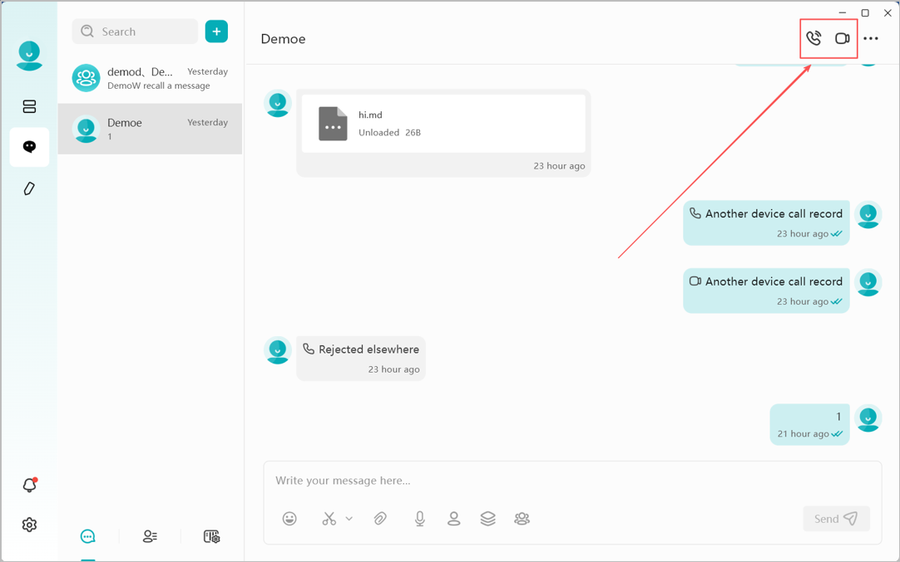
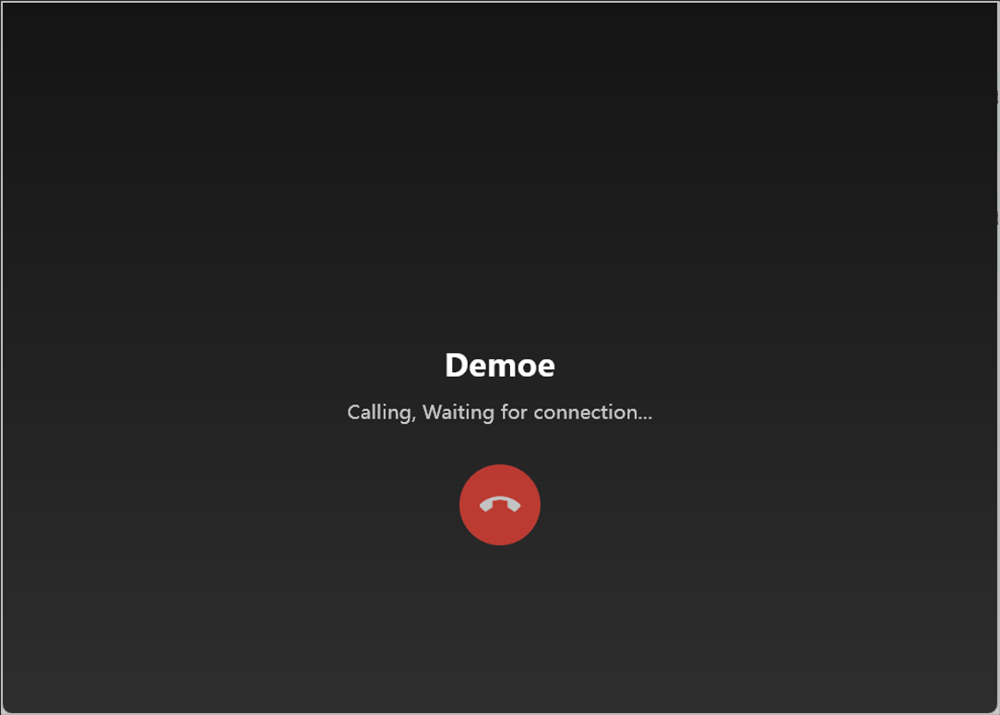
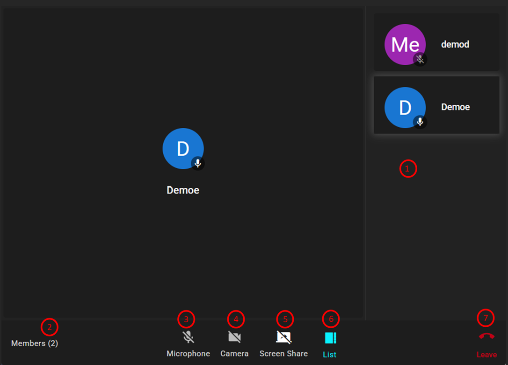
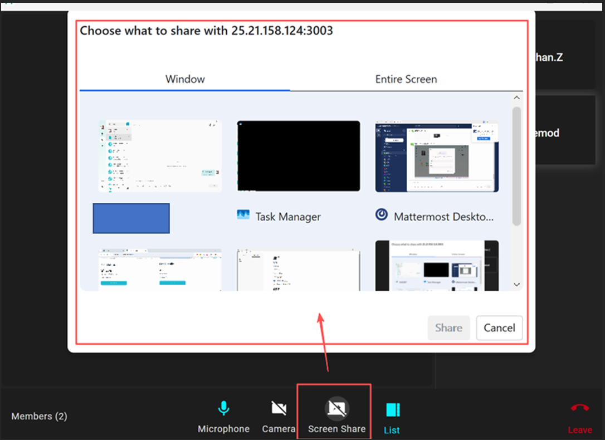
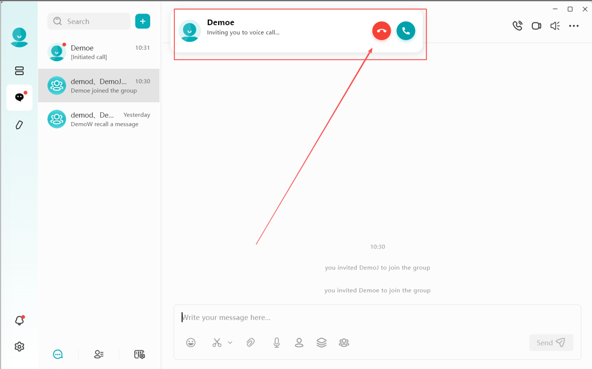
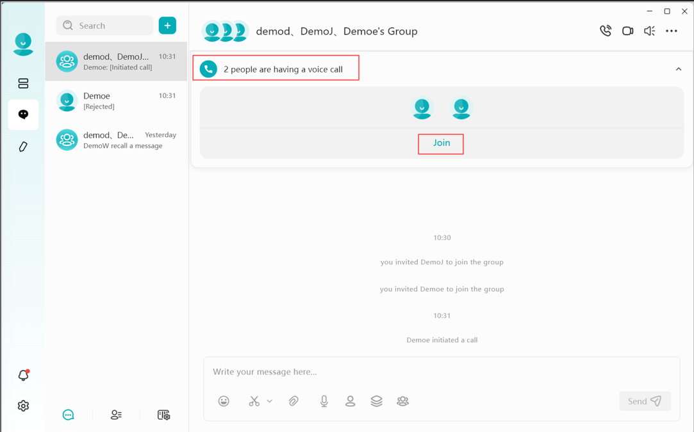

# Voice & Video Calls
In addition to text-based messaging, the IM module supports high-quality voice and video calls. You can initiate a call within a one-on-one private chat or a group conversation.
* **One-on-One Calls:** **Supports private voice or video sessions.
* **Group Calls:** Supports multi-user voice or video conferencing.

Call Features:

* **Voice Calls:** The camera is **disabled by default**.  You can choose to turn on your camera at any point during the conversation.
* **Video Calls:** The camera is **enabled by default**. You have the option to turn off your camera at any time during the call. 

## Initiating a Voice/Video Call

1. Open a chat window and click on the **Voice Call** or **Video Call** icon in the top-right corner of the screen.

2. The system will enter the **Calling Interface**.

3. Once the other party (or parties) accepts the invitation, you will enter the **Voice/Video Call Interface**.

## Voice/Video Call Features

Inside the call interface, the following functions are available:
1.	**Participant View:** Displays the list of people in the call. You can toggle between List View and Grid View (using button ⑥).
2.	**Member Count:** Shows the total number of participants currently in the call.
3.	**Mute/Unmute:** Enable or disable your microphone.
4.	**Camera Toggle:** Turn your camera on or off.
5.	**Screen Sharing:** Share your screen with other participants. You can choose to share a specific application window or your entire screen.
6.	**Layout Switch:** Toggle the display layout between List and Grid modes.
7.	**Leave:** Exit the current session.
        * **One-on-one calls:** Clicking "Leave" will end the call for both parties.
        * **Group calls:** Clicking "Leave" only removes you from the call while others continue.

## Screen Sharing

During a voice or video call, you can click the **Screen Share** button ⑤ at any time to share your terminal's screen.

You can choose from the following sharing modes:
* **Window:** Select a specific application window from your currently open programs to share. Only the selected program interface will be visible to others.
* **Entire Screen:** Selecting this option will broadcast your terminal's complete desktop screen to all other participants in the call.

## Answering Voice/Video Calls

When a friend sends a voice or video call invitation, a call notification will appear at the top of the DASSET interface. You can choose to either **Answer** or **Decline** the call.

## Joining a Group Call

If a call is initiated within a group you belong to, a status indicator will appear within the **Group Chat** window. Click the **Join** button to enter the ongoing group call at any time.

