# Group Chat

DASSET IM supports creating group chats with multiple contacts, making it convenient for small teams to communicate and share information.

## Create a Group Chat
1.  Click **+  New Conversation**, or use the **New Conversation** button.

2.  In the contact selection window, select multiple contacts.

3.  Click **Confirm** to create the group chat.

## Manage Group Members
You can manage group members at any time, including viewing, adding, or removing participants.
1.  In the group chat window, click the **\...** menu in the top-right corner.

2.  Select **Add Member** to invite additional contacts connected to the same chat server.

3.  Select **Remove Member** to remove a participant from the group. Only the group creator can remove members.

## Set Group Member Remarks
You can set personalized remarks for members of the group within a group chat, making it easier to identify participants.
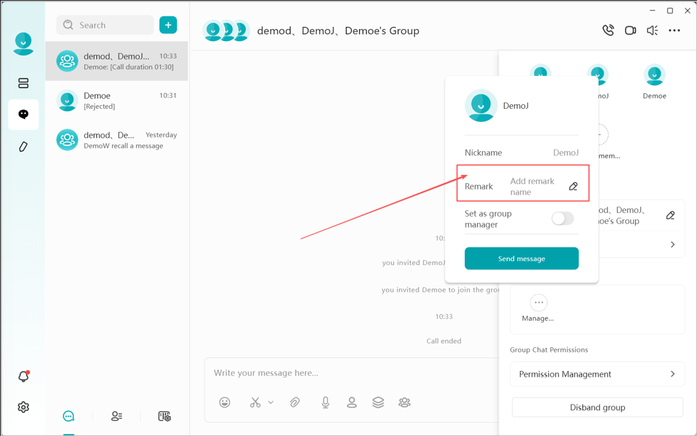

## Group Administrator Settings
Group owners can appoint **Group Administrators** to assist in managing the chat as the number of participants grows.

* **Permissions:** The specific management rights and authorities of a Group Administrator are configured via the **Group Chat Permissions** function.

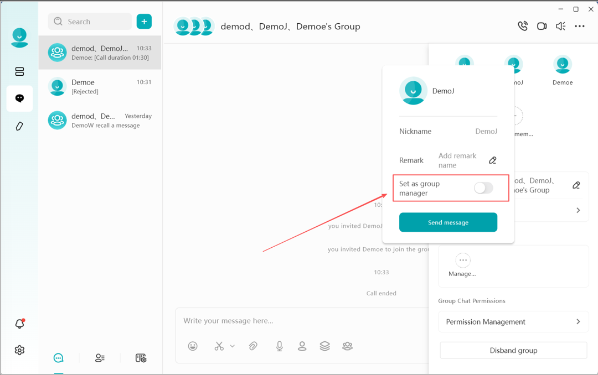

## Change Group Name
The group creator can rename the group for easier identification. Click the edit icon next to the group name to enter a new name.

## Group Notice
Group notices are specially formatted messages that are sent to all group members in the group chat that can be used for announcements or other items that require all member's attention.  More than one group notice can be present in a group chat and additionally group notices can be "pinned" to the chat if desired.

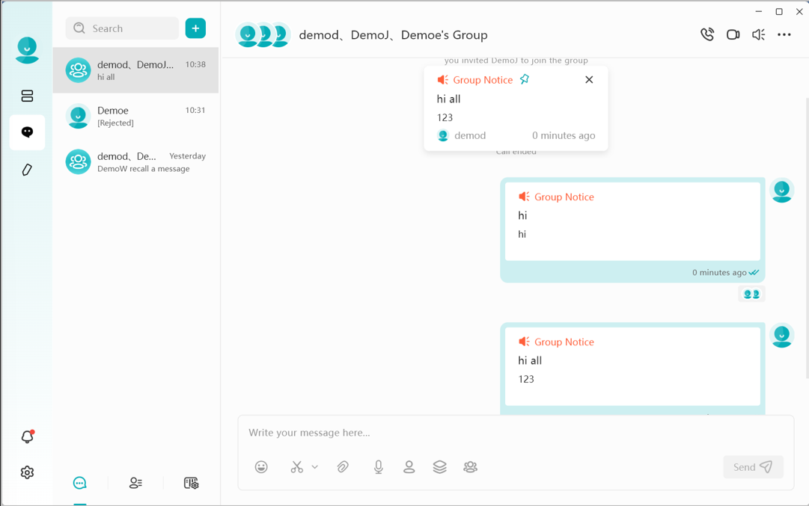

### Creating a Group Notice

1. Click the **Group Notice## icon or section within the group settings.

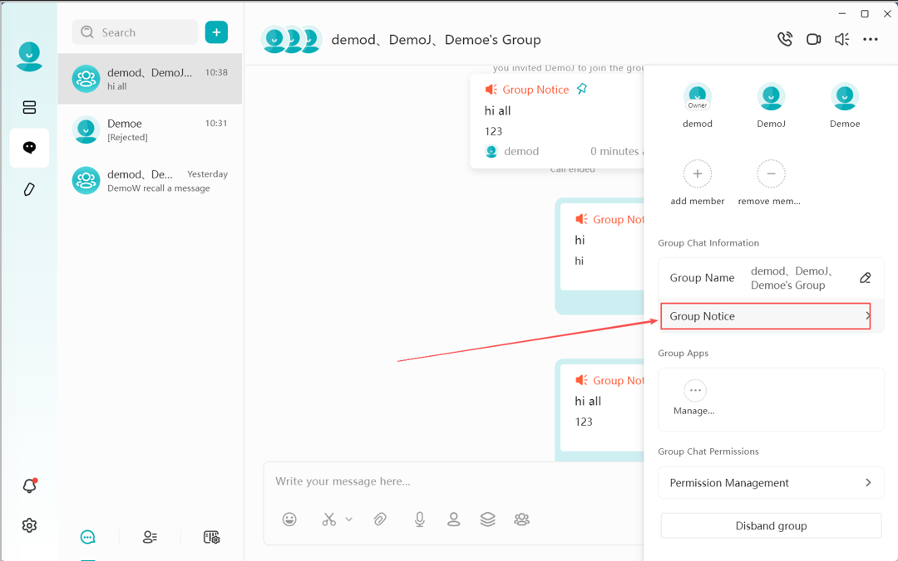

2. Click the **+** icon

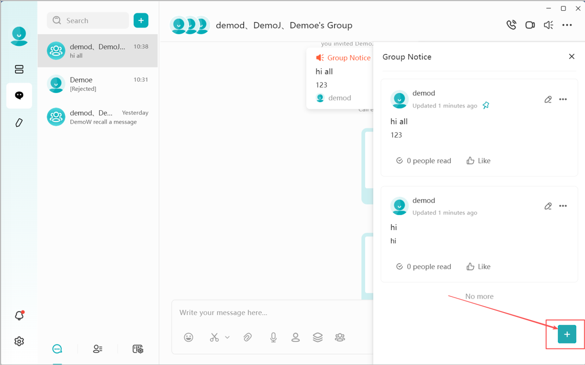

3. Enter a **Title**, which will be a large font in the announcement, other details will be standard text format unless you choose to do special formatting by accessing the format toolbar.

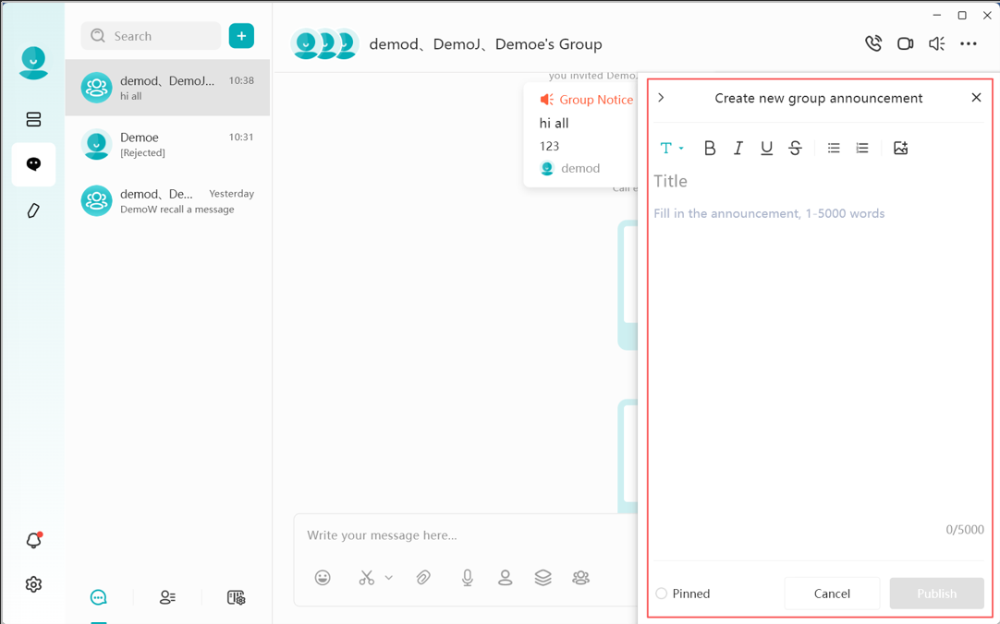

4. Clicking **Publish** will post the group notice in the chat in addition to notifying all all group chat members.

### Viewing Group Notices

Enter the **Group Notice** section to view all currently published notices.  The ability to see which members have read or "liked" the notice are available, in addition to the ability to edit the contents of the notice.

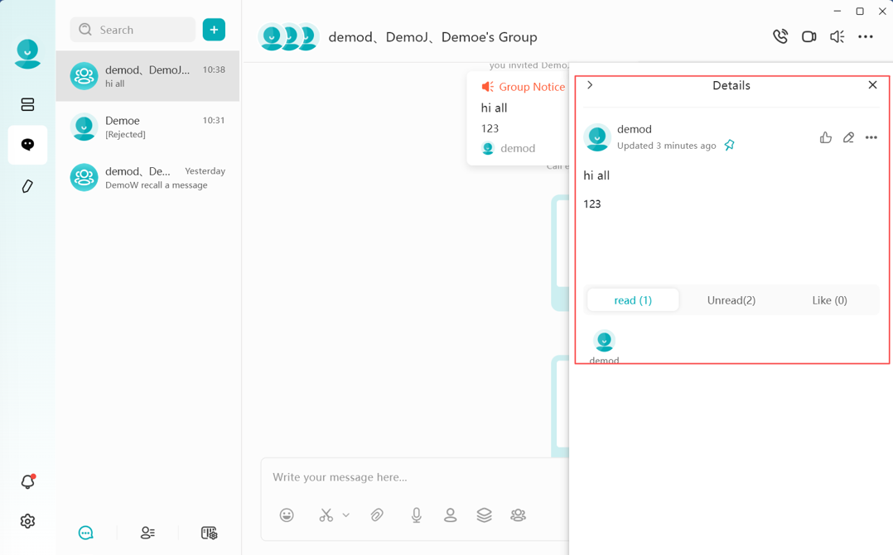

### Editing Group Notices

Within the Group Announcement list, click the **Edit** icon to modify the content of a previously published announcement.

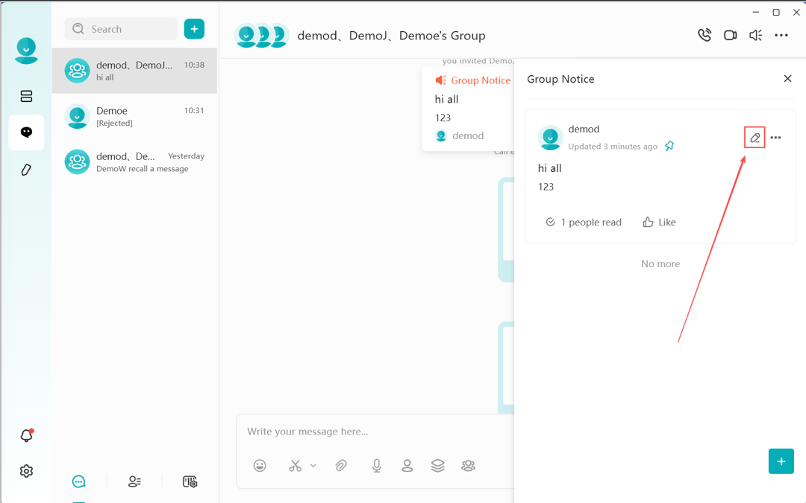

### Pinning and Deleting Group Notices

In the announcement list, click the ellipsis (three dots) icon to perform the following actions:

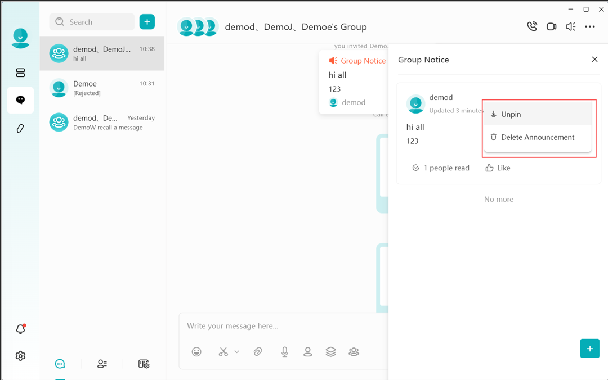

* Pinned announcements are displayed prominently at the very top of the group chat window.
  * Multiple announcements can be pinned simultaneously.
  * Group members can click the **X** button to hide a specific pinned announcement from their view.
* Delete Group Notice permanently removes the notice from the group chat.

## Group Apps

You can add specialized applications to a group chat to extend its functionality and provide more collaborative tools.  

Click **Manage** under the Group Apps section to add or remove available Group Apps.

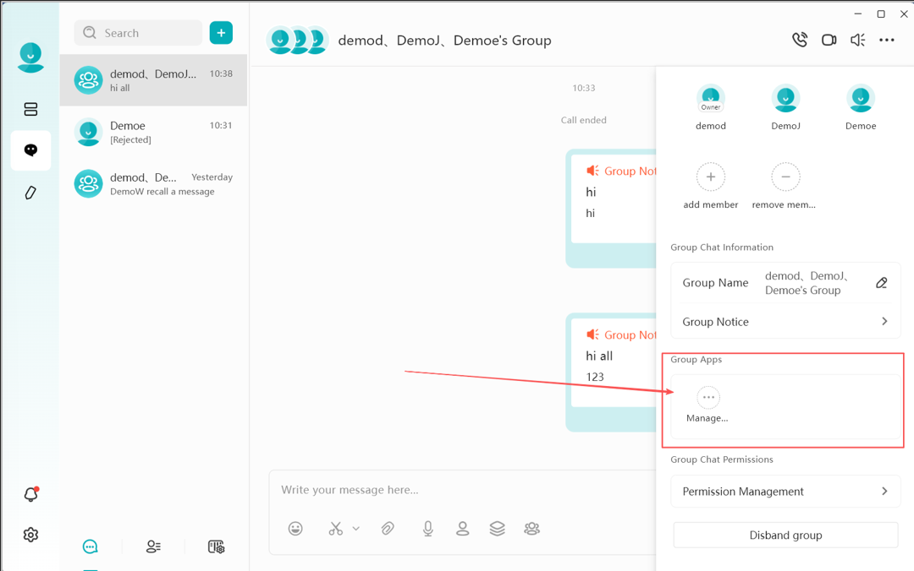

The following Group Apps are currently available for use

* **Group Files:** Provides a dedicated space to manage and share files within the group.
* **To-do:** Provides a collaborative tracking task manager for members of the group.

By clicking the **+** or **-** icon next to the group app adds or removes the application (respectively) for use by the group.

### Group Files

Files sent within a group chat can be centrally managed through the **Group Files** feature.  To access Group Files, click the ellipsis in the Group settings and click on **Group Files**

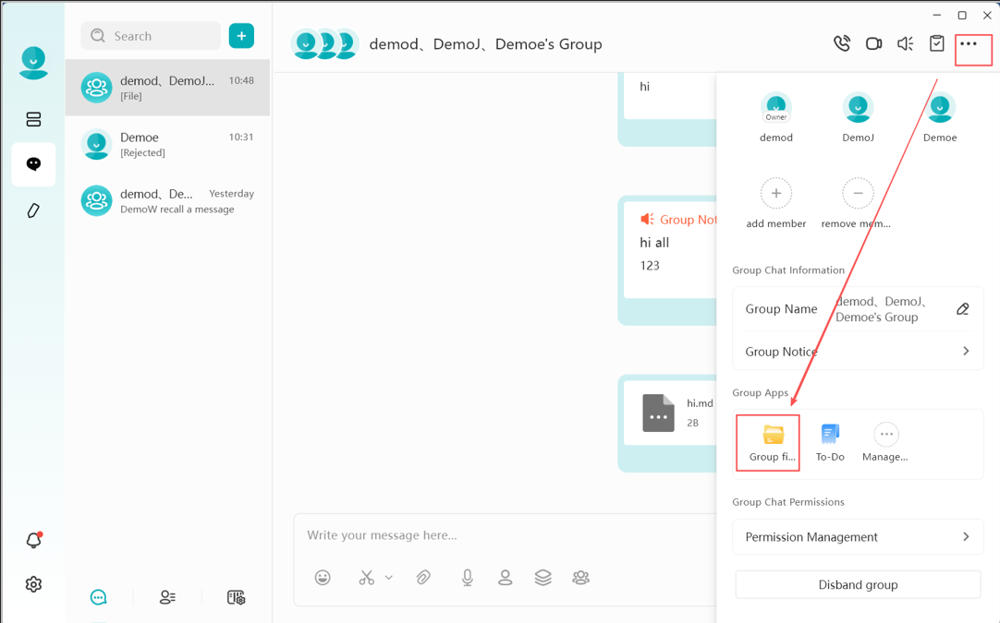

Within the **Group Files** application, you can perform the following actions:

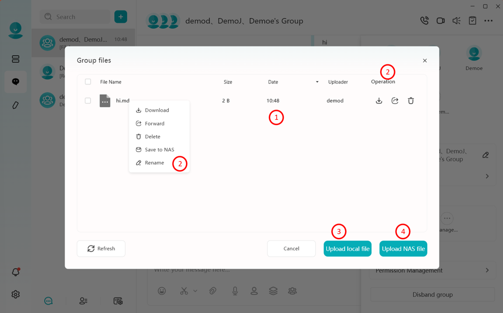

1.	**File List View:** View detailed information for all shared files, including File Name, Size, Upload Date, and the Uploader's identity.
2.	**File Operations:**
    * **Download (All Members):** Save the file directly to your local computer or device.
    * **Forward (All Members):** Share the file with other contacts or group chats.
    * **Delete (Creator & Uploader Only):** To maintain data security, only the Group Creator or the original file uploader has the authority to delete files from the Group Files list.
    * **Save to NAS (All Members):** Users can click "Save" to transfer the file directly to their Personal Space on the current NAS.
    * **Rename (Group Creator Only):** The group creator has the authority to modify file names for better organization.
3.	**Upload Local Files:** Select files from your local terminal to upload to the group.
Note: Once uploaded, a file message will be automatically generated and sent to the group chat for all members to see.
4.	**Upload NAS Files:** Directly select files stored on your NAS to share with the group.

:::info

Similar to local uploads, sharing a NAS file will automatically post a notification message in the group chat.

:::

## To-do

The Group To-do feature allows you to convert an existing chat message into a task or create a brand-new to-do item directly within the application.

### Converting Group Messages to To-do Tasks

You can quickly turn important chat content into actionable tasks by right-clicking on a message and select **Convert to To-Do**.

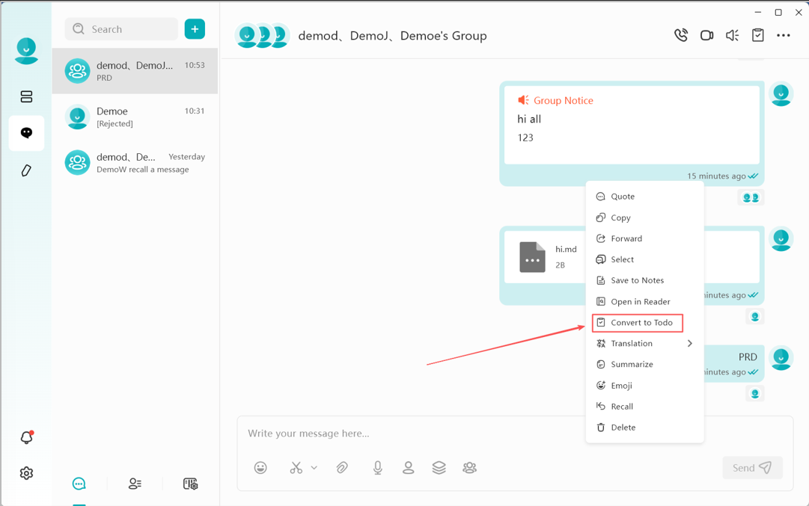

In the To-do task creation window, you can perform the following:

1. **AI Organization:** Invoke AI models to analyze the message and automatically generate a summarized title and description.
2. **Title:** Manually enter or edit the task title.
3. **Description:** Provide specific details or notes for the task.
4. **Assignees:** Assign the task to specific group members (multiple assignees supported).
5. **Deadline:** Set a due date and time for task completion.
6. **Priority:** Set the task urgency level to Urgent, High, Medium, or Low.
7. **Attachments:** Attach relevant files from your local terminal or DASSET device.

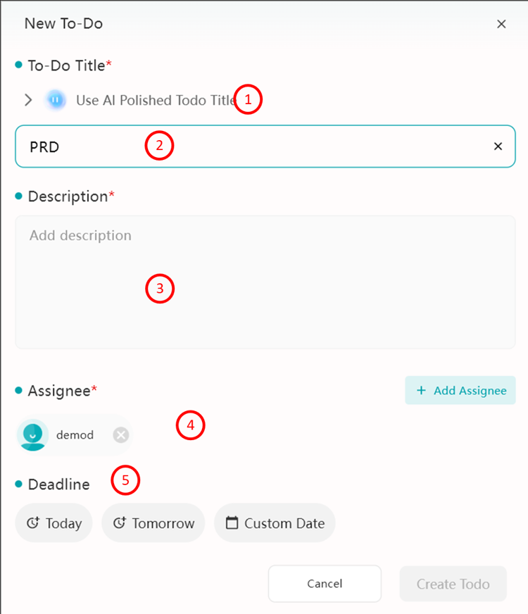
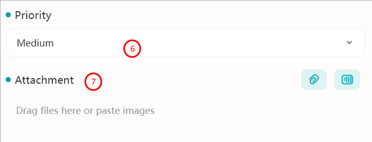

Once configured, click **Create To-do**.  Once created, a to-do notification will be posted in the chat to inform the group.  The newly created task will appear in the **Group To-do list** for centralized tracking.

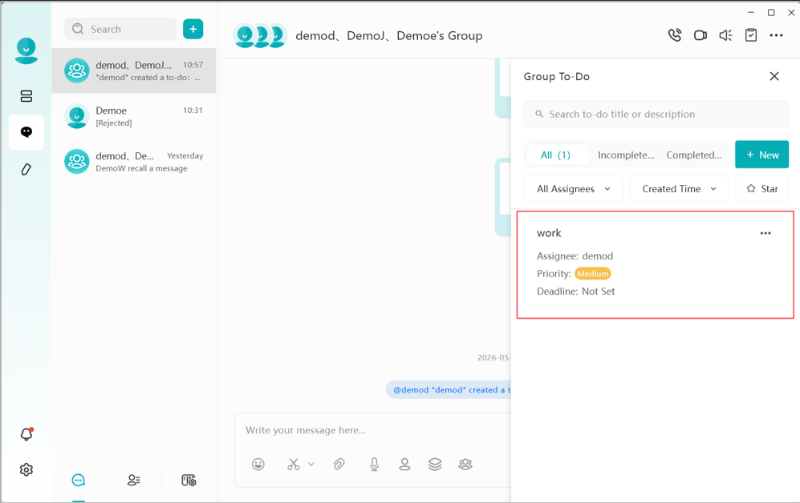

### Creating New To-do Tasks

When creating a new to-do task, simply click the **+New** button which brings-up the same creation interface as described above when converting a message to a to-do task.

### To-do Management

Managing a list of to-do tasks can be made easier by searching, filtering and sorting:

1.	**Search:** Quickly locate tasks using keywords.
2.	**Status Filter:** Filter tasks by All, Completed, or Incomplete.
3.	**New Task:** Direct entry point to create a new task.
4.	**Assignee Filter:** Toggle between viewing All Assignees or tasks where "I am the Assignee."
5.	**Sorting:** Sort tasks by Creation Time, Priority, or Deadline.
6.	**Starred:** Filter to view only tasks marked with a star.
7.	**Task List:** Displays titles, assignees, priority levels, deadlines, and completion status.
8.	**Add Star:** Mark specific tasks as important.
9.	**Delete:** Remove a to-do item permanently.

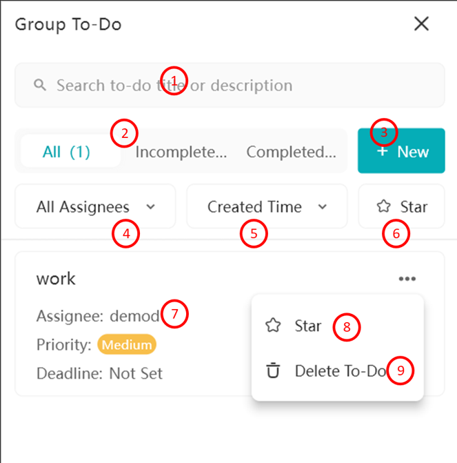

### Completing To-do Tasks

When a task is finished, the assignee can click the task in the Group To-Do list or the notification in the chat window to open the details and mark it as done:

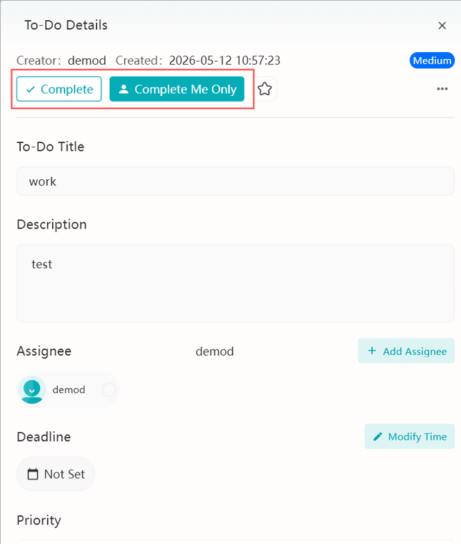

* **Complete To-Do:** Confirms the entire task is finished. The task status in the group list will change to **Completed**.
* **Completed by Me Only:** Use this if the overall task is ongoing but your specific portion of the work is finished.

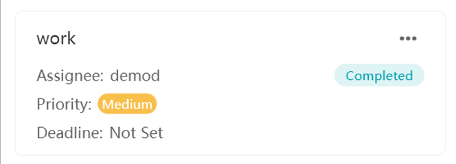

## Group Chat Permissions

Granular permissions can be set for members of the group by clicking **Permission Management** under **Group Chat Permissions**.

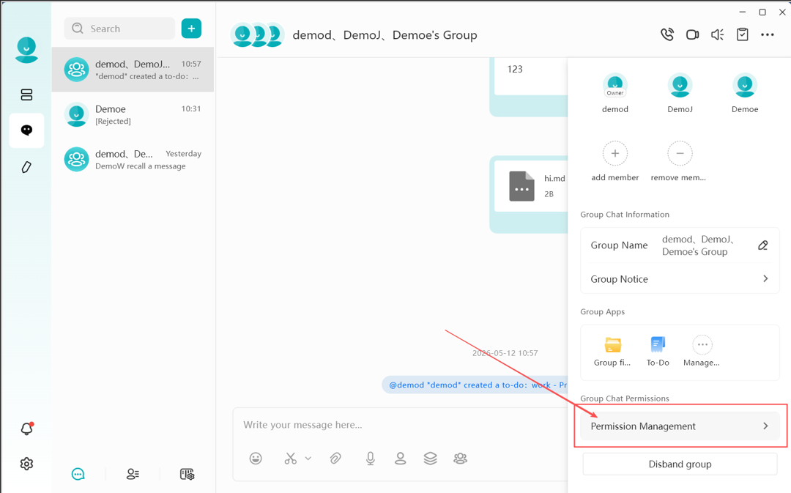

**Configurable Permissions:**
* **@All Permissions:** Controls who can use the @all mention.
* **Announcement Management:** Controls who can post or manage group announcements.
* **To-Do Management:** Controls who can create or manage group tasks.

**Available Roles for Each Permission:**
* **Owner Only:** Only the group creator has authority.
* **Owner & Administrators:** Both the creator and appointed admins have authority.
* **All Members:** Everyone in the group can perform the action.

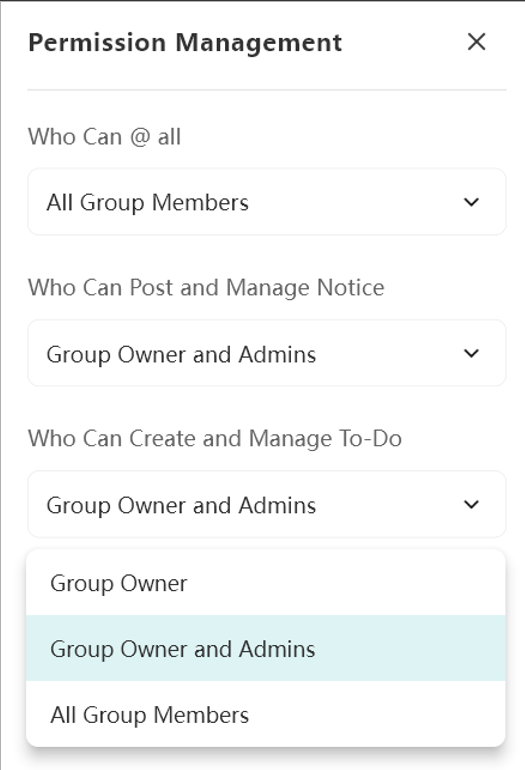

## Automatic Chat Translation

You can enable the **Auto-Translate** feature within any chat conversation. Once activated, the AI Agent will automatically translate all incoming and outgoing messages into your specified language.

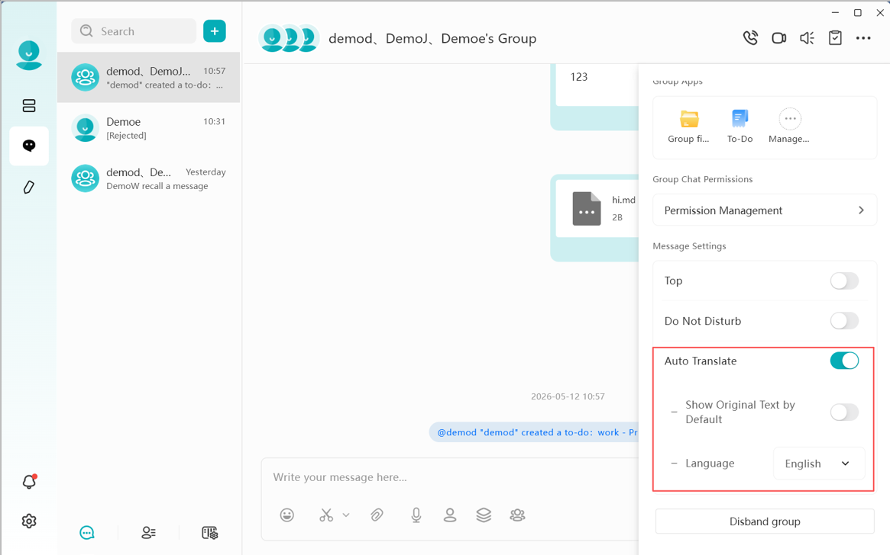

## Pin Group Chat
Group chats can be pinned to the top of the list of chats by enabling **Top** in the group chat settings.

## Mute Notifications
Enable **Do not Disturb** to stop receiving alerts for new messages in the group.

## Disband Group
The group creator can disband the group:
1.  In the group chat window, click the **\...** menu  **Disband Group**.
2.  Click **Confirm** to delete the group.

## Leave Group
Any group member can exit the group at any time:
1.  In the group chat window, click the **\...** menu  **Exit the Group**.
2.  After leaving, you will no longer receive messages from that group.

## Scheduled Meetings
Scheduled meetings can be enabled in a group chat.

You can schedule a meeting in advance and invite specific users to join. Before the meeting starts, invited users can join the meeting directly, making it easier to arrange meeting times.

* Create a meeting
* Close a meeting
* Search the meeting list by keyword

### Create a Scheduled Meeting

1.	Enter the group chat screen, then click the **Scheduled Meeting** button in the upper-right corner > **Create Meeting**.

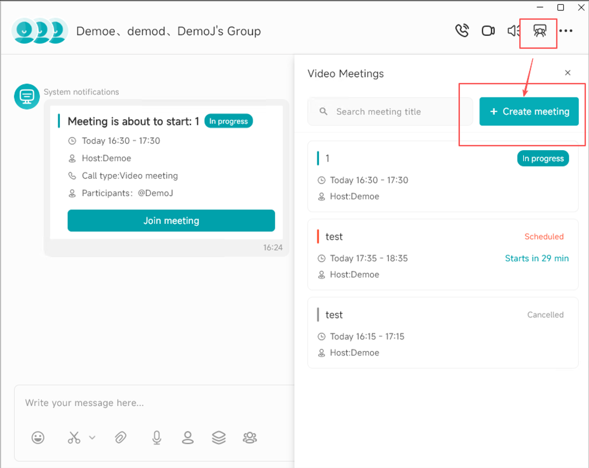

2.	In the scheduled meeting editing window, you can configure the following settings:

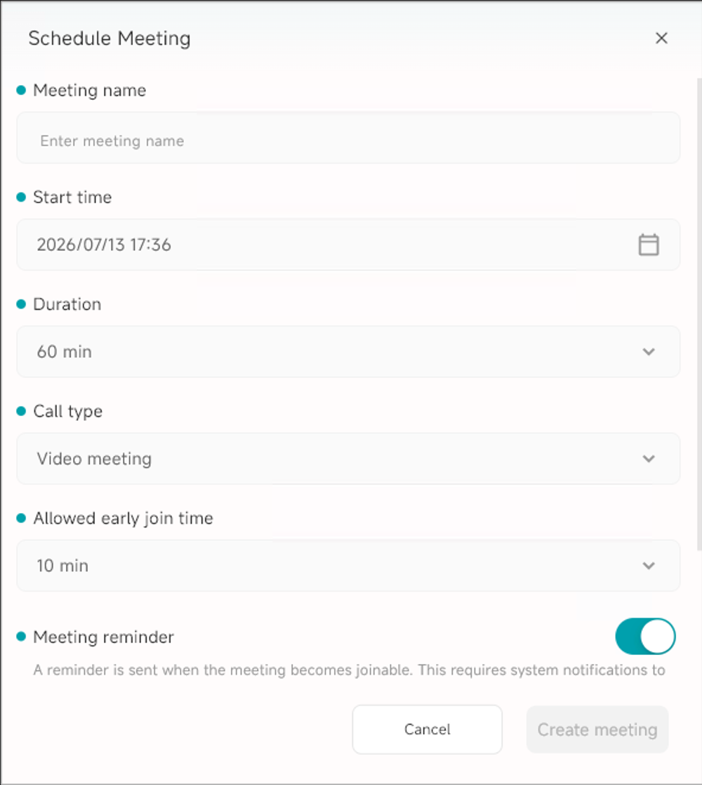

* **Meeting Name:** Enter the meeting name or subject.
* **Start Time:** Set the meeting start time.
* **Duration:** Set the meeting duration.
* **Call Type:** Video meeting or audio meeting.
* **Allow Participants to Join Early:** Specify how long before the scheduled start time participants are allowed to join.
* **Meeting Reminder:** Before enabling this option, a group administrator must first enable system notifications for the group chat.

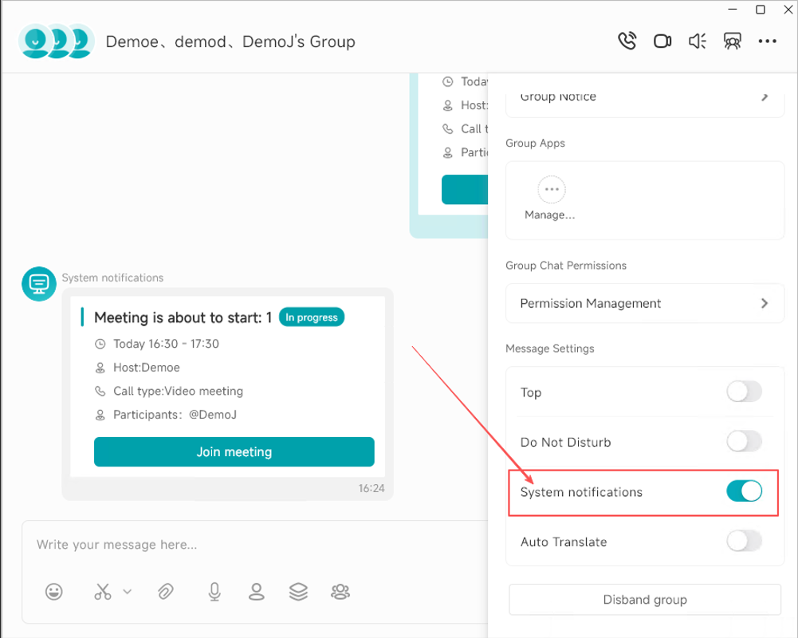

After meeting reminders are enabled, an automatic reminder message will be sent in the group chat shortly before the meeting starts.

* **Custom Participants:** Select the group members to invite to the meeting. Users who are not selected will not be able to join the meeting.

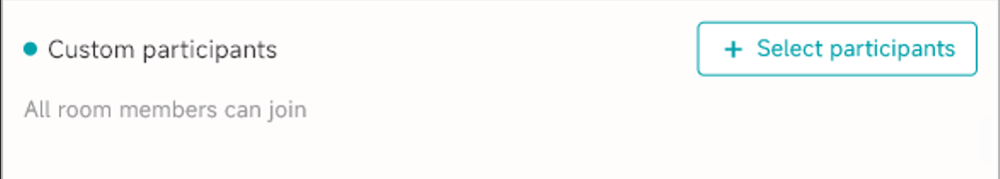

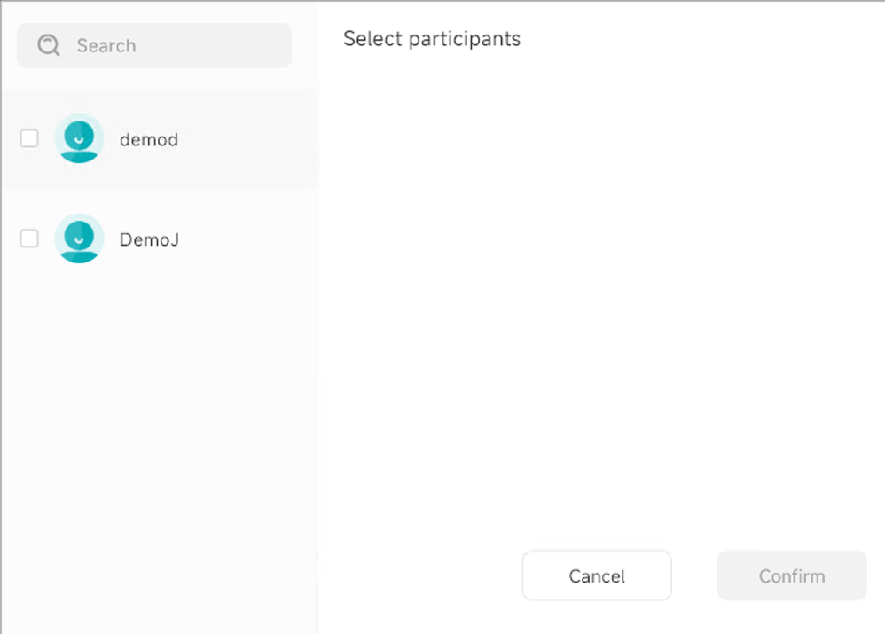

3.	After the meeting is created, a scheduled meeting record will appear in the scheduled meeting list. The meeting organizer will also automatically send a scheduled meeting notification message in the group chat.

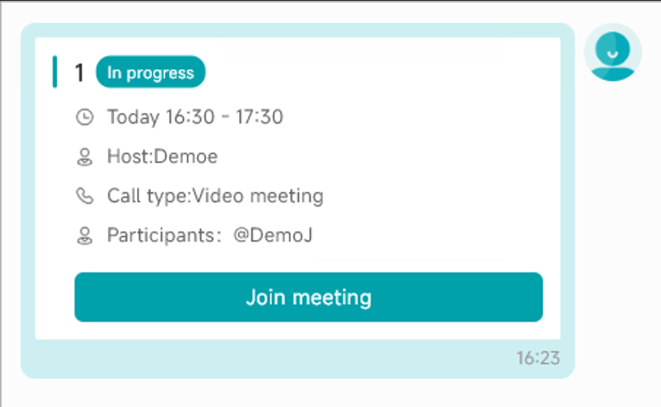

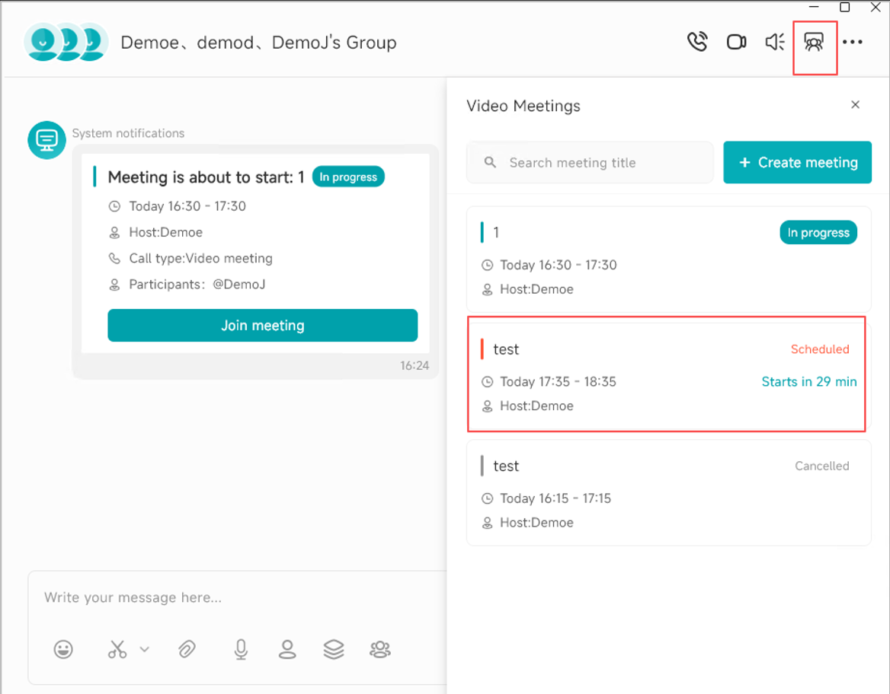

### Join a Scheduled Meeting

There are several ways to join a scheduled meeting:
1.	In the scheduled meeting window, view the list of current scheduled meetings and click a meeting to join it.

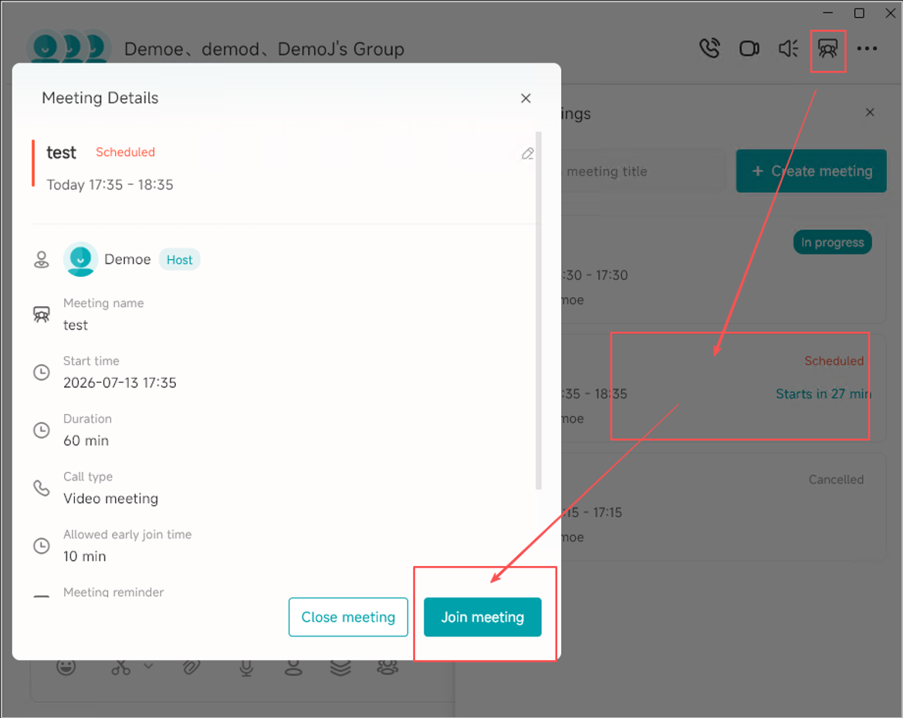

2.	In the chat history, click a scheduled meeting card sent by a user or a meeting notification card to join the meeting.

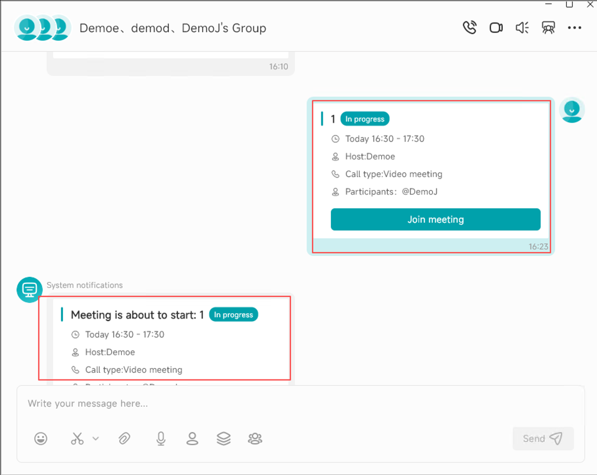

### Close a Scheduled Meeting

The meeting organizer can close a scheduled meeting that has already been created.
Click the scheduled meeting card or select the meeting from the scheduled meeting list. In the meeting details window, click **Close Meeting**.

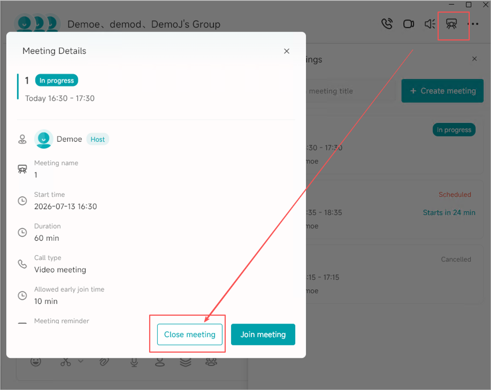

After the meeting is closed, its status in the meeting list will be displayed as **Canceled**.

A canceled meeting cannot be joined again.