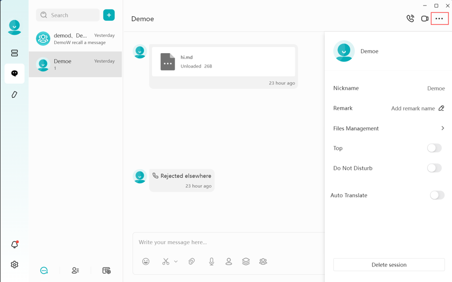
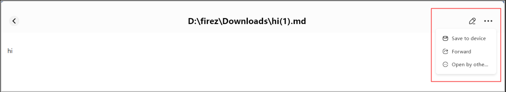
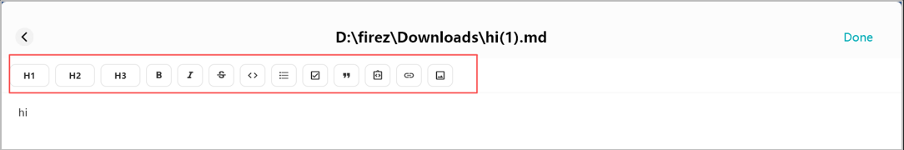
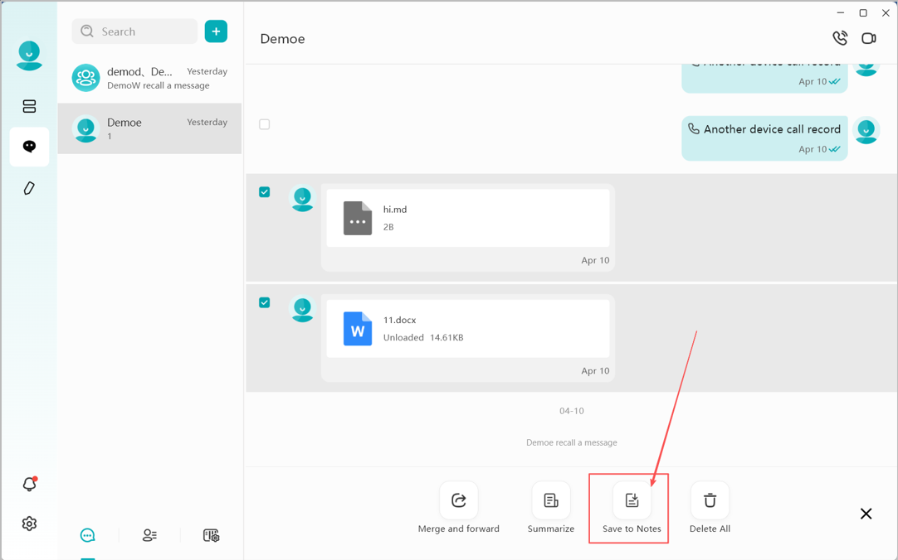
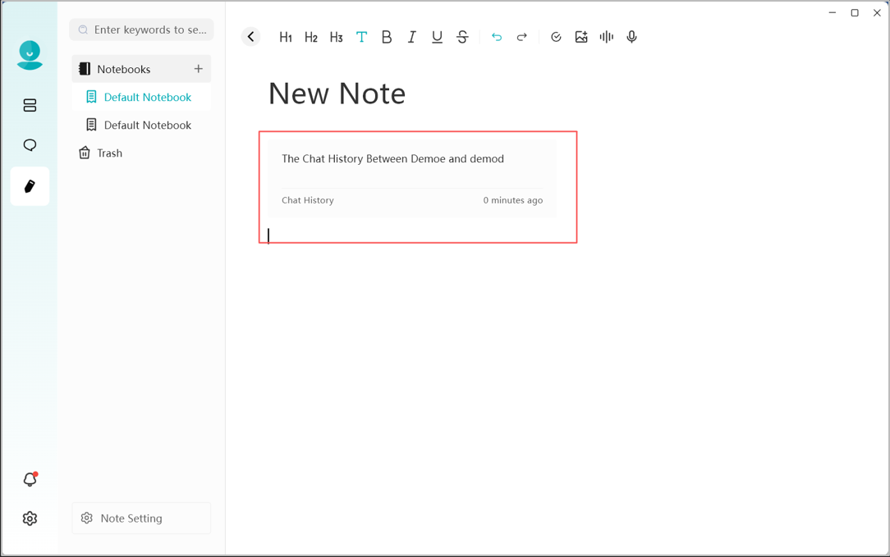
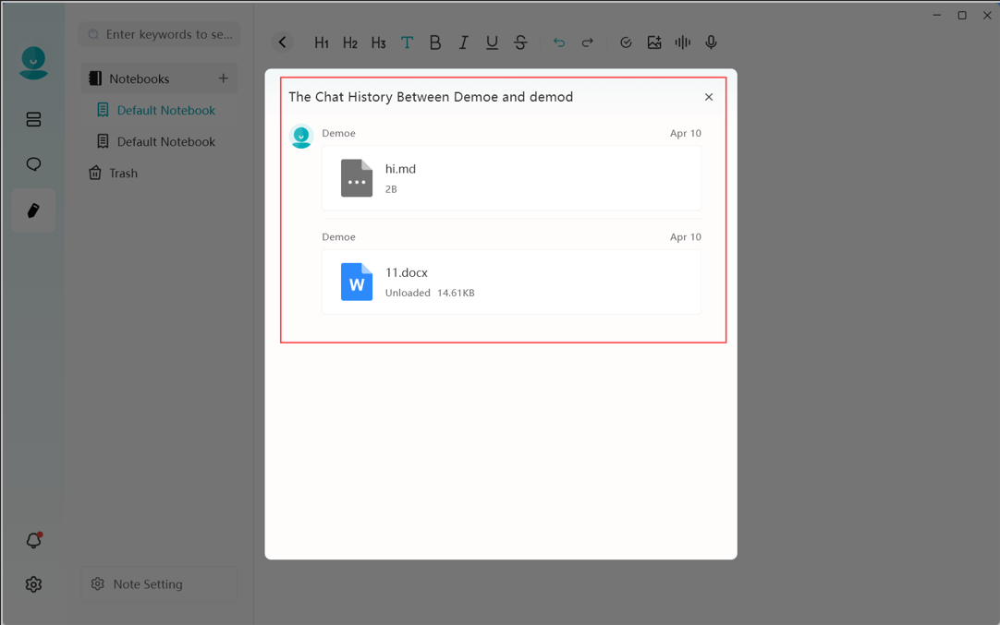

# Instant Messaging (IM)

DASSET IM is a fully private messaging application that runs and stores data on your DASSET device.  It provides text chat capabilities, as well as real-time translation of multiple languages, and provides voice and video call capabilities as well.  Additionally, private groups can be created enabling the ability to easily share files with the group as well a create shared task lists complete with priorities and due dates.

The DASSET IM feature supports the following operations:
1.  **Quote**: Reply to a specific message by quoting it.
2.  **Copy**: Copy the content of a message.
3.  **Delete**: The sender can delete a message. Once deleted, it is also removed from the recipient's chat history.
4.  **Preview media**: View pc-images, play videos, and listen to audio files shared in the chat.
5.  **Document preview and editing**: Open and edit documents directly from the chat.
6.  **Save files**: Save received chat files to your local device.
7.  **Send files**: Share files stored on the DASSET device into the chat.
8.  **Message status**: Check whether a sent message is marked as **Read** or **Delivered**.
9.  **AI Agent support**: Use AI-powered features such as translation, summarization, reply suggestions, and speech-to-text recognition.

## Selecting a Chat Server

When using DASSET IM for the first time, you must select a DASSET device to act as your **chat server**. Once selected, you can freely chat with all users connected to that device, and all chat history will be stored on the same server. Each chat server runs on a single DASSET device. All users bound to that device can communicate with each other through the server.

- **Note 1**: To protect user privacy, DASSET does not automatically create chat server accounts for all users bound to a device. If users on the same device want to chat with each other, they must first select the same chat server.
- **Note 2**: Each chat server is independent. Think of it as having a private WhatsApp server hosted in your home or office. Only users connected to the same server can communicate. DASSET users on different servers cannot chat with each other.
- **Note 3**: Cross-server instant messaging is not supported. Accounts connected to different chat servers cannot communicate across devices.

When you first enter the chat interface, DASSET displays all the DASSET devices bound to your account and prompts you to select one as your chat server. If a device does not support the chat application, you will see a red message stating **This device does not support chat services**. This usually occurs because the device firmware has not been updated to the latest version or the hardware is not capable of running chat services. A single account can bind to multiple chat servers, but you can only be connected to one chat server at a time. Chatting is limited to users on that active server.

You may switch servers at any time to view messages from users on other chat servers.

## Chat Interface Overview

After selecting a chat server, you will enter the DASSET chat interface:

1.  **Search:** Search for contacts with whom you already have active conversations.
2.  **Add (+):** Select users connected to the current chat server to start a first-time conversation, or invite new users to join the server (available only to the device Owner).
3.  **New Conversation:** Start a first-time chat with users connected to the current chat server.
4.  **Conversation List:** Switch to view the list of chat conversations.
5.  **Contacts:** View all users currently on the selected chat server.
6.  **Switch Chat Server:** Switch between multiple chat servers at any time to communicate with users on different servers.
7.  **Chat Window:** Displays chat messages and conversation history.

## Viewing the Contact List

When you open the contact list, you can see all user accounts currently connected to the selected chat server:

1.  **Contact List:** Displays the names of all contacts.
2.  **Remarks:** Add or edit notes for contacts to make them easier to remember.
3.  **Phone Number:** View the contact's registered phone number.
4.  **Email Address:** View the contact's registered email address.
5.  **Send Message:** Start a conversation with the selected contact.

## Switching Chat Servers

Click **Switch Server** to log in to another chat server and communicate with contacts connected to it.
- At any given time, you can only be connected to **one chat server**, and you may chat only with users on that server.
- The server list will only display your bound DASSET devices that support chat services.

## New Message Notifications

When a new message arrives, the DASSET client notifies you in two ways:
1.  A **red dot** appears on the chat icon in the client.
2.  A **red dot** appears on the contact's avatar in the chat interface.

## Instant Chat Window

In DASSET IM, you can chat one-on-one or create group chats with users connected to the same chat server. The chat interface is designed to be familiar and intuitive, similar to other mainstream IM tools.

1.  **Conversation Tabs:** Switch between different chat conversations. Right-click on any chat record to:
    - **Pin** the conversation
    - **Mute Notifications**
    - **Delete** the conversation
  

2.  **Chat Window:** Displays the conversation history.
3.  **Input Box:** Supports text input and pasting pc-images. Also supports sending long text and Markdown-formatted content. Messages exceeding 5000 characters will be automatically converted into a file for sending.
4.  **Emojis:** Insert emojis into your messages.
5.  **Screenshot:** Takes a screenshot for insertion into your chat. 
7.  **Local Attachments:** Send files stored on your computer.
8.  **Voice Messages:** Record and send voice messages.
9.  Send files from the "My Space" on the DASSET device that hosts the current IM chat server.
10. Send files from the "Public Space" on the DASSET device that hosts the current IM chat server.
11. Send files from the "Group Space" on the DASSET device that hosts the current IM chat server.
12. **Send Message:** Deliver the composed chat message.
13. **Voice Call:** Initiates a voice call with the participant(s) of the chat.
14. **Video Call:** Initiates a video call with the participant(s) of the chat.
15. **Chat Information Panel:** View and manage details of the chat partner or group:
    - View avatar
    - View nickname
    - Edit remarks
    - Pin the conversation
    - Mute the conversation
    - **Delete Conversation**: Permanently remove the chat from your view. 
    
    :::warning
    
     Deleting a conversation removes all records from your side. Even if you start a new chat, previous messages will not be visible. However, the recipient's chat history will still remain intact.

    :::

## Chat Message Interactions

In the chat window, you can right-click on historical chat records to perform the following actions:
1.  **Quote**: Reply to a specific message by quoting it.
2.  **Copy**: Copy the content of the selected message.
3.  **Image Recognition**: Supports AI integration to analyze and interpret the content of images.
4.  **Text Recognition (OCR)**: Supports AI-powered automatic identification and extraction of text from images.
5.  **Speech Recognition**: The AI Agent automatically recognizes voice messages and converts them into text output.
6.  **Forward**: Forward the message to another user.
7.  **Multi-Select**: Select multiple messages for combined forwarding or deletion.
8.  **Save to NAS**: Save attachments from the chat directly to your DASSET device.
9.  **Save to Notes**: Save single or multiple chat messages directly to your notes. A new note containing the selected messages will be automatically created.
10. **Open in**: Open selected chat messages in the built-in Markdown editor for viewing and editing.
11. **Download**: Download attachments to your local computer.
12. **Emoji**: Respond to a message with an emoji.
13. **Recall**: Withdraw a message you sent.
14. **Delete**: Delete selected messages.
    :::warning
        Deletion only removes the message from the current terminal. If you log in from another terminal, the deleted message will still be visible. To ensure the message is removed from all terminals and the recipient, use Recall instead.
    :::
15. **Open**: Preview attachments directly if supported.
16. **Online Editing**: Access and edit Word, PDF, Excel, and PPT documents online via third-party Office applications installed on your DASSET device. Note: This feature is only available on supported device models.
17. **URL Links:** If a chat message contains a URL, clicking it will open the link in your browser.

### Open in Reader
You can select a chat message (sent by yourself or others), right-click, and select Open in Reader. DASSET will automatically open the message using its built-in Markdown editor.

In the built-in reader, you can:
* **Read:** View the content in a clean, formatted layout.
* **Edit:** Modify the text as needed.
* **Save to Device:** Save the message as a .md file directly to your DASSET device.
* **Forward to IM:** Send the generated Markdown file to other chat contacts.
* **Open with Local App:** Open the file using other Markdown editors installed on your computer.

**Editing Mode:** To edit the Markdown file, click the Edit icon in the top right corner. The editor includes the following features:
* Set hierarchical Headings.
* Standard text formatting: Bold, Italic, Strikethrough, and Numbered Lists.
* Insert Code Blocks, Image URLs, and Hyperlinks.
* Create Task Lists.
* Once finished, click Done to preview the modified file.

### Save to Notes
You can select one or multiple messages and save them directly to your personal notes.
* **Operation:** After selecting the messages, click **Save to Notes**.

* **Auto-Redirect to Notes:** The application will automatically jump to the **Notes** interface and generate a new entry.

* **View Details:** Click on the chat history window within the note to view the specific content of the saved messages.

### Online Editing
The IM module supports online editing for document attachments. You can access this by right-clicking a file and selecting the **Online Editing** function.
* **Supported Formats:** View and edit common document types, including .docx, .pptx, and .xlsx.
* **Markdown Files:** For .md files, simply double-click the file within the chat to preview or edit it directly.
* **File Saving:** After editing, changes are automatically saved to the local file downloaded on your terminal.
Note: Editing a file will not modify the original source file already sent in the chat history.

:::info

Editing a file will not modify the original source file already sent in the chat history.

:::

## Voice & Video Calls
In addition to text-based messaging, the IM module supports high-quality voice and video calls. You can initiate a call within a one-on-one private chat or a group conversation.
* **One-on-One Calls:** **Supports private voice or video sessions.
* **Group Calls:** Supports multi-user voice or video conferencing.

Call Features:

* **Voice Calls:** The camera is **disabled by default**.  You can choose to turn on your camera at any point during the conversation.
* **Video Calls:** The camera is **enabled by default**. You have the option to turn off your camera at any time during the call. 

### Initiating a Voice/Video Call

1. Open a chat window and click on the **Voice Call** or **Video Call** icon in the top-right corner of the screen.

2. The system will enter the **Calling Interface**.

3. Once the other party (or parties) accepts the invitation, you will enter the **Voice/Video Call Interface**.

### Voice/Video Call Features

Inside the call interface, the following functions are available:
1.	**Participant View:** Displays the list of people in the call. You can toggle between List View and Grid View (using button ⑥).
2.	**Member Count:** Shows the total number of participants currently in the call.
3.	**Mute/Unmute:** Enable or disable your microphone.
4.	**Camera Toggle:** Turn your camera on or off.
5.	**Screen Sharing:** Share your screen with other participants. You can choose to share a specific application window or your entire screen.
6.	**Layout Switch:** Toggle the display layout between List and Grid modes.
7.	**Leave:** Exit the current session.
        * **One-on-one calls:** Clicking "Leave" will end the call for both parties.
        * **Group calls:** Clicking "Leave" only removes you from the call while others continue.

### Screen Sharing

During a voice or video call, you can click the **Screen Share** button ⑤ at any time to share your terminal's screen.

You can choose from the following sharing modes:
* **Window:** Select a specific application window from your currently open programs to share. Only the selected program interface will be visible to others.
* **Entire Screen:** Selecting this option will broadcast your terminal's complete desktop screen to all other participants in the call.

### Answering Voice/Video Calls

When a friend sends a voice or video call invitation, a call notification will appear at the top of the DASSET interface. You can choose to either **Answer** or **Decline** the call.

### Joining a Group Call

If a call is initiated within a group you belong to, a status indicator will appear within the **Group Chat** window. Click the **Join** button to enter the ongoing group call at any time.

## One-on-One Chat

### Creating a Chat
1.  Click **+  New Conversation**, or use the **New Conversation** button.

2.  In the contact selection window, choose one or more users to start the conversation.
    - If you select multiple contacts, the conversation will automatically switch to group chat mode.

3.  Click **Confirm** to create the conversation.

### Deleting a Conversation
You can delete an existing conversation with a contact as follows:
1.  In the chat window, click the **\...** menu in the top-right corner and select **Delete Conversation**.

2.  In the confirmation window, click **Confirm** to delete the conversation.
:::warning
Deleting a conversation will remove all chat records with that user from your view. Even if you start a new conversation later, previous messages will not reappear. However, the recipient will still retain the full chat history.
:::

### Pinning Chats and Muting Notifications
In the chat settings window, you can:
- **Top**: Keep the conversation at the top of the chat list.
- **Do Not Disturb**: Disable new message alerts for the conversation.

## Group Chat

DASSET IM supports creating group chats with multiple contacts, making it convenient for small teams to communicate and share information.

### Create a Group Chat
1.  Click **+  New Conversation**, or use the **New Conversation** button.

2.  In the contact selection window, select multiple contacts.

3.  Click **Confirm** to create the group chat.

### Manage Group Members
You can manage group members at any time, including viewing, adding, or removing participants.
1.  In the group chat window, click the **\...** menu in the top-right corner.

2.  Select **Add Member** to invite additional contacts connected to the same chat server.

3.  Select **Remove Member** to remove a participant from the group. Only the group creator can remove members.

### Set Group Member Remarks
You can set personalized remarks for members of the group within a group chat, making it easier to identify participants.

### Group Administrator Settings
Group owners can appoint **Group Administrators** to assist in managing the chat as the number of participants grows.

* **Permissions:** The specific management rights and authorities of a Group Administrator are configured via the **Group Chat Permissions** function.

### Change Group Name
The group creator can rename the group for easier identification. Click the edit icon next to the group name to enter a new name.

### Group Notice
Group notices are specially formatted messages that are sent to all group members in the group chat that can be used for announcements or other items that require all member's attention.  More than one group notice can be present in a group chat and additionally group notices can be "pinned" to the chat if desired.

#### Creating a Group Notice

1. Click the **Group Notice## icon or section within the group settings.

2. Click the **+** icon

3. Enter a **Title**, which will be a large font in the announcement, other details will be standard text format unless you choose to do special formatting by accessing the format toolbar.

4. Clicking **Publish** will post the group notice in the chat in addition to notifying all all group chat members.

#### Viewing Group Notices

Enter the **Group Notice** section to view all currently published notices.  The ability to see which members have read or "liked" the notice are available, in addition to the ability to edit the contents of the notice.

#### Editing Group Notices

Within the Group Announcement list, click the **Edit** icon to modify the content of a previously published announcement.

#### Pinning and Deleting Group Notices

In the announcement list, click the ellipsis (three dots) icon to perform the following actions:

* Pinned announcements are displayed prominently at the very top of the group chat window.
  * Multiple announcements can be pinned simultaneously.
  * Group members can click the **X** button to hide a specific pinned announcement from their view.
* Delete Group Notice permanently removes the notice from the group chat.

### Group Apps

You can add specialized applications to a group chat to extend its functionality and provide more collaborative tools.  

Click **Manage** under the Group Apps section to add or remove available Group Apps.

The following Group Apps are currently available for use

* **Group Files:** Provides a dedicated space to manage and share files within the group.
* **To-do:** Provides a collaborative tracking task manager for members of the group.

By clicking the **+** or **-** icon next to the group app adds or removes the application (respectively) for use by the group.

#### Group Files

Files sent within a group chat can be centrally managed through the **Group Files** feature.  To access Group Files, click the ellipsis in the Group settings and click on **Group Files**

Within the **Group Files** application, you can perform the following actions:

1.	**File List View:** View detailed information for all shared files, including File Name, Size, Upload Date, and the Uploader's identity.
2.	**File Operations:**
    * **Download (All Members):** Save the file directly to your local computer or device.
    * **Forward (All Members):** Share the file with other contacts or group chats.
    * **Delete (Creator & Uploader Only):** To maintain data security, only the Group Creator or the original file uploader has the authority to delete files from the Group Files list.
    * **Save to NAS (All Members):** Users can click "Save" to transfer the file directly to their Personal Space on the current NAS.
    * **Rename (Group Creator Only):** The group creator has the authority to modify file names for better organization.
3.	**Upload Local Files:** Select files from your local terminal to upload to the group.
Note: Once uploaded, a file message will be automatically generated and sent to the group chat for all members to see.
4.	**Upload NAS Files:** Directly select files stored on your NAS to share with the group.

:::info

Similar to local uploads, sharing a NAS file will automatically post a notification message in the group chat.

:::

### To-do

The Group To-do feature allows you to convert an existing chat message into a task or create a brand-new to-do item directly within the application.

#### Converting Group Messages to To-do Tasks

You can quickly turn important chat content into actionable tasks by right-clicking on a message and select **Convert to To-Do**.

In the To-do task creation window, you can perform the following:

1. **AI Organization:** Invoke AI models to analyze the message and automatically generate a summarized title and description.
2. **Title:** Manually enter or edit the task title.
3. **Description:** Provide specific details or notes for the task.
4. **Assignees:** Assign the task to specific group members (multiple assignees supported).
5. **Deadline:** Set a due date and time for task completion.
6. **Priority:** Set the task urgency level to Urgent, High, Medium, or Low.
7. **Attachments:** Attach relevant files from your local terminal or DASSET device.

Once configured, click **Create To-do**.  Once created, a to-do notification will be posted in the chat to inform the group.  The newly created task will appear in the **Group To-do list** for centralized tracking.

#### Creating New To-do Tasks

When creating a new to-do task, simply click the **+New** button which brings-up the same creation interface as described above when converting a message to a to-do task.

#### To-do Management

Managing a list of to-do tasks can be made easier by searching, filtering and sorting:

1.	**Search:** Quickly locate tasks using keywords.
2.	**Status Filter:** Filter tasks by All, Completed, or Incomplete.
3.	**New Task:** Direct entry point to create a new task.
4.	**Assignee Filter:** Toggle between viewing All Assignees or tasks where "I am the Assignee."
5.	**Sorting:** Sort tasks by Creation Time, Priority, or Deadline.
6.	**Starred:** Filter to view only tasks marked with a star.
7.	**Task List:** Displays titles, assignees, priority levels, deadlines, and completion status.
8.	**Add Star:** Mark specific tasks as important.
9.	**Delete:** Remove a to-do item permanently.

#### Completing To-do Tasks

When a task is finished, the assignee can click the task in the Group To-Do list or the notification in the chat window to open the details and mark it as done:

* **Complete To-Do:** Confirms the entire task is finished. The task status in the group list will change to **Completed**.
* **Completed by Me Only:** Use this if the overall task is ongoing but your specific portion of the work is finished.

### Group Chat Permissions

Granular permissions can be set for members of the group by clicking **Permission Management** under **Group Chat Permissions**.

**Configurable Permissions:**
* **@All Permissions:** Controls who can use the @all mention.
* **Announcement Management:** Controls who can post or manage group announcements.
* **To-Do Management:** Controls who can create or manage group tasks.

**Available Roles for Each Permission:**
* **Owner Only:** Only the group creator has authority.
* **Owner & Administrators:** Both the creator and appointed admins have authority.
* **All Members:** Everyone in the group can perform the action.

### Automatic Chat Translation

You can enable the **Auto-Translate** feature within any chat conversation. Once activated, the AI Agent will automatically translate all incoming and outgoing messages into your specified language.

### Pin Group Chat
Group chats can be pinned to the top of the list of chats by enabling **Top** in the group chat settings.

### Mute Notifications
Enable **Do not Disturb** to stop receiving alerts for new messages in the group.

### Disband Group
The group creator can disband the group:
1.  In the group chat window, click the **\...** menu  **Disband Group**.
2.  Click **Confirm** to delete the group.

### Leave Group
Any group member can exit the group at any time:
1.  In the group chat window, click the **\...** menu  **Exit the Group**.
2.  After leaving, you will no longer receive messages from that group.

### Scheduled Meetings
Scheduled meetings can be enabled in a group chat.

You can schedule a meeting in advance and invite specific users to join. Before the meeting starts, invited users can join the meeting directly, making it easier to arrange meeting times.

* Create a meeting
* Close a meeting
* Search the meeting list by keyword

#### Create a Scheduled Meeting

1.	Enter the group chat screen, then click the **Scheduled Meeting** button in the upper-right corner > **Create Meeting**.

2.	In the scheduled meeting editing window, you can configure the following settings:

* **Meeting Name:** Enter the meeting name or subject.
* **Start Time:** Set the meeting start time.
* **Duration:** Set the meeting duration.
* **Call Type:** Video meeting or audio meeting.
* **Allow Participants to Join Early:** Specify how long before the scheduled start time participants are allowed to join.
* **Meeting Reminder:** Before enabling this option, a group administrator must first enable system notifications for the group chat.

After meeting reminders are enabled, an automatic reminder message will be sent in the group chat shortly before the meeting starts.

* **Custom Participants:** Select the group members to invite to the meeting. Users who are not selected will not be able to join the meeting.

3.	After the meeting is created, a scheduled meeting record will appear in the scheduled meeting list. The meeting organizer will also automatically send a scheduled meeting notification message in the group chat.

#### Join a Scheduled Meeting

There are several ways to join a scheduled meeting:
1.	In the scheduled meeting window, view the list of current scheduled meetings and click a meeting to join it.

2.	In the chat history, click a scheduled meeting card sent by a user or a meeting notification card to join the meeting.

#### Close a Scheduled Meeting

The meeting organizer can close a scheduled meeting that has already been created.
Click the scheduled meeting card or select the meeting from the scheduled meeting list. In the meeting details window, click **Close Meeting**.

After the meeting is closed, its status in the meeting list will be displayed as **Canceled**.

A canceled meeting cannot be joined again.

## IM AI Agent

The IM feature includes multiple AI Agent capabilities that can be invoked anytime to improve communication efficiency.

### Translation
You can translate a selected chat message into other languages (Chinese, English, or Japanese).
1.  Select a chat message, then right-click  **Translation  Target Language**.

2.  Wait while the AI Agent processes the translation.

3.  Once complete, the translated text will be displayed.

### Smart Reply
AI Agent can generate multiple reply suggestions based on a selected message.
1.  Select a chat message, then right-click  **Smart Reply**.

2.  Wait while the AI Agent generates suggested replies.
3.  Once complete, several reply options will be displayed. You can click any suggestion to send it directly, or select **Change to another group** to request a new set of suggestions.

### Summarization
AI Agent can summarize the content of a selected chat message.
1.  Select a chat message, then right-click  **Summarize**.

2.  Wait while the AI Agent generates the summary.
3.  Once complete, the summarized text will be displayed.

### Speech Recognition
AI Agent can transcribe voice messages into text.
1.  Select a voice message, then right-click  **To Text**.

2.  Wait while the AI Agent processes the audio.
3.  Once complete, the transcribed text will be displayed.

### Auto Translation
In a chat conversation, you can enable the **Auto Translation** feature. The AI Agent will automatically translate all chat messages into your specified language.
1.  In the chat window, click the **...** menu in the top-right corner **Auto Translation**.

2.  Enable **Auto Translation** and configure options:
    - **Show Original Text**: When enabled, both the original and translated messages will be displayed.
    - **Target Language**: Select the language into which messages should be translated.
3.  The AI Agent will automatically translate incoming messages based on your settings.

4.  After activation, all chat records will display both the original text and the translation.

### Image Recognition
You can turn on the "Image Recognition" feature within any chat. Once enabled, the AI Agent will automatically analyze the selected image and generate a detailed description.
1.  In the chat window, , right-click the image and choose **Recognize Image.**

2.  Wait while the AI Agent processes the translation.

3.  When finished, you'll see the AI-generated description of the image.
