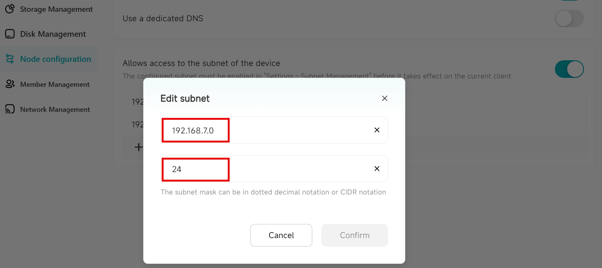

# Node Configuration

Node configuration allows the DASSET device to expose its local network resources (e.g., at home) for remote access. This enables users to access home network resources such as cameras, printers and other devices when they are not on the local network. Only Owners and Administrators can configure this feature.

**Example:**
If you configure your home printer's IP address in Node Configuration, you can log in to the DASSET client from your office and use the DASSET device as a *relay node* to connect to your home printer for printing. All communication during this process is encrypted.

Node Configuration provides three functions:
- **Allow access to the network through this node**: When enabled, users can use this DASSET device as a *relay node* to access the Internet.
- **Use a dedicated DNS**: Configure a dedicated DNS address so domain names can be resolved using your chosen DNS, avoiding domain pollution.
- **Allow access to the subnet of the device**: Configure access to the local network resources where the DASSET device is located, enabling remote access via the DASSET hardware relay.

### Allow access to the network through this node

When enabled, if you activate the **Node** function on the device home page, all your Internet traffic will first be sent to the DASSET device, and then forwarded to the target website.

:::tip
**Note:** All communications are encrypted by the SDVN virtual network, so you do not need to worry about your data being decrypted or read by others.
:::

Once enabled, all users bound to this device can use this function. Please enable it with caution.

**Example:**
If you are at a café in City A and need to use online banking but are concerned about Wi-Fi security, you can log in to the DASSET client and select the **Node** function on your home device in City B. Your online banking data will be encrypted and tunneled to the DASSET device in City B before being forwarded to the bank's server. Even if the café's Wi-Fi is being monitored, hackers cannot obtain your banking information because the traffic is encrypted.

**Steps:**
1.  Go to **Device Management  Node Configuration** and enable **Allow Internet Access Through This Node**.

2.  After enabling, you will see a **Node** button appear on this device's card in the device home page.

3.  Click **Node**, then confirm in the pop-up window.

4.  The **Node** button will appear active, and all subsequent Internet access will be routed through this device.

### Use Dedicated DNS

When enabled, you can configure a specific DNS server for domain name resolution. This is useful if Internet access through DASSET hardware seems slow, allowing you to choose a faster DNS server.

:::warning
Ensure the DNS server you configure is valid. If it is unavailable, domain names may fail to resolve, making URLs inaccessible. If you are unsure, it is not recommended to enable this function.
:::

### Allow Access to Device Subnet

This function allows remote access to local network resources via the DASSET hardware relay.

:::danger
Once configured, all users bound to this device can access the subnet IP addresses you specify. Configure carefully to avoid privacy risks. The device must be on the same LAN as the target subnet.
:::

**Example:**
If you configure your home printer's IP address in Node Configuration, you can log in to the DASSET client from the office and use the device as a relay node to print documents remotely. All communication is encrypted.

**Steps:**
1.  Go to **Device Management - Node Configuration** and enable **Allow Access to Device Subnet**.

2.  Click the "+" icon to add a new device or subnet for access.
    - **Sharing a single device:** To access a single device, such as a printer, enter the IP address of the printer in the **IP Address** field. Enter `32` or `255.255.255.255` in the **Subnet Mask** field and click **Confirm**.
    - **Sharing an entire subnet:** To access an entire subnet, which would provide access to all devices on the subnet, enter the subnet IP address with the last segment being "0" (eg; 192.168.7.0). Enter `24` in the **Subnet Mask** field and click **Confirm**

:::tip
It is recommended to use subnet addresses to reduce the risk of IP conflicts.
:::

### Example Scenario: Remote Work

A user places a DASSET device in the office and enables sharing of the office computer's network resources. While at home or on a business trip, the user can securely and easily control the office computer through the DASSET device, enabling efficient remote work.