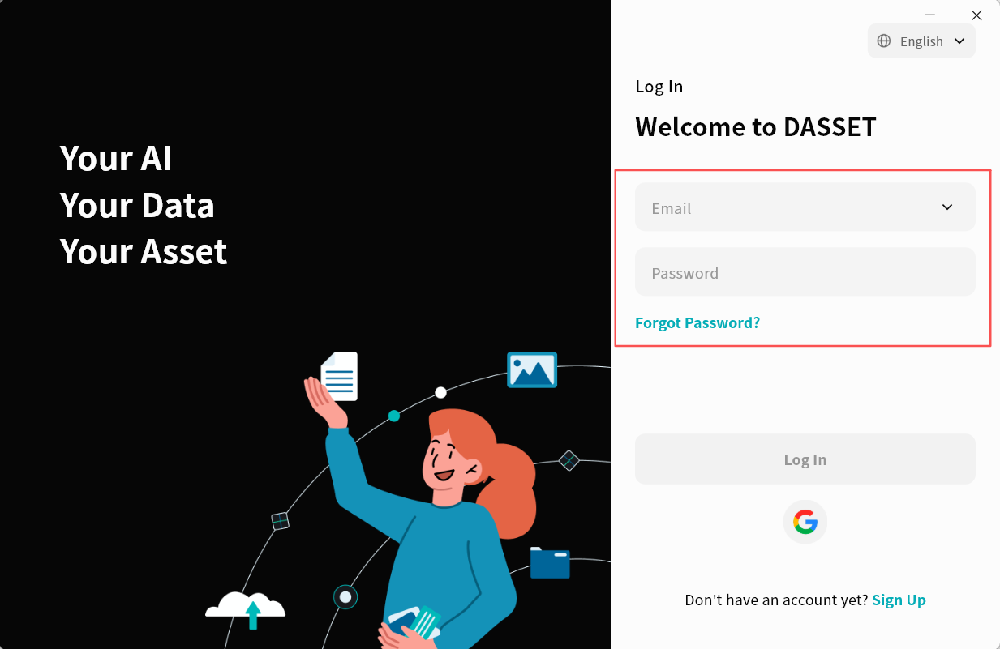
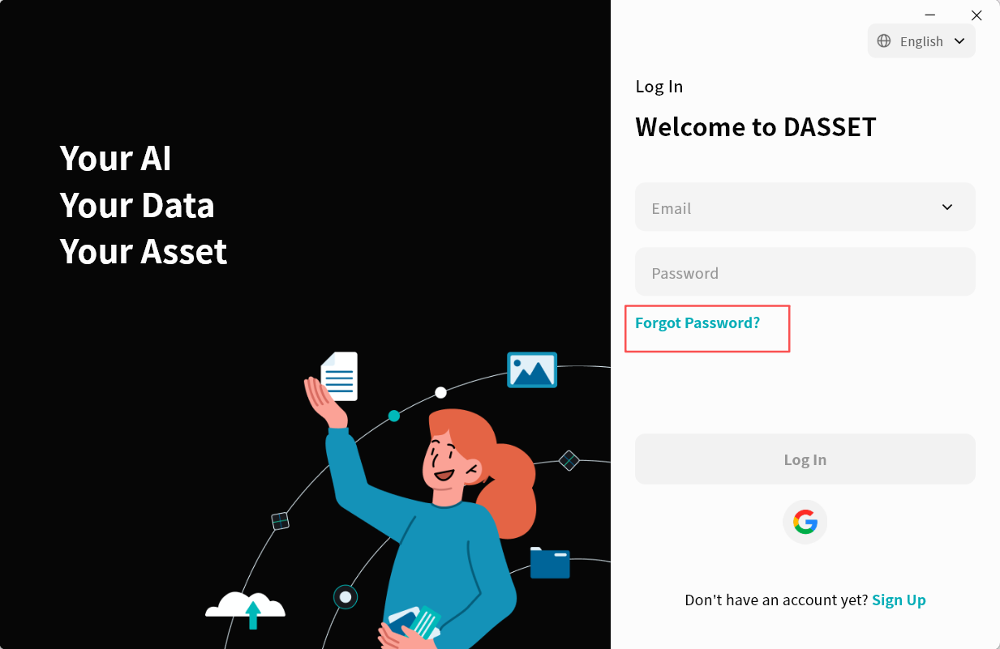
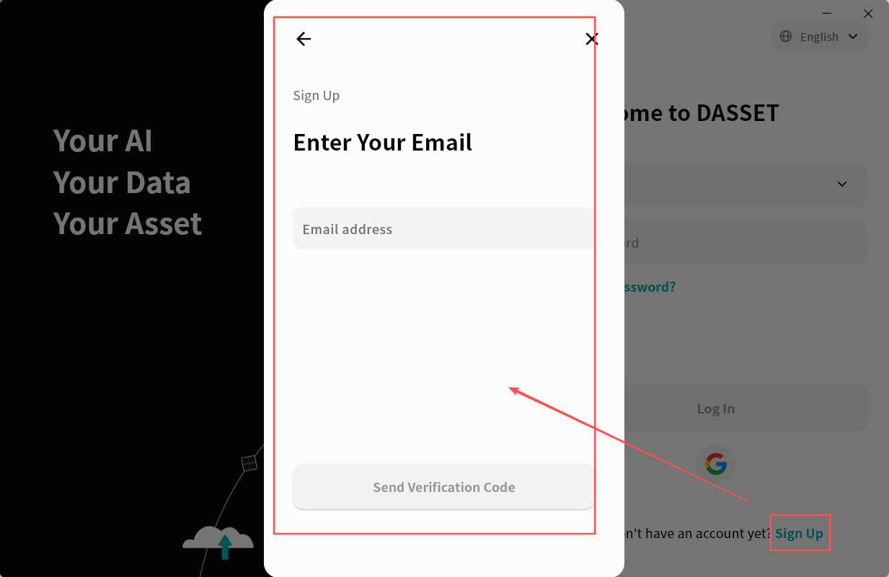
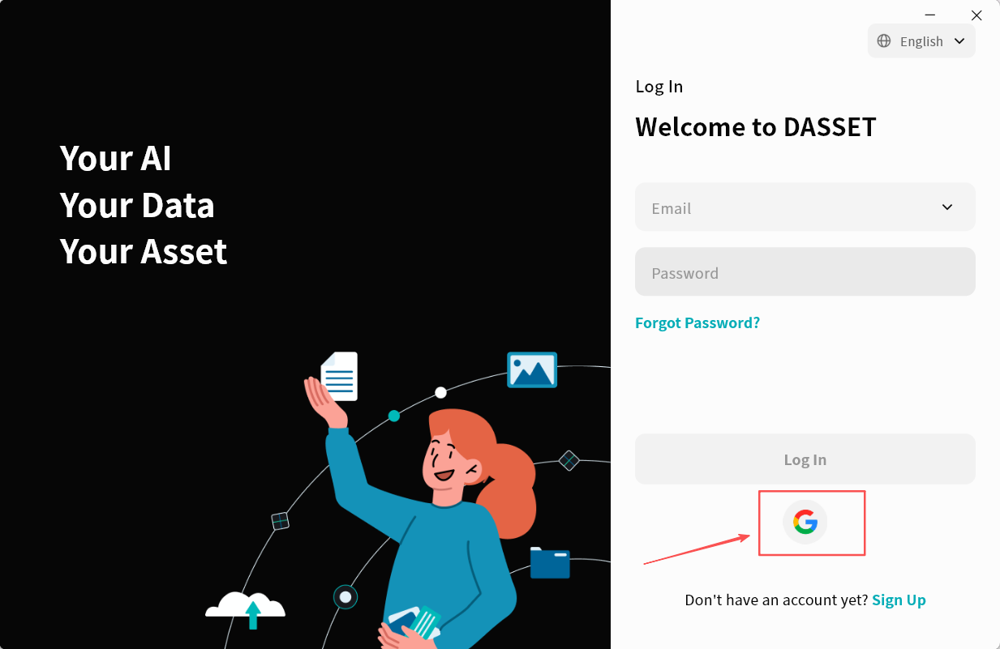
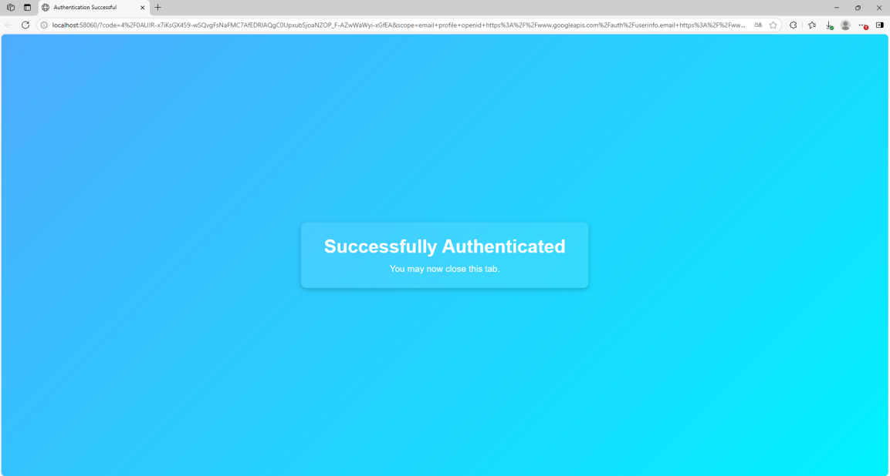

# Registration and Login

When using DASSET for the first time, you will need to create an account. DASSET supports both mobile phone numbers and email addresses as account credentials.

:::note

The current DASSET version for Windows and macOS does not allow mobile phone number registration.

:::

:::warning

DASSET empowers you to define your own security standards for Password Strength. For optimal protection of your sovereign assets, we recommend using a complex, high-security password to minimize potential privacy vulnerabilities.

:::

If you forget your password, you can easily reset it on the DASSET login page by using the mobile phone number or email address registered with your account.

## Registration

DASSET supports two registration methods: mobile phone number and email. To register, click the **Register** button on the login page and follow the instructions to complete the account setup.

:::warning

External security filters and aggressive ISP settings can occasionally intercept DASSET registration emails. If you have not received your Verification Code, please check your Spam folder.

:::

## Password Reset

If you forget your DASSET login password, click **Forgot Password** on the login page and follow the on-screen instructions to reset your password.

## Login

DASSET supports login via both email and mobile phone number. Enter the email or phone number you registered with, along with your password, then click **Login** to proceed. You may also click the dropdown arrow next to the account input field to select a previously used account (if saved) and log in directly.

## Quick Login with Google Account

You can log in to DASSET with one-click authorization using your Google account, without the need to register.

1.  On the DASSET login page, click the **Google** icon.

2.  DASSET will open a browser and redirect to the Google verification page. Enter your Google account and click **Next**.
3.  Enter your Google account password and click **Next**.
4.  Wait for verification. When the page shown below appears, it indicates that Google verification has been successfully completed.

After verification, wait for DASSET to automatically complete the login process.