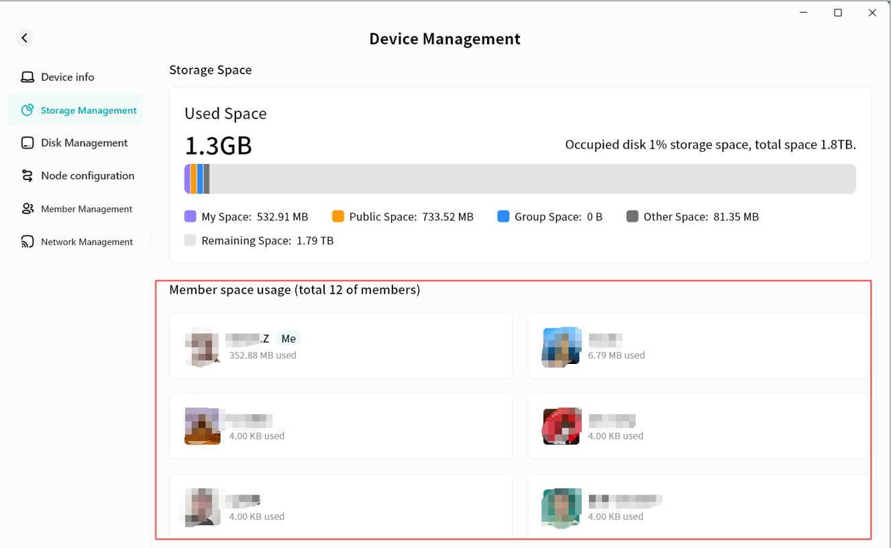
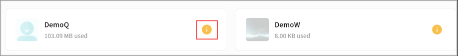
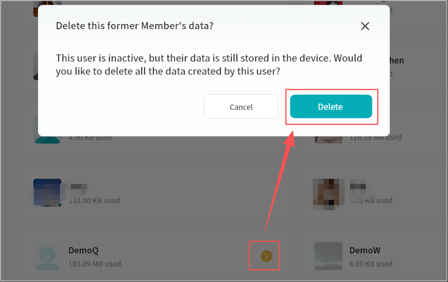

# Storage Management

The **Storage Management** pages allows you to view the overall storage usage of the current DASSET device, including:

### Total Storage Usage
    *  Total hard disk capacity
    *  Current used disk space (all users combined)
    *  Total disk space used by My Space (all users combined)
    *  Total disk space used by Public Space (all users combined)
    *  Total disk space used by Group Space (all users combined)
    *  Total disk space used by Other Space (including My Vault, Recycle Bin, thumbnails, etc.)
    *  Total available space
  
### Per-Member Storage Usage

### Removed Member's Storage

In the event that a Member has un-bound from the device and their data was not chosen to be deleted, their storage used will show-up here.

Clicking on the yellow information icon will allow you to delete this Member's data to reclaim disk space.

